# F1 — Acceso, menú, Pulso del día y Mi cuenta

Primer capítulo del manual de pantallas del frontend web. Cubre el esqueleto sobre el que se montan todas las pantallas de
negocio de los lotes siguientes: iniciar sesión, el menú y la cabecera, la pantalla de inicio ("Pulso del día") y "Mi cuenta".
Direcciones (URL) tal como aparecen en el navegador; capturas en `img/f1-*.png`.

## Iniciar sesión

**Para qué sirve.** Es la puerta de entrada a Teikem: con su correo y contraseña, cada persona entra a la compañía (tenant)
donde tiene una cuenta.

**Cómo se llega.** Dirección `/login`. Si no ha iniciado sesión y trata de abrir cualquier otra pantalla, el sistema lo manda
aquí solo.

**Qué se ve.**

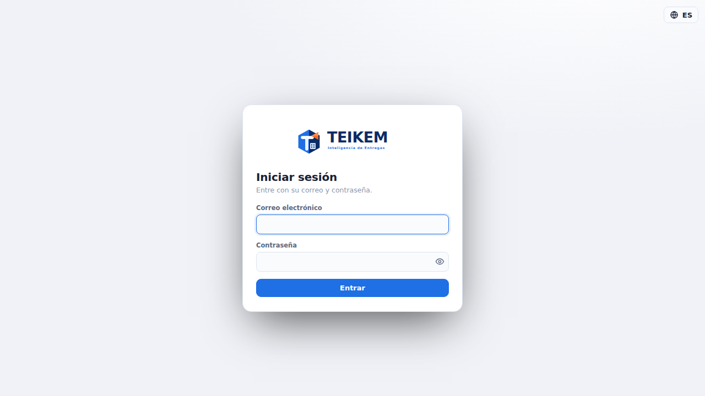

Un cuadro con el logo de Teikem, "Correo electrónico", "Contraseña" y el botón **Entrar**. Arriba a la derecha, el selector de
idioma (globo + "ES"/"EN"), disponible también sin haber iniciado sesión.

**Qué hace cada control.**
- **Correo electrónico / Contraseña**: los datos de su cuenta.
- **Entrar**: envía el usuario y la contraseña. Si son correctos, según su cuenta puede pasar a: la pantalla de inicio
  directamente, la de verificación en dos pasos (si su compañía la exige o usted ya la activó), o la de elegir compañía (si
  pertenece a más de una).

**Permiso.** Ninguno: cualquier persona con una cuenta puede ver esta pantalla.

**Mensajes que puede ver y qué hacer.**

| Mensaje | Cuándo aparece | Qué hacer |
|---|---|---|
| "Escriba un correo válido." | El correo no tiene forma de correo (falta la `@`, etc.) | Corrija el correo. |
| "Escriba su contraseña." | Dejó la contraseña en blanco | Escriba su contraseña. |
| "Credenciales inválidas." | El correo no existe, la cuenta está bloqueada por intentos fallidos, o la contraseña es incorrecta | Verifique ambos datos; si sospecha que se bloqueó (5 intentos fallidos bloquean 15 minutos), espere unos minutos. |

## Verificación en dos pasos (MFA)

**Para qué sirve.** Segundo paso del inicio de sesión cuando su compañía exige un código además de la contraseña, o cuando
usted ya activó la verificación en dos pasos en "Mi cuenta".

**Cómo se llega.** Dirección `/mfa`, automáticamente después de "Entrar" si el API responde que hace falta el código. No
tiene entrada de menú (es parte del flujo de inicio de sesión); si abre `/mfa` directo sin haber pasado por el login, lo
manda de vuelta a `/login`.

**Qué se ve y qué hace cada botón.** Según el caso:
- **Ya tiene la verificación activada**: un campo "Código de verificación" y el botón **Verificar** (acepta el código de 6
  dígitos de su app o un código de recuperación de un solo uso). "Volver al inicio de sesión" cancela y regresa a `/login`.
- **Su compañía la exige y usted todavía no la activó** (alta obligatoria): primero un botón **Comenzar configuración**;
  luego la clave para escribir a mano en su app (Google Authenticator, Microsoft Authenticator, 1Password…) o el enlace
  "Abrir en la app de autenticación", un campo de código y el botón **Confirmar**; al confirmar se muestran los **códigos de
  recuperación** (una sola vez, con un botón para copiarlos) y por último se le pide un código nuevo de la app para terminar
  de entrar.

**Permiso.** Ninguno (parte del inicio de sesión).

**Mensajes que puede ver y qué hacer.**

| Mensaje | Cuándo aparece | Qué hacer |
|---|---|---|
| "Código MFA inválido." | El código de la app venció (dura 30 segundos) o el código de recuperación ya se usó o está mal escrito | Use el código actual de la app o un código de recuperación no usado. |
| "Código inválido." | Al confirmar el alta de la app de autenticación, el código de 6 dígitos no coincide con la clave que se le mostró | Revise la hora del teléfono y vuelva a escribir el código que muestre la app en ese momento. |

Si perdió el teléfono con la app: use un código de recuperación (se le mostraron al activar). Si también los perdió, pida a
un administrador de su compañía que le ayude; no hay una forma de restablecer el MFA usted mismo sin esos códigos.

## Elegir compañía

**Para qué sirve.** Cuando su usuario pertenece a más de una compañía (tenant), esta pantalla deja elegir con cuál trabajar
en esta sesión.

**Cómo se llega.** Dirección `/select-tenant`, automáticamente después de "Entrar" si el API detecta más de una membresía
activa. Sin entrada de menú; si la abre directo sin una selección pendiente, lo manda a `/login`.

**Qué se ve.** Un botón por cada compañía a la que pertenece; la marcada "Predeterminada" es la que usa por costumbre.
"Volver al inicio de sesión" cancela.

**Permiso.** Ninguno.

**Mensajes que puede ver.** El mismo tipo de mensajes de "Credenciales inválidas." si algo falla al repetir el intento con
la compañía elegida.

## Menú y cabecera

**Para qué sirve.** Es el marco de toda pantalla ya con la sesión iniciada: el menú lateral para moverse entre pantallas y
la cabecera con la compañía activa, el idioma, su usuario y salir. Todavía no hay pantallas de negocio en este lote: el
único grupo visible es "Operación" con "Pulso del día".

**Qué se ve.**

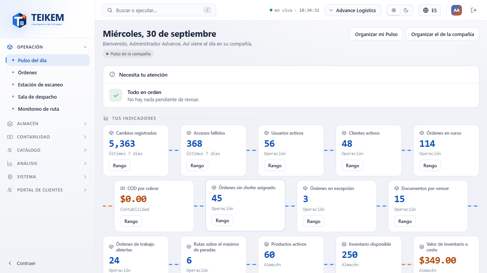

- **Menú lateral**: agrupa las pantallas por tema (Operación, Catálogo, Almacén, Análisis, Administración); un grupo sin
  ninguna pantalla visible para usted no aparece. El botón **Contraer** (abajo) lo reduce a solo íconos en pantallas anchas.
  Por debajo de 900 px de ancho el menú se convierte en un cajón: aparece un botón "Abrir menú" (☰) en la cabecera y el menú
  se desliza por encima del contenido.

  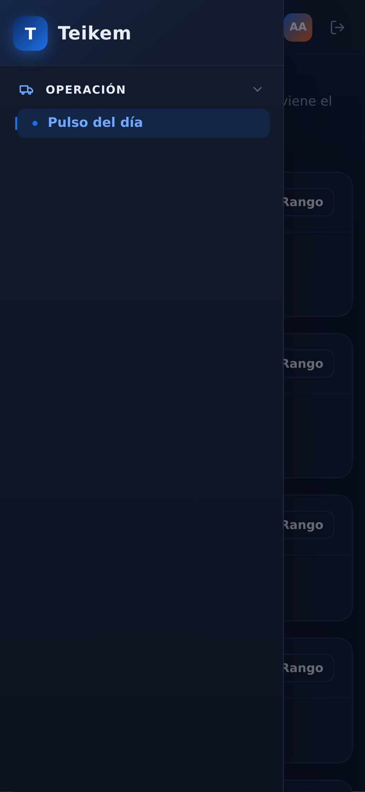

- **Cabecera**: nombre de la compañía activa (si pertenece a más de una compañía a la que puede cambiar, aquí aparece un
  selector en su lugar); el selector de idioma (ES/EN); su nombre (lleva a "Mi cuenta"); el botón de salir (icono de flecha
  de salida).

**Qué hace cada botón.**
- **Un grupo del menú** (p. ej. "Operación"): lo despliega o lo cierra; no cambia de pantalla.
- **Selector de idioma**: cambia el idioma de toda la interfaz al instante, sin recargar la página ni perder lo que tenía
  abierto (la pantalla actual, el grupo del menú desplegado y lo que haya escrito en un formulario se conservan).

  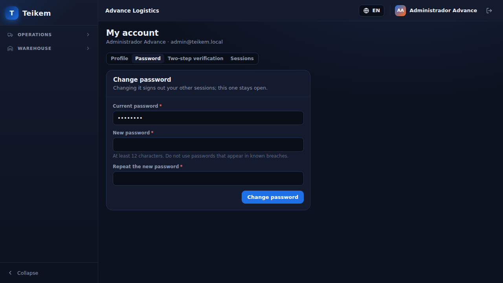

- **Selector de compañía** (cuando aplica): cambia de compañía activa y vuelve al inicio.
- **Su nombre**: va a "Mi cuenta".
- **Salir**: cierra la sesión y vuelve a "Iniciar sesión".

**Permiso.** El menú y la cabecera no piden permiso; cada entrada del menú se muestra u oculta sola según el permiso y el
módulo que exige su pantalla (por eso en este lote solo aparece "Pulso del día").

**Mensajes que puede ver.** Si cambiar de compañía falla, aparece el mensaje del servidor junto al selector de compañía en
la cabecera.

## Pulso del día

**Para qué sirve.** Es la pantalla de inicio: un vistazo rápido a los indicadores y gráficos que usted (o su compañía) marcó
para verse aquí todos los días.

**Cómo se llega.** Dirección `/`, entrada "Pulso del día" del grupo Operación (siempre visible en el menú).

**Qué se ve.** Un saludo con su nombre, el panel **Necesita tu atención** (desde el Lote 14, si tiene el permiso `pulse.attention`; ver
[F7A](f7a-pulso-almacen-y-actividad.md#pulso-del-día-panel-necesita-tu-atención)), una sección "Indicadores" (tarjetas con un número: cambios registrados, accesos
fallidos, usuarios activos, clientes activos, órdenes en curso, COD por cobrar, etc., según lo que tenga marcado su
compañía) y una sección "Gráficos" (barra, dona o línea).

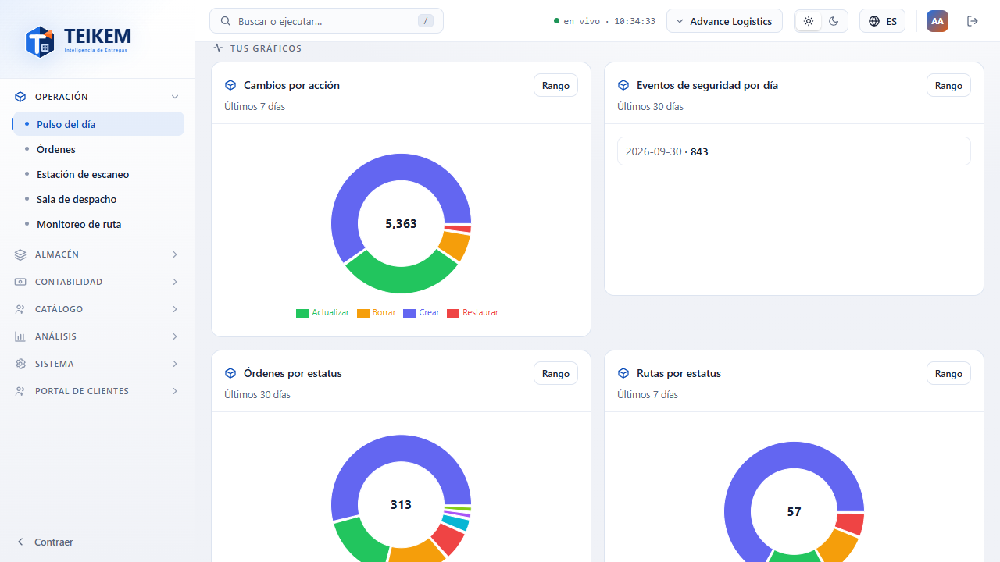

En un teléfono, las tarjetas se apilan en una sola columna, una debajo de otra.

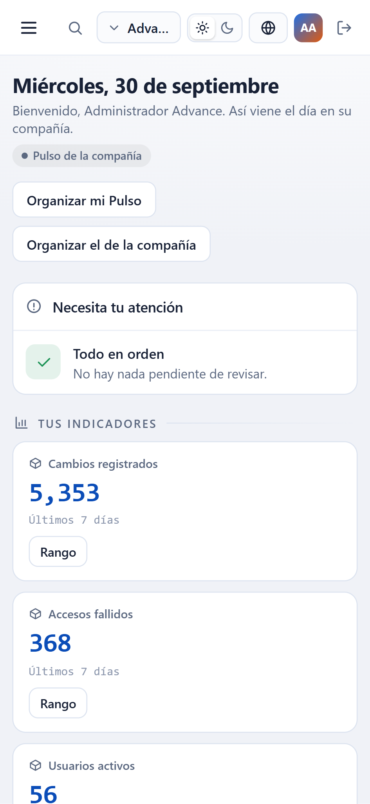

**Qué hace cada botón.**
- **Rango** (en cada tarjeta): abre "Mi rango de fecha" para esa tarjeta: elegir el modo (por ejemplo, últimos 7 días, mes
  actual, un rango personalizado con Desde/Hasta) que usted quiere ver. Es una preferencia suya; no cambia lo que ven los
  demás usuarios de su compañía. **Guardar** aplica el cambio y recalcula la tarjeta; **Cancelar** cierra sin guardar.

**Permiso.** `analytics.view`, módulo **Análisis** (`ANALYTICS`). Si le falta cualquiera de los dos, en vez de indicadores
ve un saludo sin datos (la pantalla no llega a pedirle nada al servidor):

| Situación | Mensaje |
|---|---|
| Sin el permiso `analytics.view` | "Su usuario no tiene permiso para ver los indicadores y gráficos del Pulso del día. Pida al administrador de su compañía que se lo asigne." |
| Con el permiso pero sin el módulo Análisis encendido | "Los indicadores y gráficos del Pulso del día son parte del módulo de Análisis, que no está activo en su compañía. Pida al administrador que lo active." |
| Con permiso y módulo, pero su compañía no marcó nada para Pulso | "Todavía no hay nada en Pulso" / "Marque indicadores o gráficos para que aparezcan aquí (opción «Mostrar en Pulso del día»)." |

**Mensajes del diálogo "Mi rango de fecha".**

| Mensaje | Cuándo aparece |
|---|---|
| "Elija un rango." | No eligió ningún modo |
| "Indique la fecha Desde." / "Indique la fecha Hasta." | Eligió el rango personalizado y dejó una de las dos fechas vacía |
| "Desde no puede ser mayor que Hasta." | La fecha Desde es posterior a Hasta |

## Mi cuenta

**Para qué sirve.** Cada usuario ve y ajusta aquí sus propios datos: perfil, contraseña, verificación en dos pasos y las
sesiones (dispositivos) donde tiene la sesión abierta.

**Cómo se llega.** Dirección `/account`; se abre con su nombre en la cabecera (no está en el menú lateral). Cada pestaña
tiene su propia dirección para poder enlazarla directo: `/account`, `/account?tab=password`, `/account?tab=mfa`,
`/account?tab=sessions`.

**Permiso.** Ninguno especial: cualquier persona con sesión iniciada ve y usa las cuatro pestañas de su propia cuenta.
Desactivar la verificación en dos pasos es la única acción que además pide confirmar su identidad de nuevo (ver
"Reautenticación" más abajo).

### Pestaña Perfil

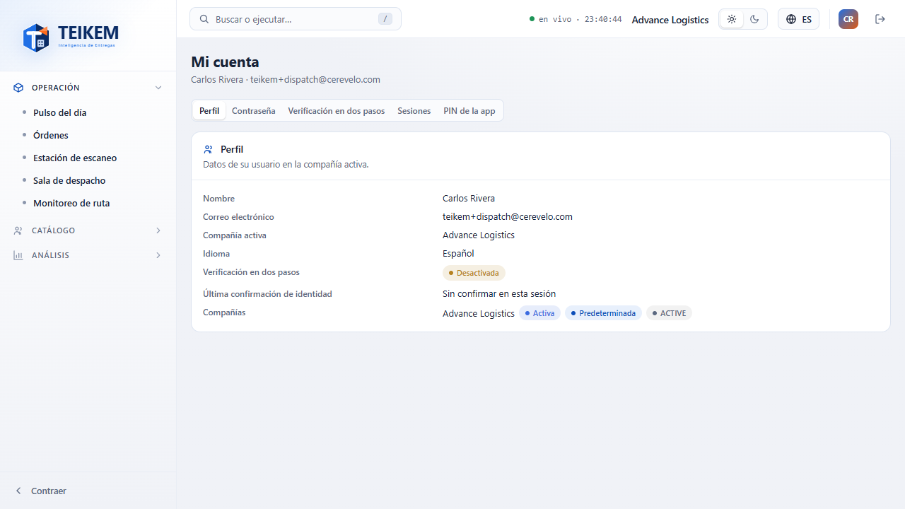

**Qué se ve.** Solo lectura: nombre, correo, compañía activa, idioma, si tiene la verificación en dos pasos activada o
desactivada, cuándo confirmó su identidad por última vez en esta sesión ("Sin confirmar en esta sesión" si nunca lo hizo), y
la lista de compañías a las que pertenece (marcando cuál es la activa y cuál su predeterminada). Si es administrador de la
plataforma, también lo indica. No hay botones de edición aquí: cambiar su nombre o correo lo hace un administrador desde
Administración (fuera de este lote).

### Pestaña Contraseña

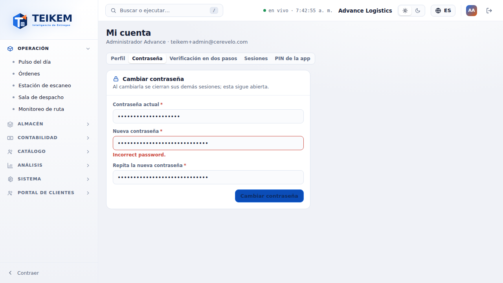

**Qué se ve.** "Contraseña actual", "Nueva contraseña", "Repita la nueva contraseña" y el botón **Cambiar contraseña**. Al
cambiarla se cierran sus demás sesiones (la actual sigue abierta).

**Validaciones y mensajes.**

| Campo | Regla | Mensaje |
|---|---|---|
| Contraseña actual | obligatoria | "Escriba su contraseña actual." |
| Nueva contraseña | mínimo 12 caracteres | "La nueva contraseña debe tener al menos 12 caracteres." |
| Repita la nueva contraseña | debe coincidir con la nueva | "Las contraseñas no coinciden." |

Si la contraseña actual que escribió no es la correcta, el servidor rechaza el cambio y el mensaje aparece bajo el campo
"Nueva contraseña" (no bajo "Contraseña actual"): **"Incorrect password."** — este mensaje puede verse en inglés aunque el
resto de la pantalla esté en español; es un texto que envía el servidor tal cual y no depende del idioma que tenga elegido.
Si su contraseña nueva aparece en filtraciones conocidas, el mensaje es "Esta contraseña aparece en brechas conocidas; elija
otra." (también bajo "Nueva contraseña"). En ambos casos: corrija el campo indicado y vuelva a enviar.

### Pestaña Verificación en dos pasos

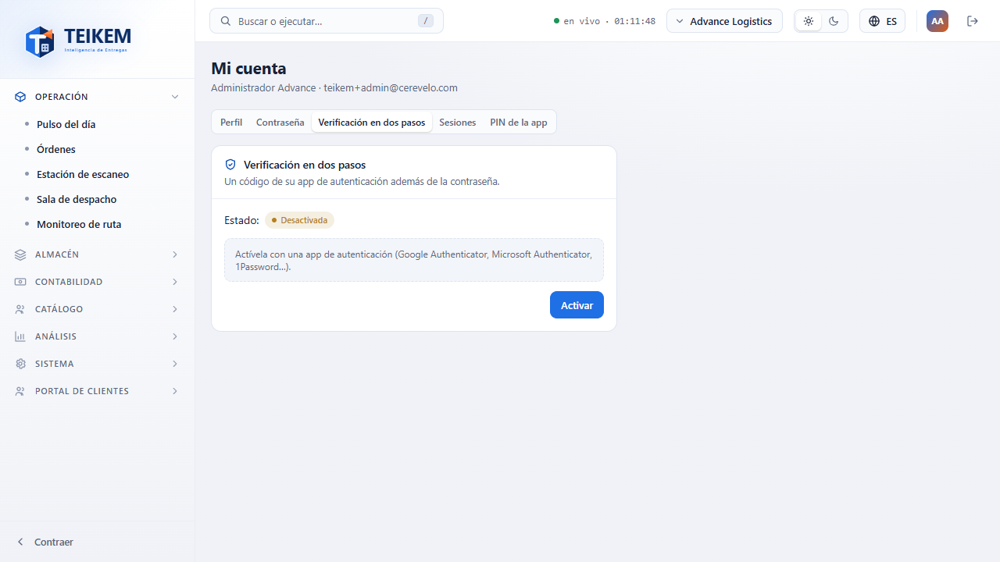

**Qué se ve.** El estado ("Activa" o "Desactivada") y una explicación corta. Si está desactivada, el botón **Activar**; si
está activada, el botón **Desactivar**.

**Activar.** Al pulsar **Activar** se muestra la clave para escribir a mano en su app de autenticación (o el enlace "Abrir
en la app de autenticación") y un campo para el código de 6 dígitos que le muestre la app.

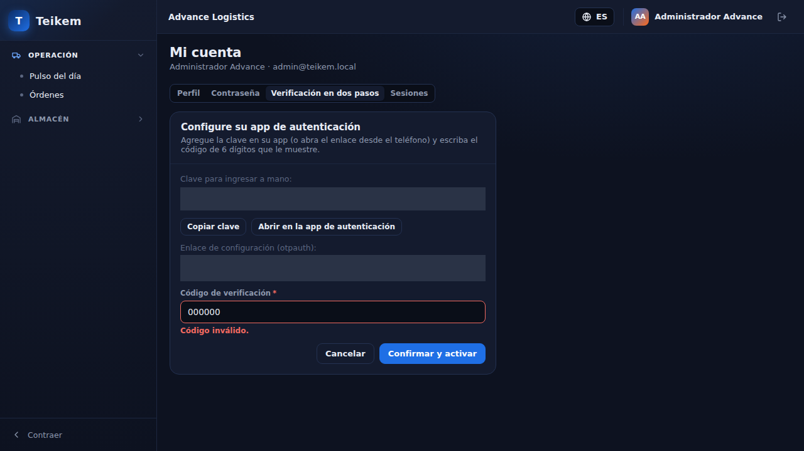

- **Copiar clave**: copia la clave al portapapeles ("Copiado al portapapeles." o "No se pudo copiar; selecciónelo y
  cópielo a mano." si el navegador no lo permite).
- **Confirmar y activar**: valida el código; si es correcto, muestra los **códigos de recuperación** (una sola vez, con
  botón **Copiar**) y termina con **Ya los guardé**.
- **Cancelar**: sale sin activar nada.

**Desactivar.** Pide confirmar su identidad (contraseña, y su código MFA si ya lo tiene activo) antes de desactivarlo.

**Validaciones y mensajes.**

| Campo | Regla | Mensaje |
|---|---|---|
| Código de verificación | 6 dígitos | "Escriba los 6 dígitos que muestra su app." |
| Código de verificación | el código no coincide con la clave mostrada | "Código inválido." (bajo el campo) |

### Pestaña Sesiones

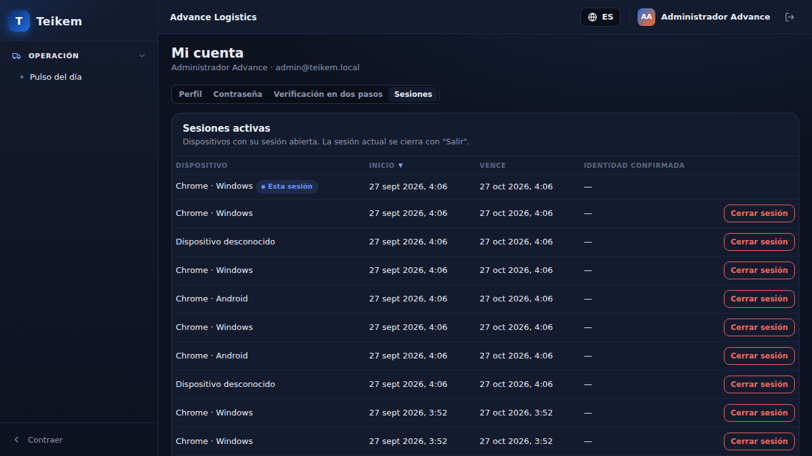

**Qué se ve.** Una tabla con cada dispositivo donde tiene la sesión abierta: dispositivo (o "Dispositivo desconocido"),
inicio, vencimiento y si confirmó su identidad recientemente ahí; la fila de la sesión con la que está conectado ahora
lleva la marca "Esta sesión".

**Qué hace cada botón.**
- **Cerrar sesión** (en cualquier fila que no sea la suya): pide confirmar y revoca esa sesión; ese dispositivo tendrá que
  volver a iniciar sesión. La sesión actual no tiene este botón: para cerrarla se usa **Salir** de la cabecera.

**Mensajes.** "No hay sesiones activas." si la lista está vacía (no debería ocurrir con la sesión actual siempre presente);
"Sesión cerrada." al confirmar.

## Reautenticación (AAL2)

**Para qué sirve.** Confirma su identidad de nuevo antes de una acción sensible (por ejemplo, desactivar su verificación en
dos pasos). Aparece sola, como un cuadro sobre la pantalla en la que está, cuando el servidor responde que hace falta
("aal2_required"); también antes de desactivar el MFA.

**Qué se ve.** "Confirme su identidad", un campo de contraseña y, si ya tiene la verificación en dos pasos activada, un
campo de código. **Confirmar** reintenta la acción original; **Cancelar** la deja sin hacer.

**Permiso.** Ninguno adicional: es parte de la acción que la pidió.

**Mensajes que puede ver.** "Contraseña incorrecta." o "Código MFA inválido." si alguno de los dos datos no es correcto;
corrija y vuelva a intentar.

## Sin permiso / Módulo apagado

**Para qué sirve.** Son las pantallas que ve en vez de la que pidió cuando le falta el permiso o el módulo que esa pantalla
exige (por ejemplo, si alguien comparte un enlace a una pantalla de un módulo apagado en su compañía). En este lote no hay
pantallas de negocio todavía; se ven si se navega a una dirección que las use directo.

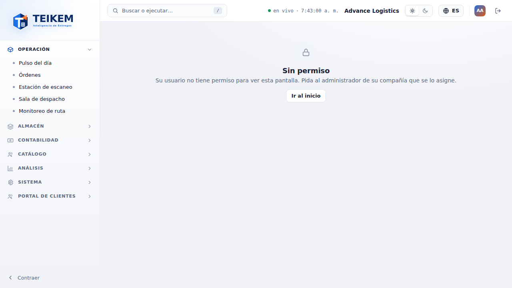

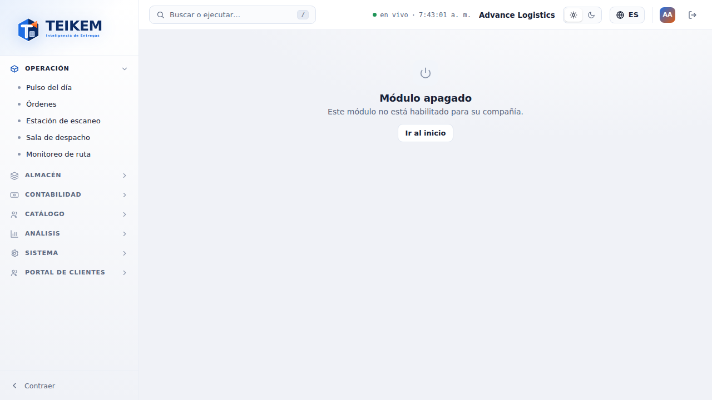

**Qué se ve.** Un ícono, el título ("Sin permiso" o "Módulo apagado"), una frase explicando la causa y el botón **Ir al
inicio** (vuelve a Pulso del día).

**Mensajes.**

| Mensaje | Causa | Qué hacer |
|---|---|---|
| "Su usuario no tiene permiso para ver esta pantalla. Pida al administrador de su compañía que se lo asigne." | Le falta el permiso que exige esa pantalla | Pida a un administrador de su compañía que le asigne el permiso. |
| "Este módulo no está habilitado para su compañía." | El módulo de esa pantalla está apagado en su compañía | Pida a un administrador que active el módulo (Administración › Módulos, fuera de este lote). |

## Preguntas frecuentes de este capítulo

**¿Por qué el menú solo muestra "Pulso del día"?** Porque en el Lote F1 todavía no hay pantallas de negocio (clientes,
órdenes, flota, trips, inventario): llegan en los lotes siguientes. Cada una aparecerá sola en su grupo cuando su permiso y
el módulo de su compañía lo permitan.

**¿Por qué al cambiar el idioma no se recarga la pantalla?** Es a propósito: cambiar el idioma solo cambia los textos, no
reinicia lo que estaba haciendo (un formulario a medio llenar, el grupo del menú que tenía abierto).

**¿Por qué "Mi cuenta" no tiene botón para editar mi nombre o correo?** Esta pantalla es solo para lo que le pertenece a
usted mismo (contraseña, MFA, sesiones); cambiar sus datos de perfil, rol o permisos lo hace un administrador desde
Administración, que llega en un lote posterior.

**Cambié de compañía y ya no veo lo mismo que antes, ¿es normal?** Sí: el menú, los permisos y los módulos encendidos son
por compañía. Si pertenece a varias, cada una puede tener un menú distinto.
