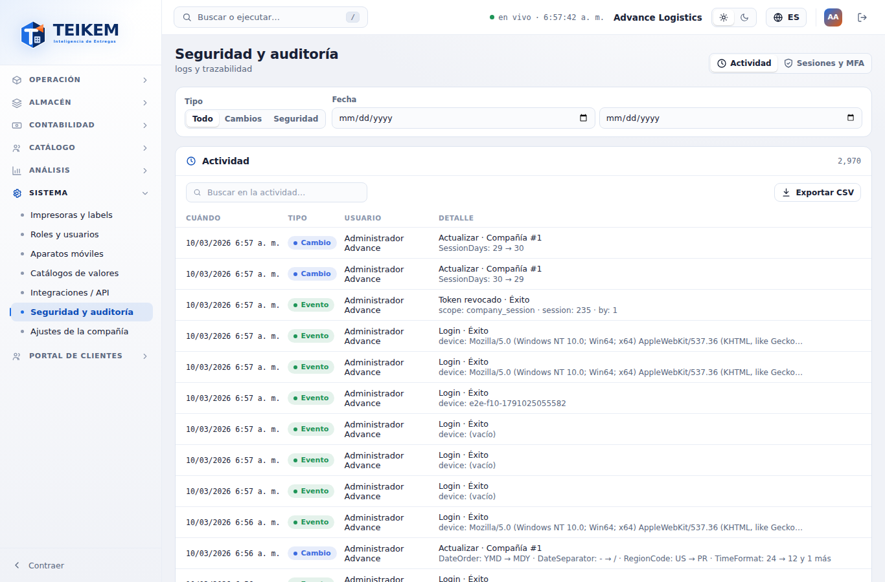
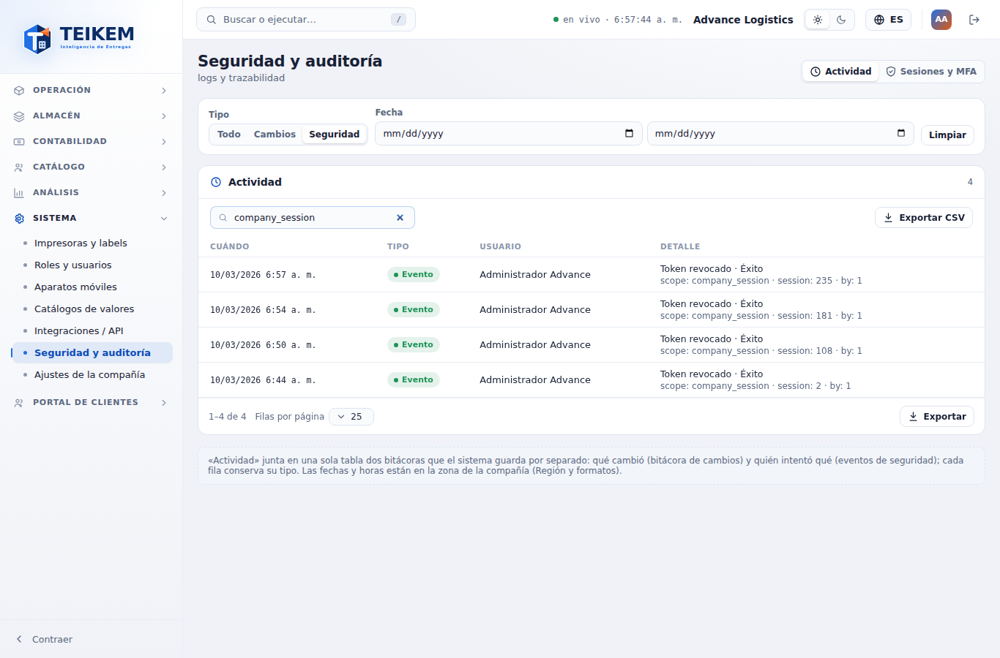
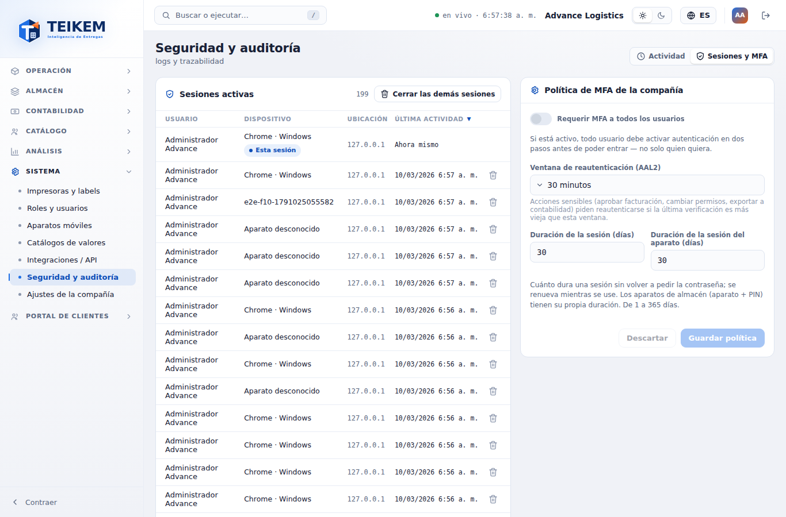
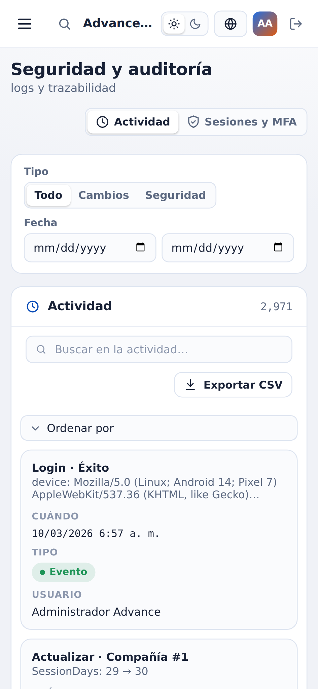


# F10 — Seguridad y auditoría

Pantalla **Sistema → Seguridad y auditoría** (`/system/audit`), que deja de ser una pantalla "pendiente". Junta en un lugar la
bitácora de la compañía (qué cambió y quién intentó qué), las sesiones abiertas de todos los usuarios y la política de
seguridad de la compañía (MFA obligatorio, reautenticación y duración de las sesiones). Backend: capítulo 01, secciones 1.5, 9,
9.1 y 11; decisiones del frontend en `docs/frontend/loteF10-decisiones.md`.

**Quién puede.** Ver la pantalla: permiso **`admin.audit`** con el módulo **Sistema** (`SYSTEM`) encendido (sin el permiso, el
menú no la muestra y la dirección lleva a "Sin permiso"). Dentro:

| Acción | Permiso |
|---|---|
| Ver la actividad, exportarla y ver las sesiones de la compañía | `admin.audit` |
| Revocar una sesión o "Cerrar las demás sesiones" | además `admin.users` (sin él, los botones no aparecen) |
| Cambiar la política (MFA, reautenticación, duración de sesiones) | `admin.tenant` (sin él, la política se ve de solo lectura) |

**Pestañas.** Arriba a la derecha, como en la maqueta: **Actividad** (sin parámetro) y **Sesiones y MFA** (`?tab=sessions`).
El botón **Abrir Seguridad y auditoría** de Ajustes de la compañía → General abre directo Sesiones y MFA. Abajo, la nota:
«Actividad» junta en una sola tabla dos bitácoras que el sistema guarda por separado… Las fechas y horas están en la zona de la
compañía (Región y formatos).

## 1. Actividad

Una sola tabla con la **bitácora de cambios** (qué cambió: altas, cambios, bajas y restauraciones de los registros auditados) y
los **eventos de seguridad** (quién intentó qué: entradas, salidas, MFA, reautenticación, permisos denegados, sesiones
revocadas…), lo más reciente primero (`GET /api/v1/audit/activity`).

- **Columnas** (todas ordenables con un clic en el encabezado; el orden se aplica a la página que se ve y a lo que se exporta):
  - **Cuándo**: fecha y hora con el formato y la zona de la compañía (`10/03/2026 6:40 a. m.`).
  - **Tipo**: **Cambio** (azul) para la bitácora de cambios; **Alerta** (rojo) para un evento fallido o bloqueado, un permiso
    denegado o un bloqueo de cuenta; **Evento** (verde) para el resto.
  - **Usuario**: quien hizo el cambio o el intento; "—" si no se sabe (p. ej. un intento de entrada con un correo que no existe).
  - **Detalle**: arriba qué pasó ("Actualizar · Compañía #1", "Login · Éxito", "Token revocado · Éxito") y debajo los datos,
    legibles: en un cambio "Campo: antes → después" (`SessionDays: 30 → 29`), en un evento "dato: valor" (`device: ZEBRA-01`).
    Se ven los primeros 4 datos y "y N más"; el archivo los trae todos. Al pasar el mouse sale la IP si la hay.
- **Filtros** (barra de arriba; **Limpiar** los quita):
  - **Tipo**: **Todo / Cambios / Seguridad** (el segmento de la maqueta).
  - **Fecha**: desde / hasta, en días de la compañía (de la medianoche del primer día a la del día siguiente al último).
  - **Buscar en la actividad…** (dentro del panel): texto libre que busca el servidor (300 ms después de dejar de escribir) en
    el detalle, la IP, el nombre o correo del usuario, el nombre o código del tipo, del resultado, de la acción y de la entidad
    (`Permiso`, `LOGIN`, `Compañía`) y el número de la entidad (`#12`). Sin distinguir mayúsculas.
- El contador del panel es el **total real** con los filtros. Pie de la tabla: rango, **Filas por página** (10/25/50/100), ‹ › y
  **Exportar** (Excel, CSV o PDF, con todo lo filtrado).
- **Exportar CSV** (botón junto al buscador, el de la maqueta): descarga `auditoria-AAAA-MM-DD.csv` con **todas** las filas que
  cumplen el tipo, la fecha y la búsqueda (no solo la página), en el orden de la tabla, con las columnas Cuándo, Tipo, Usuario y
  Detalle. Las comas, comillas y saltos de línea van entre comillas, la fecha sale como fecha (`2026-10-03 06:40:00`, en la hora
  de la compañía) y un texto que empieza con `=`, `+`, `-` o `@` lleva un apóstrofo para que Excel no lo ejecute. Aviso
  "Descargando N filas"; si hay más de 10 000, se bajan las primeras 10 000 con el aviso "Se descargaron las primeras 10000
  filas; acote la fecha para exportar el resto.".

## 2. Sesiones y MFA

### 2.1 Sesiones activas

Las sesiones abiertas de **todos los usuarios de la compañía** (`GET /api/v1/audit/sessions`), no solo las suyas (las suyas
también están en Mi cuenta → Sesiones).

- **Usuario**, **Dispositivo** (navegador y sistema, "Chrome · Windows"; un aparato de almacén dice "ZEBRA-01 · Muelle 1
  (Aparato de almacén)"; sin dato, "Aparato desconocido"), **Ubicación** (la IP desde la que se abrió o se renovó la sesión; no
  hay ciudad ni país) y **Última actividad** (la última renovación de la sesión, que ocurre cada 15 minutos mientras se usa; la
  suya dice "Ahora mismo"). Ordenables; por defecto la más reciente arriba.
- **Esta sesión** marca la suya: no tiene botón para revocarla (se cierra con **Salir**).
- **Revocar** (papelera de la fila, `admin.users`): pide confirmación "¿Revocar esta sesión?" — "Se cerrará la sesión de {usuario}
  en {dispositivo}. Tendrá que volver a entrar en ese aparato." → aviso "Sesión revocada".
- **Cerrar las demás sesiones** (cabecera del panel, `admin.users`; apagado si no hay otras): confirma "¿Cerrar las demás
  sesiones?" — "Se cerrarán N sesiones de la compañía: todas menos esta. Cada usuario tendrá que volver a entrar." → aviso "Se
  cerraron las demás sesiones (N)". Es una acción sensible: si su última verificación es más vieja que la ventana de
  reautenticación, la pantalla le pide la contraseña (y el código MFA si lo tiene) y la repite sola.
- Qué pasa después de revocar: ese aparato o navegador no puede renovar la sesión; lo que tenga abierto deja de funcionar a más
  tardar en 15 minutos. **Si lo intenta**, el servidor cierra **todas** las sesiones de ese usuario por seguridad (ver la decisión 3
  del lote): tendrá que volver a entrar en todos sus aparatos.

### 2.2 Política de MFA de la compañía

Los cuatro valores de seguridad de la compañía (`GET`/`PUT /api/v1/tenant/settings`, solo lo que cambió):

| Campo | Qué hace | Valores |
|---|---|---|
| **Requerir MFA a todos los usuarios** | todo usuario debe activar la verificación en dos pasos antes de poder entrar | sí / no |
| **Ventana de reautenticación (AAL2)** | las acciones sensibles piden la contraseña de nuevo si la última verificación es más vieja | 15, 30 o 60 minutos (si el valor guardado es otro, también aparece) |
| **Duración de la sesión (días)** | cuánto dura una sesión sin volver a pedir la contraseña; se renueva mientras se use | 1 a 365 |
| **Duración de la sesión del aparato (días)** | lo mismo para los aparatos de almacén (aparato + PIN) | 1 a 365 |

- **Guardar política** / **Descartar** (solo con cambios; "Hay cambios sin guardar."). Al guardar: aviso "Política guardada".
- La duración nueva vale para las sesiones que se abran o renueven desde ese momento; las abiertas siguen con la que tenían.
- Sin `admin.tenant`: aviso "Solo lectura: cambiar la política exige el permiso para administrar la compañía (admin.tenant)." y
  los campos apagados, sin botones.

| Campo | Regla | Mensaje | Dónde |
|---|---|---|---|
| Duración de la sesión / del aparato | entero de 1 a 365 | "Entre 1 y 365 días." | Pantalla (bajo el campo, no se manda) y servidor, 400 bajo el campo |
| Ventana de reautenticación | 5 a 240 minutos | "Entre 5 y 240 minutos." | Servidor, 400 bajo el campo (la pantalla solo ofrece valores válidos) |

## 3. En el celular (360 px)

 

Las tablas pasan a tarjetas (con "Ordenar por"), los filtros y la política quedan en una columna y la página nunca se desplaza
de lado; las pestañas se desplazan dentro de su franja si no caben.

## 4. Casos frecuentes

- **Busco algo que pasó hace meses y no aparece en las primeras páginas.** Ponga la **Fecha** de ese período o una búsqueda: el
  contador dice cuántas filas hay y las páginas llegan hasta el final.
- **Un usuario perdió su teléfono.** En Sesiones activas busque su sesión por dispositivo y última actividad y **Revóquela**. Si no
  sabe cuál es, en Roles y usuarios puede cerrar todas las sesiones de ese usuario.
- **Revoqué una sesión y el usuario dice que lo sacaron de todos sus aparatos.** Es lo esperado si el aparato revocado intentó
  seguir usándose: el servidor lo toma como posible robo del token y cierra todas sus sesiones.
- **¿Por qué la ubicación es un número?** Es la dirección IP; Teikem no consulta servicios externos para convertirla en ciudad.
- **Quiero exportar la bitácora para una auditoría externa.** Filtre por fecha y tipo y use **Exportar CSV** (o Exportar → Excel/PDF
  del pie, que además llevan la compañía, el título y los filtros aplicados).
