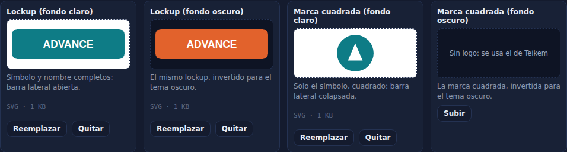
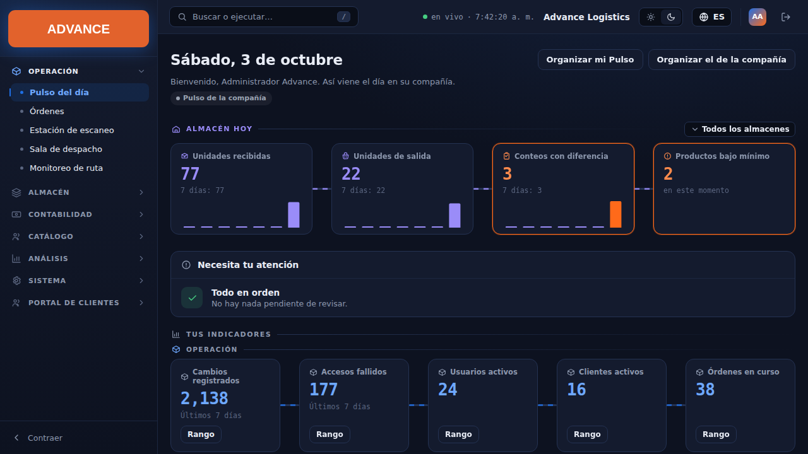
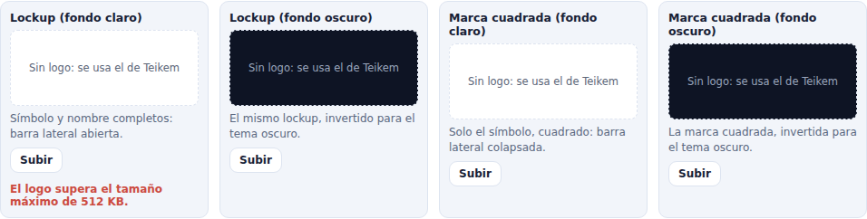
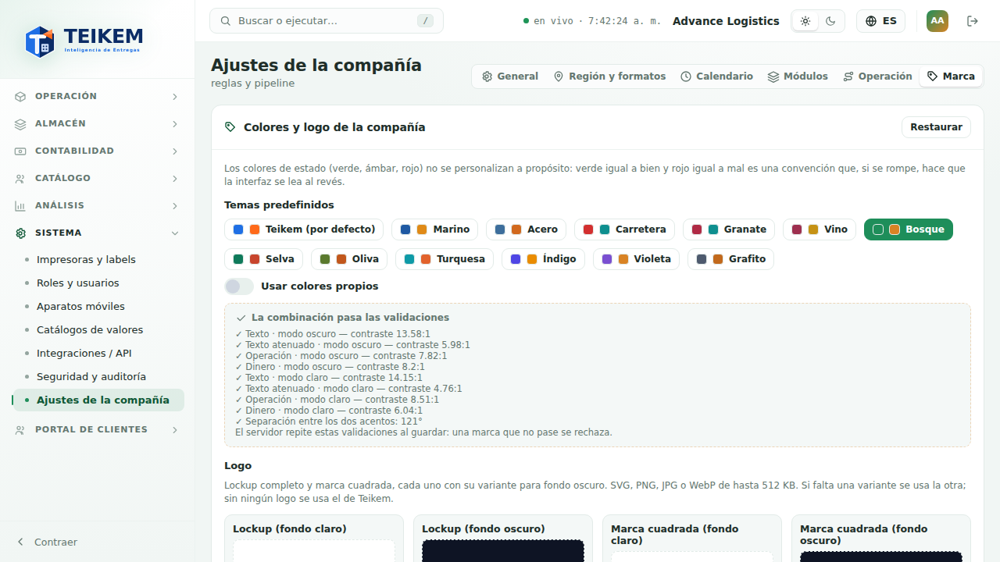

# F11 — Marca por compañía: logos y colores validados por el servidor

Pestaña **Marca** de **Sistema → Ajustes de la compañía** (`/system/settings?tab=brand`), ahora conectada al servidor: los
**logos** de la compañía se suben, se ven y se quitan desde aquí, y los colores los valida también el servidor con las mismas
reglas que la pantalla. Backend: capítulo 01, sección 11.2; decisiones en `docs/lote19-decisiones.md`; la pestaña de colores se
describe en [F9, sección 7](f9-ajustes-de-la-compania.md).

**Quién puede.** Ver la pestaña y los logos: cualquier usuario con sesión (es la marca de la interfaz); en la pantalla, con el
permiso **`admin.tenant`** y el módulo **Sistema** (como el resto de Ajustes). Subir, reemplazar y quitar logos y guardar colores:
**`admin.tenant`**. Sin él la pestaña es de **solo lectura**: se ven los colores y los logos, sin botones.

## 1. Logos

Cuatro ranuras, cada una con su vista previa sobre **fondo claro** o **fondo oscuro** según corresponda:

| Ranura | Para qué | Dónde se ve |
|---|---|---|
| Lockup (fondo claro) | símbolo y nombre completos | barra lateral abierta, tema **claro** |
| Lockup (fondo oscuro) | el mismo lockup, invertido | barra lateral abierta, tema **oscuro** |
| Marca cuadrada (fondo claro) | solo el símbolo, cuadrado | barra lateral **colapsada** (y pantallas pendientes), tema claro |
| Marca cuadrada (fondo oscuro) | la marca cuadrada, invertida | ídem, tema oscuro |

- **Subir / Reemplazar:** el botón abre el selector de archivos (SVG, PNG, JPG o WebP, hasta 512 KB). El logo se guarda **al
  instante** ("Logo guardado"); no hace falta "Guardar cambios" (ese botón es solo para los colores). Bajo la vista previa se lee
  el tipo y el tamaño ("SVG · 2 KB").
- **Quitar:** el botón «Quitar» de la ranura ("Logo quitado"). Si la compañía se queda sin logo en una ranura, la interfaz usa la
  otra variante de la misma pieza y, si no hay ninguna, el logo de Teikem ("Sin logo: se usa el de Teikem").
- **Variantes:** en el tema oscuro se usa la invertida y en el claro la normal; si solo se subió una de las dos, se usa en
  ambos temas. El **lockup** y la **marca cuadrada** son piezas independientes: sin marca cuadrada, la barra colapsada muestra el
  símbolo de Teikem.
- **Se aplica a toda la compañía** sin recargar: la barra lateral cambia en cuanto se sube el archivo, y los demás usuarios la ven
  la próxima vez que su pantalla revisa los logos (al abrirla o al volver a la ventana).

### Errores del servidor, junto a la ranura

El mensaje exacto del servidor sale en rojo debajo de la ranura donde falló (los demás logos no se tocan):

| Qué pasó | Mensaje | HTTP |
|---|---|---|
| El contenido no es SVG/PNG/JPG/WebP (aunque el nombre diga `.png`) | `Formato no admitido: el logo debe ser SVG, PNG, JPG o WebP.` | 415 |
| El archivo pesa más de 512 KB (la pantalla lo avisa antes de enviarlo; el servidor también lo rechaza) | `El logo supera el tamaño máximo de 512 KB.` | 413 |
| SVG con contenido activo o referencias externas | `El SVG no se acepta: contiene el elemento <script>, que puede ejecutar código o cargar contenido externo.` (u otro motivo: atributo `on…`, `javascript:`, enlace fuera del archivo, DOCTYPE, hoja de estilos externa) | 400 |
| El archivo es un tipo de imagen y declara otro | `El contenido del archivo (image/png) no coincide con el tipo declarado (image/jpeg).` | 415 |
| Imagen cortada o dañada | `El archivo está dañado o incompleto y no se puede usar como logo.` | 400 |

La lista completa con el "qué hacer" de cada uno está en el FAQ, sección "Lote 19".

## 2. Colores: el servidor repite las validaciones

Las validaciones de contraste (texto 7:1; texto atenuado y los dos acentos 4.5:1, en modo oscuro y claro) y de separación de matiz
(40°) siguen mostrándose en vivo, y ahora el **servidor las repite al guardar** con los mismos números. Si algo no pasara (por
ejemplo, alguien llama al API a mano), el mensaje exacto del servidor aparece en rojo **junto a los colores** y no se guarda nada.
La nota de la lista de validaciones lo dice: «El servidor repite estas validaciones al guardar: una marca que no pase se rechaza.»

## 3. Calendario: feriado repetido

Al agregar un feriado en una fecha que ya tiene uno, el servidor responde 409 y la pantalla muestra su mensaje: **«Ya hay un
feriado en esa fecha.»** (antes la pantalla lo detectaba sola y el servidor habría reemplazado el feriado sin avisar). Para
cambiar uno, elimínelo y agréguelo de nuevo.

## 4. Casos frecuentes

- **Subí el logo y la barra lateral no cambió.** Revise el tema: en oscuro se usa la ranura «fondo oscuro» y, si falta, la de
  fondo claro. Para la barra colapsada hace falta la **marca cuadrada**.
- **El logo se ve muy pequeño o muy grande.** El lockup ocupa el ancho de la barra con un alto máximo de 64 px y la marca cuadrada,
  44 px; la imagen se ajusta sin deformarse. Use un lienzo con poco margen alrededor.
- **El SVG de mi diseñador se rechaza.** El mensaje dice qué elemento o atributo lo causó; vea el FAQ.
- **No veo los botones de subir.** Sin `admin.tenant` la pestaña es de solo lectura.
