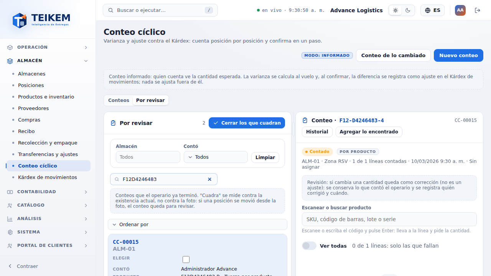
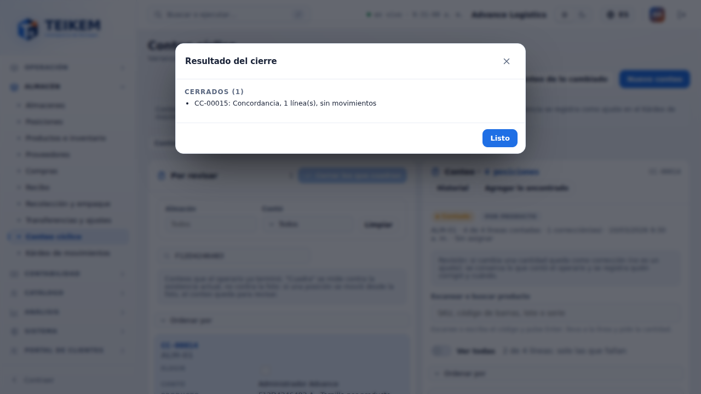
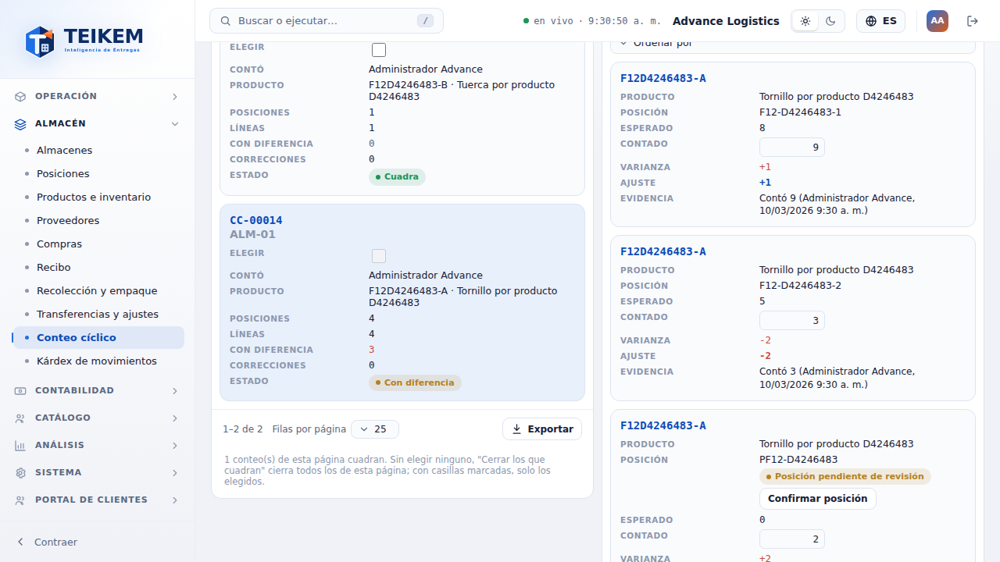
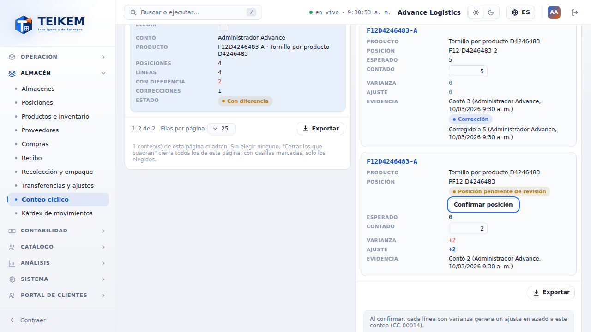
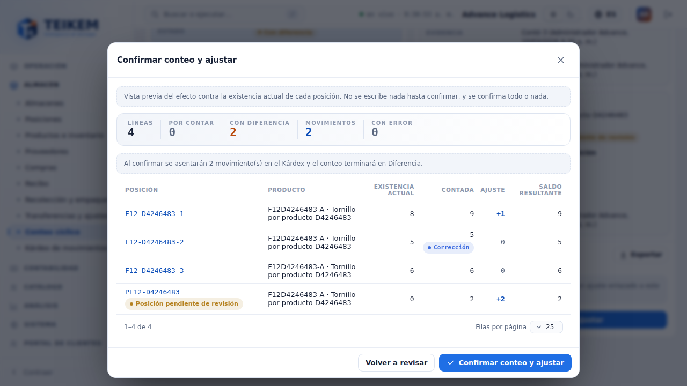
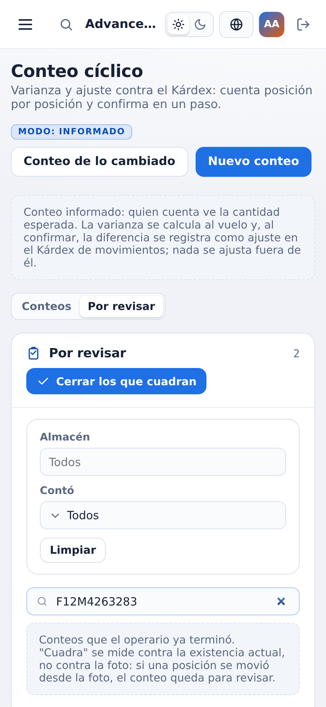
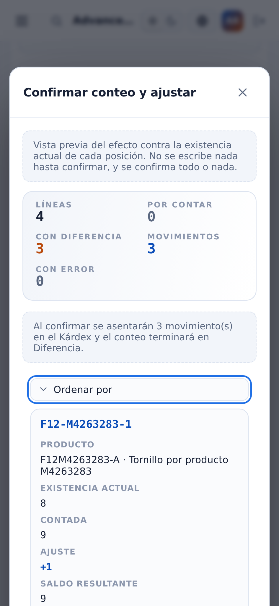

# F12 — Conteo cíclico por producto: "Por revisar", corrección del supervisor y vista previa

Pantalla **Almacén → Conteo cíclico** (`/warehouse/cycle-counts`). Este lote agrega la **revisión rápida** de los conteos que el
operario ya terminó en la app (sobre todo los conteos **por producto**): una lista "Por revisar", el cierre en bloque de los que
cuadran, la corrección de cantidades con evidencia y una **vista previa del efecto** antes de confirmar. Servidor: capítulo
[06, sección 6, "Lote 21"](../06-inventario-y-almacen.md); decisiones en `docs/frontend/loteF12-decisiones.md`. La app ("Contar
por producto") está en el [capítulo 09](../09-app-almacen.md).

**Quién puede.** Todo requiere el módulo **WMS_LOTSERIAL**.

| Qué | Permiso |
|---|---|
| Ver la pantalla y la lista de siempre | `inventory.view` |
| Ver la pestaña **Por revisar**, la vista previa, corregir cantidades, **Cerrar los que cuadran** y **Confirmar conteo y ajustar** | `warehouse.count` |
| **Confirmar posición** (posición pendiente de revisión) | `warehouse.manage` |

Sin `warehouse.count` (conteo **a ciegas**) no se ve la pestaña "Por revisar" ni nada de lo esperado: ni la vista previa, ni el
ajuste, ni "solo las que fallan". Quién ve las cantidades del sistema **no cambió**. La evidencia (quién contó y quién corrigió) sí
se ve, porque no revela lo que dice el sistema.

## 1. Pestaña "Por revisar"

Arriba de la pantalla hay dos pestañas: **Conteos** (la lista de siempre) y **Por revisar** (`?tab=review`). "Por revisar" muestra
los conteos en estatus **Contado** (los que el operario terminó), los más recientes primero, con el conteo elegido a la derecha.

| Columna | Qué dice |
|---|---|
| Elegir | casilla para cerrar solo algunos (solo se puede marcar en los que **cuadran**) |
| Conteo | número (CC-…) y almacén |
| Contó | quien capturó más líneas; "Ana y 1 más" si contaron varios |
| Producto | el primero (SKU · nombre) y "y N más" si el conteo tiene varios productos |
| Posiciones · Líneas | cuántas posiciones y líneas tiene |
| Con diferencia | líneas que asentarían un ajuste **contra la existencia actual** (en rojo si hay alguna) |
| Correcciones | líneas que el supervisor corrigió |
| Estado | **Cuadra** (verde), **Con diferencia** (naranja), **Con errores** (rojo), **Faltan líneas** (gris) |

- **"Cuadra" se mide contra la existencia actual, no contra la foto.** Si una posición se movió desde que se tomó la foto, un
  conteo que coincidía con la foto puede salir "Con diferencia".
- El estado lo calcula el servidor con el mismo cálculo que la confirmación. "Con errores" gana sobre "Faltan líneas" y éste sobre
  "Con diferencia".
- **Filtros** (van al servidor y vuelven a la página 1): **Almacén** (uno o todos), **Contó** (las personas que aparecen en la lista
  y, si su usuario puede administrar usuarios, todos los de la compañía) y el **buscador** (número del conteo, SKU o nombre del
  producto). **Limpiar** los quita.
- Las columnas se ordenan con clic en el encabezado (ordena la página que se ve). Con el panel angosto o en el teléfono la lista
  pasa a tarjetas con "Ordenar por". El pie tiene el rango, "Filas por página" y **Exportar** (todo lo filtrado).
- **Clic en un conteo** lo abre a la derecha (`?count=<id>`); sin elegir, se abre el primero de la página.

## 2. Cerrar los que cuadran

El botón **Cerrar los que cuadran** (arriba de la lista) cierra en **Concordancia**, sin mover inventario, los conteos que cuadran:

- **Sin casillas marcadas:** todos los que cuadran **de la página que se ve** (con los filtros de arriba).
- **Con casillas marcadas:** solo los elegidos (el botón dice "Cerrar los elegidos (N)").
- Una confirmación dice **cuántos y cuáles** ("Se van a cerrar 2 conteo(s) que cuadran: CC-00012, CC-00015…") y permite un
  **comentario** opcional (máximo 500 caracteres) que queda en el historial de cada conteo cerrado.
- Antes de cerrar cada uno, el servidor **vuelve a comprobar** la existencia actual. Cada conteo se cierra en su propia
  transacción: termina en Concordancia o queda como estaba.
- El **resultado** lista los **Cerrados** ("CC-00012: Concordancia, 1 línea(s), sin movimientos") y los que **quedan para revisar**
  con su motivo. Un clic en el número abre ese conteo.

| Motivo (código) | Texto que se ve | Qué hacer |
|---|---|---|
| `WouldPost` | Asentaría {n} movimiento(s); revíselo. | Abrirlo, ver la vista previa y corregir o confirmar a mano |
| `Errors` | Tiene {n} línea(s) con error: *(mensaje del servidor)* | Liberar la reserva o corregir la cantidad |
| `Pending` | Faltan {n} línea(s) por contar. | Terminar de contar |
| `Stale` | La existencia cambió mientras se cerraba; revíselo. | Volver a mirarlo |
| `NotCounted` | Todavía no se termina de contar. | Esperar a que el operario termine |
| `AlreadyReconciled` | Ya estaba confirmado. | Nada |
| `NotFound` | El conteo no existe. | Nada (otro usuario lo eliminó) |
| `NoLines` | El conteo no tiene líneas. | Eliminarlo o agregar lo encontrado |
| `Failed` | No se pudo cerrar: *(mensaje del servidor)* | Según el mensaje |

Si no hay ninguno que cuadre en la página, el botón queda deshabilitado ("Ningún conteo de esta página cuadra.").

## 3. Revisar un conteo: solo las líneas que fallan, evidencia y corrección

Un conteo **Contado** se abre mostrando **solo las líneas que fallan**: las que asentarían un ajuste contra la existencia actual o
que tienen un error. El interruptor **Ver todas** muestra el resto; al lado se lee "3 de 4 líneas: solo las que fallan". Un conteo
Pendiente (el que se cuenta en la web) se abre con todas las líneas.

Columnas nuevas de la rejilla (con `warehouse.count` y el conteo abierto):

- **Ajuste:** lo que se asentaría en esa posición contra la existencia **actual** (+ en azul entra, − en rojo sale; al pasar el
  mouse: "Existencia actual 8 → saldo resultante 9"). Si la línea tiene un error (contado menos que lo reservado), el mensaje del
  servidor aparece debajo y la fila se marca en rojo. La **Varianza** sigue siendo contra la foto.
- **Evidencia:** *Contó 3 (Ana Operaria, 10/03/2026 8:54 a. m.)* y, si alguien la corrigió, el chip **Corrección** con *Corregido a 5
  (Sofía Supervisora, …)*. Fechas y horas en el formato y la zona de la compañía.

**Corregir** es escribir otra cantidad en **Contado** (Enter o salir del campo guarda). En un conteo Contado eso es una
**corrección, no un ajuste**: no mueve inventario por sí misma; se conserva lo que contó el operario y se anota quién corrigió y
cuándo. El inventario se mueve solo al confirmar. La fila que se acaba de corregir **se queda a la vista** aunque ya no falle. La
vista previa y la columna Ajuste se recalculan solas ("recalculando…").

**Posición pendiente de revisión:** una posición que el operario creó desde la app ("Otra posición") lleva el chip **Posición
pendiente de revisión**. Con `warehouse.manage` aparece **Confirmar posición** ("Posición … confirmada."); también se puede revisar
en Almacenes → ficha → Posiciones (sección 5).

## 4. Vista previa y confirmar

**Confirmar conteo y ajustar** ya no confirma directamente: primero guarda lo tecleado y abre la **vista previa del efecto**, que
calcula el servidor con la misma regla que la confirmación (sin escribir nada):

- **Totales:** Líneas, Por contar, Con diferencia, Movimientos y Con error.
- **Por posición:** Posición (con el chip si es provisional), Producto, Lote, **Existencia actual** (chip "Saldo cambió" si se movió
  desde la foto), Reservado (si hay), **Contada** (chip "Corrección"), **Ajuste** (+/−), **Saldo resultante** y **Error**.
- **Avisos:** "Faltan {n} línea(s) por contar: no se puede confirmar hasta contarlas."; "Concordancia: el conteo cuadra con la
  existencia actual; al confirmar no se ajustará nada."; "Al confirmar se asentarán {n} movimiento(s) en el Kárdex y el conteo
  terminará en Diferencia."; "La existencia de {n} posición(es) cambió desde la foto…".
- **Qué bloquea** (el botón Confirmar queda deshabilitado y el motivo se lee junto a él): un error del conteo entero (p. ej. una
  serie en dos líneas), "Hay {n} línea(s) con error; corríjalas antes de confirmar.", "Faltan {n} línea(s) por contar." o "El conteo
  no tiene líneas."
- **Confirmar** es **todo o nada** y usa la versión del conteo que se previsualizó: si alguien cambió el conteo después, el servidor
  responde el 409 y la vista previa se recalcula. **Volver a revisar** cierra sin confirmar.

Al confirmar: "Conteo CC-…: Diferencia, 2 ajuste(s) en el Kárdex." (o "…: Concordancia, sin ajustes.") y el conteo queda cerrado con
el enlace "Ver los ajustes en el Kárdex". El motivo de cada ajuste del Kárdex lleva la evidencia de la corrección.

### Mensajes del servidor que se ven aquí

| Mensaje | HTTP | Dónde | Qué hacer |
|---|---|---|---|
| El conteo de {sku} en {posición} ({contado}) es menor que lo reservado ({reservado}); libere la reserva antes de reconciliar. | 409 al confirmar; en la vista previa, como error de la línea | columna Error / Ajuste | Liberar la reserva o corregir la cantidad |
| El registro fue modificado por otro usuario; recargue e intente de nuevo. | 409 | pie de la vista previa | La vista previa se recalcula sola; revise y confirme de nuevo |
| El conteo ya fue reconciliado; solo se consulta. | 422 | vista previa | Otro usuario lo confirmó o lo cerró en bloque |
| Faltan {n} línea(s) por contar. | 422 | botón Confirmar | Contar las líneas pendientes |
| La posición no está pendiente de revisión. | 409 | aviso al confirmar posición | Ya estaba confirmada: nada que hacer |
| Se revisan como máximo 200 conteos por vez; acote por almacén o por ids. | 400 | confirmación del cierre en bloque | No ocurre desde la pantalla (cierra como máximo una página de 200) |
| El comentario admite como máximo 500 caracteres. | (pantalla) | comentario del cierre en bloque | Acortar el comentario |

## 5. Posiciones pendientes de revisión en el almacén

En **Almacenes → ficha del almacén → Posiciones**, una posición creada desde un conteo lleva el chip **Pendiente de revisión** junto
al código; el interruptor **Solo pendientes de revisión** las filtra y la acción de fila **Confirmar posición** (`warehouse.manage`)
les quita la marca. En **Posiciones** (Ubicaciones) se ve el mismo chip.

## 6. En el teléfono (360 px)

 

La lista y el conteo se apilan, las tablas pasan a tarjetas y la vista previa se lee completa sin desplazamiento horizontal de la
página.

## 7. Casos frecuentes

- **El operario puso 0 donde había 1 y 1 donde había 0:** corrija las dos líneas en la rejilla (quedan como correcciones) y la vista
  previa mostrará 0 movimientos: "Concordancia".
- **Un conteo cuadraba ayer y hoy dice "Con diferencia":** alguien movió inventario en esa posición después de la foto; la vista
  previa lo marca con "Saldo cambió". Revise si el conteo sigue siendo correcto antes de confirmar.
- **No veo la pestaña "Por revisar":** su usuario no tiene `warehouse.count` (cuenta a ciegas).
- **Crear un conteo por producto desde la web:** todavía no; se crea desde la app (decisión pendiente del dueño).
