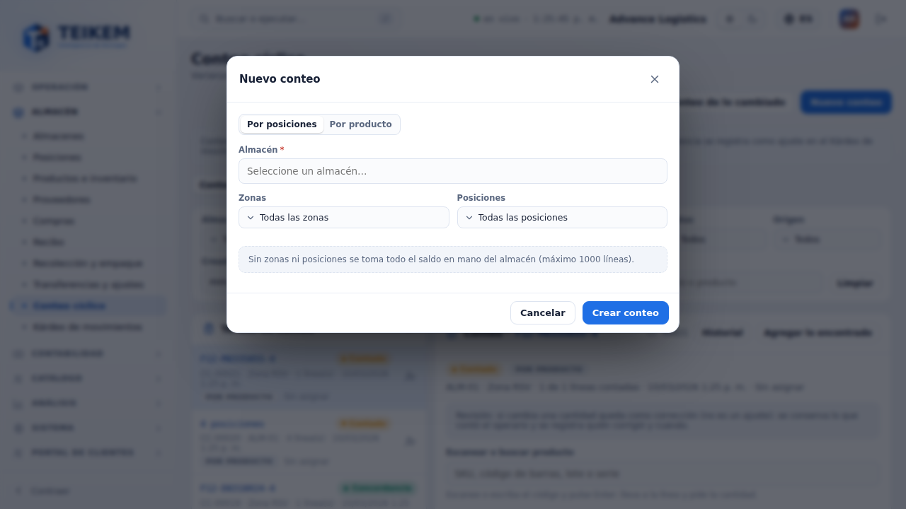
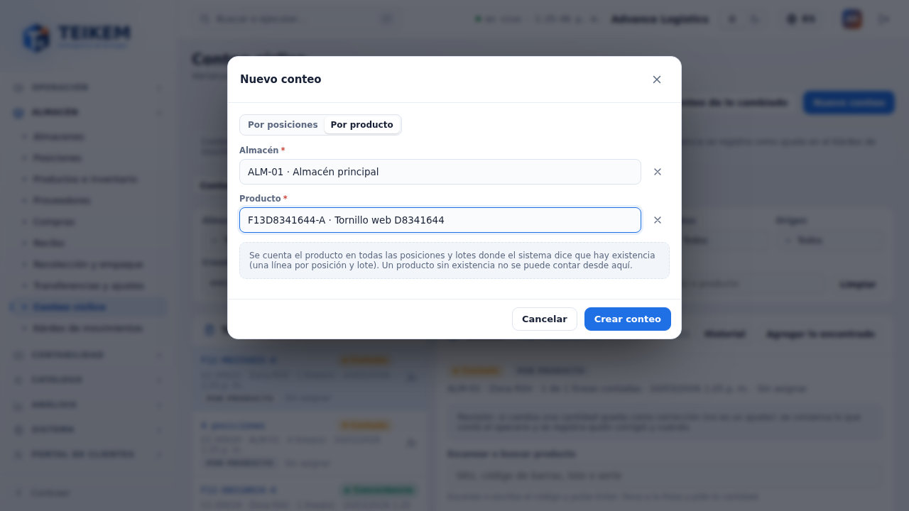
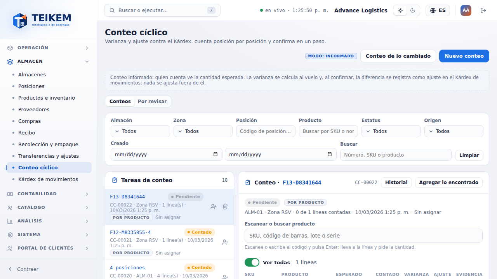
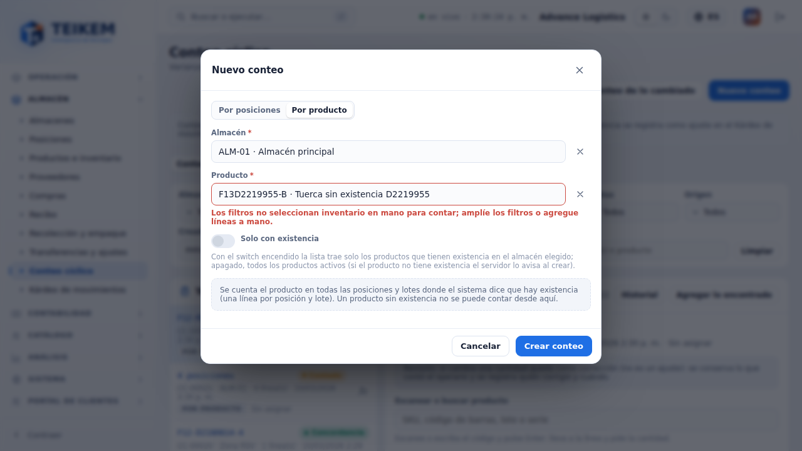

# F13 — Nuevo conteo "Por producto" desde la web

> **Actualizado el 2026-10-05 (Lote 25):** en **Por producto** el producto es **opcional**: sin elegirlo se abre un conteo vacío al que se agregan productos escaneados (el escáner del detalle abre "Agregar lo encontrado" con el producto puesto y la posición opcional). Ver [lote25-decisiones.md](../../lote25-decisiones.md) y el FAQ "Lote 25".

Pantalla **Almacén → Conteo cíclico** (`/warehouse/cycle-counts`), botón **Nuevo conteo**. Este cambio (decisión del dueño del
2026-10-03) agrega la opción **Por producto**: se elige un almacén y **un** producto, y el servidor arma el conteo con una línea por
cada posición y lote donde el sistema dice que hay existencia de ese producto. Es el mismo conteo que se crea desde la app de almacén
("Contar por producto"), con origen **Producto**. Servidor: capítulo [06, sección 6, "Lote 21"](../06-inventario-y-almacen.md).

**Quién puede.** Requiere el módulo **WMS_LOTSERIAL** y el permiso **`warehouse.count`** (el mismo de "Nuevo conteo" de siempre: sin él
el botón no se ve). Crear el conteo es `POST /api/v1/cycle-counts`.

## 1. Las dos opciones del modal

El modal **Nuevo conteo** abre con dos pestañas:

| Pestaña | Campos | Qué crea |
|---|---|---|
| **Por posiciones** (la de siempre) | Almacén (obligatorio), Zonas y Posiciones (opcionales) | Un conteo con todo el saldo en mano de lo elegido; sin zonas ni posiciones, de todo el almacén (máximo 1000 líneas) |
| **Por producto** (nueva) | Almacén (obligatorio), Producto (obligatorio, con buscador por SKU o nombre) | Un conteo de ese producto con una línea por posición y lote con existencia; origen **Producto** |

Al cambiar de pestaña se limpian los errores; el almacén elegido se conserva.

## 2. Crear un conteo por producto

1. **Nuevo conteo** → pestaña **Por producto**.
2. Elija el **Almacén** y escriba parte del SKU o del nombre en **Producto**; elija una opción de la lista. Debajo del selector está el
   switch **Solo con existencia** (segundo bloque de decisiones del dueño, 2026-10-03): **nace encendido** y la lista ofrece solo los
   productos que tienen existencia en mano en el almacén elegido (`GET /api/v1/products?warehousePublicId=…&onlyOnHand=true`; es la misma
   existencia que cuenta el servidor, incluida la reservada). Apáguelo para ver **todos** los productos activos, por ejemplo para
   contar algo que el sistema cree que no existe. No se guarda la preferencia: cada vez que abre el modal vuelve a nacer encendido, y
   al cambiar de almacén la lista se vuelve a pedir con el almacén nuevo.
3. **Crear conteo**. Aparece el aviso *Conteo CC-00012 creado con N línea(s).*, el modal se cierra y el conteo nuevo queda abierto en el
   panel de la derecha (`?count=<id>`), con su lista de posiciones y lotes. Ya se puede contar desde la web o desde la app.

Productos con **número de serie**: el servidor los admite, pero la captura por serie se sigue haciendo en la web, en la fila del conteo
(la app de almacén todavía no captura series).

## 3. Mensajes y validaciones

| Cuándo | Mensaje | HTTP | Dónde se ve |
|---|---|---|---|
| Sin almacén | `Seleccione un almacén.` (texto de la web) | — (no se envía) | Bajo Almacén |
| Sin producto (pestaña Por producto) | `Elija el producto.` | — (no se envía) | Bajo Producto |
| El producto no tiene existencia en ninguna posición del almacén (solo se puede elegir con el switch **Solo con existencia** apagado) | `Los filtros no seleccionan inventario en mano para contar; amplíe los filtros o agregue líneas a mano.` | 400 | Bajo Producto; el modal sigue abierto |
| El producto o el almacén ya no existen | `Producto no encontrado.` / error de almacén | 404 | Aviso arriba del formulario |
| Más de 1000 líneas | `El conteo no puede tener más de 1000 líneas…` (texto del servidor) | 400 | Aviso arriba del formulario |

La web **no** usa `allowEmpty`: un producto sin existencia **no** se puede contar desde aquí (para contar algo que el sistema cree que no
existe, use "Contar por producto" en la app de almacén, que abre el conteo vacío y deja agregar lo hallado en una posición).

## 4. Casos frecuentes

- **El producto no aparece en la lista:** el buscador solo ofrece productos activos; busque por SKU o por nombre. Con **Solo con existencia**
  encendido tampoco salen los que no tienen existencia en el almacén elegido: apague el switch o cambie el almacén.
- **"Los filtros no seleccionan inventario…" con un producto que sí existe:** no tiene existencia en mano en ese almacén (puede estar en
  otro almacén o toda reservada/en tránsito). Cambie el almacén o recíbalo primero.
- **Ya hay un conteo abierto de ese producto:** se puede crear otro; cada conteo es independiente. Al confirmar, cada uno ajusta contra la
  existencia actual (ver el [capítulo F12](f12-conteo-por-producto.md), "Vista previa").
- **Móvil (360 px):** el modal ocupa el ancho de la pantalla y las dos pestañas caben sin desplazar la página.
