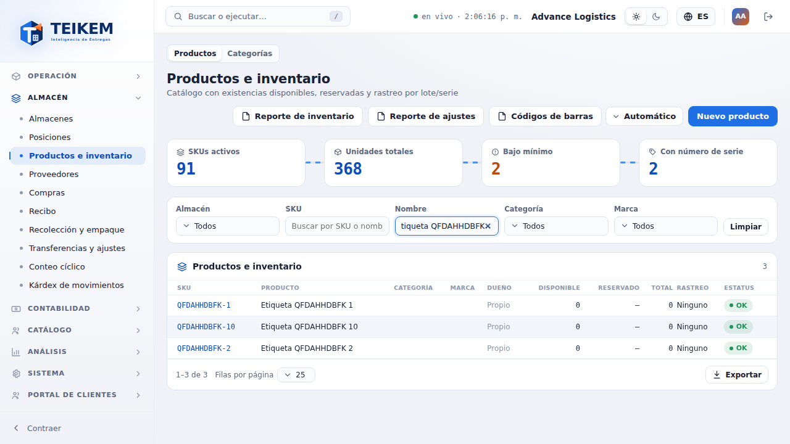
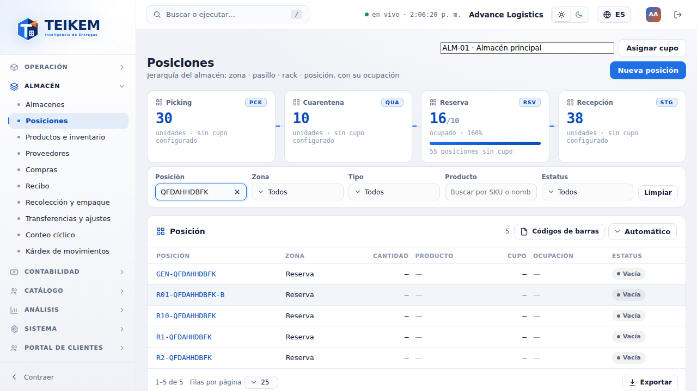
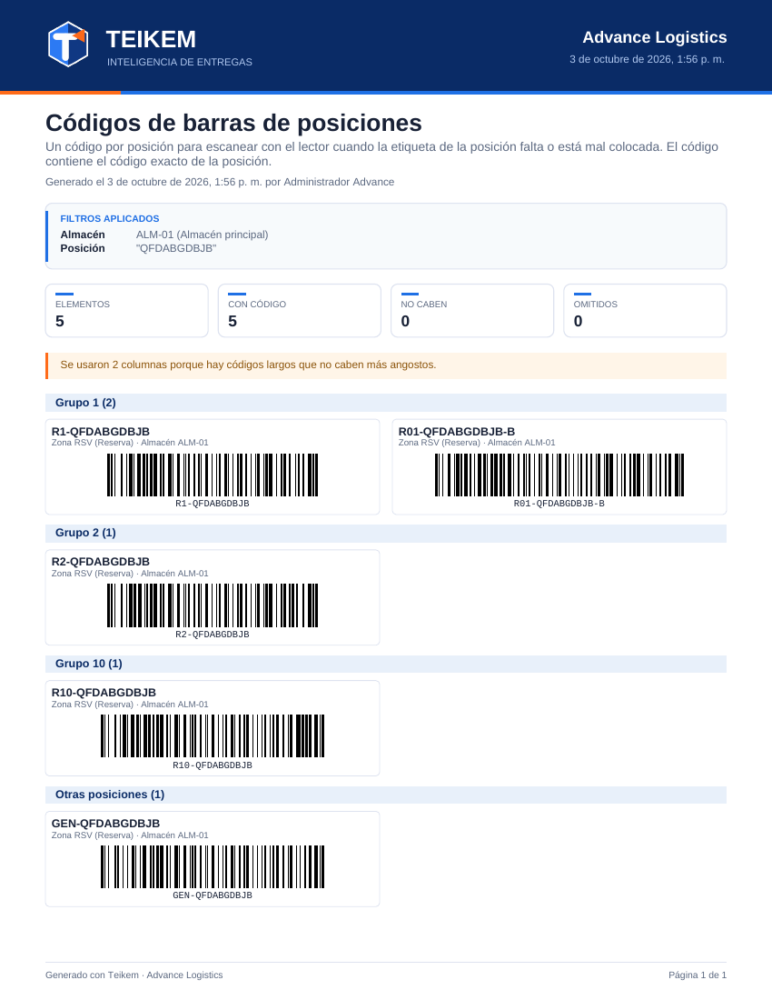
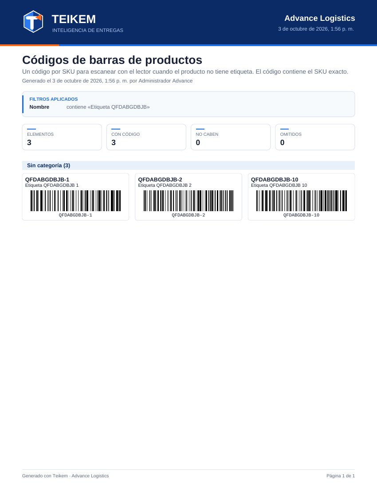
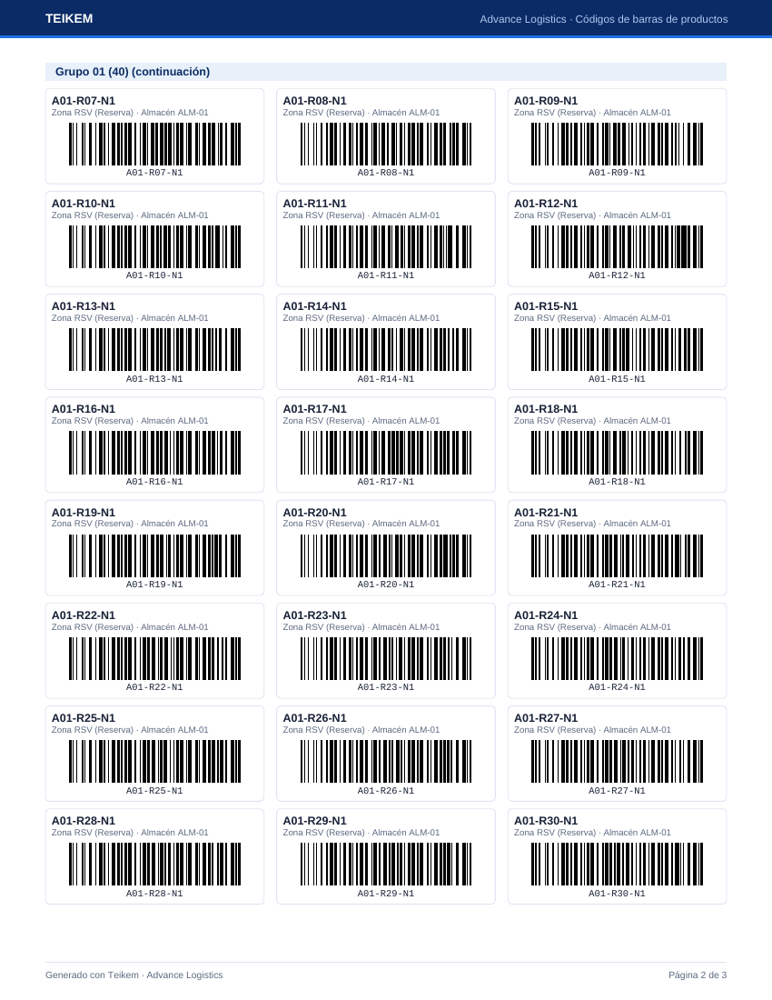

# F14 — Códigos de barras para el conteo (productos y posiciones)

Cuando se hace inventario (conteo), muchos productos no tienen etiqueta y las etiquetas de las posiciones pueden faltar o estar mal
colocadas. Estos dos reportes imprimen una hoja con **un código de barras por elemento** para que el contador **escanee el papel** con el
lector (Zebra) en vez de teclear. Pedido del dueño del 2026-10-03, con el diseño en rejilla del mismo día (menos páginas).

| Reporte | Desde | Qué lleva el código de barras |
|---|---|---|
| **Códigos de barras de productos** | Almacén → **Productos e inventario** (`/warehouse/products`), cabecera | El **SKU exacto** del producto (no el código de barras propio del producto) |
| **Códigos de barras de posiciones** | Almacén → **Posiciones** (`/warehouse/locations`), cabecera de la tabla; y la pestaña **Posiciones** de la ficha del almacén | El **código exacto** de la posición |

La app del lector ya reconoce lo escaneado: busca el producto por código de barras **o SKU**, y la posición por su **código exacto**.

**Quién puede.** Módulo **WMS_LOTSERIAL** y permiso **`inventory.view`** (el mismo de las pantallas y de sus otros reportes y Exportar). Sin el
permiso el botón no se ve. Los reportes se arman en el navegador (no hay endpoint propio): leen el listado con
`GET /api/v1/products` o `GET /api/v1/warehouses/{almacén}/bins`, de a 200 hasta 10 000.

## 1. Generar el reporte

1. Filtre la pantalla como siempre (en Productos: Almacén, SKU, Nombre, Categoría, Marca o un indicador del río; en Posiciones:
   Posición, Zona, Tipo, Producto, Estatus o un recuadro de zona).
2. Pulse **Códigos de barras**: es un **menú** (desde 2026-10-05; ya no hay un selector aparte al lado) con dos opciones, **Automático** y
   **2 columnas** (códigos más anchos, más fáciles de leer, pero más páginas). Al elegir una se genera el PDF; igual en Productos y en Posiciones.
3. El botón dice **Generando…** mientras se arma y luego se descarga el PDF, por ejemplo
   `codigos-de-barras-de-productos-advance-logistics-2026-10-03.pdf` o `codigos-de-barras-de-posiciones-advance-logistics-2026-10-03.pdf`.

**El reporte es exactamente lo filtrado**: los mismos filtros que la tabla y que Exportar. Sin filtros, salen todos los productos (o todas
las posiciones activas del almacén elegido). En Posiciones, las inactivas no salen (la pantalla no las muestra); en la pestaña Posiciones de
la ficha del almacén, salen si está marcado "Incluir inactivas", con la marca *Inactiva*. En Productos, los inactivos salen si la tabla los
muestra, con la marca *Inactivo*.

## 2. Cómo es la hoja

- **Hoja carta vertical.** Arriba, como los demás reportes: la marca, la compañía, título, *Generado el … por …* con la fecha y hora de la
  compañía, el recuadro **Filtros aplicados** y cuatro tarjetas: **Elementos** (total del reporte), **Con código**, **No caben** y
  **Omitidos**. Abajo, *Generado con Teikem* y *Página X de Y*. Un PDF de ejemplo: [f14-ejemplo-posiciones.pdf](img/f14-ejemplo-posiciones.pdf).
- **Rejilla.** Cada recuadro es un elemento: arriba el **SKU** en negrita y su descripción (hasta 2 renglones; si es más larga termina en
  "…"), o el **código de la posición** con su zona y almacén en gris; debajo el **código de barras** con el valor legible. En
  **Automático** son **3 columnas** si todos los códigos caben; si alguno es demasiado largo, **2**, y si aun así no, **1**. Cuando se
  usan menos columnas de las pedidas, un aviso arriba lo dice (*Se usaron 2 columnas porque hay códigos largos que no caben más
  angostos.*). Con posiciones de códigos cortos caben unas 24 por página (3 × 8).
- **Grupos.** Cada grupo empieza con una franja azul con su título y la cantidad. Si el grupo sigue en la página siguiente, la franja se
  repite como *… (continuación)*. Un título nunca queda solo al pie de una página y un recuadro nunca se parte entre dos páginas.
  - **Productos**: por **categoría** (la ruta completa, p. ej. *Salud / Médico (12)*), en orden alfabético; **Sin categoría** al final.
    Dentro de cada grupo, por **SKU en orden natural** (SKU-2 antes que SKU-10).
  - **Posiciones**: por el **primer número del código** (la primera secuencia de dígitos: `A01-R01-N1-P01` → grupo **01**, `R1` → **1**,
    `B-06` → **06**). Se comparan como números (el 2 antes que el 10) y `01` y `1` son el **mismo grupo**, que se titula como aparece en
    su primer código (*Grupo 01 (8)*). Los códigos sin dígitos (`GENERAL`, `MUELLE`) van a **Otras posiciones** al final. Dentro de cada
    grupo, por código completo en orden natural.

### El código de barras

Code 128 (el que leen todos los lectores del almacén), dibujado en vectores: se imprime nítido en cualquier impresora. Cada código tiene
alrededor un margen en blanco (zona de silencio) de al menos 10 barras finas; la barra más fina mide 0.33 mm y, si el valor es largo, se
angosta hasta 0.25 mm como mínimo; las barras miden 12 mm de alto. **Imprima al 100 %** ("Tamaño real"; no "Ajustar a la página"): al
reducir la hoja las barras quedan más finas que el mínimo y el lector puede no leerlas.

## 3. Avisos del reporte (sin código HTTP)

| Aviso | Cuándo | Qué hacer |
|---|---|---|
| *El reporte incluye solo los primeros {n} productos (límite de lectura). Afine los filtros para ver el resto.* (o *las primeras {n} posiciones*) | El filtro devuelve más de 10 000 | Filtre por categoría, zona o texto e imprima por partes |
| *Se usaron {n} columnas porque hay códigos largos que no caben más angostos.* / *Se usó una sola columna…* | Algún código no cabe en 3 (o 2) columnas a 0.25 mm | Nada: es informativo. Para volver a 3 columnas, saque los códigos largos con los filtros |
| *Hay valores sin código de barras (no caben u omitidos): vea los avisos al final del reporte.* | Hay elementos de las dos filas siguientes | Revise la última página |
| *No caben como código de barras legible en el ancho de la hoja ({n}); salen en la lista sin código: …* + recuadro **No cabe: demasiado largo para un código legible** | El valor es tan largo que ni en una columna cabe a 0.25 mm (más de ~62 letras, o menos si mezcla) | Teclee ese SKU o código a mano en el lector; o acorte el código |
| *Omitidos porque tienen caracteres que el código de barras (Code 128) no admite ({n}): VALOR (no admite: É)* | El valor tiene acentos, ñ u otros caracteres fuera de ASCII imprimible | Teclee ese valor a mano; para imprimirlo, cambie el código de la posición (el SKU no se puede cambiar) |
| *Ningún producto cumple los filtros.* / *Ninguna posición cumple los filtros.* | El filtro no deja nada | Cambie los filtros |
| Toast *No se pudo generar el reporte. Intente de nuevo.* | Falló la lectura del API o el armado del PDF | Intente de nuevo; si sigue, avise a soporte con la hora |

## 4. Casos frecuentes

- **El lector no lee el papel:** imprima al 100 % (sin "Ajustar a la página"), con tinta negra y papel blanco; no doble la hoja sobre el
  código. Pruebe con **2 columnas** (códigos más anchos).
- **El lector lee pero la app no encuentra el producto:** el código lleva el SKU; si el producto se dio de baja, la app no lo ofrece.
  Confirme que el SKU está activo en Productos e inventario.
- **Quiero solo las posiciones de un pasillo:** en Posiciones escriba el pasillo en el filtro **Posición** (busca en código, pasillo, rack,
  nivel y posición) o use la pestaña Posiciones de la ficha del almacén, que tiene filtros separados de Pasillo, Rack, Nivel y Posición.
- **El filtro Almacén de Productos no cambia la lista:** es lo mismo que en la tabla: el almacén acota las cantidades, no quita productos.
  Por eso el reporte de códigos (que no tiene cantidades) sale igual.
- **¿Por qué R1 y R01 salen juntos?** Porque el primer número es el mismo (1). Es a propósito: el dueño pidió tratarlos como el mismo
  grupo.
- **Móvil (360 px):** el botón y su menú caben y el PDF se descarga igual.
