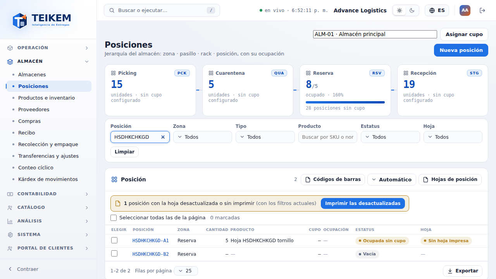
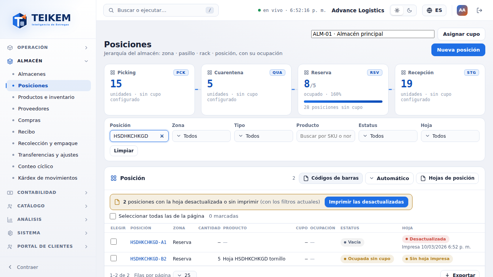
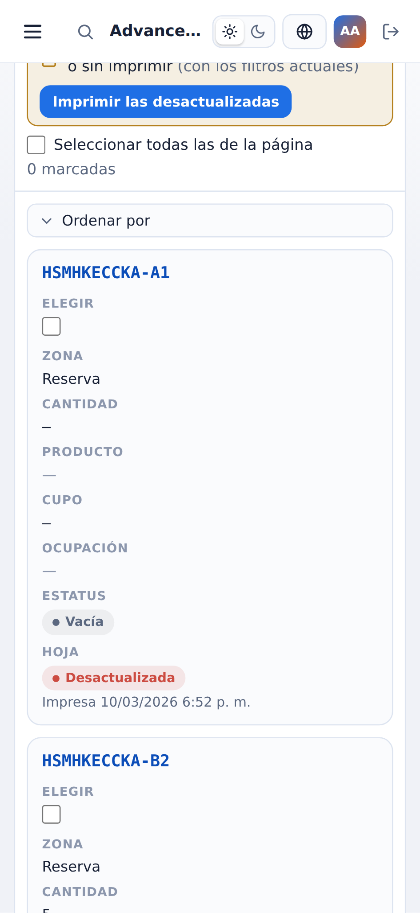
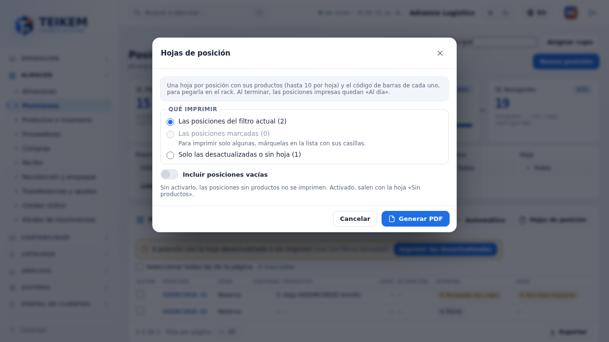
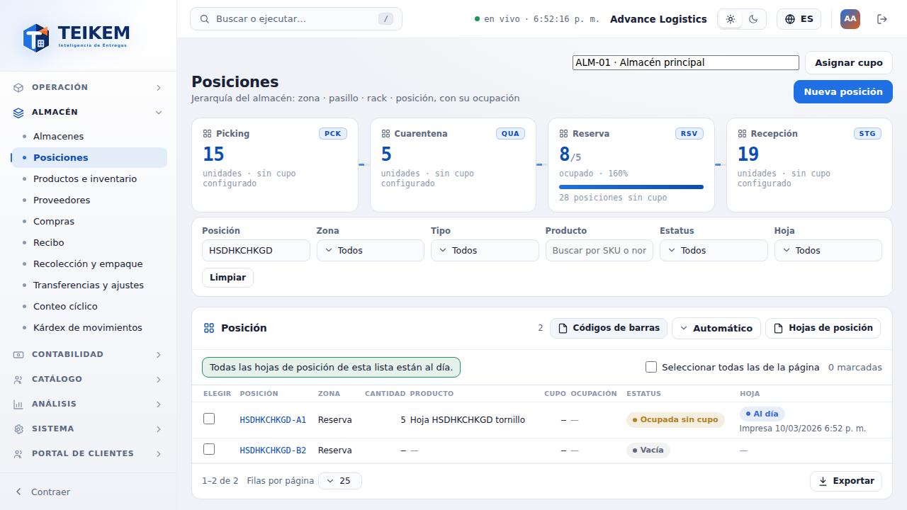
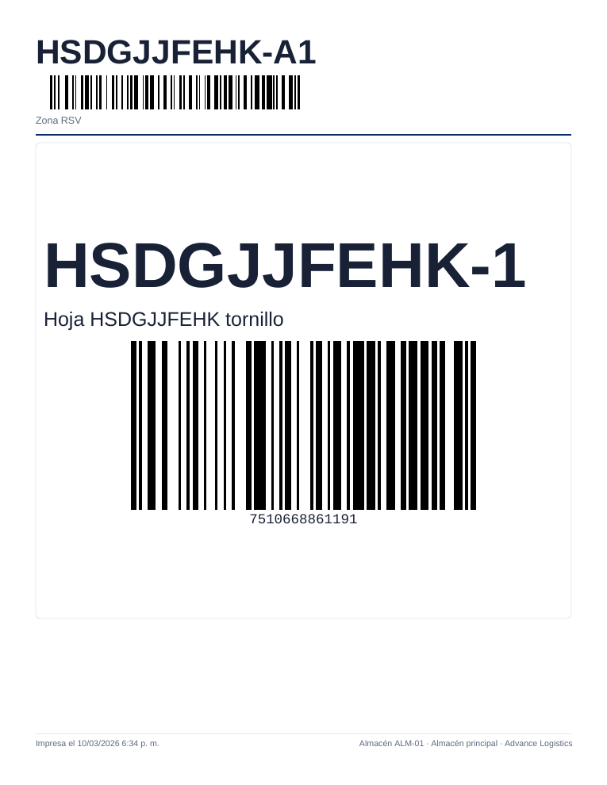
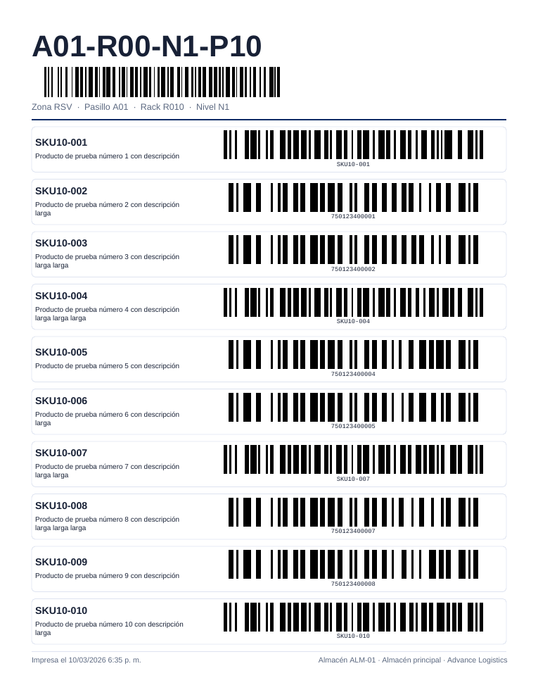
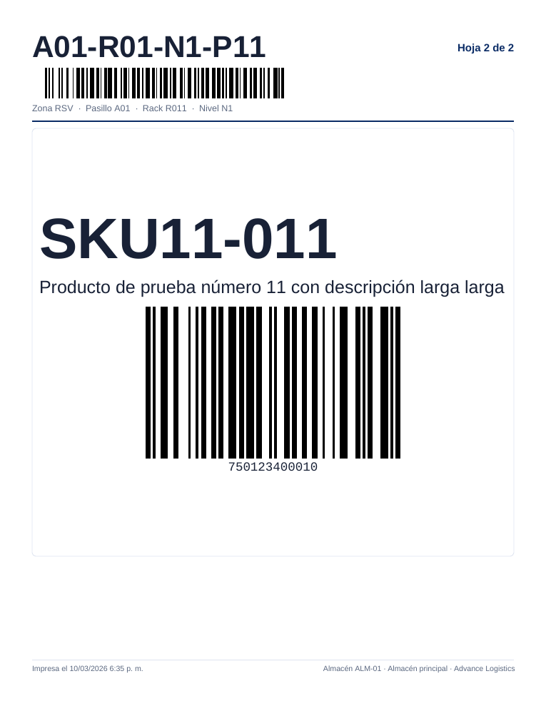

# F15 — Hojas de posición (Ubicaciones)

La **hoja de posición** es un papel que se pega en cada posición del rack con la lista de productos que hay en ella y el **código de
barras de cada producto**, para escanearlo con el lector (Zebra) cuando el producto no tiene código visible o está a 20–30 pies de altura.
Pedido del dueño del 2026-10-03. El servidor (Lote 23, [capítulo 06 §1.5](../06-inventario-y-almacen.md#15-hojas-de-posición-lote-23))
lleva el rastro de cada hoja: **cuándo se imprimió por última vez** y **cuándo cambió por última vez la lista de productos** de la
posición; con eso la pantalla dice qué hojas pegadas ya no sirven.

**Dónde.** Almacén → **Posiciones** (`/warehouse/locations`), en la tabla de posiciones del almacén elegido arriba.

**Quién puede.** Módulo **WMS_LOTSERIAL** y permiso **`inventory.view`** (el de la pantalla) para ver el estado, imprimir y marcar las
hojas como impresas (decisión del dueño: imprimir no pide un permiso nuevo). Sin el permiso no se ven los botones **Hojas de posición** ni
**Imprimir las desactualizadas**.

Es **genérico**: el código de la posición se imprime tal cual (no se supone ningún formato de piso, pasillo o nivel).

## 1. El estado de la hoja en la lista

La tabla gana tres cosas:

- Columna **Hoja** (última columna) con una insignia **de color y con texto** (no solo color):

  | Insignia | Cuándo | ¿Hay que imprimir? |
  |---|---|---|
  | **Sin hoja impresa** (amarilla) | La posición tiene productos y su hoja nunca se marcó como impresa. Las posiciones nuevas, y todas al activar la función, arrancan así | Sí |
  | **Desactualizada** (roja) | La hoja se imprimió y después **entró un producto nuevo o salió uno** (también si la posición quedó vacía: la hoja pegada ya no sirve) | Sí |
  | **Al día** (verde) | Tiene productos, la hoja se imprimió y la lista no cambió desde entonces | No |
  | **—** | La posición no tiene productos y no hay una hoja vieja pendiente | No |

  Debajo de la insignia, **Impresa 10/03/2026 6:34 p. m.** (fecha y hora de la última impresión con los formatos y la hora de la
  compañía). Al pasar el mouse: *Última impresión: … · Último cambio de productos: …*. Subir o bajar la cantidad de un producto que sigue
  en la posición **no** desactualiza la hoja (la hoja no lleva cantidades).
- Filtro **Hoja** (arriba, junto a Estatus): uno o varios de *Sin hoja impresa*, *Desactualizada*, *Al día* y *Sin productos (no necesita
  hoja)*. Va al servidor (`sheetStatus`) como los demás filtros y la columna **Hoja** se puede ordenar con un clic en el encabezado.
- El **aviso acumulado** encima de la tabla: **"N posiciones con la hoja desactualizada o sin imprimir"** (de todas las páginas; con
  *(con los filtros actuales)* si hay algún filtro puesto que no sea **Hoja**) y el botón **Imprimir las desactualizadas**. Con todo al
  día dice *Todas las hojas de posición de esta lista están al día.* **No hay ventanas emergentes** cuando se mueve mercancía (decisión
  del dueño): solo cambian la insignia y el contador cuando la lista se vuelve a cargar.

En el celular (360 px) la tabla pasa a tarjetas: cada tarjeta trae **Elegir** (la casilla), la insignia **Hoja** y la línea *Impresa …*;
el aviso y las casillas envuelven en renglones, sin desplazamiento horizontal.

## 2. Elegir qué imprimir

"Debo poder imprimir las posiciones que yo quiera, no todas." Hay tres maneras:

1. **Las posiciones del filtro actual**: filtre la tabla (Posición, Zona, Tipo, Producto, Estatus, Hoja o un recuadro de zona) y se
   imprimen exactamente esas (todas las páginas).
2. **Las posiciones marcadas**: marque la casilla **Elegir** de cada posición. **Seleccionar todas las de la página** marca (o desmarca)
   la página visible; si solo algunas están marcadas la casilla queda a medias. El contador dice **N marcadas** y **Quitar marcas**
   las borra. Las marcas se conservan al cambiar de página o de filtro (dentro del mismo almacén; al cambiar de almacén se pierden).
   Marcar no abre la posición.
3. **Solo las desactualizadas o sin hoja**: las *Desactualizada* y *Sin hoja impresa* con los demás filtros de la tabla (sin el filtro
   Hoja). Es lo que abre directo el botón **Imprimir las desactualizadas**.

Pulse **Hojas de posición** (cabecera de la tabla, junto a **Códigos de barras**). Se abre el modal con la opción ya elegida: **marcadas**
si hay marcas, si no **filtro actual**; desde **Imprimir las desactualizadas**, esa.

- **Qué imprimir**: las tres opciones con su cantidad entre paréntesis. *Las posiciones marcadas* está deshabilitada si no hay marcas
  (*Para imprimir solo algunas, márquelas en la lista con sus casillas.*).
- **Incluir posiciones vacías** (apagado por defecto): apagado, las posiciones sin productos no se imprimen; encendido, salen con una
  hoja **Sin productos** (sirve para reemplazar la hoja vieja de una posición que se vació).
- **Tope**: como mucho **500 posiciones** por impresión. Con más, el modal dice *Son N posiciones; el máximo por impresión es 500. Acote
  con los filtros o marque menos posiciones.* y **Generar PDF** queda deshabilitado.

## 3. Generar el PDF

Pulse **Generar PDF**:

1. Se leen las hojas del servidor de **200 en 200** (`GET /api/v1/warehouses/{almacén}/bin-sheets`): *Leyendo posiciones… 200 de 431*.
   Mientras lee, **Cancelar** detiene todo y **no se marca nada** (*Impresión cancelada; no se marcó ninguna hoja.*).
2. Se arma el PDF en el navegador (*Generando el PDF (N hojas)…*) y se descarga, por ejemplo
   `hojas-de-posicion-advance-logistics-2026-10-03.pdf`. Las posiciones van **por código en orden natural** (A-2 antes que A-10).
3. **Solo si el PDF se generó bien**, las posiciones que salieron en el PDF se **marcan como impresas**
   (`POST …/bin-sheets/mark-printed`, todo o nada) con la hora de los datos que dio el servidor; *Marcando N posiciones como
   impresas…*. Si la lista de productos de una posición cambió mientras se imprimía, queda **Desactualizada** (la hoja ya salió vieja).
4. El modal se cierra, la tabla se vuelve a cargar (las insignias pasan a **Al día**) y un aviso dice *Se generaron N hoja(s) de M
   posición(es); quedaron marcadas como impresas.*, más *K posición(es) sin productos no se imprimieron.* y *J producto(s) sin código de
   barras legible: vea el aviso al pie de su hoja.* cuando aplica. Si imprimió las **marcadas**, las marcas se quitan.

Imprima el PDF **al 100 %** ("Tamaño real", sin "Ajustar a la página"), en negro sobre papel blanco, y pegue cada hoja en su posición.

## 4. Cómo es la hoja

- **Carta vertical, una posición por hoja, siempre**: cada posición empieza hoja nueva.
- **Encabezado**: el **código de la posición en grande** con su **código de barras** (Code 128 del código exacto) y debajo *Zona RSV ·
  Pasillo 01 · Rack R1 · Nivel N1 · Posición P01* (solo las partes que existen; *Inactiva* si la posición está dada de baja).
- **Productos (hasta 10 por hoja)**: cada uno en un recuadro con el **SKU** en grande, el **nombre** (si es largo se recorta con "..." a
  2 o 3 renglones) y su **código de barras**: el **código de barras del producto**; si no tiene (o el lector no lo admite, o no cabe), el
  **SKU**. Debajo de las barras va el valor legible.
- **Tamaño adaptable**: el alto de la hoja se reparte entre sus productos: con **1 o 2** el SKU y el código salen lo más grandes posible y
  el código va debajo del texto a todo el ancho; con **3 a 10** el código va a la derecha del texto y todo se achica para que quepan.
  Nunca baja de lo legible (barra fina de al menos 0.25 mm, barras de al menos 8 mm de alto).

- **Más de 10 productos**: la posición sigue en otra hoja con el mismo encabezado y *Hoja 2 de 2* arriba a la derecha (11 productos =
  10 + 1).

- **Posición sin productos** (solo con *Incluir posiciones vacías*): el encabezado y, en el centro, **Sin productos** — *Esta posición no
  tenía productos cuando se imprimió la hoja.*
- **Pie**: *Impresa el 10/03/2026 2:05 p. m.* (formatos y hora de la compañía; es la hora de los datos que se marcó en el sistema) y
  *Almacén ALM-01 · Almacén principal · Advance Logistics*.
- **Sin código**: si ni el código de barras ni el SKU de un producto se pueden imprimir como Code 128 (acentos, ñ…), el recuadro lleva el
  valor y *Sin código de barras: Code 128 no admite Ñ*; si el valor es tan largo que no cabe legible, *No cabe: demasiado largo para un
  código legible*. En los dos casos, un aviso al pie de esa hoja los lista (los mismos textos del reporte de códigos de barras, F14).

## 5. Estados y transiciones

Las transiciones las calcula el servidor; la pantalla solo las muestra y marca impresas:

| De → a | Qué la provoca | Quién |
|---|---|---|
| — (vacía) → **Sin hoja impresa** | Entra el primer producto a una posición que nunca se imprimió | El inventario (recibo, acomodo, transferencia, ajuste, conteo…) |
| **Sin hoja impresa** / **Desactualizada** → **Al día** | Se generó el PDF con esa posición (Generar PDF) | Usuario con `inventory.view` |
| **Al día** → **Desactualizada** | Entra un producto nuevo o sale uno (su existencia llega a 0) | El inventario |
| **Desactualizada** (vacía) → — | Se imprime su hoja *Sin productos* (con *Incluir posiciones vacías*) | Usuario con `inventory.view` |
| **Sin hoja impresa** → — | Sale el último producto de una posición nunca impresa | El inventario |

Nada se bloquea por el estado de la hoja: es solo un aviso.

## 6. Mensajes

| Mensaje | Dónde | Qué hacer |
|---|---|---|
| *Son N posiciones; el máximo por impresión es 500. Acote con los filtros o marque menos posiciones.* | Modal (rojo) | Filtre por zona, pasillo o texto, o marque menos posiciones |
| *No hay posiciones en lo que eligió.* | Modal | El alcance elegido no tiene posiciones; elija otro o cambie los filtros |
| *No hay hojas para imprimir: las posiciones elegidas no tienen productos. Active «Incluir posiciones vacías» para imprimirlas.* | Modal (rojo); no se genera PDF | Encienda el interruptor si quiere hojas *Sin productos* |
| *Impresión cancelada; no se marcó ninguna hoja.* | Aviso abajo | Nada: no se imprimió ni marcó |
| *No se pudieron generar las hojas de posición; no se marcó ninguna. {mensaje del servidor}* | Modal (rojo) | Si el servidor respondió 400/404 (p. ej. *Estado de hoja desconocido…*, *Almacén no encontrado.*), el mensaje va al final tal cual; si no, vuelva a intentar |
| *El PDF se descargó, pero las posiciones no se pudieron marcar como impresas: {mensaje} Vuelva a generarlo para marcarlas.* | Modal (rojo) | El PDF ya está descargado pero las insignias no cambian; genérelo de nuevo (p. ej. 404 *Posición no encontrada.* si una posición dejó de existir) |
| *Se generaron N hoja(s) de M posición(es); quedaron marcadas como impresas.* | Aviso abajo (verde) | — |

Los mensajes del servidor (con su código HTTP) están en el [FAQ, sección Lote 23](../faq.md#lote-23--hojas-de-posición-servidor); la
pantalla nunca pide más de 200 hojas por lectura ni marca más de 500 por solicitud, así que esos 400 no deberían verse.

## 7. Casos frecuentes

- **Imprimir todo un pasillo por primera vez**: escriba el pasillo en **Posición** (p. ej. `A01-`), **Hojas de posición** → *Las
  posiciones del filtro actual* → **Generar PDF**.
- **Mantener las hojas al día**: cada tanto, **Imprimir las desactualizadas** (con una zona elegida en el río si prefiere ir por zonas);
  encienda *Incluir posiciones vacías* para reemplazar la hoja de las que se vaciaron.
- **Reimprimir una hoja rota o perdida**: marque su casilla → **Hojas de posición** → *Las posiciones marcadas* (aunque esté *Al día*).
- **Una posición vacía sigue Desactualizada**: su hoja vieja lista productos que ya no están. Quite el papel e imprima su hoja *Sin
  productos* (*Incluir posiciones vacías*); pasa a "—".
- **El lector no lee el código**: imprima al 100 %; los códigos se validaron decodificando el PDF a 150–600 dpi (ver
  `docs/frontend/loteF15-decisiones.md`), pero no con un Zebra físico.
