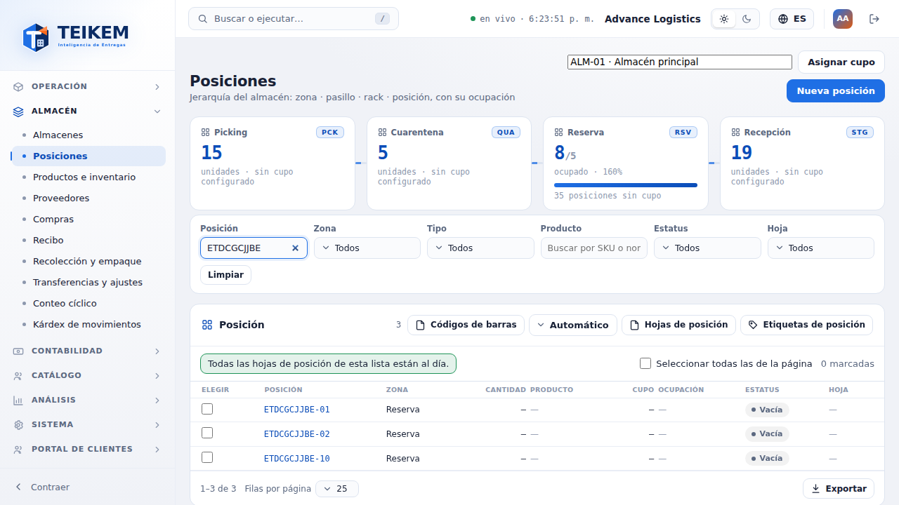
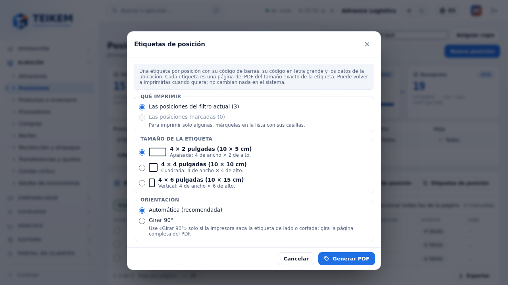
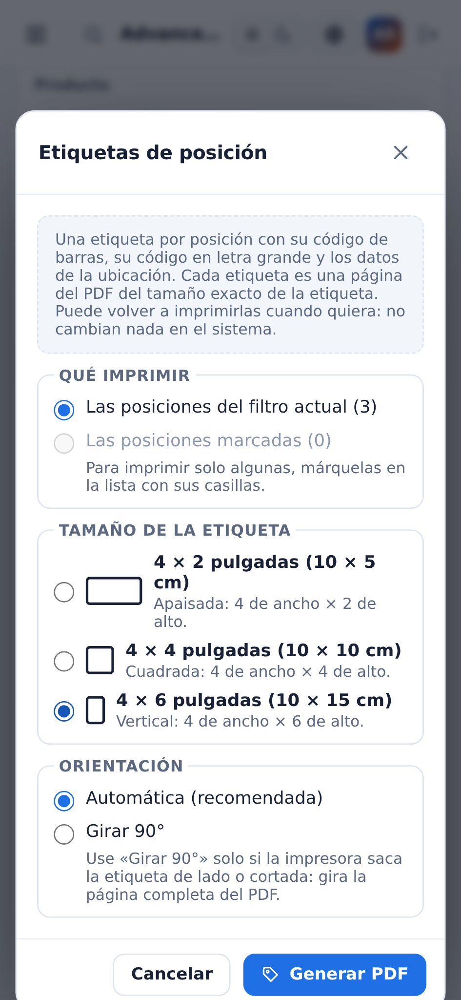
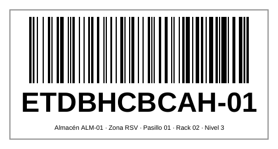
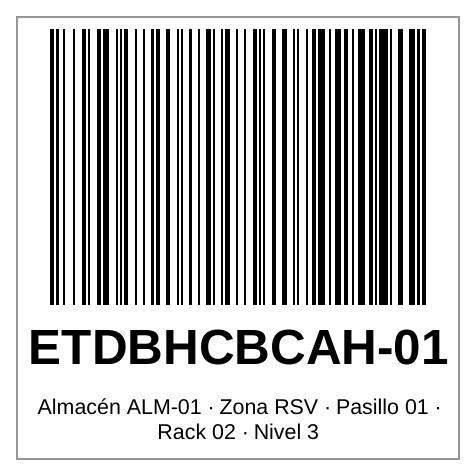
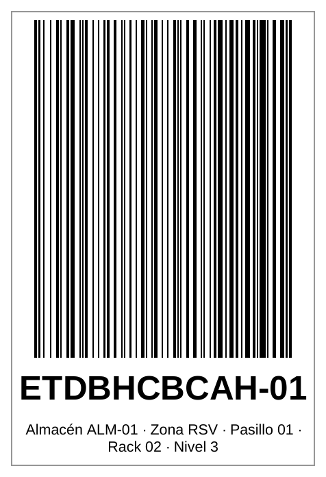
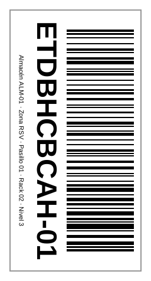
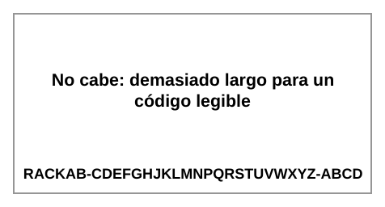

# F16 — Etiquetas de posición (Ubicaciones)

La **etiqueta de posición** es una etiqueta adhesiva para impresora de etiquetas (Zebra u otra térmica) que identifica una posición
del rack: su **código de barras** y su **código en letra grande**. Pedido del dueño del 2026-10-04: *"Una manera de imprimir o
reimprimir los labels de las posiciones, que me deje imprimir varios tamaños: 4x2, 4x4, 4x6, que se ajuste. Un label por posición,
con su barcode. En la pantalla de las posiciones, y que se filtre según el filtro de la misma pantalla."*

**Dónde.** Almacén → **Posiciones** (`/warehouse/locations`), botón **Etiquetas de posición** en la cabecera de la tabla, junto a
**Códigos de barras** y **Productos por posición**.

**Quién puede.** Módulo **WMS_LOTSERIAL** y permiso **`inventory.view`**: el mismo de la pantalla y del reporte de códigos de barras de
posiciones (F14). Sin el permiso el botón no se ve. No hay un permiso aparte para imprimir.

**Servidor.** No cambió: la pantalla lee el listado de posiciones de siempre (`GET /api/v1/warehouses/{almacén}/bins`) y arma el PDF en
el navegador.

Es **genérico**: el código de la posición se imprime tal cual (no se supone ningún formato de piso, pasillo o nivel).

## 1. Etiqueta de posición, productos por posición y reporte de códigos: no son lo mismo

| | **Etiqueta de posición** (este capítulo) | **Productos por posición** ([F15](f15-productos-por-posicion.md)) | **Códigos de barras** ([F14](f14-codigos-de-barras.md)) |
|---|---|---|---|
| Qué es | Una etiqueta adhesiva por posición con su código | Una página carta por posición con la **lista de productos** que hay en ella | Una lista en hojas carta con un código por posición, para el conteo |
| Papel | Rollo de etiquetas de 4 × 2, 4 × 4 o 4 × 6 pulgadas | Carta | Carta |
| ¿Cambia con el contenido? | **No**: identifica la posición; vale mientras la posición exista | **Sí**: se desactualiza cuando entra o sale un producto | No |
| ¿Tiene estado? | **No.** Imprimir no marca nada; se reimprime cuando se quiera | No: es un listado de lo que hay al generarlo | No |

Son cosas distintas: la etiqueta identifica la posición; el informe lista sus productos.

## 2. Elegir qué imprimir, tamaño y orientación

Pulse **Etiquetas de posición**. El modal abre con **Las posiciones marcadas** si hay alguna marcada; si no, con **Las posiciones del
filtro actual**.

- **Qué imprimir**
  - **Las posiciones del filtro actual (N)**: exactamente lo que muestra la tabla con **todos** sus filtros (Posición —el buscador—,
    Zona o el recuadro de zona del río, Tipo, Producto, Estatus y Pasillo), de todas las páginas, no solo la visible.
  - **Las posiciones marcadas (N)**: las que marcó con la casilla **Elegir** (y **Seleccionar todas las de la página**), aunque estén en
    otras páginas o fuera del filtro actual. Deshabilitada sin marcas (*Para imprimir solo algunas, márquelas en la lista con sus casillas.*).
- **Tamaño de la etiqueta** (con un dibujo de su forma):
  - **4 × 2 pulgadas (10 × 5 cm)** — *Apaisada: 4 de ancho × 2 de alto.* (por defecto)
  - **4 × 4 pulgadas (10 × 10 cm)** — *Cuadrada: 4 de ancho × 4 de alto.*
  - **4 × 6 pulgadas (10 × 15 cm)** — *Vertical: 4 de ancho × 6 de alto.*
- **Orientación**: **Automática (recomendada)** o **Girar 90°** — *Use «Girar 90°» solo si la impresora saca la etiqueta de lado o
  cortada: gira la página completa del PDF.*

El tamaño y la orientación elegidos **se recuerdan en ese navegador** para la próxima vez (reimprimir igual).

**Sin tope** (desde 2026-10-10): se imprimen **todas** las etiquetas del alcance. Pasando de **500**, el modal solo **avisa** (*Son {N}: el PDF será grande y puede tardar un poco. Se imprimen todas; no hay límite.*) y
**Generar PDF** sigue habilitado.

En el celular (360 px) el modal ocupa el ancho de la pantalla, sin desplazamiento horizontal:

## 3. Generar el PDF

Pulse **Generar PDF**:

1. Se leen las posiciones de **200 en 200** (*Leyendo posiciones… 200 de 431*). Mientras lee, **Cancelar** lo detiene (*Se canceló; no
   se generó el PDF.*).
2. Se arma el PDF en el navegador (*Generando el PDF (N etiquetas)…*) y se descarga, por ejemplo
   `etiquetas-de-posicion-4x2-advance-logistics-2026-10-04.pdf` (el tamaño va en el nombre). Las posiciones van **por código en orden
   natural** (A-2 antes que A-10).
3. El modal se cierra con el aviso *Se generaron N etiquetas de 4 × 2 pulgadas.* Si alguna posición salió **sin código de barras** (ver
   §4), el modal **se queda abierto** con la lista (*N salieron sin código de barras (solo con el código en texto):* y los avisos de
   siempre) y el botón **Listo**; el PDF ya se descargó igual.

**Nada se marca**: no se llama a nada que no sea una lectura y las marcas de las casillas se quedan, por si
quiere reimprimir. **Reimprimir** = volver a generar el PDF con el mismo filtro o las mismas marcas.

### Cómo imprimirlo

- Abra el PDF y mande a la impresora de etiquetas con el **tamaño de etiqueta configurado en el driver igual al elegido** (4 × 2, 4 × 4
  o 4 × 6) y **escala 100 % / "Tamaño real"** (sin "Ajustar a la página"). Cada página del PDF ya mide exactamente una etiqueta.
- Si la etiqueta sale **de lado o cortada** (algunos drivers alimentan la etiqueta girada), vuelva a generar el PDF con **Girar 90°**.
- Todo va en **negro puro** (sin grises), que es lo que imprime una térmica.

## 4. Cómo es la etiqueta

Una **página del PDF por posición**, del **tamaño exacto** de la etiqueta (4 × 2 = 288 × 144 puntos; 4 × 4 = 288 × 288; 4 × 6 =
288 × 432), con un **margen interno de seguridad de 0.1 pulgadas** a cada lado (nada se dibuja en el borde de corte). De arriba abajo:

| 4 × 2 | 4 × 4 | 4 × 6 |
|---|---|---|
|  |  |  |

- **Código de barras** (Code 128 del código exacto de la posición), **horizontal y lo más grande posible**: ocupa todo el ancho útil con
  su zona de silencio; la barra más fina mide entre **0.25 mm** (el mínimo legible de todos los reportes) y **1 mm**. Su alto es todo lo
  que queda después del texto (al menos 8 mm): en 4 × 2 unos 2.5 cm, en 4 × 6 más de 10 cm.
- **El código en letra grande**: la letra se ajusta para llenar el ancho sin cortarse (hasta un máximo según el tamaño); si el código es
  tan largo que ni con la letra mínima legible (10 pt) cabe en un renglón, va en dos.
- **Datos de la ubicación**, en letra más chica: *Almacén ALM-01 · Zona RSV · Pasillo 01 · Rack 02 · Nivel 3* — solo los que tienen
  valor (almacén, zona, pasillo, rack, nivel y posición), hasta dos renglones.

Con **Girar 90°** la página es la misma pero va girada (el visor la muestra acostada):

**Sin código de barras.** Si el código de la posición tiene caracteres que Code 128 no admite (acentos, ñ…) la etiqueta lleva, en el
lugar de las barras, *Sin código de barras: Code 128 no admite Ñ*; si es tan largo que ni con la barra mínima de 0.25 mm cabe en las 4
pulgadas (más o menos 30 caracteres), *No cabe: demasiado largo para un código legible*. En los dos casos la etiqueta sale igual con el
código en texto y el modal los lista al terminar.

## 5. Mensajes

| Mensaje | Dónde | Qué hacer |
|---|---|---|
| *Son {N}: el PDF será grande y puede tardar un poco. Se imprimen todas; no hay límite.* (desde 500) | Aviso en el modal; Generar PDF sigue habilitado | Filtre por zona o por el código (Posición), o marque menos |
| *No hay posiciones en lo que eligió.* | Modal | El alcance no tiene posiciones; cambie los filtros o elija otro |
| *No hay posiciones para imprimir con lo que eligió.* | Modal (rojo), sin PDF | Las posiciones dejaron de existir mientras tanto; recargue la lista |
| *Se canceló; no se generó el PDF.* | Aviso abajo | Nada |
| *No se pudieron generar las etiquetas. {mensaje}* | Modal (rojo) | Si el servidor respondió (p. ej. 404 *Almacén no encontrado.*, 400 de un filtro), el mensaje va al final tal cual; si no, vuelva a intentar |
| *Se generaron N etiquetas de 4 × 2 pulgadas.* | Aviso abajo (verde) | — |
| *N salieron sin código de barras (solo con el código en texto):* + *No caben como código de barras legible…* / *Omitidos porque tienen caracteres que el código de barras (Code 128) no admite…* | Modal (se queda abierto) | El PDF ya se descargó; esas etiquetas llevan solo el texto. Si necesita código, renombre la posición con un código más corto o sin acentos |

La pantalla nunca pide más de 200 posiciones por lectura (el máximo del listado), así que el 400 de *take* del servidor no debería verse.

## 6. Casos frecuentes

- **Etiquetar todo un pasillo**: escriba el pasillo en **Posición** (p. ej. `A01-`), **Etiquetas de posición** → *Las posiciones del
  filtro actual* → tamaño → **Generar PDF**.
- **Reimprimir una etiqueta rota**: márquela con su casilla → **Etiquetas de posición** → *Las posiciones marcadas* → **Generar PDF**.
- **Etiquetar solo las posiciones nuevas de una zona**: filtre por la zona (recuadro del río o filtro Zona) y por el código, o márquelas.
- **La impresora saca la etiqueta de lado o cortada**: revise que el tamaño del driver sea el mismo que eligió y que imprima al 100 %;
  si sigue, genere con **Girar 90°**.
- **¿La etiqueta queda "vieja" cuando cambian los productos?** No: la etiqueta solo identifica la posición. Lo que se desactualiza es la
  **Productos por posición** (F15), que lista productos.
- **El lector no lee el código**: imprima al 100 % en una impresora de 203 o 300 dpi. Los códigos se validaron decodificando el PDF a
  300, 203 y 150 dpi (ver `docs/frontend/loteF16-decisiones.md`); a 150 dpi los códigos de más de ~23 caracteres no se leen (sus barras
  quedan de menos de 2 puntos de impresora); no se probó con un Zebra físico.
