# F17 — Rentas (web) y "Convertir a serie"

Pantallas del submódulo **Rentas** de Almacén (bloque F-R1 de `docs/rentas-plan-de-ejecucion.md`): la **lista de rentas**, la **ficha** de
una renta con sus acciones (programar, despachar, extender, cancelar), el **alta y la edición** con el **selector de equipos por serie** y la
tarifa por equipo, y el botón **Convertir a serie** en la ficha del producto. Las reglas del servidor (qué hace cada acción, efectos en el
inventario, todos los mensajes) están en el capítulo [11 — Rentas](../11-rentas.md) y en el capítulo 06 §2.1 (Convertir a serie); aquí se
explica cómo se usan desde la web. Las devoluciones de renta, el proceso del equipo devuelto y los reportes de rentas están en
[F18](f18-devoluciones-y-proceso-de-rentas.md).

**Servidor.** No cambió: la web usa `/api/v1/rentals` (lista, ficha, alta, edición, equipos, tarifa, programar, despachar, cancelar,
extensiones), `/api/v1/status/history/RENTAL/{id}` (historial) y `POST /api/v1/products/{publicId}/convert-to-serial`.

## 1. Quién puede y dónde

| Qué | Dónde | Permiso y módulo |
|---|---|---|
| Ver la lista y la ficha de rentas | Almacén → **Rentas** (`/warehouse/rentals`, ficha `/warehouse/rentals/{renta}`) | `rental.view` + módulo **Rentas** (`RENTAL_EQUIPMENT`). Sin el módulo: pantalla "Módulo apagado"; sin el permiso: "Sin permiso" y el ítem no sale en el menú |
| Nueva renta, Editar, Agregar equipos, tarifa y quitar un equipo, Programar, Despachar, Cancelar | Lista (**Nueva renta**) y ficha | `rental.manage` (sin él los botones no se ven) |
| Extender | Ficha | `rental.extend` |
| Convertir a serie | Ficha del producto (Almacén → Productos e inventario → producto, `/warehouse/products/{producto}`) | `inventory.manage` **y** `inventory.adjust`, módulo **WMS_LOTSERIAL** |

Para elegir el **cliente**, su **localidad** y su **contacto** al crear una renta hace falta además poder consultar clientes y localidades
(`clients.read` y `locations.read`, módulo **Catálogo**). Sin ellos los campos avisan *"Su usuario no puede consultar clientes"* / *"Su
usuario no puede consultar localidades (permiso locations.read y módulo Catálogo)."* (ver "Decisiones" del lote: el Operador de almacén
no los trae).

El ítem **Rentas** está en el grupo Almacén justo antes de **Kárdex de movimientos**.

## 2. Convertir un producto a serie

Los equipos de Advance Depot llegaron sin seguimiento y **solo se rentan equipos con número de serie**. En la ficha del producto, el botón
**Convertir a serie** aparece solo si el producto **no tiene seguimiento** y **tiene existencia**, y usted tiene los dos permisos.

1. Pulse **Convertir a serie**. El modal muestra una caja por **posición con existencia** (*"Series para A-01 · ALM-01 (2 en mano)"*).
2. Escriba o **pegue** los números de serie, **uno por renglón** (también separados por coma). Debajo de cada caja, el contador *"1 de 2
   series"* se pone azul cuando cuadra.
3. **Revisar y convertir** valida: series **repetidas** (en cualquier posición, sin distinguir mayúsculas), **largas** (más de 80) y el
   **conteo** por posición, con el mismo mensaje que el servidor.
4. Confirmación: *"Se darán de alta 3 series de … en 2 posición(es)."* y **Es un movimiento neto cero**: por cada posición se registra un
   ajuste de salida de las unidades sin serie y un ajuste de entrada por cada serie, con el motivo **"Conversión a serie"**; el en mano y el
   disponible no cambian. Después el producto se controla por serie y no vuelve atrás.
5. **Convertir a serie**: aviso *"… ahora se controla por serie: N series dadas de alta."*; el botón desaparece y las series se ven en la
   pestaña Series.

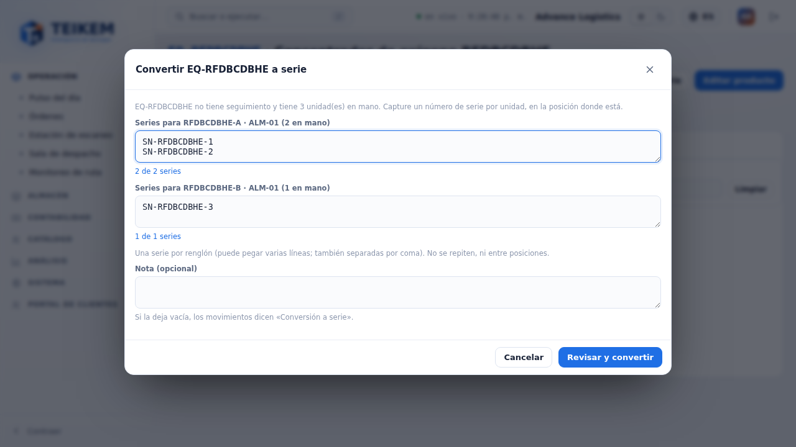
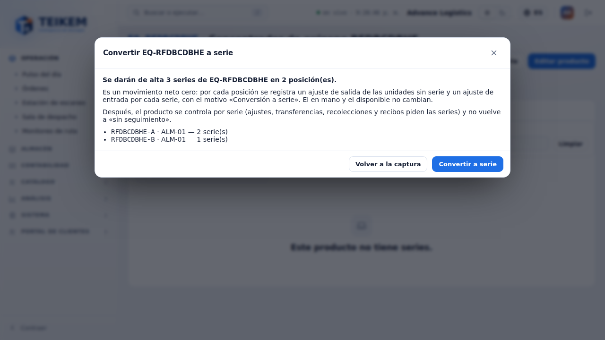

Si el producto tiene unidades **reservadas**, existencia **con lote** o **sin posición**, o **fraccionaria**, el modal lo dice al abrir
(con el mensaje del servidor) y no deja convertir. Si el servidor rechaza (p. ej. 409 *"La serie SN-1 ya está en inventario."*), el
mensaje sale arriba y se vuelve a la captura sin perder lo escrito.

## 3. Lista de rentas

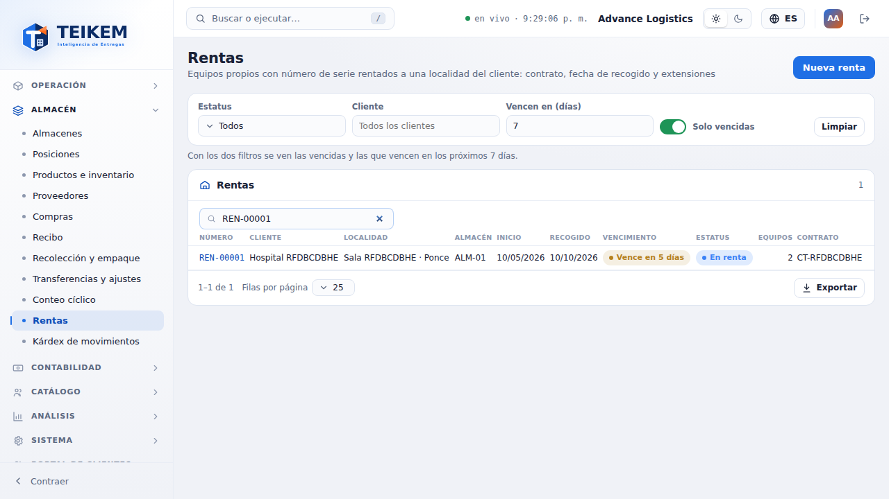

- **Filtros** (van al servidor): **Estatus** (varios), **Cliente**, **Vencen en (días)** (las Programadas o En renta que se recogen de hoy a
  hoy + N), **Solo vencidas** (Programadas o En renta con el recogido ya pasado) y el **buscador** (número de renta o de contrato, cliente,
  localidad o número de serie). Con "Vencen en" y "Solo vencidas" juntos se ven las dos cosas (lo dice la nota bajo los filtros).
  **Limpiar** quita todo.
- **Columnas** (todas ordenables): Número, Cliente, Localidad, Almacén, Inicio, Recogido, **Vencimiento**, Estatus (con su color y texto),
  Equipos y Contrato. **Vencimiento** es un **dato calculado**, no un estatus: *"Vencida hace N días"* (rojo), *"Se recoge hoy"* o *"Vence en
  N días"* (ámbar, hasta 7 días), *"En N días"* (más adelante) y "—" si la renta no está abierta. "Hoy" es el día de la compañía.
- 25 filas por página (cambiable), **Exportar** (Excel, CSV o PDF) con todo lo filtrado.
- Clic en una fila → la ficha.
- Enlaces: *"Ver todos"* de "Necesita tu atención" abre la lista con `?dueWithinDays=7&overdue=true`; *"Revisar"* abre
  `/warehouse/rentals?rental=…`, que lleva a la ficha de esa renta.

En el celular la tabla pasa a tarjetas:

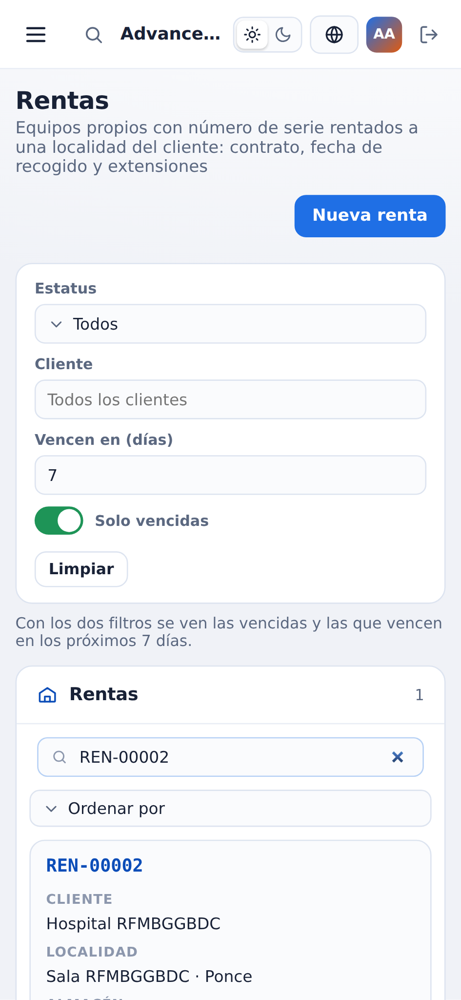

## 4. Nueva renta (Borrador)

**Nueva renta** abre el formulario. La renta nace en **Borrador** y **no reserva nada**.

- **Cliente** (activo), **Localidad del cliente** (solo las localidades propias del cliente; al cambiar de cliente se vacían localidad y
  contacto), **Contacto del cliente** (opcional), **Almacén de origen** (ya elegido si la compañía tiene uno solo), **Fecha de inicio**
  (hoy por defecto), **Fecha de recogido**, **Número de contrato** y **Contrato firmado el**, **Costo de transporte estimado** y su moneda
  (solo un dato: los envíos llegarán con su módulo) y **Notas**.
- **Equipos por serie** (opcional; también se agregan después en la ficha):
  1. **Equipo (SKU o nombre)**: productos propios con disponible en el almacén de origen. Si no se controla por serie: *"El producto … no se
     controla por serie; solo se rentan equipos con número de serie."* y la pista de **Convertir a serie**.
  2. **Series disponibles en ALM-01 (N)**: casillas con la posición de cada serie. Solo las **disponibles** del almacén de origen en zonas
     que se rentan (no cuarentena, cruce de muelle ni En renta; las que se ocultan por eso se cuentan en una nota) y que **no** están ya en
     la renta. **Buscar o escanear serie** filtra la lista; **Enter** con la serie exacta la elige (lector de código de barras). Una serie
     ya elegida avisa *"La serie … ya está en esta renta."* y una que no está disponible *"La serie … no está disponible en ALM-01."*.
  3. **Tarifa para estos equipos (opcional)**: frecuencia (Diaria, Semanal, Mensual o **Fija**), monto y moneda (la de la compañía si no
     se elige). Es solo un dato (no se calcula ni se cobra).
  4. **Agregar N equipo(s)**: pasan a la tabla **Equipos a rentar**, donde se pueden quitar. Si cambia el almacén de origen, se quitan.
- **Crear renta con N equipo(s)** → la ficha de la renta nueva (*"Renta REN-… creada en Borrador."*).

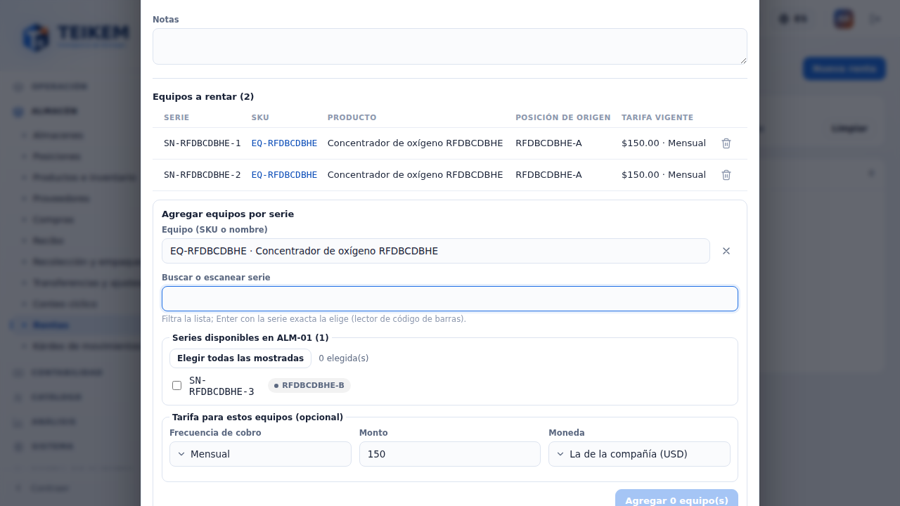

Los errores del servidor salen bajo su campo o arriba del formulario con el mensaje exacto, por ejemplo 409 *"La serie SN-2 ya está en la
renta REN-00003."* o 409 *"La serie SN-2 no está disponible en A-01."* (alguien la tomó mientras tanto).

En el celular el formulario es de una columna:

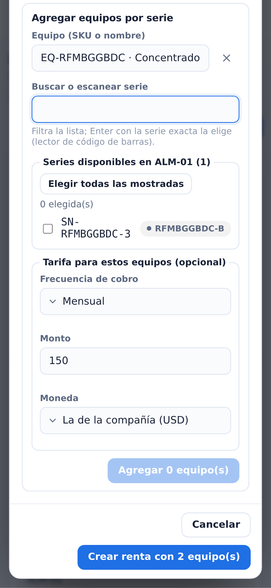

## 5. Ficha de la renta

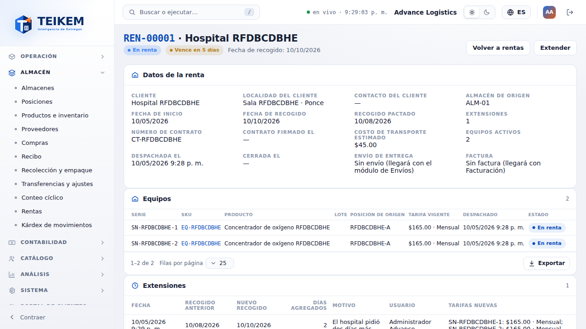

- **Cabecera**: número y cliente, estatus (con su color), vencimiento calculado y la fecha de recogido; las acciones que aplican.
- **Datos de la renta**: cliente, localidad, contacto, almacén de origen, inicio, **recogido** (vigente) y **recogido pactado** (el
  original, que no cambia con las extensiones), extensiones, contrato y fecha de firma, costo de transporte, equipos activos, despachada el,
  cerrada el, envío y factura (*sin enlace* hasta que existan Envíos y Facturación) y notas.
- **Equipos**: serie, SKU, producto, lote, **posición de origen**, **tarifa vigente**, fecha de despacho y **estado** (*Por despachar*, *En
  renta*, *Devuelto* o *Inactivo*). Antes del despacho, con `rental.manage`: **Tarifa** (corrige la vigente) y **Quitar equipo** (queda
  inactivo; en una Programada se libera su reserva). En una renta **cancelada** se ven los equipos que tenía, atenuados.
- **Extensiones**: fecha, recogido anterior y nuevo, días agregados, motivo, usuario y tarifas nuevas.
- **Historial de estatus**: cada cambio con quién, cuándo y el comentario.

### Acciones (según el estatus)

| Estatus | Acciones |
|---|---|
| Borrador | Editar, Agregar equipos, **Programar**, Cancelar renta |
| Programada | Editar, Agregar equipos (se reservan al momento), **Despachar**, Extender, Cancelar renta |
| En renta | **Extender** y **Registrar devolución** ([F18](f18-devoluciones-y-proceso-de-rentas.md)) |
| Devuelta / Cancelada | Solo consulta |

Todas piden confirmación y aceptan un **comentario** opcional que queda en el historial:

- **Programar**: *"Los N equipo(s) quedan reservados para esta renta: el disponible del producto baja y el en mano no cambia."*
- **Despachar**: *"Cada equipo pasa con una transferencia a la posición EN-RENTA del almacén ALM-01: sigue siendo de la compañía (en mano),
  no cuenta como disponible y su serie queda «En renta»."*

  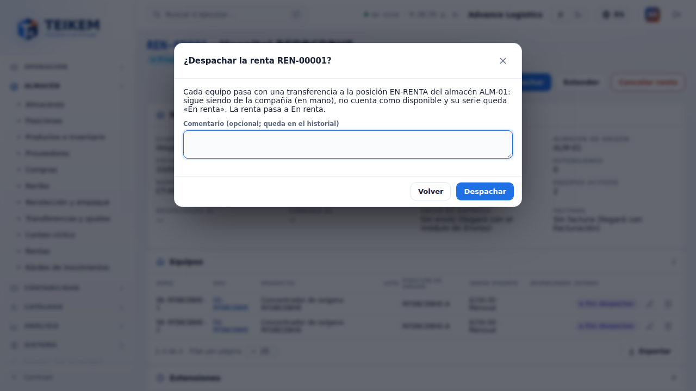
- **Cancelar renta**: en Borrador *"Nada estaba reservado."*; en Programada *"se liberan las reservas y las series vuelven a estar
  disponibles."*

Si el servidor rechaza, el diálogo **no se cierra** y muestra su mensaje exacto (p. ej. 422 *"La renta no tiene equipos; agregue al menos
uno."* o 422 *"Solo se cancela una renta en Borrador o Programada; para terminarla registre la devolución."*).

**Editar** abre el mismo formulario: el cliente no se cambia (*"El cliente de la renta no se cambia; cancele la renta y cree otra."*), el
almacén solo sin equipos y las fechas solo sin extensiones; se guarda solo lo que cambió.

### Extender

**Extender** (`rental.extend`): **Nueva fecha de recogido** (posterior a la vigente), **Motivo** (obligatorio, hasta 300) y, opcional,
**Tarifa nueva** para los equipos elegidos (solo se registra si cambia; empieza el día siguiente al recogido anterior). Los errores salen
bajo su campo con el mensaje del servidor: *"La nueva fecha de recogido debe ser posterior a la actual (2026-10-08)."* e *"Indique el motivo
de la extensión."*. Al extender, el vencimiento se recalcula y la extensión aparece en su tabla.

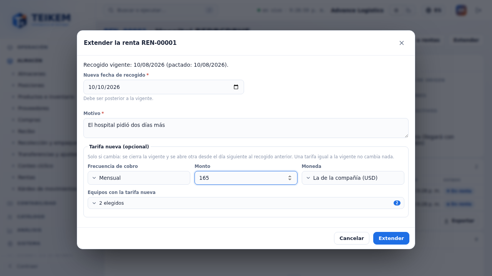

En el celular las acciones envuelven y las tablas pasan a tarjetas, sin desplazamiento horizontal:

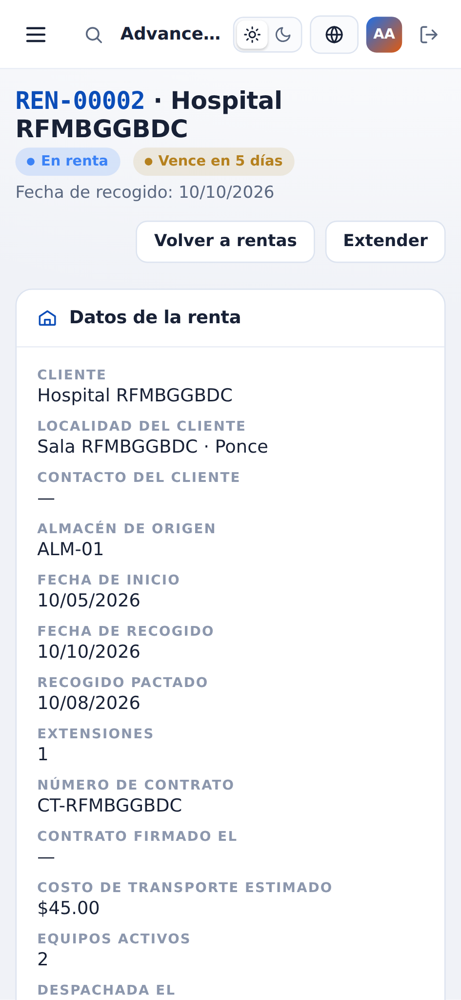

## 6. Aviso en "Necesita tu atención"

En el Pulso, cada renta **abierta vencida o que vence en 7 días** sale como *"Renta REN-… vencida"*, *"Renta REN-…: se recoge hoy"* o
*"Renta REN-…: vence en N días"*, con cliente · localidad · almacén, **Recogido**, **Equipos** y, si está vencida, **Días vencida** (en
rojo; las por vencer en ámbar). **Revisar** abre la ficha; **Ver todos** abre la lista con "Vencen en 7 días" y "Solo vencidas".

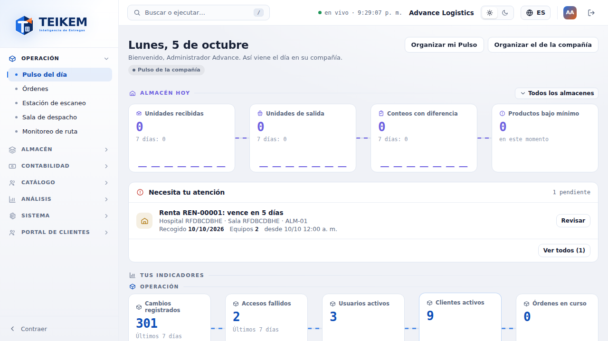

## 7. Mensajes (además de los del servidor, que se muestran tal cual — capítulo 11 §9 y capítulo 06 §2.1)

| Dónde | Mensaje | Cuándo |
|---|---|---|
| Nueva renta | *"Elija el almacén de origen."* | Sin almacén de origen (la web lo pide para ofrecer sus series) |
| Nueva renta | *"Escriba un número válido."* | Costo de transporte que no es número |
| Selector de equipos | *"La serie {s} ya está en esta renta."* | Escaneó una serie que ya eligió o que ya está en la renta |
| Selector de equipos | *"La serie {s} no está disponible en {almacén}."* | Escaneó una serie que no está disponible en el almacén de origen |
| Selector de equipos | *"Una renta admite como máximo 200 equipos."* | Pasaría de 200 equipos |
| Extender | *"Elija al menos un equipo para la tarifa nueva."* | Puso tarifa nueva sin equipos |
| Confirmaciones | *"El comentario admite como máximo 500 caracteres."* | Comentario largo |

Los mensajes de validación que la web revisa antes de enviar son **los mismos** del servidor (alta, tarifa, extensión, conversión), para
que el usuario vea exactamente el mismo texto: ver la FAQ, sección "Lote F17".

## 8. Casos frecuentes

- **No veo "Rentas" en el menú**: el módulo Rentas debe estar encendido (depende de Inventario y trazabilidad) y su rol debe tener
  `rental.view`.
- **No aparece "Convertir a serie"**: el producto ya es por serie o por lote, no tiene existencia, o le falta `inventory.manage` o
  `inventory.adjust`.
- **El equipo no aparece en el selector**: no es propio, no tiene disponible en el almacén de origen, está en cuarentena o cruce de
  muelle, o ya está en esta renta; si es otro almacén, cambie el almacén de origen (sin equipos agregados).
- **Programé y el producto sale "No disponible"**: es lo esperado: las series quedan reservadas.
- **Despaché y el en mano no bajó**: correcto: el equipo sigue siendo de la compañía, en la posición EN-RENTA.
- **La renta sale "Vencida"**: extiéndala (si el cliente lo sigue usando) o registre su devolución ([F18](f18-devoluciones-y-proceso-de-rentas.md)).
