# F18 — Devoluciones de renta, proceso de equipos y reportes de rentas (web)

Pantallas del bloque **F-R2** de `docs/rentas-plan-de-ejecucion.md`: **registrar la devolución** de una renta desde su ficha, la **lista y
la ficha de devoluciones**, la **cola de proceso** de los equipos devueltos (avanzar, completar y dar de baja), las **tarjetas de resumen**
de la lista de rentas y los **Reportes de rentas** (vistas, indicadores y gráfico de Análisis). Las reglas del servidor (qué hace cada
acción, sus efectos en el inventario y todos los mensajes) están en el capítulo [11 — Rentas](../11-rentas.md) §5, §6 y §10; aquí se explica
cómo se usan desde la web. La renta (lista, ficha, alta, despacho, extensión) está en [F17](f17-rentas.md).

**Servidor.** No cambió: la web usa `POST /api/v1/rentals/{publicId}/returns`, `GET /api/v1/rental-returns[/{publicId}]`,
`GET /api/v1/rental-processes`, `POST /api/v1/rental-processes/{id}/advance|complete|scrap`, `/api/v1/status/history/RENTAL_PROCESS/{id}`,
`GET /api/v1/rentals` (totales del resumen) y, para los reportes, `GET /api/v1/analytics/reports`, `POST /api/v1/analytics/reports/{id}/run`,
`GET /api/v1/analytics/indicators[/{id}/value]` y `GET /api/v1/analytics/charts[/{id}/data]`.

## 1. Quién puede y dónde

| Qué | Dónde | Permiso y módulo |
|---|---|---|
| Ver devoluciones (lista y ficha) | Almacén → **Devoluciones de renta** (`/warehouse/rental-returns`, ficha `/warehouse/rental-returns/{devolución}`) | `rental.view` + módulo **Rentas** (`RENTAL_EQUIPMENT`) |
| Registrar una devolución | Ficha de una renta **En renta** → **Registrar devolución** | `rental.return` |
| Ver la cola de proceso | Almacén → **Proceso de equipos** (`/warehouse/rental-processes`) | `rental.view` + Rentas |
| Avanzar y completar un proceso | Cola de proceso (botones de la fila) | `rental.maintenance` |
| Dar de baja un equipo en proceso | Cola de proceso | `rental.maintenance` **y** `inventory.adjust` (sin él, el botón no aparece y una nota bajo los filtros lo explica) |
| Reportes de rentas | Lista de rentas → **Reportes de rentas** o pestaña **Reportes** (`/warehouse/rental-reports`) | `rental.view` + Rentas, y además `analytics.view` + módulo **Análisis** (sin ellos: "Sin permiso" o "Módulo apagado", y la pestaña no se ve) |

Las cuatro pantallas comparten una franja de **pestañas**: Rentas · Devoluciones · Proceso de equipos · Reportes. En el menú de Almacén,
**Devoluciones de renta** y **Proceso de equipos** van justo después de **Rentas** (el Kárdex sigue siendo el último).

## 2. Registrar una devolución

En la ficha de una renta **En renta** con equipos despachados y sin devolver aparece **Registrar devolución**.

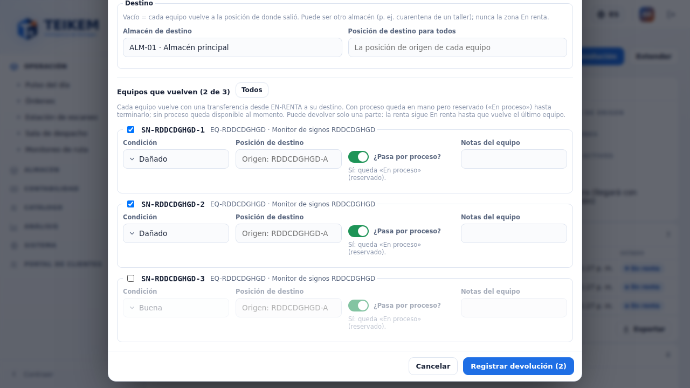

- **Fecha de devolución**: hoy (día de la compañía) por defecto; no puede ser futura ni anterior al inicio de la renta. Si es anterior a la
  fecha de recogido, la web avisa *"Devolución anticipada: la fecha es anterior al recogido (…)"* (es un dato calculado, no un estatus).
- **Motivo** (obligatorio, uno por devolución): Fin del contrato, Anticipada por daño, Anticipada a pedido del cliente u Otro. Con **Otro**
  las **Notas** son obligatorias.
- **Costo de recogido estimado** y su moneda: solo un dato (el recogido saldrá de un envío cuando exista ese módulo).
- **Destino**: **Almacén de destino** (el de la renta por defecto; puede ser otro, por ejemplo un taller) y **Posición de destino para
  todos** (opcional). Vacía = cada equipo vuelve a **la posición de donde salió**. La zona **En renta** no se ofrece.
- **Equipos que vuelven (N de M)**: uno por equipo despachado y sin devolver, con su casilla (**Todos/Ninguno**). Se puede devolver **una
  parte**: la renta sigue En renta hasta que vuelve el último. Por equipo: **Condición** (Buena por defecto, Dañado, Incompleto), **Posición
  de destino** propia (opcional), **¿Pasa por proceso?** (sí por defecto) y **Notas del equipo**.
- **Registrar devolución (N)**: aviso *"Devolución DRN-… registrada: N equipo(s)."* (si volvió el último: *"… La renta REN-… quedó
  Devuelta."*). La ficha de la renta se actualiza y su panel **Devoluciones** enlaza la devolución nueva.

Efectos (capítulo 11 §5): cada equipo vuelve con una transferencia desde EN-RENTA; **con proceso** queda en mano pero **reservado** ("En
proceso") y se abre su proceso en *Pendiente*; **sin proceso** queda disponible al momento.

Si el servidor rechaza, el diálogo no se cierra y muestra su mensaje exacto (por ejemplo 409 *"La serie {s} no está en renta en {REN-n}."*
o 400 *"La posición de destino no puede ser de la zona En renta."*).

En el celular cada equipo es un bloque de una columna:

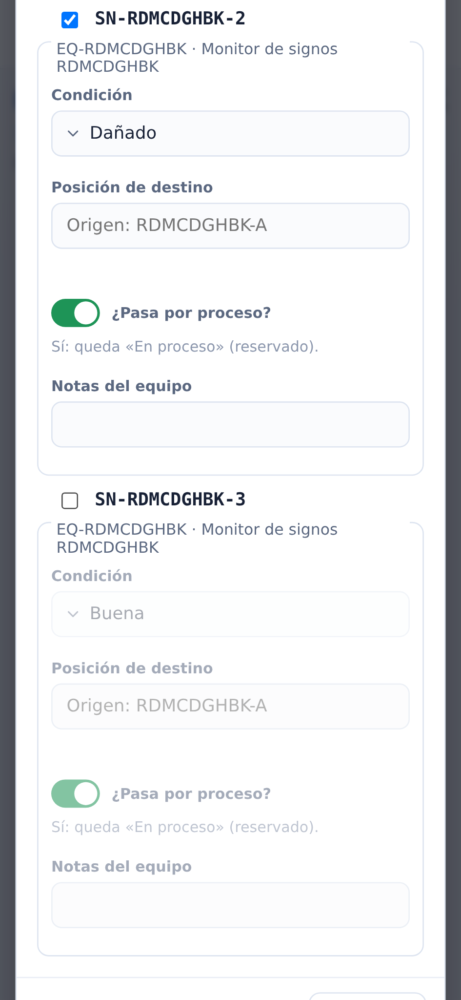

## 3. Devoluciones: lista y ficha

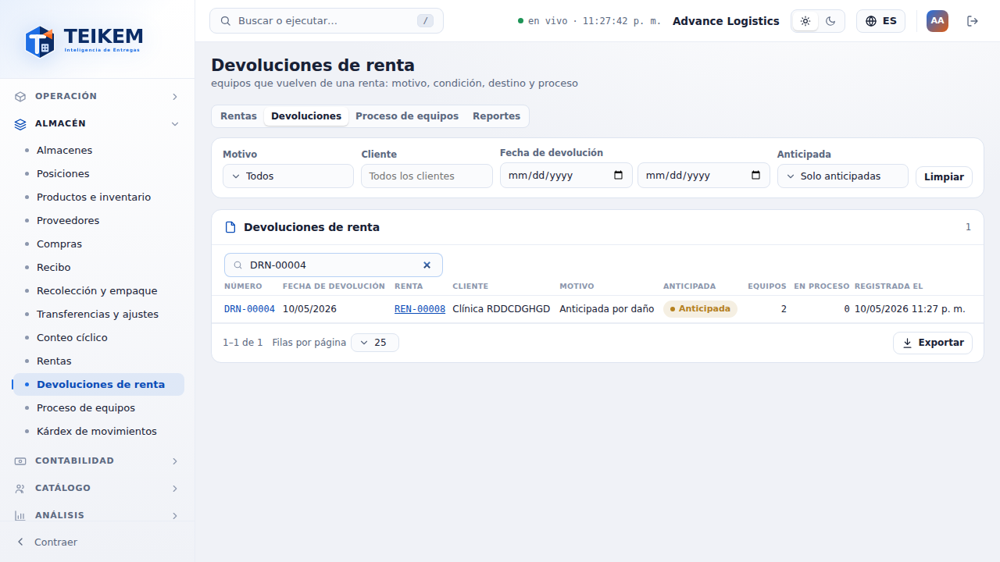

- **Filtros** (van al servidor): **Motivo** (varios), **Cliente**, **Fecha de devolución** (rango), **Anticipada** (Solo anticipadas / Solo
  al término) y el **buscador** (número DRN, número de renta o serie). Desde la ficha de una renta, **Ver en Devoluciones** abre la lista
  filtrada por esa renta (*"Solo las devoluciones de la renta REN-…"*, con **Quitar este filtro**).
- **Columnas** (todas ordenables): Número, Fecha de devolución, **Renta** (enlace a la ficha de la renta), Cliente, Motivo, Anticipada,
  Equipos, En proceso (procesos abiertos) y Registrada el. Exportar saca todo lo filtrado.
- Clic en la fila → la **ficha de la devolución**: motivo, anticipada o al término, fecha, equipos, procesos abiertos, **estatus de la renta
  después de la devolución**, costo de recogido, envío de recogido (sin enlace por ahora), quién y cuándo, notas, y los **equipos devueltos**
  con su condición, el destino (almacén · posición) y el **estatus de su proceso** (o *"Sin proceso (disponible)"*) con **Ver proceso**
  (abre la cola con esa serie). El botón **Renta REN-…** vuelve a la renta.

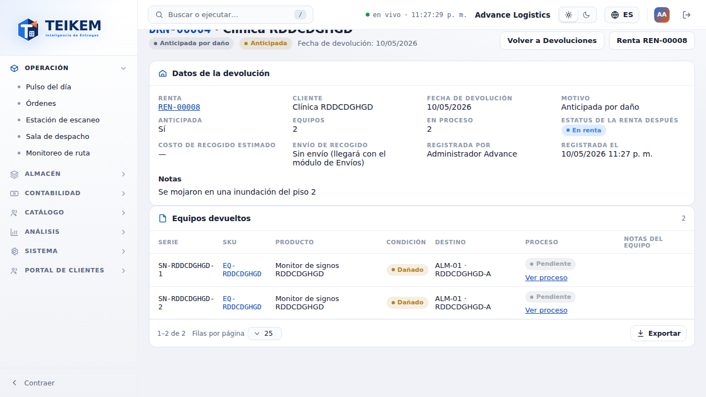

## 4. Proceso de equipos (cola)

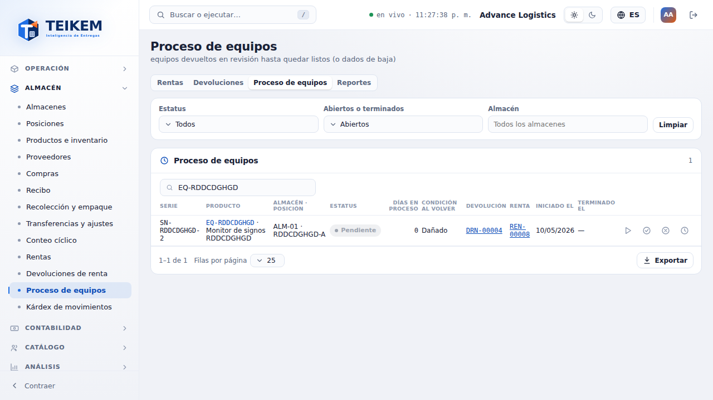

- **Filtros**: **Estatus** (los de la compañía, con sus nombres), **Abiertos o terminados** (Abiertos por defecto; Terminados = Lista o
  Dada de baja; Todos), **Almacén** y el buscador (serie, SKU, número de devolución o de renta).
- **Columnas**: Serie, Producto, Almacén · posición, **Estatus** (con el color del catálogo), **Días en proceso** (días de la compañía desde
  que volvió, hasta hoy o hasta que terminó), Condición al volver, Devolución y Renta (enlaces), Iniciado el y Terminado el. Los terminados
  se ven atenuados.
- **Acciones** de la fila (proceso abierto): **Avanzar**, **Completar**, **Dar de baja**; y **Historial** (los pasos con quién, cuándo y
  comentario) también en los terminados.

**Avanzar**: elija el estatus en **Pasa a** (se propone el siguiente paso, *"Limpieza (siguiente)"*). Se ofrecen los estatus habilitados
que no son finales (Lista y Dada de baja tienen su acción). El servidor aplica las reglas del pipeline: siguiente paso, Reparación o
Esperando piezas desde cualquier paso y de ahí de vuelta. Un salto fuera de orden muestra su mensaje tal cual:

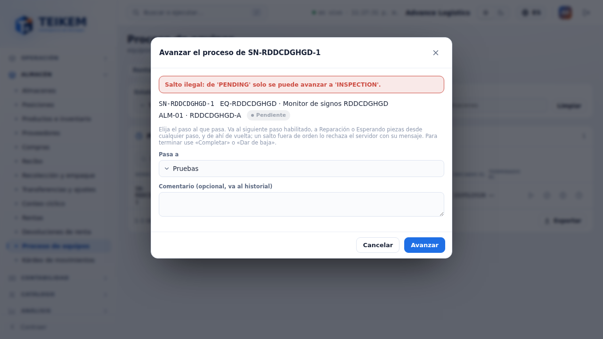

**Completar**: el proceso pasa a **Lista**, se libera la reserva y el equipo vuelve a estar **disponible**. Opcional: trasladarlo a otra
posición del **mismo almacén** (no la zona En renta); a otro almacén, con una transferencia después.

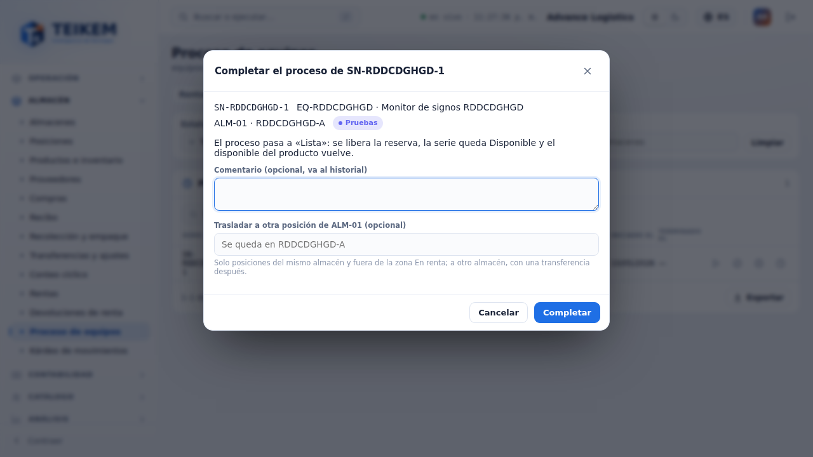

**Dar de baja** (pide además `inventory.adjust`): es un **ajuste de salida** (−1) con el motivo **Daño**; la serie queda dada de baja y no
vuelve. Por eso se confirma **escribiendo la serie** (sin distinguir mayúsculas); sin ella: *"Escriba la serie {s} para confirmar la baja."*

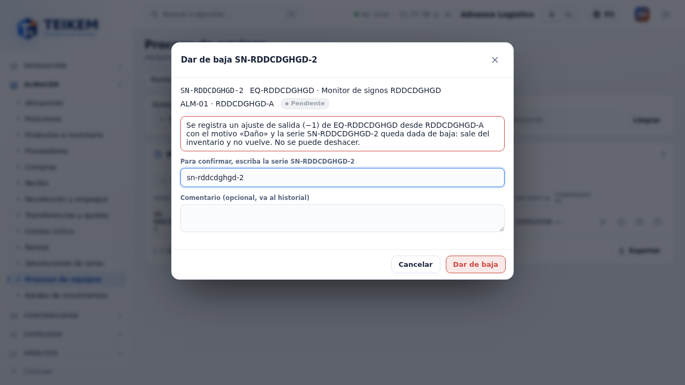

## 5. Resumen de la lista de rentas y Reportes de rentas

Arriba de la lista de rentas, tres tarjetas con el total del momento: **En renta hoy** (rentas En renta), **Por vencer (7 días)** (se
recogen de hoy a 7 días) y **Vencidas** (el recogido ya pasó; Programadas o En renta). Un clic aplica ese filtro a la lista (la tarjeta
queda marcada). Es el mismo criterio que el aviso de "Necesita tu atención" y los indicadores.

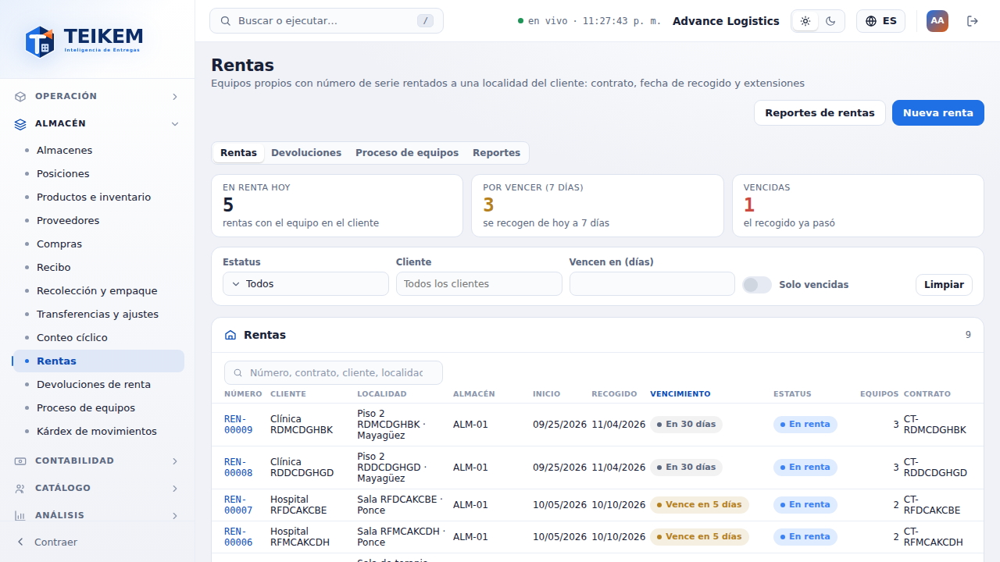

**Reportes de rentas** muestra lo que el servidor sembró en Análisis para Rentas, calculado por el **motor de Análisis** (la web no
recalcula nada):

- **Indicadores**: "Rentas por vencer (7 días)" y "Rentas vencidas" con su valor. Para verlos en el Pulso, encienda *Mostrar en mi Pulso*
  en Análisis → Indicadores (vienen apagados porque "Necesita tu atención" ya muestra cada renta).
- **Gráfico** "Devoluciones de renta por motivo" (últimos 30 días).
- **Vistas de rentas**: Equipos en renta por cliente, Rentas por vencer (7 días), Rentas vencidas, Devoluciones de renta por motivo y Equipos
  en proceso (y las que cree la compañía sobre esas fuentes). Al elegir una se corre con el rango "Todo"; las agrupadas muestran sus
  **Totales** debajo. Exportar como cualquier tabla. En el celular la vista se elige en una lista desplegable.

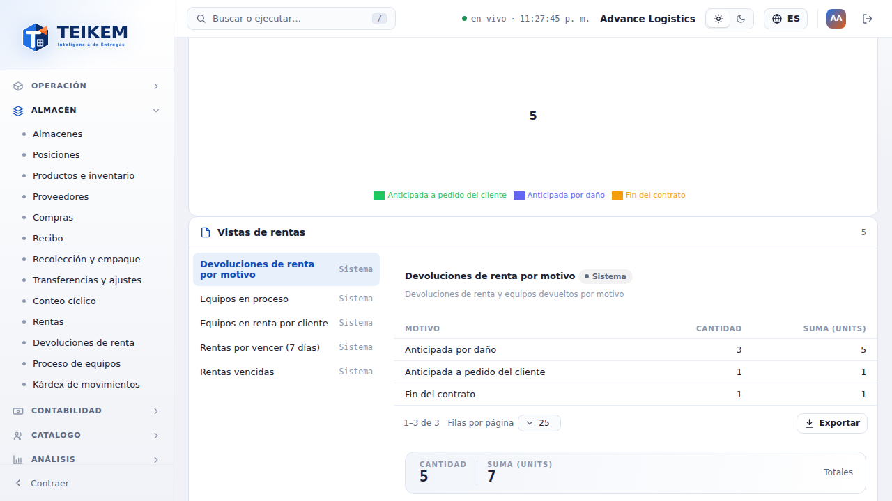

En el celular, todo envuelve a 360 px sin desplazamiento horizontal (la franja de pestañas se desplaza dentro de sí misma):

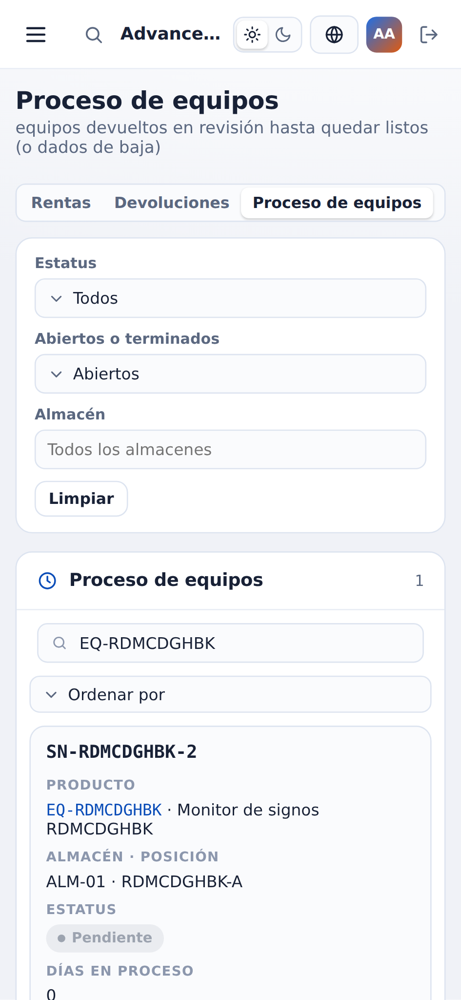
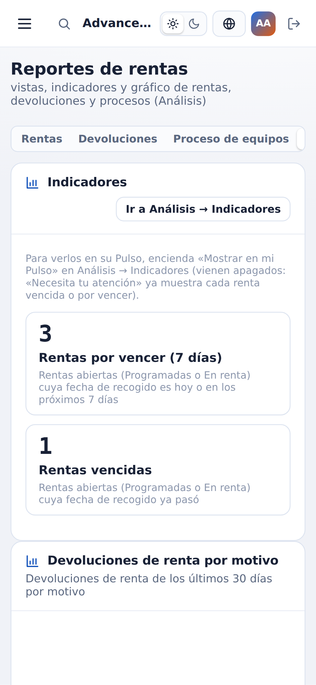

## 6. Mensajes

Los del servidor salen **tal cual** (capítulo 11 §9 "Devolución, proceso y conteo"). La web revisa antes de enviar, con **el mismo texto**:
*"Indique el motivo de la devolución: END_OF_CONTRACT, EARLY_DAMAGE, EARLY_CLIENT u OTHER."*, *"Con el motivo 'Otro' describa la devolución
en las notas."*, *"La fecha de devolución no puede ser futura."*, *"La fecha de devolución no puede ser anterior al inicio de la renta
(aaaa-mm-dd)."*, *"El costo de recogido estimado no puede ser negativo."*, *"Indique al menos una serie que se devuelve."*, *"Las notas
admiten como máximo 1000 caracteres."*, *"Las notas del equipo admiten como máximo 500 caracteres."* e *"Indique el estatus al que pasa el
proceso."*. Solo de la web:

| Dónde | Mensaje | Cuándo |
|---|---|---|
| Registrar devolución | *"Escriba un número válido."* | Costo de recogido que no es número |
| Dar de baja | *"Escriba la serie {s} para confirmar la baja."* | La confirmación no coincide con la serie |
| Cola de proceso | *"Dar de baja exige además el permiso inventory.adjust (ajustes de inventario), que su usuario no tiene: pídalo a un administrador."* | Tiene `rental.maintenance` pero no `inventory.adjust` |

## 7. Casos frecuentes

- **No veo "Registrar devolución"**: la renta no está En renta, ya no le quedan equipos por devolver, o su rol no tiene `rental.return`.
- **Devolví un equipo y sigue "No disponible"**: pasó por proceso; termínelo con **Completar** en Proceso de equipos.
- **Me equivoqué y marqué "pasa por proceso"**: complételo de inmediato (Completar); queda disponible.
- **Quiero devolver a la cuarentena de otro almacén**: cambie el **Almacén de destino** y elija la posición (para todos o por equipo).
- **"Salto ilegal: …" al avanzar**: el pipeline va paso a paso; elija el siguiente (el que dice "(siguiente)") o Reparación / Esperando
  piezas.
- **No aparece "Dar de baja"**: falta `inventory.adjust` (la nota bajo los filtros lo dice) o el proceso ya terminó.
- **No veo la pestaña Reportes**: hace falta `analytics.view` y el módulo Análisis encendido.

> **Menú (ajuste del 2026-10-06):** en Almacén hay un solo ítem, **Rentas**. Dentro, las pestañas **Rentas · Devoluciones · Proceso de equipos · Reportes** (Reportes solo con `analytics.view` y el módulo Análisis). Donde este capítulo dice "el ítem de menú Devoluciones de renta / Proceso de equipos", léase "la pestaña".
