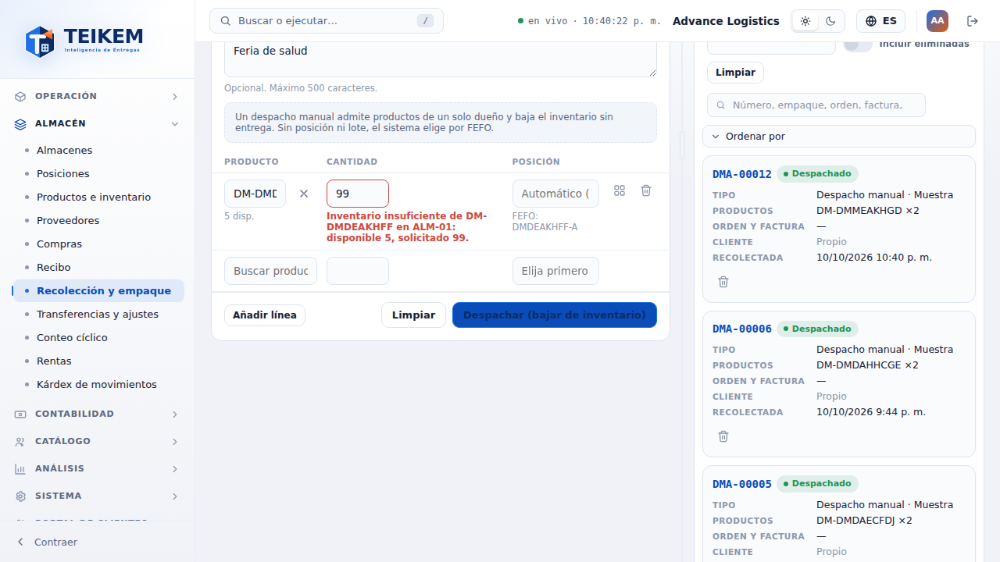
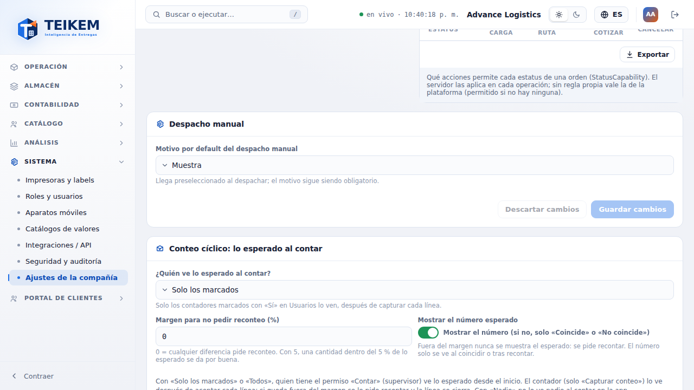
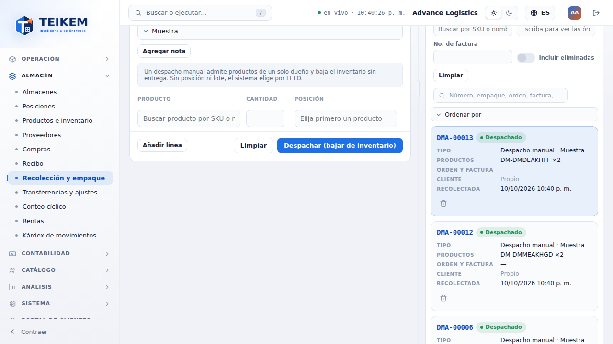
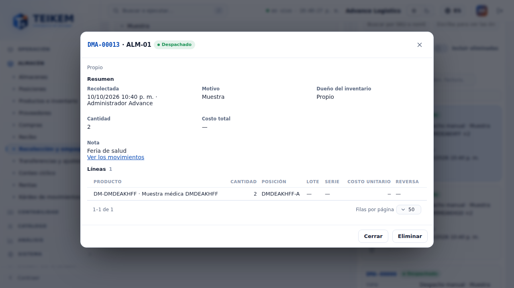
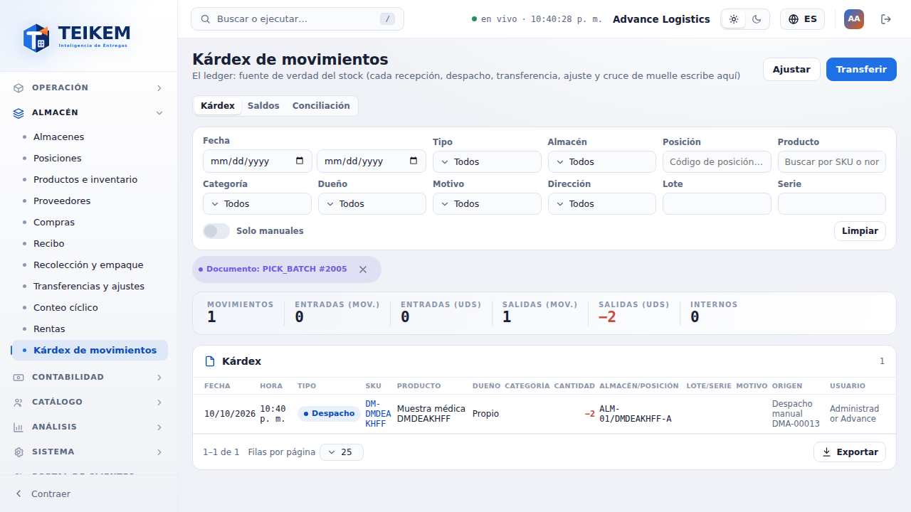
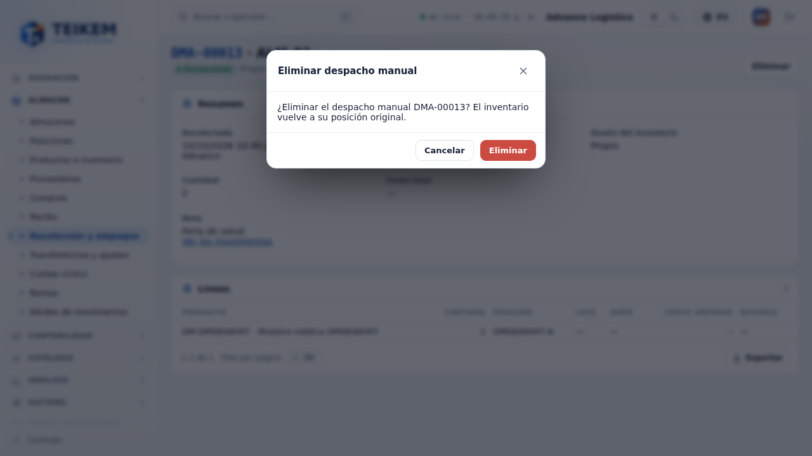
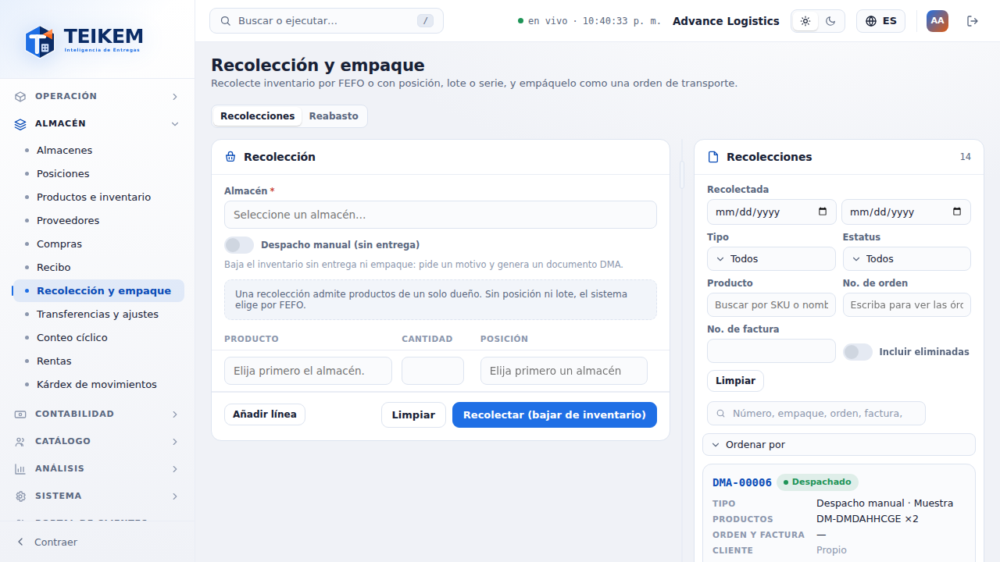
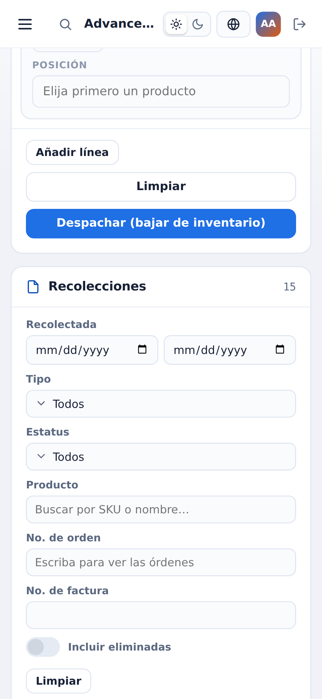

# F19 — Despacho manual en la web (Recolección y empaque)

El **despacho manual** es una salida de inventario **sin entrega** (muestra, uso interno, retiro del cliente, venta u otro) que deja un
documento propio **DMA-#####** con motivo obligatorio y nota libre. **No hay pantalla ni ítem de menú nuevos**: todo vive en
**Almacén → Recolección y empaque** (`/warehouse/pick-batches`), donde todo es una *recolección* y algunas (las manuales) no tienen empaque.
Las reglas del servidor, los códigos HTTP y los mensajes exactos están en el capítulo [06 — Inventario y almacén](../06-inventario-y-almacen.md)
§7b y en la sección «Despacho manual» de las [preguntas frecuentes](../faq.md); aquí se explica cómo se usa desde la pantalla.

**Servidor.** No cambió: la web usa `POST /api/v1/manual-issues` (con `Idempotency-Key`), `GET /api/v1/manual-issues/reasons`,
`DELETE /api/v1/manual-issues/{publicId}`, `GET /api/v1/pick-batches?kind=ALL|PACK|MANUAL` y la ficha `GET /api/v1/pick-batches/{publicId}`.

## 1. Quién puede

| Qué | Dónde | Permiso y módulo |
|---|---|---|
| Ver la lista y la ficha (también de los manuales) | Recolección y empaque | `inventory.view` + módulo **Lotes y series** (`WMS_LOTSERIAL`) |
| Despachar | Panel **Recolección** → interruptor **Despacho manual (sin entrega)** | `warehouse.issue` |
| Eliminar un despacho manual (con reversa) | Fila de la lista o ficha → **Eliminar** | `warehouse.issue` (no basta `warehouse.pick`) |

Quien tiene `warehouse.pick` **y** `warehouse.issue` ve el interruptor y elige el modo. Quien solo tiene `warehouse.issue` ve el panel ya en modo
manual (sin interruptor). Quien solo tiene `warehouse.pick` no ve nada nuevo: el panel es «Recolectar (bajar de inventario)» como siempre.

## 2. Hacer un despacho manual

1. Elija el **Almacén** (si la compañía tiene uno solo, ya viene elegido) y encienda **Despacho manual (sin entrega)**.
2. Aparece **Motivo** (obligatorio: Muestra, Uso interno, Retiro del cliente, Venta u Otro; la compañía puede renombrarlos o deshabilitarlos), **ya
   preseleccionado** (ver §2b), y el botón **Agregar nota** (la nota es opcional, máximo 500 caracteres, vacía y oculta por omisión).
3. Llene las líneas **igual que una recolección**: producto (con su existencia disponible), cantidad, posición (vacía = el sistema elige por
   FEFO), lote, series (productos con serie) y **Sugerir posiciones** (reparte la cantidad entre posiciones en orden FEFO).
   Un despacho admite productos de **un solo dueño**.
4. **Despachar (bajar de inventario)**: un solo envío. El número `DMA-#####` lo pone el servidor y el aviso dice *«Despacho manual DMA-… registrado.»*.
   La lista lo resalta. La existencia **se sigue mostrando** (no es a ciegas).

Mensajes de la pantalla (antes de llamar al servidor): *«Indique el motivo del despacho manual.»*, *«La nota admite como máximo 500 caracteres.»*,
*«Un despacho manual solo puede tener productos de un mismo dueño.»* y los de las líneas (producto, cantidad, series). Los del servidor se
muestran **tal cual** junto a lo que corrigen; por ejemplo, sin existencia suficiente (409) la fila queda marcada en su **cantidad** con
*«Inventario insuficiente de SKU en ALM-01: disponible 5, solicitado 99.»* y **no se descuenta nada ni se consume el número**.

Si se corta la red al enviar, vuelva a pulsar **Despachar** sin cambiar nada: se manda con la misma llave de idempotencia y el servidor devuelve el
mismo documento, no uno nuevo.

## 2b. Motivo por default (2026-10-11 b)

El despacho manual no debe complicar la operación: el **Motivo llega preseleccionado**, con prioridad así:

1. el **último motivo que usted usó** en este navegador (se guarda al despachar, por compañía y usuario) si todavía existe y está habilitado;
2. si no, el **motivo por default de la compañía** (`isDefault` en `GET /api/v1/manual-issues/reasons`);
3. si no hay ninguno, queda vacío y hay que elegirlo (el motivo **sigue siendo obligatorio**: el servidor lo exige igual).

Después de despachar el panel queda listo para el siguiente con el motivo recién usado. Un último motivo que ya no existe se ignora sin error.
Si el navegador no deja guardar datos, simplemente no se recuerda.

**Dónde se fija el default.** Ajustes de la compañía → **Operación** → panel **Despacho manual** → **Motivo por default del despacho manual** (los motivos activos
del catálogo + «Sin motivo por default»; ayuda: *«Llega preseleccionado al despachar; el motivo sigue siendo obligatorio.»*). Exige `admin.tenant` (sin él se ve
y no se cambia) y el módulo Lotes y series. Guarda con `PUT /api/v1/tenant/settings` (`defaultManualIssueReason`, `""` = sin default); el error 400
*«El motivo {CÓDIGO} no existe o está inactivo.»* sale bajo el selector y no se guarda nada.

**Nota.** El campo queda detrás de **Agregar nota** para no ocupar lugar; sin texto por default. Se vuelve a ocultar tras despachar o **Limpiar**.

## 3. Lista de Recolección y empaque

La lista trae **todo**. Columna **Tipo**: *Empaque*, o *Despacho manual · {motivo}*. Filtro **Tipo**: Todos / Empaques / Despachos manuales (manda
`kind`). El estatus de un manual se muestra **Despachado** (y **Cancelado** si se eliminó; use «Incluir eliminadas» para verlos). Un manual no
tiene **Empacar**. Se puede buscar por número, motivo, nota o SKU en el buscador. Ordenar columnas y exportar incluyen todo lo filtrado.

## 4. Ficha de un despacho manual

Clic en la fila (modal) o la dirección `/warehouse/pick-batches/{publicId}` muestran: número DMA, **Despachado**, **Motivo**, **Dueño del inventario**,
quién y cuándo, cantidad y costo total, **Nota**, enlace **Ver los movimientos** (Kárdex del documento: nota *«DMA-… · motivo»*, la nota libre no
va al Kárdex) y las líneas (producto, cantidad, posición, lote, serie, costo unitario, reversa). Sin etapas de empaque ni **Empacar**.

## 5. Eliminar (con reversa)

**Eliminar** pide confirmación: *«¿Eliminar el despacho manual DMA-…? El inventario vuelve a su posición original.»* Restaura el inventario con
un movimiento de reversa y el documento queda **Cancelado**. Errores del servidor (404 si ya se eliminó, 409 de versión —la ficha se recarga—, 422
si el producto ya está dado de baja) salen tal cual en el diálogo.

## 6. En el teléfono (360 px)

Mismos pasos, sin scroll horizontal: el panel y la lista pasan a tarjetas y el Tipo y el motivo caben en la tarjeta (capturas `f19-m-*`).

