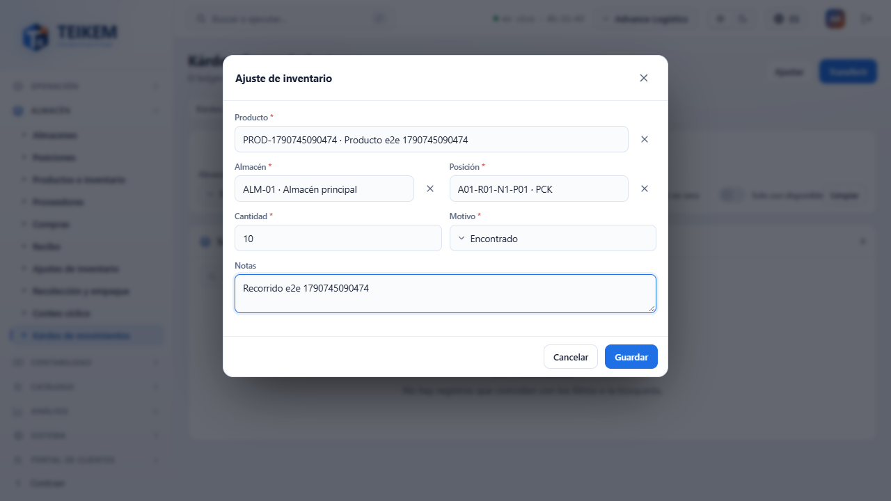
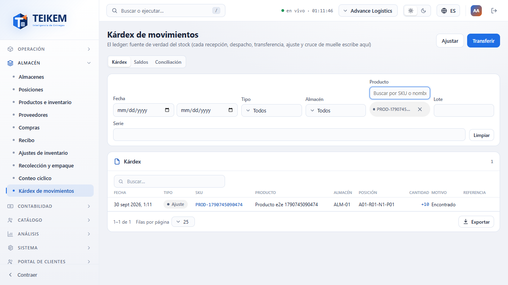
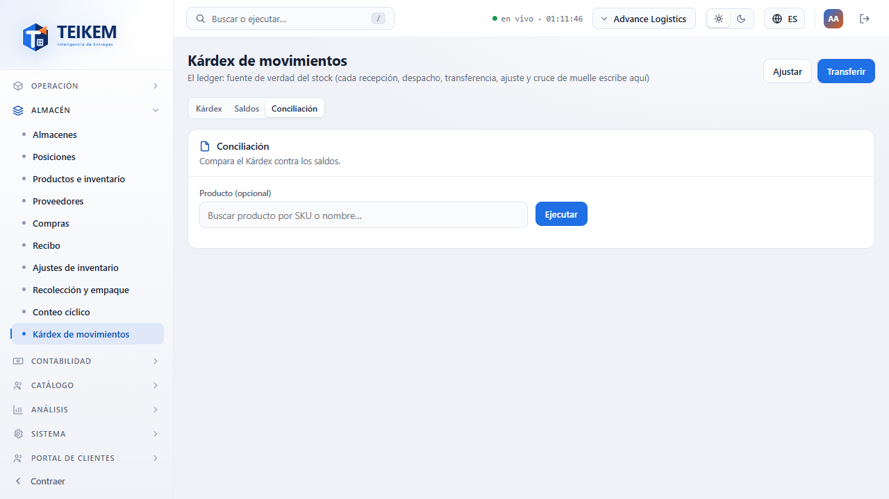
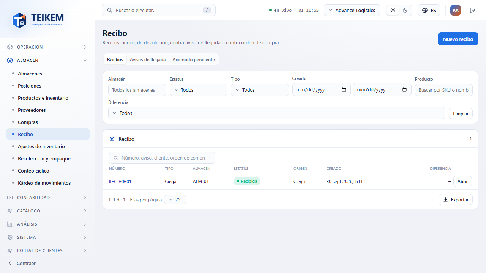
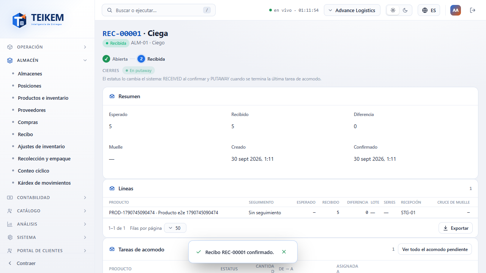
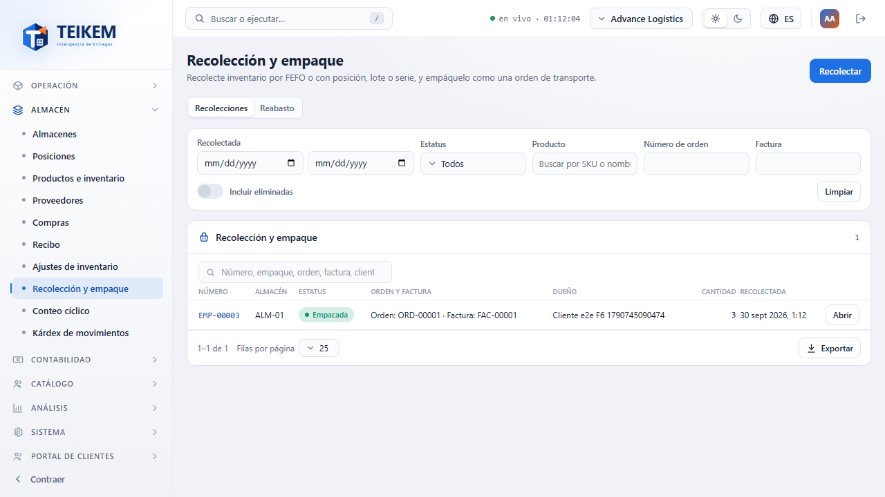

# F6 — Almacén e inventario (mínimo) + consulta de órdenes

Capítulo del manual de pantallas para el módulo de almacén (manual funcional 06) y para la consulta de solo lectura de
órdenes de transporte que lo acompaña. Todas las pantallas viven bajo el grupo **Almacén** del menú lateral, salvo
"Órdenes" que está en **Operación** y el panel "Almacén" de Pulso, que se ve en la pantalla de inicio. Direcciones tal
como aparecen en el navegador; capturas en `img/f6-*.png`. Las secciones **Almacenes** y **Posiciones** (antes
«Ubicaciones») y el pie común de las tablas se reescribieron en el Lote 11: sus capturas están pendientes (se marcan en el
texto) y las imágenes antiguas de la lista, las zonas y las posiciones del almacén se retiraron por no corresponder a la
pantalla actual. En el Lote 12 se reescribieron **Productos e inventario**, **Proveedores** y **Órdenes de compra**
(Compras) y se agregó el botón **Asignar cupo** a Posiciones. Las capturas de Productos, Proveedores y Órdenes de compra son
las que regeneró el recorrido `f6.spec.ts` con la pantalla nueva (datos de prueba de ese recorrido); siguen pendientes las de
Posiciones con **Asignar cupo**, el bloque **Añadir ajuste** y los PDF (se marcan en el texto).

## Todas las tablas: pie, filas por página y Exportar (Lote 11)

Aplica a todas las tablas de la aplicación que usan el componente estándar, no solo a Almacén.

> **Captura pendiente:** pie de tabla con el rango, "Filas por página" y el menú Exportar abierto.

**El pie de la tabla.** Mientras la tabla tenga filas, debajo de ella aparece siempre una barra con:
- El rango y el total: `1–25 de 552`.
- **Filas por página**: 10, 25, 50 o 100 (si la pantalla arrancó con otro tamaño, ese tamaño también aparece en la lista).
  Por defecto son 25. En las listas que vienen paginadas del servidor (Órdenes, Inventario —Saldos y Kárdex—,
  Recolección y empaque, Órdenes de compra, Recibos, Productos, Tareas de almacén, la pestaña Posiciones de la ficha del
  almacén y Posiciones) cambiar el tamaño vuelve a pedir los datos y regresa a la página 1. En las demás la lista ya
  está cargada y el cambio es inmediato.
- El botón **Exportar**.
- Los botones **‹** y **›** con `Página X de Y` (solo si hay más de una página).

Si la tabla no tiene filas se ve el mensaje de vacío (por defecto "Sin resultados") y no hay pie. Algunas tablas de apoyo no paginan y muestran todas sus
filas (las líneas con campos para capturar, y el panel "Actividad reciente", que tiene su propio "Ver más").

**Ordenar.** Un clic en el encabezado ordena por esa columna. En una lista paginada por el servidor ordena **solo las
filas de la página que está viendo**, no todo el resultado.

**Exportar.** El menú ofrece **Excel (.xlsx)**, **CSV (.csv)** y **PDF (.pdf)** y muestra cuántas filas saldrán
(`Filas: 552`). El archivo se genera en su navegador y se descarga solo; no se envía nada a otro lado.

| Pregunta | Respuesta |
|---|---|
| ¿Qué filas salen? | En una tabla ya cargada, **todas** las filas con los filtros activos, en el orden que ve (no solo la página). En una lista paginada por el servidor, **todas las filas de la consulta actual**, con los mismos filtros: la pantalla lee el resultado completo de a 200 filas; si ordenó por una columna, el archivo sale en ese orden. |
| ¿Hay un tope? | Sí: 10.000 filas. Si la consulta tiene más, el archivo lleva las primeras 10.000 y aparece el aviso "Se exportaron las primeras {count} filas (límite de exportación). Afine los filtros para exportar el resto." |
| ¿Qué columnas salen? | Las que ve, con el mismo texto que muestra la pantalla (la columna de acciones y las casillas de selección no). Un "—" sale como celda vacía. Los números salen como número en Excel (se pueden sumar). Sí/No para los valores verdadero/falso. |
| ¿Cómo se llama el archivo? | Como la tabla o, si no tiene nombre, el título de su panel, en minúsculas y sin acentos, más la fecha de hoy: `almacenes-2026-09-29.xlsx`. |
| CSV | Separado por comas, codificación UTF-8 con marca de orden de bytes (Excel lo abre bien con tildes y eñes). Un texto que empieza por `=`, `+`, `-` o `@` sale con un apóstrofo delante para que Excel no lo tome por fórmula. |
| PDF | Hoja A4, vertical (horizontal si la tabla tiene más de 5 columnas), con el título arriba y el número de página abajo. Solo admite caracteres latinos: tildes y eñes salen bien; otros símbolos salen como `?`. |

Si algo falla al generar el archivo aparece el aviso "No se pudo generar el archivo. Intente de nuevo." Mientras se
prepara, el botón dice "Exportando…".

**Desplegables y filtros.** La flecha de todos los desplegables está ahora a la **izquierda**, y los filtros ocupan todo
el ancho del panel (envuelven a otro renglón en pantallas angostas) sin dejar huecos.

## Panel "Almacén" en Pulso del día

**Para qué sirve.** Da un vistazo del estado actual del almacén (no de un período: es "ahora mismo") desde la misma
pantalla de inicio donde ya se ven los indicadores y gráficos del Lote F1.

**Cómo se llega.** Aparece automáticamente debajo de los indicadores y gráficos de Pulso (`/`), sin pedir nada aparte.

> Este panel se extendió en el Lote F7A con el filtro de almacén y de categoría o producto, y con la tarjeta "Bajo
> mínimo". La descripción y las capturas actuales están en
> [F7A — Pulso: panel Almacén con filtro y Actividad reciente](f7a-pulso-almacen-y-actividad.md#pulso-del-día-panel-almacén-con-filtro).
> Aquí queda solo la referencia de permiso, que no cambió.

**Permiso.** Se pinta solo si tiene `inventory.view` **y** el módulo **Almacén y lote/serie** (`WMS_LOTSERIAL`)
encendido; sin alguno de los dos, Pulso se ve igual que en F1 (sin este panel, sin pedir nada al servidor).

## Almacenes: zonas, posiciones y muelles

**Para qué sirve.** Administra los almacenes de la compañía y, dentro de cada uno, sus zonas, posiciones (bins) y
muelles. (Reescrito en el Lote 11: lista en maestro-detalle, ficha con filtros y ocupación, ciudad y código postal desde
un catálogo. Las reglas y los mensajes del servidor están en el
[capítulo 06, sección 1](../06-inventario-y-almacen.md#1-almacenes-y-ubicaciones).)

**Cómo se llega.** Menú **Almacén › Almacenes**, dirección `/warehouse/warehouses`; la ficha en
`/warehouse/warehouses/:publicId`.

### Lista de almacenes

Debajo del título ("Alta y mantenimiento de tus almacenes — cada uno con sus propias zonas y posiciones") hay dos
zonas: la **tabla** y, a su derecha (420 px; bajo 720 px de ancho queda debajo de la tabla), el **panel del almacén
elegido**.

**Filtros** (arriba, con el botón **Limpiar**; filtran en la pantalla, sin volver a pedir datos):
- **Código** y **Nombre**: desplegables de selección múltiple con buscador.
- **Dirección**: texto libre. Cada palabra debe aparecer en la dirección, la ciudad, el estado o el código postal (sin
  distinguir mayúsculas ni acentos).
- **Tipo**: tipos de zona; queda el almacén que tenga **alguna zona activa** de esos tipos.
- **Estatus**: selección múltiple (Activo, Inactivo).
No hay buscador dentro de la tabla ni el selector "Mostrar": los almacenes inactivos se ven siempre, atenuados.

**La tabla.** Columnas: Código, Nombre, Dirección, Zonas y Estatus (el estatus se llamaba "Estado"). Ordena por Código por
defecto. Un clic en la fila **elige** el almacén y lo muestra en el panel derecho; la elección queda en la dirección
(`?warehouse=…`), así que se puede copiar el enlace. Sin elección, se muestra el primero por código. El pie es el común
de todas las tablas (arriba, "Todas las tablas").

**El panel derecho.** Muestra el nombre y el código del almacén, su dirección y su estatus, y el bloque **Zonas de
este almacén**:
- El ícono del lápiz abre la **ficha** del almacén ("Editar almacén" con `warehouse.manage`; "Abrir la ficha del
  almacén" sin él).
- **+ Nueva zona** (con `warehouse.manage`; deshabilitado si el almacén está dado de baja) abre el formulario de zona.
- Una fila por **zona activa**: código, nombre, tipo y `ocupadas/total posiciones` (posiciones activas con existencia entre
  posiciones activas). Con `warehouse.manage`, un clic en la fila abre el formulario para editarla.
- La **papelera** de cada fila da de baja la zona (pide confirmación: "La zona {code} quedará inactiva."; aviso "Zona dada de
  baja."). Si la zona tiene posiciones activas la papelera está deshabilitada y el aviso al pasar el cursor dice "No se
  puede dar de baja: esta zona tiene posiciones creadas".
- Sin zonas: "Todavía no tiene zonas — cree la primera". Sin almacén elegido: "Seleccione un almacén de la lista".

**Nuevo almacén** (botón de la cabecera, con `warehouse.manage`).

> **Captura pendiente:** formulario "Nuevo almacén" con el combobox "Ciudad o código postal" abierto.

| Campo | Cómo funciona |
|---|---|
| Código | Obligatorio; letras, números, guion y guion bajo, máximo 30. No se puede cambiar después |
| Nombre | Obligatorio |
| Dirección | Texto libre |
| Ciudad o código postal | Un solo campo con buscador: escriba una ciudad, un municipio o los primeros dígitos de un código postal (espera 250 ms entre teclas, ↑ ↓ Enter para elegir, Esc cierra la lista, la ✕ "Quitar ciudad y código postal" vacía el campo). Cada opción se ve como `ZIP · CIUDAD POSTAL (Municipio), Estado` y, fuera de Puerto Rico, termina con el país. Al elegir una opción se llenan **Ciudad, Código postal, Estado y País** |
| Estado y País | Solo lectura: se llenan con la localidad elegida ("Se llena según la ciudad elegida."). Si no elige ninguna, el país queda en Puerto Rico y el estado vacío |
| Activo | Casilla marcada y sin poder cambiarse: todo almacén nace activo ("Todo almacén nuevo nace activo; se da de baja desde su ficha.") |

Al guardar aparece "Almacén creado.".

### Ficha del almacén

Encabezado con código, nombre y ciudad, la barra de estatus (Activo → Inactivo, con **Avanzar a Inactivo**, definitivo)
y cuatro pestañas: **Datos**, **Zonas**, **Posiciones**, **Muelles**.

**Datos.** Código (solo lectura: "El código del almacén no se puede cambiar."), Nombre, Dirección, **Ciudad o código
postal** (el mismo combobox de la alta; muestra `Ciudad · ZIP` con lo guardado, aunque el almacén se haya creado antes
del catálogo), y Estado y País de solo lectura. **Guardar** solo se activa si hubo cambios y solo lo ve quien tiene
`warehouse.manage`; aviso "Cambios guardados.". Sin `warehouse.manage` el formulario se ve deshabilitado.

**Zonas.**

- Filtros: **Código**, **Nombre**, **Tipo** (selección múltiple con buscador; filtran en la pantalla) e **Incluir
  inactivas**.
- Columnas: Código, Nombre, Tipo, Posiciones (activas), **Ocupadas** (activas con existencia) y **Estatus** (Activo /
  Inactivo).
- **+ Nueva zona** en la cabecera del panel. Un **clic en la fila** abre el formulario de edición (ya no hay botón
  "Editar"). Por fila, un ícono: **Dar de baja** (el servidor la rechaza con 409 si la zona aún tiene posiciones activas) o **Reactivar**, con confirmación.
- Sin `warehouse.manage` las filas no se pueden abrir y no hay íconos.

**Formulario de zona** ("Nueva zona" / "Editar zona"): **Código** (obligatorio; **se puede editar**: "Único en el almacén.
Cambiarlo no mueve sus posiciones ni sus existencias."), **Nombre** (obligatorio) y **Tipo** (desplegable con buscador
sobre los tipos de zona; se puede dejar vacío). Si el código ya lo usa otra zona del almacén, el mensaje del servidor
"Ya existe una zona con ese código en el almacén." aparece **debajo del campo Código** y el formulario se queda abierto.
Avisos: "Zona creada." / "Cambios guardados.".

**Posiciones.**

- Esta pestaña **pagina en el servidor** (25 por defecto): añadir, editar o dar de baja una posición ya no espera a
  cargar todo el almacén. Abrir o cerrar un formulario no vuelve a consultar.
- Filtros (van al servidor; los de texto esperan un instante después de la última tecla): **Código** (busca también por
  pasillo, rack, nivel y posición, y por el código de la zona), **Zona** (selección múltiple con buscador), **Pasillo**,
  **Rack**, **Nivel**, **Posición**, **Incluir inactivas** y **Solo con existencias**. El contador del panel es el total
  que cumple los filtros.
- Columnas: Código, Zona, Pasillo/rack/nivel/posición, **Cupo**, En mano, **Ocupación**, Producto, Peso máximo (kg) y
  Estatus. **Ocupación** es un chip —Vacía, Parcial, Llena u Ocupada sin cupo— y, si la posición tiene cupo y existencia,
  el porcentaje (`40 %`). **Producto** muestra el SKU si hay uno solo (el nombre sale al pasar el cursor), "N productos" si
  hay varios y "—" si no hay.
- **Asignar cupo** y **Nueva posición** en la cabecera (con `warehouse.manage`). **Asignar cupo** fija o quita el cupo de
  muchas posiciones a la vez y arranca con la Zona, el Pasillo, el Rack, el Nivel y la Posición que tenga puestos en los
  filtros de esta pestaña (el filtro Código no se traslada); ver "Asignar cupo" en la sección Posiciones, más abajo. Un clic
  en la fila abre el formulario de edición. Por fila: **Dar de baja** / **Reactivar**.
- **Exportar** saca **todas** las posiciones que cumplen los filtros, no solo la página.

**Formulario de posición** ("Nueva posición" / "Editar"):
- Alta: **Zona** (desplegable con buscador por código, nombre o tipo; obligatoria), **Código** (opcional si escribe alguna
  parte), Pasillo, Rack, Nivel, Posición, **Cupo máximo** y Peso máximo (kg).
- Edición: el **código y la zona no cambian** (se muestran deshabilitados: "El código y la zona de la posición no se pueden
  cambiar."). Pasillo, rack, nivel, posición, cupo y peso sí, pero cambiar las partes **no recalcula** el código.
- **Cupo máximo**: unidades de producto que caben ("Unidades que caben; vacío = sin cupo."). Entero mayor que cero. Al editar,
  dejarlo vacío quita el cupo.

**Muelles.** Sin cambios respecto al Lote F6: código, tipo (Inbound/Outbound/Both), estatus y activo; **Nuevo muelle**,
**Editar**, **Cambiar estatus** (Libre ↔ Ocupado ↔ Mantenimiento) y **Dar de baja**/**Reactivar**.

### Posiciones (antes «Ubicaciones»)

**Para qué sirve.** Vista de un almacén completo: cuánto de su capacidad está ocupada en cada zona y dónde está cada cosa,
posición por posición. Desde el Lote 12 el ítem del menú se llama **Posiciones** (antes «Ubicaciones»; en inglés, «Bins») y
permite editar una posición con un clic en su fila y asignar cupo en bloque. La dirección no cambió.

**Cómo se llega.** Menú **Almacén › Posiciones**, dirección `/warehouse/locations`. El almacén y la zona elegidos van en
la dirección (`?warehouse=…&zone=…`).

> **Captura pendiente:** pantalla Posiciones con los recuadros por zona, los filtros, la tabla de posiciones y el botón
> **Asignar cupo**.

**Arriba a la derecha:** el selector de **almacén** (sin elegir, el primero activo; cambiar de almacén borra los filtros),
**Asignar cupo** y **Nueva posición** (los dos con `warehouse.manage`; **Nueva posición** abre el mismo formulario de la ficha).

**Los recuadros por zona.** Uno por zona activa, unidos por una tubería:
- Con cupo: `ocupado/capacidad` (por ejemplo `10/25`), el texto `ocupado · 40%` y una barra. La capacidad es la suma del cupo
  de las posiciones de la zona; lo ocupado, lo que hay en esas mismas posiciones. Si la zona tiene posiciones **sin cupo**,
  el recuadro lo avisa ("1 posición sin cupo" / "N posiciones sin cupo") y esas posiciones **no cuentan** en el porcentaje.
- Zona con posiciones pero ninguna con cupo: la existencia total y "unidades · sin cupo configurado" (no hay porcentaje).
- Zona sin posiciones: `0` y "sin posiciones".
- Un **clic en un recuadro** filtra la tabla por esa zona; otro clic en el mismo la quita ("Clic para ver solo esta zona
  en la tabla; otro clic quita el filtro").
Sin zonas, la pantalla dice "Este almacén todavía no tiene zonas".

**Filtros:** **Posición** (texto: busca en código, pasillo, rack, nivel y posición; espera un instante tras la última
tecla), **Zona**, **Tipo** (tipo de zona: equivale a elegir todas las zonas de ese tipo), **Producto** (posiciones con
existencia de alguno de esos productos) y **Estatus** (Vacía, Parcial, Llena, Ocupada sin cupo). Todos van al servidor y el
botón **Limpiar** los quita. Si la combinación no deja ninguna zona (por ejemplo, una zona y un tipo que no coinciden) la
tabla queda vacía: "Ninguna posición coincide con los filtros.".

**La tabla.** Columnas: Posición, Zona, Cantidad, Producto (el nombre si es uno solo; "N productos" si hay varios), **Cupo**,
**Ocupación** (barra y porcentaje; "—" si la posición no tiene cupo) y **Estatus** (Vacía / Parcial / Llena / Ocupada sin
cupo). Solo muestra posiciones activas. Con `warehouse.manage`, un **clic en la fila** abre el formulario de edición de la
posición (el mismo de la ficha del almacén: el código y la zona no cambian; sí el pasillo, rack, nivel, posición, cupo y peso
máximo); al guardar se refrescan la tabla y los recuadros. Sin ese permiso las filas no se abren. La tabla no tiene íconos de
baja: dar de baja o reactivar una posición se hace en la pestaña Posiciones de la ficha del almacén. Pagina en el servidor con el pie común; **Exportar**
saca todas las que cumplen los filtros. Sin posiciones: "Este almacén todavía no tiene posiciones.". Sin almacenes
activos: "No hay almacenes activos.".

**Qué no hay todavía.** Las barras de ocupación de los últimos 7 días que muestra la maqueta no están: dependen de un
historial diario que aún no existe (ver `docs/lote11-decisiones.md`).

#### Asignar cupo (cupo máximo de muchas posiciones a la vez)

**Para qué sirve.** Poner o quitar el cupo máximo (unidades) de todas las posiciones que cumplan un alcance, en un solo paso
y sin editarlas una por una. Sirve, por ejemplo, para corregir el cupo que estimó la migración (ver la pregunta frecuente
«¿De dónde salió el cupo de mis posiciones?» en el FAQ). Quién puede: `warehouse.manage`, módulo `WMS_LOTSERIAL`. Sin ese
permiso el botón no aparece. Se llega desde **Asignar cupo** en Posiciones y en la pestaña Posiciones de la ficha del almacén.
Aplica siempre solo a posiciones **activas**. Llama a `POST /api/v1/warehouses/{publicId}/bins/capacity` (capítulo 06 del
manual funcional).

> **Captura pendiente:** el modal «Asignar cupo a posiciones» con alcance, acción y vista previa.
> **Captura pendiente:** el aviso de confirmación con más de 100 posiciones.

**El modal.** Título «Asignar cupo a posiciones». Tiene dos grupos:
- **Alcance:** **Zona** (varias, con buscador; sin elegir dice «Cualquier zona»), **Pasillo**, **Rack**, **Nivel** y
  **Posición** (texto: contiene), el interruptor **Solo posiciones sin cupo** (no pisa ningún cupo ya capturado) y, solo
  mientras no haya ningún filtro puesto, el interruptor **Todo el almacén**. Desde Posiciones el modal arranca con la zona
  de `?zone=`; desde la ficha, con los filtros de la pestaña.
- **Acción:** un botón de opción, **Cupo máximo** (con el campo «Cupo máximo (unidades)», entero mayor que cero) o **Quitar
  cupo**. Al elegir Quitar cupo, «Solo posiciones sin cupo» se deshabilita («No aplica al quitar el cupo.»).

**La vista previa.** Debajo del modal, una línea dice a cuántas posiciones se aplicará, con una pausa breve tras el último
cambio: «Calculando posiciones…», «Se aplicará a 1 posición.», «Se aplicará a {count} posiciones.». Si no hay ningún filtro
ni «Todo el almacén»: «Elija al menos un filtro (zona, pasillo, rack, nivel o posición) o marque «Todo el almacén».». Si nada
coincide: «Ninguna posición coincide con el alcance: no hay nada que aplicar.». El botón de aplicar (**Asignar cupo** o
**Quitar cupo**) queda deshabilitado mientras no hay alcance, se está calculando, no hay posiciones o el cálculo falló.
Con «Solo posiciones sin cupo» y filtros de texto (pasillo, rack, nivel o posición) el conteo exacto solo se hace si hay
hasta 1.000 posiciones; con más, la vista previa dice «Se aplicará a como máximo {count} posiciones (se omiten las que ya
tienen cupo).» y la cifra es un tope.

**Al aplicar.**
1. Si son más de 100 posiciones, o se marcó «Todo el almacén», pide confirmación («Confirmar cupo en bloque»): «Se asignará un
   cupo máximo de {qty} unidades a {count} posiciones.» o «Se quitará el cupo máximo de {count} posiciones.», más «El cambio
   afecta a todo el almacén.» cuando corresponde y «Las posiciones que ya tengan ese valor no cambian.». Con conteo
   aproximado, el {count} dice «hasta N».
2. Aplica y cierra el modal con el aviso «Cupo aplicado a {changed} de {matched} posiciones» (o «Cupo quitado a {changed} de
   {matched} posiciones»; en singular, «de 1 posición»). `matched` son las que cumplían el alcance y `changed` las que de verdad
   cambiaron: las que ya tenían ese cupo no cuentan como cambiadas.
3. Las tablas y los recuadros de ocupación se refrescan solos.
4. Si el servidor rechaza la petición, el mensaje queda en el modal (recuadro rojo arriba) y el modal sigue abierto; el error
   del cupo se muestra también bajo el campo. Los mensajes del servidor están en el capítulo 06 del manual funcional.

**Qué bloquea.** Con el almacén dado de baja, el servidor responde 422 «El almacén está dado de baja; solo se consulta.».

### Permisos y módulo

`inventory.view` (ver Almacenes, la ficha, Posiciones y el catálogo de ciudades); **`warehouse.manage`** para crear y
editar el almacén, sus zonas, posiciones y muelles, asignar cupo en bloque, dar de baja y reactivar, y el estatus manual del muelle. Módulo
**Almacén y lote/serie** (`WMS_LOTSERIAL`).

### Estatus y transiciones

| Entidad | De → a | Quién | Qué valida / dispara | Bloquea |
|---|---|---|---|---|
| Almacén | Activo → Inactivo (terminal) | `warehouse.manage` (barra de estatus de la ficha) | Inventario y documentos abiertos | 409 "El almacén {code} tiene inventario o documentos abiertos; no se puede dar de baja." Ya inactivo: solo se consulta (nada se edita; 422 "El almacén está dado de baja; solo se consulta.") |
| Zona | Activa → Inactiva | `warehouse.manage` (ícono Dar de baja en la ficha o papelera en el panel de la lista) | Posiciones activas | 409 "La zona tiene posiciones activas; desactívelas primero." (la papelera de la lista ya viene deshabilitada) |
| Zona | Inactiva → Activa | `warehouse.manage` (ícono Reactivar) | — | — |
| Posición | Activa → Inactiva / Inactiva → Activa | `warehouse.manage` (íconos de la pestaña Posiciones) | Inventario y tareas abiertas | 409 "La posición {code} tiene inventario; no se puede desactivar." / 409 "La posición tiene tareas de almacén abiertas; complételas o cancélelas antes de desactivarla." |
| Muelle (estatus operativo) | Libre ↔ Ocupado ↔ Mantenimiento (laterales) | `warehouse.manage` | — | — |
| Muelle (activo) | Activo → Inactivo | `warehouse.manage` | Citas vigentes | 409 "El muelle tiene citas agendadas o en curso." |

La **ocupación** de una posición (Vacía, Parcial, Llena, Ocupada sin cupo) y la de una zona no son estatus: se calculan
solas comparando la existencia en mano con el cupo, no tienen transiciones y no bloquean ninguna acción.

### Validaciones y mensajes

| Campo | Regla | Mensaje | Dónde |
|---|---|---|---|
| Código (almacén, zona) | obligatorio | "El código es obligatorio." | Pantalla (y 400 del servidor) |
| Código (almacén, zona) | letras, números, guion y guion bajo, máx. 30 | "El código solo admite letras, números, guion y guion bajo (máximo 30)." | Pantalla (y 400) |
| Código de zona | único en el almacén (al crear y al editar) | "Ya existe una zona con ese código en el almacén." | Servidor, 409, bajo el campo Código |
| Código de almacén | único en la compañía | "Ya existe un almacén con ese código." | Servidor, 409 |
| Nombre (almacén, zona) | obligatorio | "El nombre es obligatorio." | Pantalla (y 400) |
| Zona (alta de posición) | obligatoria | "Seleccione la zona." | Pantalla |
| Código o pasillo/rack/nivel/posición | uno de los dos | "Indique el código de la posición o su pasillo/rack/nivel/posición." | Pantalla (y 400) |
| Código de posición ya usado | único en el almacén | "Ya existe una posición con ese código en el almacén." | Servidor, 409 |
| Cupo máximo | mayor que cero | "El cupo máximo de la posición debe ser mayor que cero." | Pantalla (y 400) |
| Cupo máximo | número entero | "El cupo máximo debe ser un número entero." | Pantalla |
| Cupo máximo | hasta 2.147.483.647 | "El cupo máximo es demasiado grande." | Pantalla |
| Peso máximo (posición) | > 0 | "El peso máximo debe ser mayor que cero." | Pantalla |
| Peso máximo (posición) | ≤ 3 decimales | "El peso máximo admite hasta 3 decimales." | Pantalla |
| Código (muelle) | obligatorio | "El código es obligatorio." | Pantalla |
| Ciudad o código postal | el servidor niega la consulta del catálogo | "Su usuario no puede consultar el catálogo de ciudades." | Lista del combobox |
| Ciudad o código postal | sin coincidencias | "No hay ciudades ni códigos postales que coincidan." | Lista del combobox |
| Filtros de Posiciones | combinación sin resultados | "Ninguna posición coincide con los filtros." | Tabla |
| Asignar cupo: Cupo máximo | vacío | "Indique el cupo máximo." | Pantalla |
| Asignar cupo: Cupo máximo | número entero | "El cupo máximo debe ser un número entero." | Pantalla |
| Asignar cupo: Cupo máximo | mayor que cero | "El cupo máximo de la posición debe ser mayor que cero." | Pantalla (y 400 del servidor) |
| Asignar cupo: Cupo máximo | hasta 2.147.483.647 | "El cupo máximo es demasiado grande." | Pantalla |
| Asignar cupo: alcance | algún filtro o «Todo el almacén» | "Elija al menos un filtro (zona, pasillo, rack, nivel o posición) o marque «Todo el almacén»." | Pantalla (vista previa; el botón queda deshabilitado) |
| Asignar cupo: alcance | al menos una posición | "Ninguna posición coincide con el alcance: no hay nada que aplicar." | Pantalla (vista previa) |
| Asignar cupo: vista previa | el conteo se pudo calcular | "No se pudo calcular a cuántas posiciones se aplicará: {mensaje}" | Pantalla (vista previa) |
| Asignar cupo: almacén | debe estar activo | "El almacén está dado de baja; solo se consulta." | Servidor, 422, en el recuadro del modal |

## Productos y categorías

**Para qué sirve.** Es el maestro de artículos (SKU): costo, precio, mínimos, categoría, quién es el dueño (propio o
de un cliente) y cómo se rastrea (sin seguimiento, por lote o por serie).

**Cómo se llega.** Menú **Almacén › Productos e inventario**, dirección `/warehouse/products` (con la subpestaña
**Categorías** en la misma pantalla). Un clic en una fila abre el producto en un modal; la ficha con las pestañas Lotes y
Series sigue en `/warehouse/products/:publicId` (se llega desde el modal con «Ver lotes» / «Ver series»).

> **Captura pendiente:** el bloque «Añadir ajuste» abierto dentro del modal de producto.

**Los indicadores (KPIs) son botones.** Arriba hay cuatro tarjetas: **SKUs activos**, **Unidades totales**, **Bajo mínimo** y
**Con número de serie**. Sus cifras son de todo el catálogo (no cambian al usar los filtros) y usan el separador de miles del
idioma (367.329 en español). Cada tarjeta filtra la tabla al hacer clic; otro clic en la misma quita el filtro. El filtro
elegido queda en la dirección (`?kpi=`), así que se puede copiar el enlace o volver atrás con el navegador.

| Tarjeta | Qué cuenta | Filtro que aplica a la tabla | `?kpi=` |
|---|---|---|---|
| SKUs activos | Productos activos | Solo activos | `active` |
| Unidades totales | Existencia en mano de todos los saldos | Activos con disponible mayor que cero (no cuenta la existencia en cuarentena ni cruce de muelle) | `available` |
| Bajo mínimo | Productos activos con mínimo cuyo disponible es menor | Bajo mínimo | `low` |
| Con número de serie | Productos activos con rastreo por serie o con series registradas | Rastreo por serie o con series registradas (incluye los inactivos que las tengan) | `serial` |

**Cuándo una tarjeta se pone naranja.** Solo cuando hay algo que atender: **Bajo mínimo** cuando su cifra es mayor que cero, y
**Con número de serie** cuando hay productos con serie cuyas series capturadas son menos que su existencia; en ese caso
muestra debajo «N sin series completas». Sin pendientes, ambas se ven con el color normal. **SKUs activos** y **Unidades
totales** nunca son naranja.

**Filtros** (van al servidor; **Limpiar** los quita todos, incluido el indicador elegido):
- **Almacén** (varios, con buscador): limita las **cantidades** de cada fila (Disponible, Reservado, Total) a esos almacenes.
  No quita productos de la lista: un producto sin existencia en ese almacén sigue apareciendo con ceros.
- **SKU** (varios, con buscador; incluye productos inactivos).
- **Nombre** (texto: el nombre **contiene** lo escrito, sin distinguir mayúsculas; espera un instante tras la última tecla).
- **Categoría** (varias; incluye las subcategorías).
- **Marca** (varias, con buscador; ofrece las marcas que ya usan los productos de la compañía).

Ya no existe el filtro **Estado** (lo reemplazan los indicadores) ni el buscador libre dentro de la tabla: para buscar por
texto use **Nombre** o **SKU**.

**Qué se ve (lista).** Columnas: SKU, Producto, Categoría, **Marca** (el **Modelo** aparece debajo, en tono tenue; no tiene
columna propia), Dueño ("Propio" o el nombre del cliente), Disponible, Reservado, Total, Rastreo y **Estatus** (chip: OK,
Bajo mínimo o Inactivo; las filas inactivas se ven atenuadas). Pagina en el servidor con el pie común; un clic en el
encabezado ordena solo la página visible. **Exportar** saca todo lo que cumple los filtros; en el archivo, la columna Marca
lleva «Marca · Modelo».

**Qué hace cada botón.**
- **Reporte de inventario** y **Reporte de ajustes**: generan un PDF con los filtros de la tabla (ver "Reportes en PDF").
- **Nuevo producto** (`inventory.manage`): abre el modal vacío.
- **Clic en una fila**: abre el modal de edición (sin `inventory.manage` se abre como «Ver datos del producto», de solo lectura).

**El modal de producto** (alta y edición). Campos en este orden: **SKU** (obligatorio al crear; al editar no se puede cambiar) y
**Unidad** (desplegable con buscador); **Nombre**; **Marca** y **Modelo**; **Categoría** (desplegable con buscador; se busca
por cualquier nivel de la ruta «Raíz / Hija») y **Rastreo** (desplegable con buscador); **Dueño del inventario**; **Costo de
compra** y **Precio de venta**; **Almacén por defecto** y **Posición por defecto**; **Total** (solo lectura: se cambia con un
ajuste) y **Punto de reorden**; al editar, el interruptor **Producto activo** (bloqueado mientras el producto tenga
inventario) y, plegado en «Más datos del producto», código de barras, peso, volumen, mínimo y máximo de picking y los campos
personalizados. Con movimientos, Unidad, Rastreo y Dueño quedan bloqueados.
- **Marca** es texto libre con sugerencias: al escribir ofrece las marcas ya usadas en la compañía, pero se puede escribir una
  nueva. **Modelo** es texto libre. Ambos son opcionales, de hasta 100 caracteres; los espacios de los extremos se recortan.
  Al editar, borrar el contenido quita la marca o el modelo.

**Añadir ajuste** (solo al editar y con `inventory.adjust`). El bloque de ajuste está **oculto** hasta pulsar **+ Añadir
ajuste**. Al abrirlo muestra: **Cantidad (+/-)** (positivo suma, negativo resta), **Motivo** (desplegable con buscador, sin los
motivos que asigna el sistema), **Almacén** y **Posición** (por defecto, los del producto), Lote o Series si el rastreo lo
pide, y **Nota** (obligatoria, hasta 300 caracteres; «Por qué se ajusta (obligatoria)»). Botones **Cancelar ajuste** (cierra
el bloque sin cambios) y **Aplicar ajuste**. Al aplicar, aparece «Ajuste aplicado: {cantidad} {sku}», el **Total** del modal se
actualiza y el bloque vuelve a ocultarse vacío; el modal sigue abierto. Si el ajuste dejaría el inventario en negativo, el
servidor lo rechaza (409, «Inventario insuficiente de {sku} en {posición}: disponible {x}, solicitado {y}.») y el mensaje
aparece **dentro del bloque**, que sigue abierto para corregirlo. La nota es obligatoria **en la pantalla**; el API la deja
opcional para otros flujos. Los mensajes del bloque comparten texto con la pantalla Ajustes de inventario.

### Reportes en PDF (Productos e inventario)

Los dos botones de la cabecera generan un PDF en su navegador (no se envía nada a otro lado) con **los filtros que tenga la
tabla en ese momento**. Mientras se genera, el botón dice «Generando…»; si falla: «No se pudo generar el reporte. Intente de
nuevo.». Los PDF admiten solo caracteres latinos (tildes y eñes salen bien; otros símbolos salen como `?`). Ambos son
horizontales y traen: encabezado con el logo de Teikem, la compañía, el título, la fecha y hora y el usuario que lo generó; el
recuadro **Filtros aplicados** (o «Sin filtros: incluye todos los registros de la compañía.»); tarjetas de resumen; la tabla con
el encabezado repetido en cada página y filas alternadas; y el pie «Generado con Teikem · compañía» con «Página X de Y».

> **Captura pendiente:** primera página del Reporte de inventario.
> **Captura pendiente:** primera página del Reporte de ajustes.

**Reporte de inventario.** Foto del inventario al momento, agrupada por categoría (con la cantidad de productos de cada una)
y con un subtotal por categoría y un total general.
- Columnas: SKU, Producto, Categoría, Marca, Disponible, Reservado, Total, Costo unitario y Valor. Resumen: Productos,
  Unidades en mano, Disponible y Valor del inventario.
- **Solo lista productos con existencia** (en mano distinta de cero). Los que están en 0 no salen y un aviso dice cuántos
  quedaron fuera: «Productos sin existencia (en mano 0) no incluidos: {count}.».
- **Valor = Total × costo de compra** registrado en el producto. El sistema no guarda costo promedio ni costo por lote (el
  reporte lo dice). Un producto con existencia pero sin costo muestra «—» en el costo y en el valor, no suma en los totales y
  se avisa: «Productos con existencia sin costo de compra: {count}. Su valor aparece como «—» y no se suma en los totales.».
  Si ningún producto tiene costo, el valor total del resumen también es «—».
- Con un filtro de Almacén, las cantidades son solo de esos almacenes (el filtro lo aclara).
- Lee hasta 10.000 productos; con más, avisa: «El reporte incluye solo los primeros {count} productos (límite de lectura).
  Afine los filtros para ver el resto.».

**Reporte de ajustes.** Movimientos de tipo **Ajuste** del Kárdex, del más reciente al más antiguo, de los productos que
cumplen los filtros de la tabla (Almacén, SKU, Nombre, Categoría y Marca). **No tiene rango de fechas:** incluye todo el
historial de ajustes que cumpla los filtros.
- Columnas: Fecha y hora, SKU, Producto (con el lote o la serie, si tiene), Almacén / Posición, Cantidad (±), Motivo, Nota y
  Usuario. Resumen: Ajustes, Entradas, Salidas y Neto; al final de la tabla, las filas de Entradas, Salidas y Neto.
- **Excluye los saldos iniciales de la migración** (motivo OPENING_BALANCE), porque se registraron como ajustes pero no son
  ajustes de la operación. Un aviso dice cuántos quedaron fuera: «Saldos iniciales de la migración excluidos: {count} (no son
  ajustes de la operación).».
- Si hay un indicador elegido (activos, con disponible, bajo mínimo, con serie), no se aplica a los movimientos; el reporte lo
  avisa: «La vista «{vista}» depende del estado actual del producto y no aplica a los movimientos: se incluyen los ajustes de
  los productos que cumplen los demás filtros.».
- Lee hasta 10.000 movimientos; con más: «El reporte incluye solo los {count} ajustes más recientes (límite de lectura). Afine
  los filtros para ver el resto.».
- Sin ajustes: «No hay ajustes para los filtros elegidos.».

El nombre del archivo lleva el título, la compañía y la fecha (por ejemplo `reporte-de-inventario-advance-depot-2026-09-30.pdf`).

**Validaciones y mensajes (marca, modelo y ajuste del modal).**

| Campo | Regla | Mensaje | Dónde |
|---|---|---|---|
| Marca | máx. 100 caracteres | "La marca no puede exceder 100 caracteres." | Pantalla (el campo ya no deja escribir más) y 400 |
| Modelo | máx. 100 caracteres | "El modelo no puede exceder 100 caracteres." | Pantalla (el campo ya no deja escribir más) y 400 |
| Ajuste: Cantidad | vacía o no numérica | "Indique la cantidad del ajuste (número, positivo para sumar o negativo para restar)." | Pantalla |
| Ajuste: Cantidad | distinta de cero | "La cantidad del ajuste no puede ser cero." | Pantalla (y 400) |
| Ajuste: Cantidad | hasta 3 decimales | "La cantidad admite como máximo 3 decimales." | Pantalla (y 400) |
| Ajuste: Motivo | obligatorio | "Seleccione un motivo." | Pantalla |
| Ajuste: Almacén | obligatorio | "Seleccione un almacén." | Pantalla |
| Ajuste: Posición | obligatoria | "Seleccione una posición." | Pantalla |
| Ajuste: Nota | obligatoria | "Escriba una nota que explique el ajuste." | Pantalla |
| Ajuste: Nota | máx. 300 caracteres | "Las notas admiten como máximo 300 caracteres." | Pantalla (y 400) |
| Ajuste: saldo | no dejar el inventario en negativo | "Inventario insuficiente de {sku} en {posición}: disponible {x}, solicitado {y}." | Servidor, 409, dentro del bloque |

**Qué se ve (ficha).** La ficha completa (`/warehouse/products/:publicId`) conserva las pestañas **Datos**, **Lotes** y
**Series**; hoy se llega a Lotes y Series desde el modal.

**Subpestaña Categorías** (en la misma pantalla de Productos, pestaña "Categorías"):

Árbol simple con indentación por nivel (hasta 5); cada fila muestra cuántos productos tiene y **Editar**/
**Dar de baja**/**Reactivar**; **Nueva categoría** elige el nombre y la categoría superior (o "raíz").

**Permiso.** `inventory.view` (lista, ficha, lotes, series, categorías); **`inventory.manage`** para crear/editar/
dar de baja/reactivar producto y categoría. Módulo `WMS_LOTSERIAL`.

**Validaciones y mensajes (producto).**

| Campo | Regla | Mensaje |
|---|---|---|
| SKU | obligatorio | "El SKU es obligatorio." |
| SKU | máx. 60 caracteres | "El SKU no puede exceder 60 caracteres." |
| SKU | sin espacios ni caracteres de control | "El SKU no admite espacios ni caracteres de control." |
| Nombre | obligatorio | "El nombre del producto es obligatorio." |
| Nombre | máx. 200 caracteres | "El nombre no puede exceder 200 caracteres." |
| Código de barras | máx. 60 caracteres | "El código de barras no puede exceder 60 caracteres." |
| Seguimiento | obligatorio | "Seleccione el tipo de seguimiento." |
| Costo / Precio | no negativos | "El costo y el precio no pueden ser negativos." |
| Costo | ≤ 4 decimales | "El costo admite como máximo 4 decimales." |
| Precio | ≤ 4 decimales | "El precio admite como máximo 4 decimales." |
| Costo o precio | tope | "El costo o el precio excede el máximo permitido." |
| Mínimos | no negativos | "Los mínimos no pueden ser negativos." |
| Máximo de picking | ≥ mínimo | "El máximo de la posición de picking debe ser mayor o igual al mínimo." |
| Mínimo de picking | exige posición preferida en zona PICKING | "El mínimo de picking requiere una posición preferida en una zona PICKING." |
| Peso / volumen | no negativos | "El peso y el volumen no pueden ser negativos." |
| Peso | ≤ 3 decimales, < 1,000,000,000 | "El peso admite como máximo 3 decimales y debe ser menor que 1,000,000,000." |
| Volumen | ≤ 4 decimales, < 100,000,000 | "El volumen admite como máximo 4 decimales y debe ser menor que 100,000,000." |

Al editar: cambiar seguimiento, unidad base o dueño de un producto con movimientos: **"No se puede cambiar: el
producto ya tiene movimientos."** (409). Dar de baja bloqueado con inventario en mano o documentos abiertos (409).

**Validaciones y mensajes (categoría).** "El nombre de la categoría es obligatorio."; "El nombre de la categoría no
puede exceder 150 caracteres."; más de 5 niveles o nombre repetido en el mismo nivel: rechazado por el servidor (409);
baja bloqueada con productos o subcategorías activas (409).

## Inventario: saldos, Kárdex, ajustes, transferencias, genealogía, rastro de serie y conciliación

**Para qué sirve.** Consulta el inventario disponible en cada posición, su historial de movimientos (Kárdex), permite
corregirlo (ajuste, transferencia) y compara el Kárdex contra los saldos (conciliación). No tiene estatus propio: es
un libro de movimientos, no una entidad con ciclo de vida.

**Cómo se llega.** Menú **Almacén › Inventario**, dirección `/warehouse/inventory`, con pestañas **Saldos**,
**Kárdex** y **Conciliación**.

**Qué se ve (Saldos).**

Columnas: almacén, posición, zona, SKU, producto, lote, vencimiento, en mano, reservado, disponible, valor costo,
valor venta y actualizado. Filtros: almacén, producto (buscador), categoría, lote, "Incluir en cero", "Solo con
disponible" y buscador libre. Cada fila puede abrir **Genealogía** (si tiene lote) o **Rastro de serie**.

**Qué hace cada botón.**
- **Ajustar** (cabecera): producto, almacén, posición, cantidad (puede ser negativa), motivo, notas, y lote/series si
  el producto los usa.
- **Transferir** (cabecera): producto, posición de origen y destino (con sus almacenes si es entre almacenes distintos)
  y cantidad.

**Qué se ve (Kárdex).**

Columnas: fecha, tipo, SKU, producto, almacén, posición, cantidad (con signo) y referencia/motivo. Filtros: rango de
fecha, tipo de movimiento, almacén, producto, lote, serie y buscador libre. Cada fila puede abrir **Rastro de serie**.

**Qué se ve (Conciliación).**

Un producto opcional (buscador) y el botón **Ejecutar**: muestra cuándo se ejecutó, cuántos saldos se revisaron y una
tabla de diferencias (Kárdex vs. saldo); sin diferencias, "El inventario concilia".

**Permiso.** `inventory.view` (saldos, Kárdex, genealogía, rastro de serie, conciliación de solo lectura);
**`inventory.adjust`** para ajustar, transferir y ejecutar la conciliación. Módulo `WMS_LOTSERIAL`.

**Validaciones y mensajes.**

| Campo | Regla | Mensaje |
|---|---|---|
| Producto/Almacén/Posición (ajuste) | obligatorios | "Seleccione un producto." / "Seleccione un almacén." / "Seleccione una posición." |
| Motivo (ajuste) | obligatorio | "Seleccione un motivo." |
| Cantidad (ajuste) | ≠ 0 | "La cantidad del ajuste no puede ser cero." |
| Cantidad (ajuste/transferencia) | ≤ 3 decimales | "La cantidad admite como máximo 3 decimales." |
| Lote (ajuste, producto por lote) | obligatorio | "Indique el número de lote." |
| Series (ajuste, producto por serie) | al menos una | "Indique al menos un número de serie." |
| Posiciones (transferencia) | origen ≠ destino | "El origen y el destino no pueden ser la misma posición." |
| Cantidad (transferencia) | > 0 | "La cantidad debe ser mayor que cero." |
| Ambos (falta de existencia) | — | 409 "Inventario insuficiente de {sku} en {bin}: disponible {x}, solicitado {y}." |
| Rango del Kárdex | desde ≤ hasta | "La fecha 'desde' no puede ser posterior a la fecha 'hasta'." |

## Recepción: recibos y avisos de llegada

**Para qué sirve.** Registra la mercancía que entra al almacén: recibos ciegos (sin documento previo), de devolución,
contra un aviso de llegada (ASN) de un cliente, o contra una orden de compra propia.

**Cómo se llega.** Menú **Almacén › Recepción**, dirección `/warehouse/receipts` (pestañas **Recibos** y **Avisos de
llegada**); ficha del recibo en `/warehouse/receipts/:publicId`.

**Qué se ve (lista de recibos).**

Columnas: número, tipo, almacén, estatus, origen, creado y diferencia (si hay). Filtros: almacén, estatus, tipo, rango
de creación, producto y "Con/sin diferencia".

**Qué hace cada botón.**
- **Nuevo recibo**: elige "Recibir" (Ciego, Devolución, contra Aviso de llegada o contra Orden de compra —esta última
  solo si además tiene `purchasing.receive` y el módulo Compras encendido—), el almacén, la posición de recepción
  (vacío usa la primera posición de una zona STAGING) y las líneas (producto y cantidad recibida).

**Qué se ve (ficha).**

Barra de estatus (Abierta — Recibida, con "Cierre: En putaway"), resumen (esperado/recibido/diferencia/muelle),
líneas con lo esperado vs. lo recibido (y **Capturar**/**Quitar línea** mientras está Abierta), y "Tareas de acomodo"
con acceso directo a Tareas de almacén.

**Qué hace cada botón (ficha).**
- **Agregar línea** / **Capturar** / **Quitar línea**: solo con el recibo Abierta.
- **Confirmar recibo**: asienta el inventario y crea las tareas de acomodo; ya no se puede modificar después.
- **Eliminar**: solo Abierta y sin cruce de muelle asignado.

**Permiso.** `inventory.view` (lista y ficha de solo lectura); **`warehouse.receive`** para capturar líneas, agregar/
quitar, confirmar, eliminar y administrar avisos de llegada (recibir contra orden de compra exige además
`purchasing.receive` + módulo Compras). Módulo `WMS_LOTSERIAL`.

**Estatus y transiciones.** El estatus no lo cambia un botón de pipeline: **Abierta → Recibida** al **Confirmar**;
**→ En putaway (terminal)** lo dispara el sistema cuando se termina la última tarea de acomodo. El texto bajo el
pipeline lo aclara: "El estatus lo cambia el sistema: RECEIVED al confirmar y PUTAWAY cuando se termina la última
tarea de acomodo."

**Validaciones y mensajes.**

| Campo | Regla | Mensaje |
|---|---|---|
| Almacén | obligatorio | "Elija el almacén." |
| Aviso de llegada / Orden de compra | obligatorio según lo elegido en "Recibir" | "Elija el aviso de llegada." / "Elija la orden de compra." |
| Producto (línea) | obligatorio | "Indique el producto." |
| Líneas | al menos una | "Indique al menos una línea." |
| Líneas | máx. 200 | "El recibo admite como máximo 200 líneas." |
| Cantidad recibida | obligatoria, no negativa | "Indique la cantidad recibida." / "La cantidad recibida no puede ser negativa." |
| Lote (producto por lote) | obligatorio | "El producto {sku} se controla por lote: indique el lote." |
| Series (producto por serie) | tantas como la cantidad, sin repetir | "El producto {sku} se controla por serie: capture {qty} número(s) de serie (hay {n})." / "El número de serie '{serial}' está repetido." |

## Tareas de almacén

**Para qué sirve.** Una cola única con todo el trabajo físico del almacén: acomodo (putaway) tras un recibo, reabasto
de posiciones de picking, conteo cíclico y cruce de muelle.

**Cómo se llega.** Menú **Almacén › Tareas de almacén**, dirección `/warehouse/tasks`.

**Qué se ve.**

Columnas: tipo, estatus, prioridad, almacén, producto, cantidad, posiciones (de → a), referencia, asignado a y
creada. Filtros: almacén, tipo, estatus, "Asignadas a mí" e "Incluir cerradas".

**Qué hace cada botón.**
- **Correr reabasto** (cabecera): elige el almacén y crea automáticamente las tareas de reabasto que hagan falta.
- **Asignar** (por fila): elige el usuario (o "Sin asignar").
- **Iniciar**: pasa la tarea a en curso.
- **Completar**: pide la posición destino (vacío usa la sugerida), cantidad (vacío completa el total; el remanente
  queda como tarea nueva) y series si aplica.

- **Cancelar**: solo para tareas de Putaway o Reabasto.

**Permiso.** `inventory.view` (ver la cola); **`warehouse.manage`** (asignar, cancelar); **Iniciar**/**Completar**
exige el permiso del tipo de tarea: `warehouse.receive` (Putaway), `warehouse.pick` (Reabasto, y el botón "Correr
reabasto"), `warehouse.count` (Conteo) o `warehouse.crossdock` (Cruce de muelle) —estas dos últimas normalmente se
completan desde Conteo cíclico o desde el plan de cruce de muelle, no desde esta cola—. Módulo `WMS_LOTSERIAL`.

**Estatus y transiciones.** Pendiente → En curso (**Iniciar**) → Terminada (**Completar**); Cancelada es lateral
desde Pendiente/En curso, solo para Putaway y Reabasto.

**Mensajes que puede ver.**

| Mensaje | Cuándo aparece |
|---|---|
| "Su usuario no puede consultar el listado de usuarios." | Al abrir **Asignar** sin permiso para ver usuarios |
| "Vacío usa la posición sugerida." / "Vacío completa la cantidad total de la tarea; el remanente queda como tarea nueva." | Ayuda del formulario de **Completar** |
| "No hay una posición sugerida para esta tarea." | La tarea (normalmente no Putaway) no trae una sugerencia del servidor |
| "Se crearon {count} tareas de reabasto." | Al terminar **Correr reabasto** |

## Conteo cíclico

**Para qué sirve.** Toma una "foto" del saldo en mano de un almacén (o de sus zonas/posiciones), permite capturar lo
contado y reconciliar el ajuste contra el saldo actual.

**Cómo se llega.** Menú **Almacén › Conteo cíclico**, dirección `/warehouse/cycle-counts`; ficha en
`/warehouse/cycle-counts/:id`.

**Qué se ve (lista).** Columnas: número, almacén, estatus, contadas (progreso), diferencia neta y creado.

**Qué hace cada botón.**
- **Nuevo conteo**: almacén y, opcionalmente, zonas o posiciones (sin filtros toma todo el saldo en mano del almacén,
  máximo 1000 líneas).

**Qué se ve (ficha).** Barra de estatus (Abierto — Contado — Reconciliado), resumen (progreso, líneas con diferencia,
diferencia neta), y la tabla de líneas con **Capturar** (cantidad contada o series, según el seguimiento del
producto).

**Qué hace cada botón (ficha).**
- **Agregar línea**: agrega una posición/producto a mano.
- **Refrescar foto**: solo aparece si hay líneas con "Foto vieja" (el saldo cambió desde que se tomó la foto); las
  vuelve a fotografiar y borra su captura.
- **Terminar conteo**: pasa de Abierto a Contado; exige que todas las líneas estén capturadas.
- **Reconciliar**: pasa de Contado a Reconciliado; asienta los ajustes contra el saldo actual.
- **Eliminar**: solo con el conteo Abierto (cancela también su tarea de conteo).

**Permiso.** `inventory.view` (solo listar); **`warehouse.count`** para todo lo demás: ver la ficha, capturar,
refrescar, terminar, reconciliar y eliminar. Módulo `WMS_LOTSERIAL`.

**Estatus y transiciones.** Abierto → Contado (**Terminar conteo**) → Reconciliado (**Reconciliar**, terminal); sin
transición manual de pipeline (los dos pasos son botones propios, no la barra de pipeline).

**Validaciones y mensajes.**

| Mensaje | Cuándo aparece |
|---|---|
| "El conteo admite como máximo 1000 líneas; acote los filtros." | Al crear un conteo sin zonas/posiciones sobre un almacén muy grande |
| "Indique la posición." / "Indique la cantidad contada." | Al agregar/capturar una línea |
| "Indique el lote por su id o por su número, no ambos." | Ambigüedad de lote al agregar una línea manual |
| "Faltan {n} línea(s) por contar." | Al **Terminar conteo** con líneas sin capturar |
| 409 (lo contado es menor que lo reservado) | Al **Reconciliar** |

## Recolección y empaque

**Para qué sirve.** Recolecta inventario (por FEFO automático o eligiendo posición/lote/serie) y lo empaca como una
orden de transporte nueva, sin pasar por la captura completa de una orden.

**Cómo se llega.** Menú **Almacén › Recolección y empaque**, dirección `/warehouse/pick-batches`; ficha en
`/warehouse/pick-batches/:publicId`.

**Qué se ve (lista).**

Columnas: número, almacén, estatus, orden y factura, dueño, cantidad y recolectada. Filtros: rango de recolección,
estatus, producto, número de orden, factura e "Incluir eliminadas".

**Qué hace cada botón.**
- **Recolectar**: almacén y líneas (producto, cantidad, y opcionalmente posición/lote/series; vacío usa FEFO
  automático). Una recolección solo admite productos de un mismo dueño.

  

**Qué se ve (ficha).** Barra de estatus (Recolectada — Empacada, con cierre "Eliminada"), resumen (recolectada,
empacada, orden, factura, cantidad, costo total) y líneas (producto, cantidad, posición, lote/serie, costo unitario,
reversa).

**Qué hace cada botón (ficha).**
- **Empacar**: cliente de la orden (debe ser el dueño del inventario recolectado), tipo de servicio, consignatario
  (del directorio o uno nuevo), número de orden/factura (vacío: automático) y paquetes.

- **Eliminar**: si ya está Empacada, exige además `orders.cancel` (borra también la orden que creó); bloqueado si la
  orden ya avanzó.

**Permiso.** `inventory.view` (listar y ver la ficha); **`warehouse.pick`** para recolectar y eliminar; **Empacar**
exige además `orders.create`. Módulo `WMS_LOTSERIAL`.

**Estatus y transiciones.** Recolectada (inicial) → Empacada (**Empacar**) → Cancelada (lateral, **Eliminar**); sin
transición manual de pipeline.

**Validaciones y mensajes.**

| Campo | Regla | Mensaje |
|---|---|---|
| Líneas | al menos una | "Indique al menos una línea a recolectar." |
| Líneas | máx. 100 | "La recolección admite como máximo 100 líneas." |
| Dueño | un solo dueño por recolección | "Una recolección solo puede tener productos de un mismo dueño." |
| Cantidad (línea) | > 0 | "La cantidad debe ser mayor que cero." |
| Series (producto por serie) | tantas como la cantidad | "El producto {sku} tiene serie: escanee las series a recolectar." / "En productos con serie la cantidad debe ser igual al número de series escaneadas." |
| Cliente (empacar) | obligatorio | "Indique el cliente de la orden." |
| Consignatario (empacar) | obligatorio (directorio o nuevo) | "El consignatario es obligatorio: elija uno del directorio o capture uno nuevo." |
| Nombre / Dirección / Ciudad (consignatario nuevo) | obligatorios | "El nombre del consignatario es obligatorio." / "La dirección (línea 1) del consignatario es obligatoria." / "La ciudad del consignatario es obligatoria." |
| País (consignatario nuevo) | código ISO de 2 letras | "Use el código ISO de 2 letras del país." |
| Paquetes | al menos uno | "Indique al menos una línea de paquete." |
| Piezas (paquete) | ≥ 1 | "La cantidad de piezas debe ser al menos 1." |

## Proveedores

**Para qué sirve.** Directorio de proveedores para las órdenes de compra: contacto, término de pago y estatus.

**Cómo se llega.** Menú **Almacén › Proveedores**, dirección `/warehouse/suppliers`. Desde el Lote 12 este ítem va **antes**
de «Compras» en el menú.

**Qué se ve.** Filtros (en la pantalla, sin consultar al servidor): **Nombre**, **Contacto**, **Teléfono**, **Correo** y
**Mostrar** («Solo activos», por defecto, o «Incluir inactivos»). El de Teléfono compara **por dígitos**: escribir `787` o
`5551234` encuentra `(787)555-1234` sea cual sea el formato guardado. **Limpiar** los quita. No hay buscador dentro de la
tabla. Columnas: Nombre, Contacto, **Teléfono**, Correo y **Estatus** (chip verde «Activo» o gris «Inactivo», con los mismos
colores que Almacenes); se ordena por nombre; los proveedores inactivos se ven atenuados. Tabla de 25 filas por página.

**Qué hace cada botón.**
- **Nuevo proveedor** (`purchasing.manage`).
- **Clic en una fila**: abre el proveedor para editarlo (solo con `purchasing.manage`; sin ese permiso las filas no se abren).
  Ya no hay botón «Editar» en la fila.
- **Ícono de baja** al final de cada fila activa (tooltip «Dar de baja»; confirmación «El proveedor {nombre} quedará
  inactivo.») y **ícono de reactivar** en las inactivas (tooltip «Reactivar»; «El proveedor {nombre} volverá a estar
  disponible.»). Solo con `purchasing.manage`. Avisos: «Proveedor dado de baja.» / «Proveedor reactivado.».

**El modal** («Nuevo proveedor» / «Editar»): **Nombre** (obligatorio), **Contacto**, **Teléfono**, **Correo electrónico**,
**Término de pago** (desplegable con buscador, «Buscar término de pago…») y **Notas**. Avisos: «Proveedor creado.» /
«Cambios guardados.».
- **Teléfono con máscara.** Escriba solo los dígitos: el campo pone `(xxx)xxx-xxxx` mientras escribe (hasta 10 dígitos). El
  teléfono se guarda con la máscara, por ejemplo `(787)555-1234`. Puede dejarse vacío. Un proveedor guardado antes con otro
  formato se muestra con la máscara si tiene exactamente 10 dígitos; si no, se muestra tal cual y hay que corregirlo para
  poder guardar (la pantalla exige 10 dígitos o vacío).

**Permiso.** `purchasing.view` (ver la lista); **`purchasing.manage`** para crear/editar/dar de baja/reactivar. Módulo
**Compras** (`PURCHASING`).

**Validaciones y mensajes.**

| Campo | Regla | Mensaje | Dónde |
|---|---|---|---|
| Nombre | obligatorio | "El nombre del proveedor es obligatorio." | Pantalla (y 400) |
| Nombre | único entre proveedores activos | "Ya existe un proveedor activo con ese nombre." | Servidor, 409 |
| Teléfono | vacío o exactamente 10 dígitos | "El teléfono debe tener 10 dígitos: (xxx)xxx-xxxx." | Pantalla |
| Correo electrónico | formato válido | "El correo electrónico no es válido." | Pantalla (y 400) |

## Órdenes de compra

**Para qué sirve.** Ordena mercancía propia a un proveedor, hace seguimiento a lo recibido contra lo pedido y
resuelve lo que quedó faltante.

**Cómo se llega.** Menú **Almacén › Órdenes de compra**, dirección `/warehouse/purchase-orders`; ficha en
`/warehouse/purchase-orders/:publicId` (pestañas **Líneas** y **Faltantes**).

**Qué se ve (lista).**

Columnas: número, proveedor, almacén, estatus, fecha esperada y fecha. Filtros (Lote 12): **Estatus**, **Proveedor** y
**Almacén**, los tres de selección **múltiple con buscador** (la orden aparece si su proveedor o almacén es cualquiera de los
elegidos), y **Fecha** (rango). **Limpiar** los quita. Ya no hay buscador dentro de la tabla.

**Qué hace cada botón.**
- **Nueva orden de compra**: **Proveedor** (desplegable con buscador, «Buscar proveedor…»; obligatorio), **Almacén**
  (obligatorio **en la pantalla**), fecha esperada, notas y las líneas (**Producto** con buscador —solo productos propios—,
  **Cantidad ordenada**, **Costo unitario**); nace en Borrador. Debe haber **al menos una línea con cantidad ordenada mayor
  que cero**; el aviso aparece sobre las líneas. (En el API el almacén es opcional cuando la compañía tiene un solo almacén
  activo; la pantalla siempre lo pide.)

  

**Qué se ve (ficha).** Barra de estatus con botones **Avanzar a Enviada** y **Avanzar a Cancelada** (los únicos
manuales; Recibida parcial/Recibida los pone el sistema al confirmar un recibo); pestañas **Líneas** (editable solo
en Borrador; una línea con recepciones muestra la nota "Esta línea ya tiene recepciones: no se elimina, no baja de lo
recibido y su costo no cambia.") y **Faltantes** (líneas pendientes con **Resolver**). El **proveedor** y el **almacén** se
muestran de solo lectura: se eligen al crear la orden y no se pueden cambiar (el servidor rechaza cambiarlos con 400 "El campo
supplierId de la orden de compra no se puede cambiar."). Si se equivocó, cancele la orden y cree otra. Al guardar las líneas
se aplica la misma regla del alta: al menos una línea con cantidad ordenada mayor que cero.

**Qué hace cada botón (ficha).**
- **Eliminar** (cabecera, solo si el servidor permite `canDelete`: sin recepciones ni recibo abierto).
- **Agregar línea** / **Quitar línea**: solo en Borrador.
- **Resolver** (pestaña Faltantes): elige la acción —**Cerrar** (dar por perdido), **Reordenar** (exige además
  `purchasing.manage`) o **Ajuste manual** (exige además el módulo `WMS_LOTSERIAL`; entra a inventario con posición,
  lote/series si aplica).

**Permiso.** `purchasing.view` (listar, ver ficha y faltantes); **`purchasing.manage`** (crear/editar/enviar/cancelar/
eliminar la orden, y proveedores); **`inventory.adjust`** para resolver un faltante. Módulo `PURCHASING`.

**Estatus y transiciones.**

| De → a | Quién | Qué dispara |
|---|---|---|
| Borrador → Enviada | `purchasing.manage` (botón del pipeline) | — |
| Enviada/Borrador/Recibida parcial → Cancelada | `purchasing.manage` (botón del pipeline) | 409 "Una orden de compra recibida completa no se cancela." si ya está Recibida |
| Enviada → Recibida parcial → Recibida | el sistema | Al confirmar un recibo contra la orden |

**Validaciones y mensajes.**

| Campo | Regla | Mensaje |
|---|---|---|
| Proveedor | obligatorio | "Indique el proveedor." |
| Almacén | obligatorio en la pantalla (el API lo acepta vacío solo con un único almacén activo) | "Indique el almacén." |
| Líneas | al menos una con cantidad ordenada > 0 (alta y edición de líneas) | "Agregue al menos una línea con cantidad ordenada mayor que cero." |
| Producto (línea) | obligatorio, solo propio | "Indique el producto." / "La orden de compra solo admite productos propios; {sku} pertenece a un cliente." |
| Cantidad ordenada | > 0, ≤ 3 decimales | "La cantidad ordenada debe ser mayor que cero." / "La cantidad admite como máximo 3 decimales." |
| Costo unitario | ≥ 0, ≤ 4 decimales | "El costo unitario no puede ser negativo." / "El costo unitario admite como máximo 4 decimales." |
| Producto (línea) | sin repetir | "Ese producto ya está en la orden de compra." |
| Líneas | al menos una, máx. 200 | "La orden de compra debe tener al menos una línea." / "La orden de compra admite como máximo 200 líneas." |
| Cantidad (resolver faltante) | > 0, ≤ pendiente | "La cantidad debe ser mayor que cero." / "La cantidad no puede exceder el faltante pendiente." |
| Posición (ajuste manual) | obligatoria | "Indique la posición donde entra la mercancía." |
| Lote/series (ajuste manual) | según seguimiento del producto | "El producto {sku} se controla por lote; indique el lote." / "El producto {sku} se controla por serie; capture los números de serie." |

Fuera de Borrador, editar la orden (sin la capacidad habilitada por el estatus del tenant) responde 422 "El estatus
actual no permite la acción 'EDIT_PURCHASE_ORDER'."

## Citas de muelle

**Para qué sirve.** Agenda del uso de los muelles del almacén, enlazada opcionalmente a un aviso de llegada o a un
viaje (demo de cruce de muelle).

**Cómo se llega.** Menú **Almacén › Citas de muelle**, dirección `/warehouse/dock-appointments`.

**Qué se ve.** Columnas: muelle, dirección (entrada/salida), inicio, fin, estatus y referencia. Filtros: almacén,
muelle, estatus y rango de fecha.

**Qué hace cada botón.**
- **Nueva cita**: almacén, muelle, dirección, inicio/fin programados y, opcionalmente, a qué se enlaza (ninguno,
  aviso de llegada o viaje).
- **Reprogramar** (por fila): cambia inicio/fin.
- **Cambiar estatus** (por fila): abre el control de pipeline (Programada → Llegó → Completada; No presentado/
  Cancelada laterales).

**Permiso.** `inventory.view` (ver la agenda); **`warehouse.crossdock`** para agendar, reprogramar y cambiar estatus.
Módulo **Cruce de muelle** (`CROSSDOCK`, apagado por defecto).

**Validaciones y mensajes.**

| Campo | Regla | Mensaje |
|---|---|---|
| Muelle | obligatorio | "Indique el muelle." |
| Inicio programado | obligatorio | "Indique el inicio programado." |
| Dirección | obligatoria | "Indique la dirección de la cita (entrada o salida)." |
| Enlace a aviso de llegada | debe ser de entrada | "Una cita de un aviso de llegada debe ser de entrada (INBOUND)." |
| Enlace | a lo sumo uno | "Una cita se enlaza a un aviso de llegada o a un viaje, no a ambos." |

## Cruce de muelle: planes

**Para qué sirve.** Asigna líneas de un recibo directamente a órdenes de salida, sin pasar por una posición de
reserva (demo del flujo de cruce de muelle).

**Cómo se llega.** Menú **Almacén › Cruce de muelle**, dirección `/warehouse/cross-dock-plans`; ficha en
`/warehouse/cross-dock-plans/:id`.

**Qué se ve (lista).** Columnas: plan, almacén, estatus, asignaciones, cantidad asignada/movida/faltante y creado.
Filtros: almacén y estatus.

**Qué hace cada botón.**
- **Nuevo plan**: almacén y, opcionalmente, la zona de tránsito (STAGING).

**Qué se ve (ficha).** Barra de estatus de solo lectura (Abierto → Asignado → Completado: lo mueve el sistema según
las asignaciones), tabla de "Líneas disponibles" (candidatas a asignar) y tabla de "Asignaciones" con su propio
estatus (Planeada → Movida/Cancelada).

**Qué hace cada botón (ficha).**
- **Completar plan** (cabecera, mientras no esté Completado): si quedan asignaciones sin mover, el servidor la
  rechaza.
- **Asignar a una orden** (por línea candidata, si tiene disponible): busca la orden por número exacto, factura o
  lote de empaque, y la cantidad.
- **Mover** (por asignación Planeada): registra el movimiento físico, con comentario opcional.
- **Cancelar asignación** (por asignación Planeada).

**Permiso.** `inventory.view` (ver planes y candidatos); **`warehouse.crossdock`** para crear el plan, asignar,
cancelar, mover y completar. Módulo `CROSSDOCK`.

**Validaciones y mensajes.**

| Mensaje | Cuándo aparece |
|---|---|
| "Elija una orden." | Al asignar sin elegir la orden destino |
| "Sin coincidencias exactas." | La búsqueda de orden (número/factura/lote de empaque) no encontró nada exacto |
| "Para buscar órdenes necesita el permiso orders.view y el módulo LTL_GROUND." | Sin ese permiso/módulo, al intentar buscar una orden para asignar |
| "Si quedan asignaciones pendientes de mover, el servidor rechazará la acción." | Ayuda antes de confirmar **Completar plan** |

## Consulta de órdenes (solo lectura)

**Para qué sirve.** Da contexto de almacén sobre las órdenes de transporte (por ejemplo, la que creó "Empacar" en
Recolección y empaque), sin dar de alta ni editar nada: es una consulta.

**Cómo se llega.** Menú **Operación › Órdenes**, dirección `/orders`; ficha en `/orders/:publicId`.

**Qué se ve (lista).**

Columnas: orden, cliente, consignatario, servicio, estatus, piezas, COD y creada. Filtros: cliente, estatus y rango
de fecha. Sin botón "Nuevo" ni acciones por fila.

**Qué se ve (ficha).**

Paneles apilados (no pestañas): **Datos generales** (factura, lote de empaque, prioridad, cotizado, COD, piezas),
**Recogida**/**Entrega** (nombre, dirección, ventana de horario, estatus de la parada), **Bultos** (número, tipo,
descripción, piezas, peso, volumen) e **Historial de estatus** de solo lectura. Sin `StatusPipeline` interactivo: no
se puede cambiar el estatus desde aquí.

**Permiso.** `orders.view`. Módulo **Transporte terrestre** (`LTL_GROUND`).

**Mensajes que puede ver.** "La orden no existe o no pertenece a su compañía." si el enlace es incorrecto o la orden
es de otra compañía.

## Preguntas frecuentes de este capítulo

**¿Por qué "Órdenes de compra" no me deja editar las líneas si ya está Enviada?** Solo se edita en Borrador; una vez
enviada, cambiar cantidades o costos podría desajustar lo que el proveedor ya está preparando. Si necesita corregirla,
pida a un administrador que revierta el estatus o cancele la orden y cree una nueva.

**¿Por qué no puedo elegir un producto de un cliente en la orden de compra?** Las órdenes de compra son para reponer
inventario propio; el selector de producto ya viene filtrado a solo propios para que no llegue a intentarlo (el
servidor lo rechazaría de todos modos con "La orden de compra solo admite productos propios...").

**¿Por qué el recibo no tiene un botón para pasarlo de "Recibida" a "En putaway" a mano?** Porque ese paso lo decide el
sistema: pasa solo cuando se completa la última tarea de acomodo que generó el recibo. Vaya a "Tareas de almacén"
para completarlas.

**¿Por qué "Cruce de muelle" no aparece en mi menú?** El módulo `CROSSDOCK` viene apagado por defecto; pida a un
administrador que lo encienda en Configuración si su compañía lo necesita.

**¿Qué significa el chip "Bajo mínimo" en Productos?** Que el disponible de ese producto está por debajo del "Mínimo
de inventario" configurado en su ficha; no bloquea nada, es solo una señal para reabastecer.

**¿Por qué la ocupación de una zona dice "unidades · sin cupo configurado"?** Porque ninguna de sus posiciones activas tiene
"Cupo máximo". La ocupación se calcula contra la suma del cupo de las posiciones; sin cupo no hay porcentaje. Abra la
zona en Posiciones o en la pestaña Posiciones de la ficha y escriba el cupo de cada posición, o use **Asignar cupo** para
ponerlo a muchas a la vez.

**¿Por qué el recuadro de una zona dice "N posiciones sin cupo"?** Porque la zona mezcla posiciones con cupo y sin cupo. El
porcentaje se calcula solo con las que tienen cupo; las otras se avisan aparte para que no falseen el número.

**¿Cómo exporto una tabla y qué exporta?** Con el botón **Exportar** del pie de la tabla: elija Excel, CSV o PDF. Sale todo lo
que cumple los filtros de la pantalla (no solo la página que está viendo), hasta 10.000 filas.

**¿Por qué mi ciudad sale en mayúsculas?** Porque la ciudad viene del catálogo postal. Fuera de Puerto Rico es el nombre
postal oficial (`NEW YORK`); en Puerto Rico se guarda el municipio con su escritura normal (`Toa Baja`). No se puede
escribir a mano desde la pantalla.

**¿Por qué no puedo cambiar el código ni la zona de una posición?** Es una regla del sistema: el código y la zona de
una posición quedan fijos desde el alta ("El código y la zona de la posición no se pueden cambiar."). Lo que sí puede cambiar
es el pasillo, rack, nivel, posición, el cupo y el peso máximo (el código no se recalcula). Si necesita otro código u otra
zona, cree una posición nueva y dé de baja la anterior (solo procede sin inventario ni tareas abiertas). El **código de una
zona**, en cambio, sí se puede editar.

**¿Adónde se fue «Ubicaciones»?** Se llama **Posiciones** desde el Lote 12 (mismo lugar del menú, misma dirección
`/warehouse/locations`). En inglés es «Bins».

**¿Por qué el reporte de inventario no lista productos con 0?** Porque es una foto de lo que hay: solo entran los productos
con existencia en mano distinta de cero. El aviso del reporte dice cuántos quedaron fuera. Para ver también los de cero use
la tabla de la pantalla o **Exportar**.

**¿Por qué el reporte de ajustes no trae los saldos iniciales de la migración?** Porque se registraron como ajustes (motivo
OPENING_BALANCE) pero no son ajustes de la operación. El aviso del reporte dice cuántos se excluyeron; siguen en el Kárdex.

**¿Por qué el valor del inventario sale «—»?** Porque el producto no tiene **Costo de compra**. El valor es Total × costo de
compra; sin costo no se calcula ni se suma. Capture el costo en el producto y vuelva a generar el reporte.

**¿Por qué, con un filtro de Almacén en Productos, siguen saliendo productos sin existencia?** Porque el filtro de Almacén
acota las **cantidades** de cada fila a ese almacén, no quita productos. Para ver solo los que tienen disponible, use el
indicador «Unidades totales».

**¿Cómo corrijo el cupo de muchas posiciones a la vez?** Con **Asignar cupo** en Posiciones (ver esa sección): elija el
alcance, escriba el cupo, revise «Se aplicará a N posiciones» y aplique.

**¿Por qué no puedo cambiar el proveedor ni el almacén de una orden de compra ya creada?** Porque se eligen al crearla y no
cambian. Cancele la orden y cree otra con los datos correctos.
