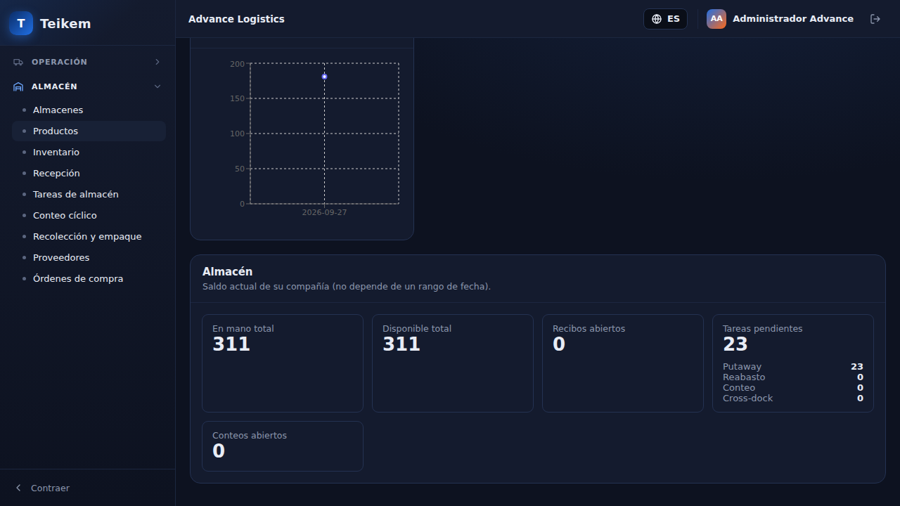

# F6 — Almacén e inventario (mínimo) + consulta de órdenes

Capítulo del manual de pantallas para el módulo de almacén (manual funcional 06) y para la consulta de solo lectura de
órdenes de transporte que lo acompaña. Todas las pantallas viven bajo el grupo **Almacén** del menú lateral, salvo
"Órdenes" que está en **Operación** y el panel "Almacén" de Pulso, que se ve en la pantalla de inicio. Direcciones tal
como aparecen en el navegador; capturas en `img/f6-*.png`.

## Panel "Almacén" en Pulso del día

**Para qué sirve.** Da un vistazo del estado actual del almacén (no de un período: es "ahora mismo") desde la misma
pantalla de inicio donde ya se ven los indicadores y gráficos del Lote F1.

**Cómo se llega.** Aparece automáticamente debajo de los indicadores y gráficos de Pulso (`/`), sin pedir nada aparte.

**Qué se ve.**

Cinco tarjetas: **En mano total**, **Disponible total**, **Recibos abiertos**, **Tareas pendientes** (con el
desglose por tipo: Putaway, Reabasto, Conteo, Cruce de muelle) y **Conteos abiertos**. El texto "Saldo actual de su
compañía (no depende de un rango de fecha)." aclara que estas tarjetas no tienen el botón "Rango" de las demás.

**Permiso.** Se pinta solo si tiene `inventory.view` **y** el módulo **Almacén y lote/serie** (`WMS_LOTSERIAL`)
encendido; sin alguno de los dos, Pulso se ve igual que en F1 (sin este panel, sin pedir nada al servidor).

**Mensajes que puede ver.** Mientras carga cada tarjeta, muestra "…"; si una consulta falla (por ejemplo, un 403),
muestra "—" en esa tarjeta en vez de sacarlo de la pantalla de inicio.

## Almacenes: zonas, posiciones y muelles

**Para qué sirve.** Administra los almacenes de la compañía y, dentro de cada uno, sus zonas, posiciones (bins) y
muelles.

**Cómo se llega.** Menú **Almacén › Almacenes**, dirección `/warehouse/warehouses`; la ficha en
`/warehouse/warehouses/:publicId`.

**Qué se ve (lista).**

Columnas: código, nombre, ciudad, zonas, posiciones, muelles, en mano y estatus. Filtro "Mostrar" (todos/solo activos/
incluir inactivos) y buscador libre sobre código/nombre/ciudad.

**Qué hace cada botón (lista).**
- **Nuevo almacén**: abre un formulario con código (obligatorio, solo letras/números/guion/guion bajo, máximo 30),
  nombre (obligatorio), dirección, ciudad y país.

**Qué se ve (ficha, pestaña Posiciones de ejemplo).**

Encabezado con código y nombre, el estatus (Activo/Inactivo) como una barra de pasos con el botón **Avanzar a
Inactivo**, y cuatro pestañas: **Datos**, **Zonas**, **Posiciones**, **Muelles**.

- **Datos**: dirección, ciudad, estado/provincia, código postal y país; el código no se puede cambiar (nota debajo del
  campo).
- **Zonas**: código, nombre, tipo, cuántas posiciones tiene y si está activa; **Nueva zona**, **Editar**, **Dar de
  baja**/**Reactivar** por fila.

  
- **Posiciones**: código, zona, pasillo/rack/nivel/posición, peso máximo, en mano, productos y estatus; filtros por
  zona, buscador, "Incluir inactivas" y "Solo con existencias"; **Nueva posición**, **Editar**,
  **Dar de baja**/**Reactivar**.
- **Muelles**: código, tipo (Inbound/Outbound/Both), estatus y activo; **Nuevo muelle**, **Editar**,
  **Cambiar estatus** (abre el mismo control de pipeline: Libre ↔ Ocupado ↔ Mantenimiento), **Dar de baja**/
  **Reactivar**.

**Permiso.** `inventory.view` (ver el almacén y sus tres pestañas de detalle); **`warehouse.manage`** para crear/
editar/dar de baja/reactivar el almacén, sus zonas, posiciones y muelles, y para el estatus manual del muelle. Módulo
**Almacén y lote/serie** (`WMS_LOTSERIAL`).

**Estatus y transiciones.**

| Entidad | De → a | Quién | Qué valida / dispara | Bloquea |
|---|---|---|---|---|
| Almacén | Activo → Inactivo (terminal) | `warehouse.manage` | — | 409 "El almacén {code} tiene inventario o documentos abiertos; no se puede dar de baja." |
| Zona | Activa → Inactiva | `warehouse.manage` (Dar de baja/Reactivar) | — | 409 si tiene posiciones activas |
| Posición | Activa → Inactiva | `warehouse.manage` | — | 409 con inventario o tareas abiertas |
| Muelle (estatus operativo) | Libre ↔ Ocupado ↔ Mantenimiento (laterales) | `warehouse.manage` | — | — |
| Muelle (activo) | Activo → Inactivo | `warehouse.manage` | — | 409 con citas vigentes |

**Validaciones y mensajes.**

| Campo | Regla | Mensaje |
|---|---|---|
| Código (almacén) | obligatorio | "El código es obligatorio." |
| Código (almacén) | solo letras/números/guion/guion bajo, máx. 30 | "El código solo admite letras, números, guion y guion bajo (máximo 30)." |
| Nombre (almacén) | obligatorio | "El nombre es obligatorio." |
| Código o pasillo/rack/nivel/posición | uno de los dos | "Indique el código de la posición o su pasillo/rack/nivel/posición." |
| Peso máximo (posición) | > 0 | "El peso máximo debe ser mayor que cero." |
| Peso máximo (posición) | ≤ 3 decimales | "El peso máximo admite hasta 3 decimales." |
| Código (zona/muelle) | obligatorio | "El código es obligatorio." |

## Productos y categorías

**Para qué sirve.** Es el maestro de artículos (SKU): costo, precio, mínimos, categoría, quién es el dueño (propio o
de un cliente) y cómo se rastrea (sin seguimiento, por lote o por serie).

**Cómo se llega.** Menú **Almacén › Productos**, dirección `/warehouse/products` (con la subpestaña **Categorías**
en la misma pantalla); ficha en `/warehouse/products/:publicId`.

**Qué se ve (lista).**

Columnas: SKU, nombre, categoría, dueño ("Propio" o el nombre del cliente), seguimiento, en mano, disponible (con un
chip "Bajo mínimo" si aplica) y estatus. Filtros: categoría, dueño (buscador de cliente), almacén, "Solo propios",
"Solo activos", "Con disponible", y buscador libre.

**Qué hace cada botón.**
- **Nuevo producto**: SKU, nombre, código de barras, tipo de seguimiento, costo, precio, peso, volumen, mínimo de
  inventario y dueño; si su compañía tiene campos personalizados para productos, aparecen al final del formulario.

**Qué se ve (ficha).**

Tres pestañas: **Datos** (todos los campos de arriba más mínimo/máximo de picking, almacén y posición preferidos),
**Lotes** (número de lote, vencimiento, activo) y **Series** (número de serie, estatus, posición). El SKU no se puede
cambiar (nota debajo del campo); **Dar de baja**/**Reactivar** en la cabecera.

**Subpestaña Categorías** (en la misma pantalla de Productos, pestaña "Categorías"):

Árbol simple con indentación por nivel (hasta 5); cada fila muestra cuántos productos tiene y **Editar**/
**Dar de baja**/**Reactivar**; **Nueva categoría** elige el nombre y la categoría superior (o "raíz").

**Permiso.** `inventory.view` (lista, ficha, lotes, series, categorías); **`inventory.manage`** para crear/editar/
dar de baja/reactivar producto y categoría. Módulo `WMS_LOTSERIAL`.

**Validaciones y mensajes (producto).**

| Campo | Regla | Mensaje |
|---|---|---|
| SKU | obligatorio | "El SKU es obligatorio." |
| SKU | máx. 60 caracteres | "El SKU no puede exceder 60 caracteres." |
| SKU | sin espacios ni caracteres de control | "El SKU no admite espacios ni caracteres de control." |
| Nombre | obligatorio | "El nombre del producto es obligatorio." |
| Nombre | máx. 200 caracteres | "El nombre no puede exceder 200 caracteres." |
| Código de barras | máx. 60 caracteres | "El código de barras no puede exceder 60 caracteres." |
| Seguimiento | obligatorio | "Seleccione el tipo de seguimiento." |
| Costo / Precio | no negativos | "El costo y el precio no pueden ser negativos." |
| Costo | ≤ 4 decimales | "El costo admite como máximo 4 decimales." |
| Precio | ≤ 4 decimales | "El precio admite como máximo 4 decimales." |
| Costo o precio | tope | "El costo o el precio excede el máximo permitido." |
| Mínimos | no negativos | "Los mínimos no pueden ser negativos." |
| Máximo de picking | ≥ mínimo | "El máximo de la posición de picking debe ser mayor o igual al mínimo." |
| Mínimo de picking | exige posición preferida en zona PICKING | "El mínimo de picking requiere una posición preferida en una zona PICKING." |
| Peso / volumen | no negativos | "El peso y el volumen no pueden ser negativos." |
| Peso | ≤ 3 decimales, < 1,000,000,000 | "El peso admite como máximo 3 decimales y debe ser menor que 1,000,000,000." |
| Volumen | ≤ 4 decimales, < 100,000,000 | "El volumen admite como máximo 4 decimales y debe ser menor que 100,000,000." |

Al editar: cambiar seguimiento, unidad base o dueño de un producto con movimientos: **"No se puede cambiar: el
producto ya tiene movimientos."** (409). Dar de baja bloqueado con inventario en mano o documentos abiertos (409).

**Validaciones y mensajes (categoría).** "El nombre de la categoría es obligatorio."; "El nombre de la categoría no
puede exceder 150 caracteres."; más de 5 niveles o nombre repetido en el mismo nivel: rechazado por el servidor (409);
baja bloqueada con productos o subcategorías activas (409).

## Inventario: saldos, Kárdex, ajustes, transferencias, genealogía, rastro de serie y conciliación

**Para qué sirve.** Consulta el inventario disponible en cada posición, su historial de movimientos (Kárdex), permite
corregirlo (ajuste, transferencia) y compara el Kárdex contra los saldos (conciliación). No tiene estatus propio: es
un libro de movimientos, no una entidad con ciclo de vida.

**Cómo se llega.** Menú **Almacén › Inventario**, dirección `/warehouse/inventory`, con pestañas **Saldos**,
**Kárdex** y **Conciliación**.

**Qué se ve (Saldos).**

Columnas: almacén, posición, zona, SKU, producto, lote, vencimiento, en mano, reservado, disponible, valor costo,
valor venta y actualizado. Filtros: almacén, producto (buscador), categoría, lote, "Incluir en cero", "Solo con
disponible" y buscador libre. Cada fila puede abrir **Genealogía** (si tiene lote) o **Rastro de serie**.

**Qué hace cada botón.**
- **Ajustar** (cabecera): producto, almacén, posición, cantidad (puede ser negativa), motivo, notas, y lote/series si
  el producto los usa.
- **Transferir** (cabecera): producto, posición de origen y destino (con sus almacenes si es entre almacenes distintos)
  y cantidad.

**Qué se ve (Kárdex).**

Columnas: fecha, tipo, SKU, producto, almacén, posición, cantidad (con signo) y referencia/motivo. Filtros: rango de
fecha, tipo de movimiento, almacén, producto, lote, serie y buscador libre. Cada fila puede abrir **Rastro de serie**.

**Qué se ve (Conciliación).**

Un producto opcional (buscador) y el botón **Ejecutar**: muestra cuándo se ejecutó, cuántos saldos se revisaron y una
tabla de diferencias (Kárdex vs. saldo); sin diferencias, "El inventario concilia".

**Permiso.** `inventory.view` (saldos, Kárdex, genealogía, rastro de serie, conciliación de solo lectura);
**`inventory.adjust`** para ajustar, transferir y ejecutar la conciliación. Módulo `WMS_LOTSERIAL`.

**Validaciones y mensajes.**

| Campo | Regla | Mensaje |
|---|---|---|
| Producto/Almacén/Posición (ajuste) | obligatorios | "Seleccione un producto." / "Seleccione un almacén." / "Seleccione una posición." |
| Motivo (ajuste) | obligatorio | "Seleccione un motivo." |
| Cantidad (ajuste) | ≠ 0 | "La cantidad del ajuste no puede ser cero." |
| Cantidad (ajuste/transferencia) | ≤ 3 decimales | "La cantidad admite como máximo 3 decimales." |
| Lote (ajuste, producto por lote) | obligatorio | "Indique el número de lote." |
| Series (ajuste, producto por serie) | al menos una | "Indique al menos un número de serie." |
| Posiciones (transferencia) | origen ≠ destino | "El origen y el destino no pueden ser la misma posición." |
| Cantidad (transferencia) | > 0 | "La cantidad debe ser mayor que cero." |
| Ambos (falta de existencia) | — | 409 "Inventario insuficiente de {sku} en {bin}: disponible {x}, solicitado {y}." |
| Rango del Kárdex | desde ≤ hasta | "La fecha 'desde' no puede ser posterior a la fecha 'hasta'." |

## Recepción: recibos y avisos de llegada

**Para qué sirve.** Registra la mercancía que entra al almacén: recibos ciegos (sin documento previo), de devolución,
contra un aviso de llegada (ASN) de un cliente, o contra una orden de compra propia.

**Cómo se llega.** Menú **Almacén › Recepción**, dirección `/warehouse/receipts` (pestañas **Recibos** y **Avisos de
llegada**); ficha del recibo en `/warehouse/receipts/:publicId`.

**Qué se ve (lista de recibos).**

Columnas: número, tipo, almacén, estatus, origen, creado y diferencia (si hay). Filtros: almacén, estatus, tipo, rango
de creación, producto y "Con/sin diferencia".

**Qué hace cada botón.**
- **Nuevo recibo**: elige "Recibir" (Ciego, Devolución, contra Aviso de llegada o contra Orden de compra —esta última
  solo si además tiene `purchasing.receive` y el módulo Compras encendido—), el almacén, la posición de recepción
  (vacío usa la primera posición de una zona STAGING) y las líneas (producto y cantidad recibida).

**Qué se ve (ficha).**

Barra de estatus (Abierta — Recibida, con "Cierre: En putaway"), resumen (esperado/recibido/diferencia/muelle),
líneas con lo esperado vs. lo recibido (y **Capturar**/**Quitar línea** mientras está Abierta), y "Tareas de acomodo"
con acceso directo a Tareas de almacén.

**Qué hace cada botón (ficha).**
- **Agregar línea** / **Capturar** / **Quitar línea**: solo con el recibo Abierta.
- **Confirmar recibo**: asienta el inventario y crea las tareas de acomodo; ya no se puede modificar después.
- **Eliminar**: solo Abierta y sin cruce de muelle asignado.

**Permiso.** `inventory.view` (lista y ficha de solo lectura); **`warehouse.receive`** para capturar líneas, agregar/
quitar, confirmar, eliminar y administrar avisos de llegada (recibir contra orden de compra exige además
`purchasing.receive` + módulo Compras). Módulo `WMS_LOTSERIAL`.

**Estatus y transiciones.** El estatus no lo cambia un botón de pipeline: **Abierta → Recibida** al **Confirmar**;
**→ En putaway (terminal)** lo dispara el sistema cuando se termina la última tarea de acomodo. El texto bajo el
pipeline lo aclara: "El estatus lo cambia el sistema: RECEIVED al confirmar y PUTAWAY cuando se termina la última
tarea de acomodo."

**Validaciones y mensajes.**

| Campo | Regla | Mensaje |
|---|---|---|
| Almacén | obligatorio | "Elija el almacén." |
| Aviso de llegada / Orden de compra | obligatorio según lo elegido en "Recibir" | "Elija el aviso de llegada." / "Elija la orden de compra." |
| Producto (línea) | obligatorio | "Indique el producto." |
| Líneas | al menos una | "Indique al menos una línea." |
| Líneas | máx. 200 | "El recibo admite como máximo 200 líneas." |
| Cantidad recibida | obligatoria, no negativa | "Indique la cantidad recibida." / "La cantidad recibida no puede ser negativa." |
| Lote (producto por lote) | obligatorio | "El producto {sku} se controla por lote: indique el lote." |
| Series (producto por serie) | tantas como la cantidad, sin repetir | "El producto {sku} se controla por serie: capture {qty} número(s) de serie (hay {n})." / "El número de serie '{serial}' está repetido." |

## Tareas de almacén

**Para qué sirve.** Una cola única con todo el trabajo físico del almacén: acomodo (putaway) tras un recibo, reabasto
de posiciones de picking, conteo cíclico y cruce de muelle.

**Cómo se llega.** Menú **Almacén › Tareas de almacén**, dirección `/warehouse/tasks`.

**Qué se ve.**

Columnas: tipo, estatus, prioridad, almacén, producto, cantidad, posiciones (de → a), referencia, asignado a y
creada. Filtros: almacén, tipo, estatus, "Asignadas a mí" e "Incluir cerradas".

**Qué hace cada botón.**
- **Correr reabasto** (cabecera): elige el almacén y crea automáticamente las tareas de reabasto que hagan falta.
- **Asignar** (por fila): elige el usuario (o "Sin asignar").
- **Iniciar**: pasa la tarea a en curso.
- **Completar**: pide la posición destino (vacío usa la sugerida), cantidad (vacío completa el total; el remanente
  queda como tarea nueva) y series si aplica.

- **Cancelar**: solo para tareas de Putaway o Reabasto.

**Permiso.** `inventory.view` (ver la cola); **`warehouse.manage`** (asignar, cancelar); **Iniciar**/**Completar**
exige el permiso del tipo de tarea: `warehouse.receive` (Putaway), `warehouse.pick` (Reabasto, y el botón "Correr
reabasto"), `warehouse.count` (Conteo) o `warehouse.crossdock` (Cruce de muelle) —estas dos últimas normalmente se
completan desde Conteo cíclico o desde el plan de cruce de muelle, no desde esta cola—. Módulo `WMS_LOTSERIAL`.

**Estatus y transiciones.** Pendiente → En curso (**Iniciar**) → Terminada (**Completar**); Cancelada es lateral
desde Pendiente/En curso, solo para Putaway y Reabasto.

**Mensajes que puede ver.**

| Mensaje | Cuándo aparece |
|---|---|
| "Su usuario no puede consultar el listado de usuarios." | Al abrir **Asignar** sin permiso para ver usuarios |
| "Vacío usa la posición sugerida." / "Vacío completa la cantidad total de la tarea; el remanente queda como tarea nueva." | Ayuda del formulario de **Completar** |
| "No hay una posición sugerida para esta tarea." | La tarea (normalmente no Putaway) no trae una sugerencia del servidor |
| "Se crearon {count} tareas de reabasto." | Al terminar **Correr reabasto** |

## Conteo cíclico

**Para qué sirve.** Toma una "foto" del saldo en mano de un almacén (o de sus zonas/posiciones), permite capturar lo
contado y reconciliar el ajuste contra el saldo actual.

**Cómo se llega.** Menú **Almacén › Conteo cíclico**, dirección `/warehouse/cycle-counts`; ficha en
`/warehouse/cycle-counts/:id`.

**Qué se ve (lista).** Columnas: número, almacén, estatus, contadas (progreso), diferencia neta y creado.

**Qué hace cada botón.**
- **Nuevo conteo**: almacén y, opcionalmente, zonas o posiciones (sin filtros toma todo el saldo en mano del almacén,
  máximo 1000 líneas).

**Qué se ve (ficha).** Barra de estatus (Abierto — Contado — Reconciliado), resumen (progreso, líneas con diferencia,
diferencia neta), y la tabla de líneas con **Capturar** (cantidad contada o series, según el seguimiento del
producto).

**Qué hace cada botón (ficha).**
- **Agregar línea**: agrega una posición/producto a mano.
- **Refrescar foto**: solo aparece si hay líneas con "Foto vieja" (el saldo cambió desde que se tomó la foto); las
  vuelve a fotografiar y borra su captura.
- **Terminar conteo**: pasa de Abierto a Contado; exige que todas las líneas estén capturadas.
- **Reconciliar**: pasa de Contado a Reconciliado; asienta los ajustes contra el saldo actual.
- **Eliminar**: solo con el conteo Abierto (cancela también su tarea de conteo).

**Permiso.** `inventory.view` (solo listar); **`warehouse.count`** para todo lo demás: ver la ficha, capturar,
refrescar, terminar, reconciliar y eliminar. Módulo `WMS_LOTSERIAL`.

**Estatus y transiciones.** Abierto → Contado (**Terminar conteo**) → Reconciliado (**Reconciliar**, terminal); sin
transición manual de pipeline (los dos pasos son botones propios, no la barra de pipeline).

**Validaciones y mensajes.**

| Mensaje | Cuándo aparece |
|---|---|
| "El conteo admite como máximo 1000 líneas; acote los filtros." | Al crear un conteo sin zonas/posiciones sobre un almacén muy grande |
| "Indique la posición." / "Indique la cantidad contada." | Al agregar/capturar una línea |
| "Indique el lote por su id o por su número, no ambos." | Ambigüedad de lote al agregar una línea manual |
| "Faltan {n} línea(s) por contar." | Al **Terminar conteo** con líneas sin capturar |
| 409 (lo contado es menor que lo reservado) | Al **Reconciliar** |

## Recolección y empaque

**Para qué sirve.** Recolecta inventario (por FEFO automático o eligiendo posición/lote/serie) y lo empaca como una
orden de transporte nueva, sin pasar por la captura completa de una orden.

**Cómo se llega.** Menú **Almacén › Recolección y empaque**, dirección `/warehouse/pick-batches`; ficha en
`/warehouse/pick-batches/:publicId`.

**Qué se ve (lista).**

Columnas: número, almacén, estatus, orden y factura, dueño, cantidad y recolectada. Filtros: rango de recolección,
estatus, producto, número de orden, factura e "Incluir eliminadas".

**Qué hace cada botón.**
- **Recolectar**: almacén y líneas (producto, cantidad, y opcionalmente posición/lote/series; vacío usa FEFO
  automático). Una recolección solo admite productos de un mismo dueño.

  

**Qué se ve (ficha).** Barra de estatus (Recolectada — Empacada, con cierre "Eliminada"), resumen (recolectada,
empacada, orden, factura, cantidad, costo total) y líneas (producto, cantidad, posición, lote/serie, costo unitario,
reversa).

**Qué hace cada botón (ficha).**
- **Empacar**: cliente de la orden (debe ser el dueño del inventario recolectado), tipo de servicio, consignatario
  (del directorio o uno nuevo), número de orden/factura (vacío: automático) y paquetes.

- **Eliminar**: si ya está Empacada, exige además `orders.cancel` (borra también la orden que creó); bloqueado si la
  orden ya avanzó.

**Permiso.** `inventory.view` (listar y ver la ficha); **`warehouse.pick`** para recolectar y eliminar; **Empacar**
exige además `orders.create`. Módulo `WMS_LOTSERIAL`.

**Estatus y transiciones.** Recolectada (inicial) → Empacada (**Empacar**) → Cancelada (lateral, **Eliminar**); sin
transición manual de pipeline.

**Validaciones y mensajes.**

| Campo | Regla | Mensaje |
|---|---|---|
| Líneas | al menos una | "Indique al menos una línea a recolectar." |
| Líneas | máx. 100 | "La recolección admite como máximo 100 líneas." |
| Dueño | un solo dueño por recolección | "Una recolección solo puede tener productos de un mismo dueño." |
| Cantidad (línea) | > 0 | "La cantidad debe ser mayor que cero." |
| Series (producto por serie) | tantas como la cantidad | "El producto {sku} tiene serie: escanee las series a recolectar." / "En productos con serie la cantidad debe ser igual al número de series escaneadas." |
| Cliente (empacar) | obligatorio | "Indique el cliente de la orden." |
| Consignatario (empacar) | obligatorio (directorio o nuevo) | "El consignatario es obligatorio: elija uno del directorio o capture uno nuevo." |
| Nombre / Dirección / Ciudad (consignatario nuevo) | obligatorios | "El nombre del consignatario es obligatorio." / "La dirección (línea 1) del consignatario es obligatoria." / "La ciudad del consignatario es obligatoria." |
| País (consignatario nuevo) | código ISO de 2 letras | "Use el código ISO de 2 letras del país." |
| Paquetes | al menos uno | "Indique al menos una línea de paquete." |
| Piezas (paquete) | ≥ 1 | "La cantidad de piezas debe ser al menos 1." |

## Proveedores

**Para qué sirve.** Directorio de proveedores para las órdenes de compra: contacto, término de pago y estatus.

**Cómo se llega.** Menú **Almacén › Proveedores**, dirección `/warehouse/suppliers`.

**Qué se ve.**

Columnas: nombre, contacto, correo y estatus. Filtro "Mostrar" (solo activos/incluir inactivos).

**Qué hace cada botón.** **Nuevo proveedor** (nombre, contacto, teléfono, correo, término de pago, notas), **Editar**,
**Dar de baja**/**Reactivar**.

**Permiso.** `purchasing.view` (ver la lista); **`purchasing.manage`** para crear/editar/dar de baja/reactivar. Módulo
**Compras** (`PURCHASING`).

**Validaciones y mensajes.**

| Campo | Regla | Mensaje |
|---|---|---|
| Nombre | obligatorio y único entre proveedores activos | "El nombre del proveedor es obligatorio." / "Ya existe un proveedor activo con ese nombre." |
| Correo electrónico | formato válido | "El correo electrónico no es válido." |

## Órdenes de compra

**Para qué sirve.** Ordena mercancía propia a un proveedor, hace seguimiento a lo recibido contra lo pedido y
resuelve lo que quedó faltante.

**Cómo se llega.** Menú **Almacén › Órdenes de compra**, dirección `/warehouse/purchase-orders`; ficha en
`/warehouse/purchase-orders/:publicId` (pestañas **Líneas** y **Faltantes**).

**Qué se ve (lista).**

Columnas: número, proveedor, almacén, estatus, fecha esperada y fecha. Filtros: estatus, proveedor, almacén, rango de
fecha y buscador.

**Qué hace cada botón.**
- **Nueva orden de compra**: proveedor, almacén y líneas (producto —solo productos propios—, cantidad ordenada,
  costo unitario); nace en Borrador.

  

**Qué se ve (ficha).** Barra de estatus con botones **Avanzar a Enviada** y **Avanzar a Cancelada** (los únicos
manuales; Recibida parcial/Recibida los pone el sistema al confirmar un recibo); pestañas **Líneas** (editable solo
en Borrador; una línea con recepciones muestra la nota "Esta línea ya tiene recepciones: no se elimina, no baja de lo
recibido y su costo no cambia.") y **Faltantes** (líneas pendientes con **Resolver**).

**Qué hace cada botón (ficha).**
- **Eliminar** (cabecera, solo si el servidor permite `canDelete`: sin recepciones ni recibo abierto).
- **Agregar línea** / **Quitar línea**: solo en Borrador.
- **Resolver** (pestaña Faltantes): elige la acción —**Cerrar** (dar por perdido), **Reordenar** (exige además
  `purchasing.manage`) o **Ajuste manual** (exige además el módulo `WMS_LOTSERIAL`; entra a inventario con posición,
  lote/series si aplica).

**Permiso.** `purchasing.view` (listar, ver ficha y faltantes); **`purchasing.manage`** (crear/editar/enviar/cancelar/
eliminar la orden, y proveedores); **`inventory.adjust`** para resolver un faltante. Módulo `PURCHASING`.

**Estatus y transiciones.**

| De → a | Quién | Qué dispara |
|---|---|---|
| Borrador → Enviada | `purchasing.manage` (botón del pipeline) | — |
| Enviada/Borrador/Recibida parcial → Cancelada | `purchasing.manage` (botón del pipeline) | 409 "Una orden de compra recibida completa no se cancela." si ya está Recibida |
| Enviada → Recibida parcial → Recibida | el sistema | Al confirmar un recibo contra la orden |

**Validaciones y mensajes.**

| Campo | Regla | Mensaje |
|---|---|---|
| Proveedor | obligatorio | "Indique el proveedor." |
| Producto (línea) | obligatorio, solo propio | "Indique el producto." / "La orden de compra solo admite productos propios; {sku} pertenece a un cliente." |
| Cantidad ordenada | > 0, ≤ 3 decimales | "La cantidad ordenada debe ser mayor que cero." / "La cantidad admite como máximo 3 decimales." |
| Costo unitario | ≥ 0, ≤ 4 decimales | "El costo unitario no puede ser negativo." / "El costo unitario admite como máximo 4 decimales." |
| Producto (línea) | sin repetir | "Ese producto ya está en la orden de compra." |
| Líneas | al menos una, máx. 200 | "La orden de compra debe tener al menos una línea." / "La orden de compra admite como máximo 200 líneas." |
| Cantidad (resolver faltante) | > 0, ≤ pendiente | "La cantidad debe ser mayor que cero." / "La cantidad no puede exceder el faltante pendiente." |
| Posición (ajuste manual) | obligatoria | "Indique la posición donde entra la mercancía." |
| Lote/series (ajuste manual) | según seguimiento del producto | "El producto {sku} se controla por lote; indique el lote." / "El producto {sku} se controla por serie; capture los números de serie." |

Fuera de Borrador, editar la orden (sin la capacidad habilitada por el estatus del tenant) responde 422 "El estatus
actual no permite la acción 'EDIT_PURCHASE_ORDER'."

## Citas de muelle

**Para qué sirve.** Agenda del uso de los muelles del almacén, enlazada opcionalmente a un aviso de llegada o a un
viaje (demo de cruce de muelle).

**Cómo se llega.** Menú **Almacén › Citas de muelle**, dirección `/warehouse/dock-appointments`.

**Qué se ve.** Columnas: muelle, dirección (entrada/salida), inicio, fin, estatus y referencia. Filtros: almacén,
muelle, estatus y rango de fecha.

**Qué hace cada botón.**
- **Nueva cita**: almacén, muelle, dirección, inicio/fin programados y, opcionalmente, a qué se enlaza (ninguno,
  aviso de llegada o viaje).
- **Reprogramar** (por fila): cambia inicio/fin.
- **Cambiar estatus** (por fila): abre el control de pipeline (Programada → Llegó → Completada; No presentado/
  Cancelada laterales).

**Permiso.** `inventory.view` (ver la agenda); **`warehouse.crossdock`** para agendar, reprogramar y cambiar estatus.
Módulo **Cruce de muelle** (`CROSSDOCK`, apagado por defecto).

**Validaciones y mensajes.**

| Campo | Regla | Mensaje |
|---|---|---|
| Muelle | obligatorio | "Indique el muelle." |
| Inicio programado | obligatorio | "Indique el inicio programado." |
| Dirección | obligatoria | "Indique la dirección de la cita (entrada o salida)." |
| Enlace a aviso de llegada | debe ser de entrada | "Una cita de un aviso de llegada debe ser de entrada (INBOUND)." |
| Enlace | a lo sumo uno | "Una cita se enlaza a un aviso de llegada o a un viaje, no a ambos." |

## Cruce de muelle: planes

**Para qué sirve.** Asigna líneas de un recibo directamente a órdenes de salida, sin pasar por una posición de
reserva (demo del flujo de cruce de muelle).

**Cómo se llega.** Menú **Almacén › Cruce de muelle**, dirección `/warehouse/cross-dock-plans`; ficha en
`/warehouse/cross-dock-plans/:id`.

**Qué se ve (lista).** Columnas: plan, almacén, estatus, asignaciones, cantidad asignada/movida/faltante y creado.
Filtros: almacén y estatus.

**Qué hace cada botón.**
- **Nuevo plan**: almacén y, opcionalmente, la zona de tránsito (STAGING).

**Qué se ve (ficha).** Barra de estatus de solo lectura (Abierto → Asignado → Completado: lo mueve el sistema según
las asignaciones), tabla de "Líneas disponibles" (candidatas a asignar) y tabla de "Asignaciones" con su propio
estatus (Planeada → Movida/Cancelada).

**Qué hace cada botón (ficha).**
- **Completar plan** (cabecera, mientras no esté Completado): si quedan asignaciones sin mover, el servidor la
  rechaza.
- **Asignar a una orden** (por línea candidata, si tiene disponible): busca la orden por número exacto, factura o
  lote de empaque, y la cantidad.
- **Mover** (por asignación Planeada): registra el movimiento físico, con comentario opcional.
- **Cancelar asignación** (por asignación Planeada).

**Permiso.** `inventory.view` (ver planes y candidatos); **`warehouse.crossdock`** para crear el plan, asignar,
cancelar, mover y completar. Módulo `CROSSDOCK`.

**Validaciones y mensajes.**

| Mensaje | Cuándo aparece |
|---|---|
| "Elija una orden." | Al asignar sin elegir la orden destino |
| "Sin coincidencias exactas." | La búsqueda de orden (número/factura/lote de empaque) no encontró nada exacto |
| "Para buscar órdenes necesita el permiso orders.view y el módulo LTL_GROUND." | Sin ese permiso/módulo, al intentar buscar una orden para asignar |
| "Si quedan asignaciones pendientes de mover, el servidor rechazará la acción." | Ayuda antes de confirmar **Completar plan** |

## Consulta de órdenes (solo lectura)

**Para qué sirve.** Da contexto de almacén sobre las órdenes de transporte (por ejemplo, la que creó "Empacar" en
Recolección y empaque), sin dar de alta ni editar nada: es una consulta.

**Cómo se llega.** Menú **Operación › Órdenes**, dirección `/orders`; ficha en `/orders/:publicId`.

**Qué se ve (lista).**

Columnas: orden, cliente, consignatario, servicio, estatus, piezas, COD y creada. Filtros: cliente, estatus y rango
de fecha. Sin botón "Nuevo" ni acciones por fila.

**Qué se ve (ficha).**

Paneles apilados (no pestañas): **Datos generales** (factura, lote de empaque, prioridad, cotizado, COD, piezas),
**Recogida**/**Entrega** (nombre, dirección, ventana de horario, estatus de la parada), **Bultos** (número, tipo,
descripción, piezas, peso, volumen) e **Historial de estatus** de solo lectura. Sin `StatusPipeline` interactivo: no
se puede cambiar el estatus desde aquí.

**Permiso.** `orders.view`. Módulo **Transporte terrestre** (`LTL_GROUND`).

**Mensajes que puede ver.** "La orden no existe o no pertenece a su compañía." si el enlace es incorrecto o la orden
es de otra compañía.

## Preguntas frecuentes de este capítulo

**¿Por qué "Órdenes de compra" no me deja editar las líneas si ya está Enviada?** Solo se edita en Borrador; una vez
enviada, cambiar cantidades o costos podría desajustar lo que el proveedor ya está preparando. Si necesita corregirla,
pida a un administrador que revierta el estatus o cancele la orden y cree una nueva.

**¿Por qué no puedo elegir un producto de un cliente en la orden de compra?** Las órdenes de compra son para reponer
inventario propio; el selector de producto ya viene filtrado a solo propios para que no llegue a intentarlo (el
servidor lo rechazaría de todos modos con "La orden de compra solo admite productos propios...").

**¿Por qué el recibo no tiene un botón para pasarlo de "Recibida" a "En putaway" a mano?** Porque ese paso lo decide el
sistema: pasa solo cuando se completa la última tarea de acomodo que generó el recibo. Vaya a "Tareas de almacén"
para completarlas.

**¿Por qué "Cruce de muelle" no aparece en mi menú?** El módulo `CROSSDOCK` viene apagado por defecto; pida a un
administrador que lo encienda en Configuración si su compañía lo necesita.

**¿Qué significa el chip "Bajo mínimo" en Productos?** Que el disponible de ese producto está por debajo del "Mínimo
de inventario" configurado en su ficha; no bloquea nada, es solo una señal para reabastecer.
