# F6 — Almacén e inventario (mínimo) + consulta de órdenes

Capítulo del manual de pantallas para el módulo de almacén (manual funcional 06) y para la consulta de solo lectura de
órdenes de transporte que lo acompaña. Todas las pantallas viven bajo el grupo **Almacén** del menú lateral, salvo
"Órdenes" que está en **Operación** y el panel "Almacén" de Pulso, que se ve en la pantalla de inicio. Direcciones tal
como aparecen en el navegador; capturas en `img/f6-*.png`. Las secciones **Almacenes** y **Posiciones** (antes
«Ubicaciones») y el pie común de las tablas se reescribieron en el Lote 11: sus capturas están pendientes (se marcan en el
texto) y las imágenes antiguas de la lista, las zonas y las posiciones del almacén se retiraron por no corresponder a la
pantalla actual. En el Lote 12 se reescribieron **Productos e inventario**, **Proveedores** y **Órdenes de compra**
(Compras) y se agregó el botón **Asignar cupo** a Posiciones. Las capturas de Productos, Proveedores y Órdenes de compra son
las que regeneró el recorrido `f6.spec.ts` con la pantalla nueva (datos de prueba de ese recorrido); siguen pendientes las de
Posiciones con **Asignar cupo**, el bloque **Añadir ajuste** y los PDF (se marcan en el texto).
En el Lote 13 se reescribieron **Recepción** (el menú la llama **Recibo**: maestro-detalle con las pestañas Recibos, Avisos de
llegada y Acomodo pendiente), **Tareas de almacén** (ya no hay una cola única: cada tipo vive en su pantalla) y **Recolección y
empaque** (dos paneles con barra arrastrable); sus capturas son las que regeneró el recorrido `f6.spec.ts`. Siguen pendientes las de
la pestaña Avisos de llegada y el modal Nuevo aviso (se marcan en el texto). El Lote 13 también ajustó, por decisión del dueño del
producto del 2026-09-30, la ficha de la **orden de compra** (proveedor y almacén editables en Borrador), la nota obligatoria de todo
ajuste manual, el indicador **Unidades totales** y los predeterminados de la compañía al **Empacar**.
En el Lote 14 se agregó **Transferencias y ajustes** (Subir/Bajar, con el Reporte de ajustes), se reescribió **Kárdex de movimientos** (antes
«Inventario»: filtros compartidos por Kárdex, Saldos y Conciliación, resumen, detalle del movimiento y descuadres con su conciliación
automática) y **Conteo cíclico** (dos paneles, «Conteo de lo cambiado» y confirmar en un solo paso). **Ajustes de inventario** salió del menú
(sus faltantes de compra se resuelven en la ficha de la orden de compra). Sus capturas son las `l14-*.png` que genera el recorrido
`lote14.spec.ts`; las `f6-inventario-*` se regeneraron. «Necesita tu atención» en el Pulso está en el capítulo
[F7A](f7a-pulso-almacen-y-actividad.md#pulso-del-día-panel-necesita-tu-atención).
En el Lote 16 se agregó el **modo de recepción** del almacén (ficha → Datos → Recepción y columna en la lista), el **recibo directo a posición** (columna
Posición destino, posiciones sugeridas, aviso de cupo), el aviso de **Acomodo pendiente** en almacenes directos, el **selector de Posición de Recolección** (solo donde hay
existencia) y, en "Todas las tablas", el **encabezado y los filtros de las exportaciones**, las **fechas como fecha** y el **formato de los números** (coma de miles). Sus capturas son las
`l16-*.png` (las genera el recorrido `lote16.spec.ts`).

## Todas las tablas: pie, filas por página y Exportar (Lote 11)

Aplica a todas las tablas de la aplicación que usan el componente estándar, no solo a Almacén.

> **Captura pendiente:** pie de tabla con el rango, "Filas por página" y el menú Exportar abierto.

**El pie de la tabla.** Mientras la tabla tenga filas, debajo de ella aparece siempre una barra con:
- El rango y el total: `1–25 de 552`.
- **Filas por página**: 10, 25, 50 o 100 (si la pantalla arrancó con otro tamaño, ese tamaño también aparece en la lista).
  Por defecto son 25. En las listas que vienen paginadas del servidor (Órdenes, Inventario —Saldos y Kárdex—,
  Recolección y empaque, Órdenes de compra, Recibos, las colas de tareas, Productos, la pestaña Posiciones de la ficha del
  almacén y Posiciones) cambiar el tamaño vuelve a pedir los datos y regresa a la página 1. En las demás la lista ya
  está cargada y el cambio es inmediato.
- El botón **Exportar**.
- Los botones **‹** y **›** con `Página X de Y` (solo si hay más de una página).

Si la tabla no tiene filas se ve el mensaje de vacío (por defecto "Sin resultados") y no hay pie. Algunas tablas de apoyo no paginan y muestran todas sus
filas (las líneas con campos para capturar, y el panel "Actividad reciente", que tiene su propio "Ver más").

**Ordenar.** Un clic en el encabezado ordena por esa columna. En una lista paginada por el servidor ordena **solo las
filas de la página que está viendo**, no todo el resultado.

**Exportar.** El menú ofrece **Excel (.xlsx)**, **CSV (.csv)** y **PDF (.pdf)** y muestra cuántas filas saldrán
(`Filas: 552`). El archivo se genera en su navegador y se descarga solo; no se envía nada a otro lado.

| Pregunta | Respuesta |
|---|---|
| ¿Qué filas salen? | En una tabla ya cargada, **todas** las filas con los filtros activos, en el orden que ve (no solo la página). En una lista paginada por el servidor, **todas las filas de la consulta actual**, con los mismos filtros: la pantalla lee el resultado completo de a 200 filas; si ordenó por una columna, el archivo sale en ese orden. |
| ¿Hay un tope? | Sí: 10.000 filas. Si la consulta tiene más, el archivo lleva las primeras 10.000 y aparece el aviso "Se exportaron las primeras {count} filas (límite de exportación). Afine los filtros para exportar el resto." |
| ¿Qué columnas salen? | Las que ve, con el mismo texto que muestra la pantalla (la columna de acciones y las casillas de selección no). Un "—" sale como celda vacía. Los números salen como número en Excel (se pueden sumar). Sí/No para los valores verdadero/falso. |
| ¿Cómo se llama el archivo? | Como la tabla o, si no tiene nombre, el título de su panel, en minúsculas y sin acentos, más la fecha de hoy: `almacenes-2026-09-29.xlsx`. |
| CSV | Separado por comas, codificación UTF-8 con marca de orden de bytes (Excel lo abre bien con tildes y eñes). Un texto que empieza por `=`, `+`, `-` o `@` sale con un apóstrofo delante para que Excel no lo tome por fórmula. |
| PDF | Hoja A4, vertical (horizontal si la tabla tiene más de 5 columnas), con la compañía, el título, «Generado el …» y la línea de filtros arriba (ver "Exportar: compañía, filtros, fechas y números") y el número de página abajo. Solo admite caracteres latinos: tildes y eñes salen bien; otros símbolos salen como `?`. La lista de Recibos, que exporta cada recibo con sus líneas, sale en carta horizontal. |

Si algo falla al generar el archivo aparece el aviso "No se pudo generar el archivo. Intente de nuevo." Mientras se
prepara, el botón dice "Exportando…".

### Exportar: compañía, filtros, fechas y números (Lote 16)

Pedidos del dueño del producto (2026-09-30). Aplican a todas las tablas con el botón **Exportar**.

- **Encabezado.** Todo **PDF** y todo **Excel** llevan arriba, en este orden: la **compañía** (la compañía con la que entró), el **título** de la tabla, **«Generado el …»** (fecha y hora de
  la exportación, en el idioma de la pantalla) y la línea de **filtros**. En Excel, cada renglón va en su fila (columna A), luego una **fila en blanco** y la tabla con **autofiltro** (las flechas de filtro
  de Excel). La biblioteca que genera los Excel (edición comunitaria de SheetJS) **no escribe negrita ni paneles inmovilizados**: los encabezados no van en negrita ni se congelan. El **CSV no cambia**:
  lleva solo la tabla.
- **La línea de filtros.** Dice qué filtros estaban **elegidos** al exportar, en el orden en que aparecen en la pantalla: `Filtros: Almacén ALM-01 (Almacén principal) · Estatus Recibiendo · Creado del 01/09/2026 al 30/09/2026`.
  Un valor con código y nombre se escribe `Código (Nombre)`; una selección de más de 4 valores dice `A, B, C, D y 3 más`; un rango dice `del 01/09/2026 al 30/09/2026`, `desde 01/09/2026` o
  `hasta 30/09/2026` (en inglés, mes/día); el buscador libre dice `Buscar "texto"`. Si la pantalla tiene barra de filtros y **no hay ninguno elegido**, dice **«Sin filtros»**. Las tablas que **no tienen barra de filtros**
  y las que están **dentro de una ventana (modal)** no llevan esa línea. Los reportes de marca en PDF (Productos e inventario) conservan su propio recuadro «Filtros aplicados».
- **Fechas como fecha.** En **Excel**, las columnas de fecha son fechas de verdad (número de serie con formato `aaaa-mm-dd`, o `aaaa-mm-dd hh:mm` si tienen hora): se ordenan, filtran y restan. En **CSV** salen como
  `2026-09-30` o `2026-09-30 14:03:00`. Las horas son de **Puerto Rico**, no las del equipo. El **PDF** muestra la fecha como texto legible. El Kárdex exporta **Fecha** con fecha y hora y ya no exporta la columna **Hora**;
  Conteos y Descuadres exportan la fecha real.
- **Recibos con sus líneas.** La exportación de **Recibos** (y de **Acomodo pendiente**) trae cada recibo **con sus líneas**. En **Excel y CSV**, una fila **por línea** repitiendo los datos del recibo (Número,
  Estatus, Tipo, Origen, Documento, Remitente, Almacén, Transporte, Referencia, Llegada esperada, Creado, Confirmado y Diferencia del recibo) y, de la línea, SKU, Producto, Esperado, Recibido, Diferencia y Lote/Serie; un
  recibo sin líneas ocupa una fila con las columnas de línea vacías. En **PDF**, un bloque por recibo con una banda (número y estatus como título y el resto de los datos) y la tablita de sus líneas ("Sin líneas" si no tiene).
  Ya no sale la columna "Líneas" (se ven las líneas). El archivo se llama `recibos-2026-09-30.xlsx`.
- **Números y dinero en pantalla y en PDF.** Las cantidades llevan **coma de miles y punto decimal** (`61,023`; `1,250.5`) en español y en inglés, y el dinero lleva **`$`** (`$1,234.50`): Saldos (costo y valor),
  Recolección (costo unitario y total), Órdenes (COD y cotizado) y los PDF de reportes. Antes, en español, `61.023` se leía como decimal. Los números de documento e identificadores no llevan coma. En **Excel**, el número
  sigue siendo número (no texto): el formato lo da Excel según su configuración.

**Desplegables y filtros.** La flecha de todos los desplegables está ahora a la **izquierda**, y los filtros ocupan todo
el ancho del panel (envuelven a otro renglón en pantallas angostas) sin dejar huecos.

## Panel "Almacén" en Pulso del día

**Para qué sirve.** Da un vistazo del estado actual del almacén (no de un período: es "ahora mismo") desde la misma
pantalla de inicio donde ya se ven los indicadores y gráficos del Lote F1.

**Cómo se llega.** Aparece automáticamente debajo de los indicadores y gráficos de Pulso (`/`), sin pedir nada aparte.

> Este panel se extendió en el Lote F7A con el filtro de almacén y de categoría o producto, y con la tarjeta "Bajo
> mínimo". La descripción y las capturas actuales están en
> [F7A — Pulso: panel Almacén con filtro y Actividad reciente](f7a-pulso-almacen-y-actividad.md#pulso-del-día-panel-almacén-con-filtro).
> Aquí queda solo la referencia de permiso, que no cambió.

**Permiso.** Se pinta solo si tiene `inventory.view` **y** el módulo **Almacén y lote/serie** (`WMS_LOTSERIAL`)
encendido; sin alguno de los dos, Pulso se ve igual que en F1 (sin este panel, sin pedir nada al servidor).

## Almacenes: zonas, posiciones y muelles

**Para qué sirve.** Administra los almacenes de la compañía y, dentro de cada uno, sus zonas, posiciones (bins) y
muelles. (Reescrito en el Lote 11: lista en maestro-detalle, ficha con filtros y ocupación, ciudad y código postal desde
un catálogo. Las reglas y los mensajes del servidor están en el
[capítulo 06, sección 1](../06-inventario-y-almacen.md#1-almacenes-y-ubicaciones).)

**Cómo se llega.** Menú **Almacén › Almacenes**, dirección `/warehouse/warehouses`; la ficha en
`/warehouse/warehouses/:publicId`.

### Lista de almacenes

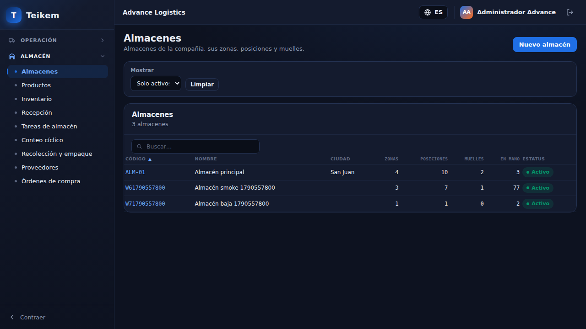

Debajo del título ("Alta y mantenimiento de tus almacenes — cada uno con sus propias zonas y posiciones") hay dos
zonas: la **tabla** y, a su derecha (420 px; bajo 720 px de ancho queda debajo de la tabla), el **panel del almacén
elegido**.

**Filtros** (arriba, con el botón **Limpiar**; filtran en la pantalla, sin volver a pedir datos):
- **Código** y **Nombre**: desplegables de selección múltiple con buscador.
- **Dirección**: texto libre. Cada palabra debe aparecer en la dirección, la ciudad, el estado o el código postal (sin
  distinguir mayúsculas ni acentos).
- **Tipo**: tipos de zona; queda el almacén que tenga **alguna zona activa** de esos tipos.
- **Estatus**: selección múltiple (Activo, Inactivo).
No hay buscador dentro de la tabla ni el selector "Mostrar": los almacenes inactivos se ven siempre, atenuados.

**La tabla.** Columnas: Código, Nombre, Dirección, Zonas, **Recepción** (Lote 16: un chip con el modo del almacén, **Con acomodo** o **Directo a posición**) y Estatus (el estatus se llamaba "Estado"). Ordena por Código por
defecto. Un clic en la fila **elige** el almacén y lo muestra en el panel derecho; la elección queda en la dirección
(`?warehouse=…`), así que se puede copiar el enlace. Sin elección, se muestra el primero por código. El pie es el común
de todas las tablas (arriba, "Todas las tablas").

**El panel derecho.** Muestra el nombre y el código del almacén, su dirección y su estatus, y el bloque **Zonas de
este almacén**:
- El ícono del lápiz abre la **ficha** del almacén ("Editar almacén" con `warehouse.manage`; "Abrir la ficha del
  almacén" sin él).
- **+ Nueva zona** (con `warehouse.manage`; deshabilitado si el almacén está dado de baja) abre el formulario de zona.
- Una fila por **zona activa**: código, nombre, tipo y `ocupadas/total posiciones` (posiciones activas con existencia entre
  posiciones activas). Con `warehouse.manage`, un clic en la fila abre el formulario para editarla.
- La **papelera** de cada fila da de baja la zona (pide confirmación: "La zona {code} quedará inactiva."; aviso "Zona dada de
  baja."). Si la zona tiene posiciones activas la papelera está deshabilitada y el aviso al pasar el cursor dice "No se
  puede dar de baja: esta zona tiene posiciones creadas".
- Sin zonas: "Todavía no tiene zonas — cree la primera". Sin almacén elegido: "Seleccione un almacén de la lista".

**Nuevo almacén** (botón de la cabecera, con `warehouse.manage`).

> **Captura pendiente:** formulario "Nuevo almacén" con el combobox "Ciudad o código postal" abierto.

| Campo | Cómo funciona |
|---|---|
| Código | Obligatorio; letras, números, guion y guion bajo, máximo 30. No se puede cambiar después |
| Nombre | Obligatorio |
| Dirección | Texto libre |
| Ciudad o código postal | Un solo campo con buscador: escriba una ciudad, un municipio o los primeros dígitos de un código postal (espera 250 ms entre teclas, ↑ ↓ Enter para elegir, Esc cierra la lista, la ✕ "Quitar ciudad y código postal" vacía el campo). Cada opción se ve como `ZIP · CIUDAD POSTAL (Municipio), Estado` y, fuera de Puerto Rico, termina con el país. Al elegir una opción se llenan **Ciudad, Código postal, Estado y País** |
| Estado y País | Solo lectura: se llenan con la localidad elegida ("Se llena según la ciudad elegida."). Si no elige ninguna, el país queda en Puerto Rico y el estado vacío |
| Modo de recepción (Lote 16) | **Con acomodo** (por defecto) o **Directo a posición**. La posición de recepción por defecto no se pide aquí (al crear el almacén aún no tiene posiciones): se fija después en la ficha |
| Activo | Casilla marcada y sin poder cambiarse: todo almacén nace activo ("Todo almacén nuevo nace activo; se da de baja desde su ficha.") |

Al guardar aparece "Almacén creado.".

### Ficha del almacén

Encabezado con código, nombre y ciudad, la barra de estatus (Activo → Inactivo, con **Avanzar a Inactivo**, definitivo)
y cuatro pestañas: **Datos**, **Zonas**, **Posiciones**, **Muelles**.

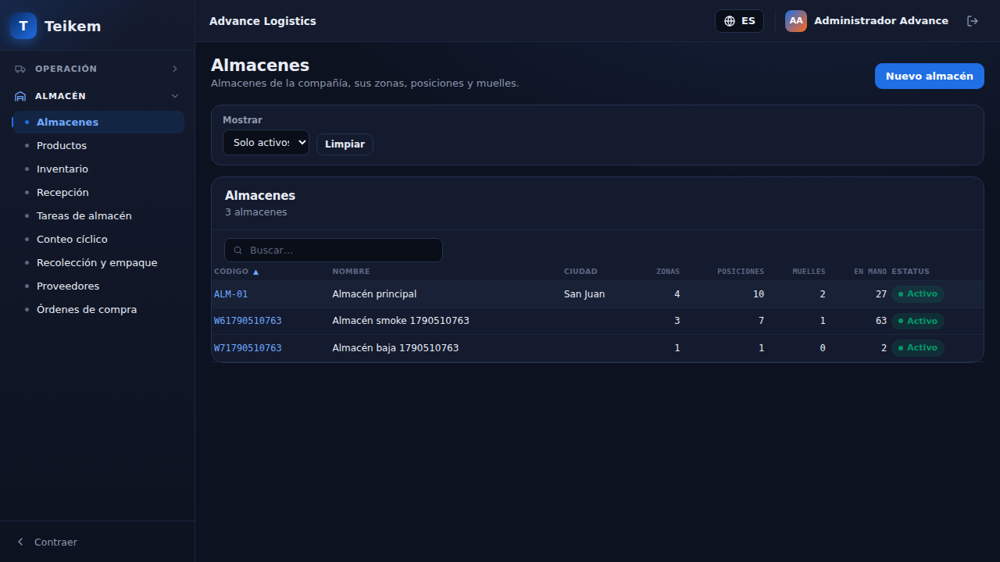

**Datos.** Código (solo lectura: "El código del almacén no se puede cambiar."), Nombre, Dirección, **Ciudad o código
postal** (el mismo combobox de la alta; muestra `Ciudad · ZIP` con lo guardado, aunque el almacén se haya creado antes
del catálogo), y Estado y País de solo lectura. **Guardar** solo se activa si hubo cambios y solo lo ve quien tiene
`warehouse.manage`; aviso "Cambios guardados.". Sin `warehouse.manage` el formulario se ve deshabilitado.

**Recepción (Lote 16).** Al final de Datos hay un grupo **Recepción** con dos campos, que solo cambia quien tiene `warehouse.manage`:

| Campo | Cómo funciona |
|---|---|
| **Modo de recepción** | **Con acomodo** o **Directo a posición**. Ayuda: "Con acomodo: entra a la posición de recepción y se crean tareas de acomodo. Directo a posición: cada línea lleva su posición y entra ahí al confirmar, sin tareas." |
| **Posición de recepción por defecto** | Selector de las posiciones de zonas `STAGING` o `CROSSDOCK` del almacén. Vacío dice "La primera de recepción" (la primera posición de una zona `STAGING`). Ayuda: "Zona STAGING o CROSSDOCK de este almacén. Vacío: la primera posición de recepción. Se usa en los recibos con acomodo y en las líneas con cruce de muelle." Vaciarla la quita |

Al guardar con **otro modo** aparece la confirmación **«¿Cambiar el modo de recepción?»**: "Los recibos nuevos de {código} entrarán {con acomodo | directo a posición}. Los {n} recibos abiertos conservan su modo y los
{m} recibos con acomodo pendiente siguen igual." (botón **Cambiar el modo**; mientras se cuentan los recibos aparece "…"). Cambiar el modo **no toca** los recibos abiertos ni los acomodos pendientes. Las reglas y los
mensajes del servidor están en el [manual 06, sección 1.4](../06-inventario-y-almacen.md#14-modo-de-recepción-y-posición-de-recepción-por-defecto-lote-16).

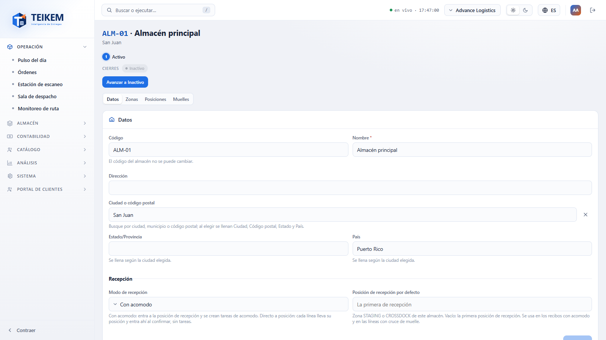

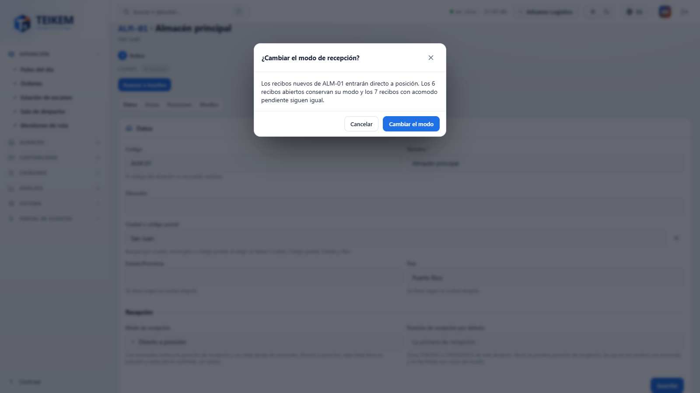

**Zonas.**

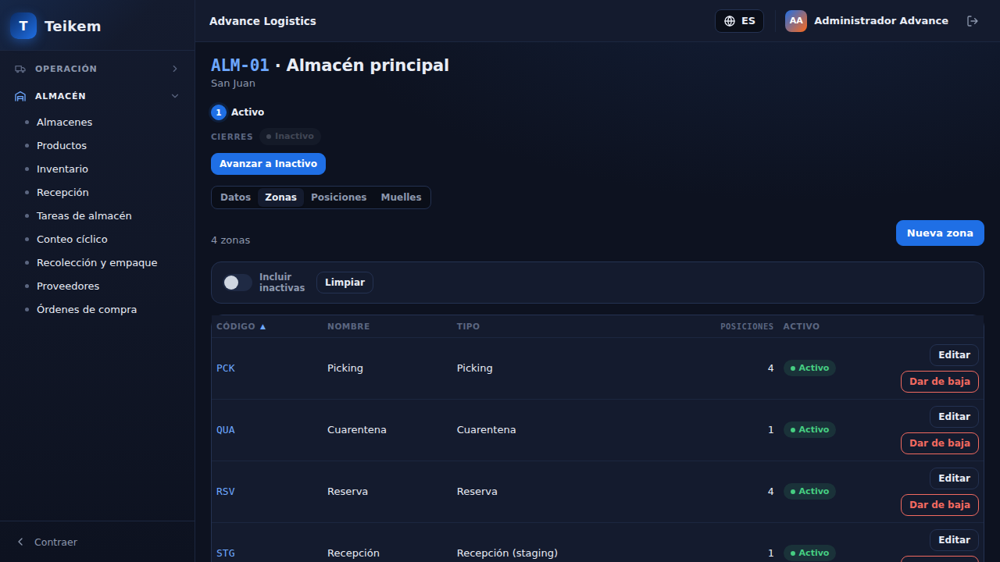

- Filtros: **Código**, **Nombre**, **Tipo** (selección múltiple con buscador; filtran en la pantalla) e **Incluir
  inactivas**.
- Columnas: Código, Nombre, Tipo, Posiciones (activas), **Ocupadas** (activas con existencia) y **Estatus** (Activo /
  Inactivo).
- **+ Nueva zona** en la cabecera del panel. Un **clic en la fila** abre el formulario de edición (ya no hay botón
  "Editar"). Por fila, un ícono: **Dar de baja** (el servidor la rechaza con 409 si la zona aún tiene posiciones activas) o **Reactivar**, con confirmación.
- Sin `warehouse.manage` las filas no se pueden abrir y no hay íconos.

**Formulario de zona** ("Nueva zona" / "Editar zona"): **Código** (obligatorio; **se puede editar**: "Único en el almacén.
Cambiarlo no mueve sus posiciones ni sus existencias."), **Nombre** (obligatorio) y **Tipo** (desplegable con buscador
sobre los tipos de zona; se puede dejar vacío). Si el código ya lo usa otra zona del almacén, el mensaje del servidor
"Ya existe una zona con ese código en el almacén." aparece **debajo del campo Código** y el formulario se queda abierto.
Avisos: "Zona creada." / "Cambios guardados.".

**Posiciones.**

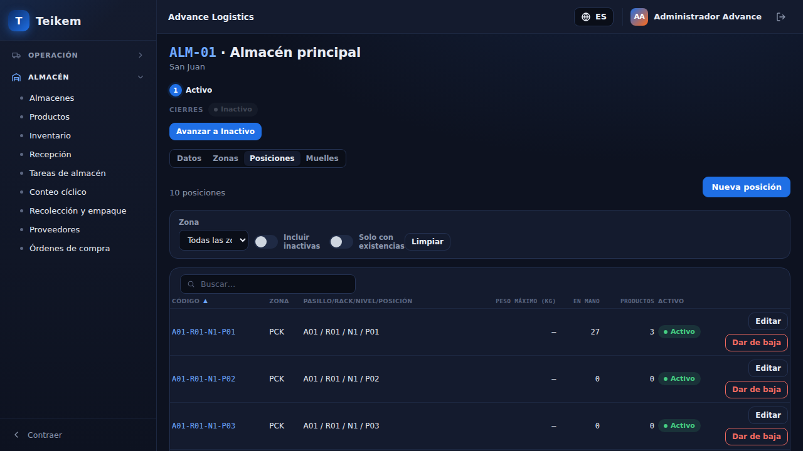

- Esta pestaña **pagina en el servidor** (25 por defecto): añadir, editar o dar de baja una posición ya no espera a
  cargar todo el almacén. Abrir o cerrar un formulario no vuelve a consultar.
- Filtros (van al servidor; los de texto esperan un instante después de la última tecla): **Código** (busca también por
  pasillo, rack, nivel y posición, y por el código de la zona), **Zona** (selección múltiple con buscador), **Pasillo**,
  **Rack**, **Nivel**, **Posición**, **Incluir inactivas** y **Solo con existencias**. El contador del panel es el total
  que cumple los filtros.
- Columnas: Código, Zona, Pasillo/rack/nivel/posición, **Cupo**, En mano, **Ocupación**, Producto, Peso máximo (kg) y
  Estatus. **Ocupación** es un chip —Vacía, Parcial, Llena u Ocupada sin cupo— y, si la posición tiene cupo y existencia,
  el porcentaje (`40 %`). **Producto** muestra el SKU si hay uno solo (el nombre sale al pasar el cursor), "N productos" si
  hay varios y "—" si no hay.
- **Asignar cupo** y **Nueva posición** en la cabecera (con `warehouse.manage`). **Asignar cupo** fija o quita el cupo de
  muchas posiciones a la vez y arranca con la Zona, el Pasillo, el Rack, el Nivel y la Posición que tenga puestos en los
  filtros de esta pestaña (el filtro Código no se traslada); ver "Asignar cupo" en la sección Posiciones, más abajo. Un clic
  en la fila abre el formulario de edición. Por fila: **Dar de baja** / **Reactivar**.
- **Exportar** saca **todas** las posiciones que cumplen los filtros, no solo la página.

**Formulario de posición** ("Nueva posición" / "Editar"):
- Alta: **Zona** (desplegable con buscador por código, nombre o tipo; obligatoria), **Código** (opcional si escribe alguna
  parte), Pasillo, Rack, Nivel, Posición, **Cupo máximo** y Peso máximo (kg).
- Edición: el **código y la zona no cambian** (se muestran deshabilitados: "El código y la zona de la posición no se pueden
  cambiar."). Pasillo, rack, nivel, posición, cupo y peso sí, pero cambiar las partes **no recalcula** el código.
- **Cupo máximo**: unidades de producto que caben ("Unidades que caben; vacío = sin cupo."). Entero mayor que cero. Al editar,
  dejarlo vacío quita el cupo.

**Muelles.** Sin cambios respecto al Lote F6: código, tipo (Inbound/Outbound/Both), estatus y activo; **Nuevo muelle**,
**Editar**, **Cambiar estatus** (Libre ↔ Ocupado ↔ Mantenimiento) y **Dar de baja**/**Reactivar**.

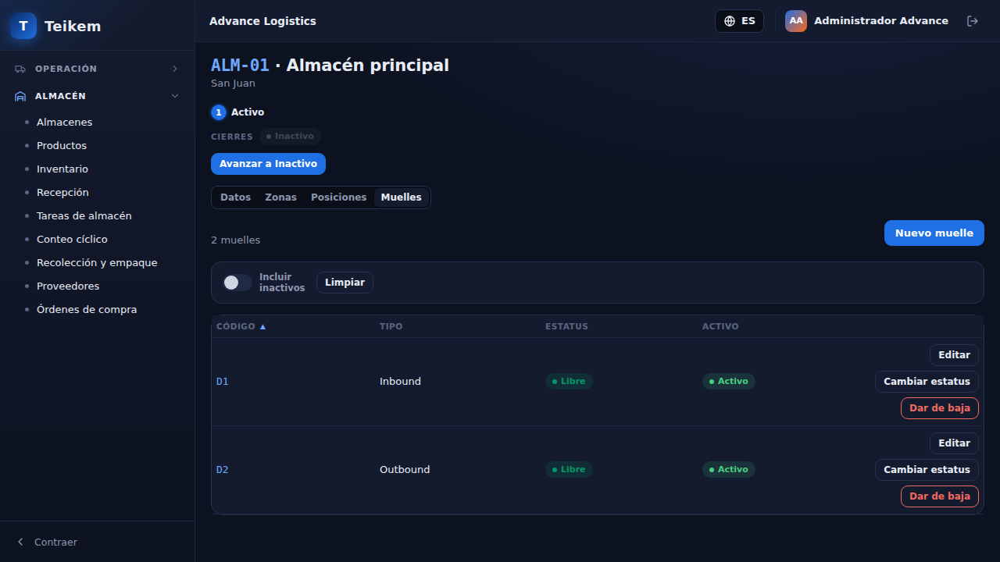

### Posiciones (antes «Ubicaciones»)

**Para qué sirve.** Vista de un almacén completo: cuánto de su capacidad está ocupada en cada zona y dónde está cada cosa,
posición por posición. Desde el Lote 12 el ítem del menú se llama **Posiciones** (antes «Ubicaciones»; en inglés, «Bins») y
permite editar una posición con un clic en su fila y asignar cupo en bloque. La dirección no cambió.

**Cómo se llega.** Menú **Almacén › Posiciones**, dirección `/warehouse/locations`. El almacén y la zona elegidos van en
la dirección (`?warehouse=…&zone=…`).

> **Captura pendiente:** pantalla Posiciones con los recuadros por zona, los filtros, la tabla de posiciones y el botón
> **Asignar cupo**.

**Arriba a la derecha:** el selector de **almacén** (sin elegir, el primero activo; cambiar de almacén borra los filtros),
**Asignar cupo** y **Nueva posición** (los dos con `warehouse.manage`; **Nueva posición** abre el mismo formulario de la ficha).

**Los recuadros por zona.** Uno por zona activa, unidos por una tubería:
- Con cupo: `ocupado/capacidad` (por ejemplo `10/25`), el texto `ocupado · 40%` y una barra. La capacidad es la suma del cupo
  de las posiciones de la zona; lo ocupado, lo que hay en esas mismas posiciones. Si la zona tiene posiciones **sin cupo**,
  el recuadro lo avisa ("1 posición sin cupo" / "N posiciones sin cupo") y esas posiciones **no cuentan** en el porcentaje.
- Zona con posiciones pero ninguna con cupo: la existencia total y "unidades · sin cupo configurado" (no hay porcentaje).
- Zona sin posiciones: `0` y "sin posiciones".
- Un **clic en un recuadro** filtra la tabla por esa zona; otro clic en el mismo la quita ("Clic para ver solo esta zona
  en la tabla; otro clic quita el filtro").
Sin zonas, la pantalla dice "Este almacén todavía no tiene zonas".

**Filtros:** **Posición** (texto: busca en código, pasillo, rack, nivel y posición; espera un instante tras la última
tecla), **Zona**, **Tipo** (tipo de zona: equivale a elegir todas las zonas de ese tipo), **Producto** (posiciones con
existencia de alguno de esos productos) y **Estatus** (Vacía, Parcial, Llena, Ocupada sin cupo). Todos van al servidor y el
botón **Limpiar** los quita. Si la combinación no deja ninguna zona (por ejemplo, una zona y un tipo que no coinciden) la
tabla queda vacía: "Ninguna posición coincide con los filtros.".

**La tabla.** Columnas: Posición, Zona, Cantidad, Producto (el nombre si es uno solo; "N productos" si hay varios), **Cupo**,
**Ocupación** (barra y porcentaje; "—" si la posición no tiene cupo) y **Estatus** (Vacía / Parcial / Llena / Ocupada sin
cupo). Solo muestra posiciones activas. Con `warehouse.manage`, un **clic en la fila** abre el formulario de edición de la
posición (el mismo de la ficha del almacén: el código y la zona no cambian; sí el pasillo, rack, nivel, posición, cupo y peso
máximo); al guardar se refrescan la tabla y los recuadros. Sin ese permiso las filas no se abren. La tabla no tiene íconos de
baja: dar de baja o reactivar una posición se hace en la pestaña Posiciones de la ficha del almacén. Pagina en el servidor con el pie común; **Exportar**
saca todas las que cumplen los filtros. Sin posiciones: "Este almacén todavía no tiene posiciones.". Sin almacenes
activos: "No hay almacenes activos.".

**Qué no hay todavía.** Las barras de ocupación de los últimos 7 días que muestra la maqueta no están: dependen de un
historial diario que aún no existe (ver `docs/lote11-decisiones.md`).

#### Asignar cupo (cupo máximo de muchas posiciones a la vez)

**Para qué sirve.** Poner o quitar el cupo máximo (unidades) de todas las posiciones que cumplan un alcance, en un solo paso
y sin editarlas una por una. Sirve, por ejemplo, para corregir el cupo que estimó la migración (ver la pregunta frecuente
«¿De dónde salió el cupo de mis posiciones?» en el FAQ). Quién puede: `warehouse.manage`, módulo `WMS_LOTSERIAL`. Sin ese
permiso el botón no aparece. Se llega desde **Asignar cupo** en Posiciones y en la pestaña Posiciones de la ficha del almacén.
Aplica siempre solo a posiciones **activas**. Llama a `POST /api/v1/warehouses/{publicId}/bins/capacity` (capítulo 06 del
manual funcional).

> **Captura pendiente:** el modal «Asignar cupo a posiciones» con alcance, acción y vista previa.
> **Captura pendiente:** el aviso de confirmación con más de 100 posiciones.

**El modal.** Título «Asignar cupo a posiciones». Tiene dos grupos:
- **Alcance:** **Zona** (varias, con buscador; sin elegir dice «Cualquier zona»), **Pasillo**, **Rack**, **Nivel** y
  **Posición** (texto: contiene), el interruptor **Solo posiciones sin cupo** (no pisa ningún cupo ya capturado) y, solo
  mientras no haya ningún filtro puesto, el interruptor **Todo el almacén**. Desde Posiciones el modal arranca con la zona
  de `?zone=`; desde la ficha, con los filtros de la pestaña.
- **Acción:** un botón de opción, **Cupo máximo** (con el campo «Cupo máximo (unidades)», entero mayor que cero) o **Quitar
  cupo**. Al elegir Quitar cupo, «Solo posiciones sin cupo» se deshabilita («No aplica al quitar el cupo.»).

**La vista previa.** Debajo del modal, una línea dice a cuántas posiciones se aplicará, con una pausa breve tras el último
cambio: «Calculando posiciones…», «Se aplicará a 1 posición.», «Se aplicará a {count} posiciones.». Si no hay ningún filtro
ni «Todo el almacén»: «Elija al menos un filtro (zona, pasillo, rack, nivel o posición) o marque «Todo el almacén».». Si nada
coincide: «Ninguna posición coincide con el alcance: no hay nada que aplicar.». El botón de aplicar (**Asignar cupo** o
**Quitar cupo**) queda deshabilitado mientras no hay alcance, se está calculando, no hay posiciones o el cálculo falló.
Con «Solo posiciones sin cupo» y filtros de texto (pasillo, rack, nivel o posición) el conteo exacto solo se hace si hay
hasta 1.000 posiciones; con más, la vista previa dice «Se aplicará a como máximo {count} posiciones (se omiten las que ya
tienen cupo).» y la cifra es un tope.

**Al aplicar.**
1. Si son más de 100 posiciones, o se marcó «Todo el almacén», pide confirmación («Confirmar cupo en bloque»): «Se asignará un
   cupo máximo de {qty} unidades a {count} posiciones.» o «Se quitará el cupo máximo de {count} posiciones.», más «El cambio
   afecta a todo el almacén.» cuando corresponde y «Las posiciones que ya tengan ese valor no cambian.». Con conteo
   aproximado, el {count} dice «hasta N».
2. Aplica y cierra el modal con el aviso «Cupo aplicado a {changed} de {matched} posiciones» (o «Cupo quitado a {changed} de
   {matched} posiciones»; en singular, «de 1 posición»). `matched` son las que cumplían el alcance y `changed` las que de verdad
   cambiaron: las que ya tenían ese cupo no cuentan como cambiadas.
3. Las tablas y los recuadros de ocupación se refrescan solos.
4. Si el servidor rechaza la petición, el mensaje queda en el modal (recuadro rojo arriba) y el modal sigue abierto; el error
   del cupo se muestra también bajo el campo. Los mensajes del servidor están en el capítulo 06 del manual funcional.

**Qué bloquea.** Con el almacén dado de baja, el servidor responde 422 «El almacén está dado de baja; solo se consulta.».

**Hojas de posición (Lote F15).** La tabla de Posiciones tiene además la casilla **Elegir**, la columna **Hoja** (estado de la hoja
pegada en el rack: Sin hoja impresa, Desactualizada, Al día o "—", con la última impresión), el filtro **Hoja**, el aviso
**"N posiciones con la hoja desactualizada o sin imprimir"** con **Imprimir las desactualizadas**, y el botón **Hojas de posición**
junto a **Códigos de barras**. Todo se explica en [F15 — Hojas de posición](f15-hojas-de-posicion.md).

**Etiquetas de posición (Lote F16).** El botón **Etiquetas de posición**, junto a **Hojas de posición**, genera un PDF con una etiqueta
por posición (4 × 2, 4 × 4 o 4 × 6 pulgadas, una página por etiqueta) del filtro actual o de las marcadas, para la impresora de
etiquetas; no cambia nada en el sistema. Ver [F16 — Etiquetas de posición](f16-etiquetas-de-posicion.md).

### Permisos y módulo

`inventory.view` (ver Almacenes, la ficha, Posiciones y el catálogo de ciudades); **`warehouse.manage`** para crear y
editar el almacén, sus zonas, posiciones y muelles, asignar cupo en bloque, dar de baja y reactivar, y el estatus manual del muelle. Módulo
**Almacén y lote/serie** (`WMS_LOTSERIAL`).

### Estatus y transiciones

| Entidad | De → a | Quién | Qué valida / dispara | Bloquea |
|---|---|---|---|---|
| Almacén | Activo → Inactivo (terminal) | `warehouse.manage` (barra de estatus de la ficha) | Inventario y documentos abiertos | 409 "El almacén {code} tiene inventario o documentos abiertos; no se puede dar de baja." Ya inactivo: solo se consulta (nada se edita; 422 "El almacén está dado de baja; solo se consulta.") |
| Zona | Activa → Inactiva | `warehouse.manage` (ícono Dar de baja en la ficha o papelera en el panel de la lista) | Posiciones activas | 409 "La zona tiene posiciones activas; desactívelas primero." (la papelera de la lista ya viene deshabilitada) |
| Zona | Inactiva → Activa | `warehouse.manage` (ícono Reactivar) | — | — |
| Posición | Activa → Inactiva / Inactiva → Activa | `warehouse.manage` (íconos de la pestaña Posiciones) | Inventario y tareas abiertas | 409 "La posición {code} tiene inventario; no se puede desactivar." / 409 "La posición tiene tareas de almacén abiertas; complételas o cancélelas antes de desactivarla." |
| Muelle (estatus operativo) | Libre ↔ Ocupado ↔ Mantenimiento (laterales) | `warehouse.manage` | — | — |
| Muelle (activo) | Activo → Inactivo | `warehouse.manage` | Citas vigentes | 409 "El muelle tiene citas agendadas o en curso." |

La **ocupación** de una posición (Vacía, Parcial, Llena, Ocupada sin cupo) y la de una zona no son estatus: se calculan
solas comparando la existencia en mano con el cupo, no tienen transiciones y no bloquean ninguna acción.

### Validaciones y mensajes

| Campo | Regla | Mensaje | Dónde |
|---|---|---|---|
| Código (almacén, zona) | obligatorio | "El código es obligatorio." | Pantalla (y 400 del servidor) |
| Código (almacén, zona) | letras, números, guion y guion bajo, máx. 30 | "El código solo admite letras, números, guion y guion bajo (máximo 30)." | Pantalla (y 400) |
| Código de zona | único en el almacén (al crear y al editar) | "Ya existe una zona con ese código en el almacén." | Servidor, 409, bajo el campo Código |
| Código de almacén | único en la compañía | "Ya existe un almacén con ese código." | Servidor, 409 |
| Nombre (almacén, zona) | obligatorio | "El nombre es obligatorio." | Pantalla (y 400) |
| Zona (alta de posición) | obligatoria | "Seleccione la zona." | Pantalla |
| Código o pasillo/rack/nivel/posición | uno de los dos | "Indique el código de la posición o su pasillo/rack/nivel/posición." | Pantalla (y 400) |
| Código de posición ya usado | único en el almacén | "Ya existe una posición con ese código en el almacén." | Servidor, 409 |
| Cupo máximo | mayor que cero | "El cupo máximo de la posición debe ser mayor que cero." | Pantalla (y 400) |
| Cupo máximo | número entero | "El cupo máximo debe ser un número entero." | Pantalla |
| Cupo máximo | hasta 2.147.483.647 | "El cupo máximo es demasiado grande." | Pantalla |
| Peso máximo (posición) | > 0 | "El peso máximo debe ser mayor que cero." | Pantalla |
| Peso máximo (posición) | ≤ 3 decimales | "El peso máximo admite hasta 3 decimales." | Pantalla |
| Código (muelle) | obligatorio | "El código es obligatorio." | Pantalla |
| Ciudad o código postal | el servidor niega la consulta del catálogo | "Su usuario no puede consultar el catálogo de ciudades." | Lista del combobox |
| Ciudad o código postal | sin coincidencias | "No hay ciudades ni códigos postales que coincidan." | Lista del combobox |
| Filtros de Posiciones | combinación sin resultados | "Ninguna posición coincide con los filtros." | Tabla |
| Asignar cupo: Cupo máximo | vacío | "Indique el cupo máximo." | Pantalla |
| Asignar cupo: Cupo máximo | número entero | "El cupo máximo debe ser un número entero." | Pantalla |
| Asignar cupo: Cupo máximo | mayor que cero | "El cupo máximo de la posición debe ser mayor que cero." | Pantalla (y 400 del servidor) |
| Asignar cupo: Cupo máximo | hasta 2.147.483.647 | "El cupo máximo es demasiado grande." | Pantalla |
| Asignar cupo: alcance | algún filtro o «Todo el almacén» | "Elija al menos un filtro (zona, pasillo, rack, nivel o posición) o marque «Todo el almacén»." | Pantalla (vista previa; el botón queda deshabilitado) |
| Asignar cupo: alcance | al menos una posición | "Ninguna posición coincide con el alcance: no hay nada que aplicar." | Pantalla (vista previa) |
| Asignar cupo: vista previa | el conteo se pudo calcular | "No se pudo calcular a cuántas posiciones se aplicará: {mensaje}" | Pantalla (vista previa) |
| Asignar cupo: almacén | debe estar activo | "El almacén está dado de baja; solo se consulta." | Servidor, 422, en el recuadro del modal |

## Productos y categorías

**Para qué sirve.** Es el maestro de artículos (SKU): costo, precio, mínimos, categoría, quién es el dueño (propio o
de un cliente) y cómo se rastrea (sin seguimiento, por lote o por serie).

**Cómo se llega.** Menú **Almacén › Productos e inventario**, dirección `/warehouse/products` (con la subpestaña
**Categorías** en la misma pantalla). Un clic en una fila abre el producto en un modal; la ficha con las pestañas Lotes y
Series sigue en `/warehouse/products/:publicId` (se llega desde el modal con «Ver lotes» / «Ver series»).

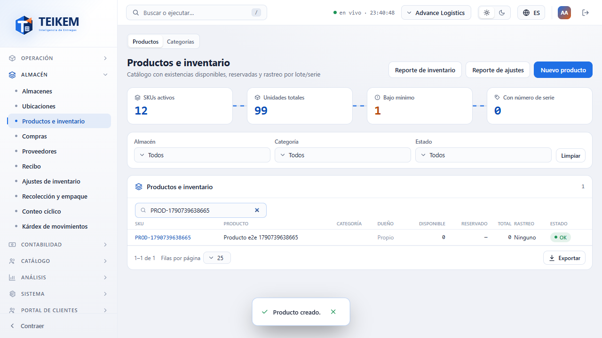

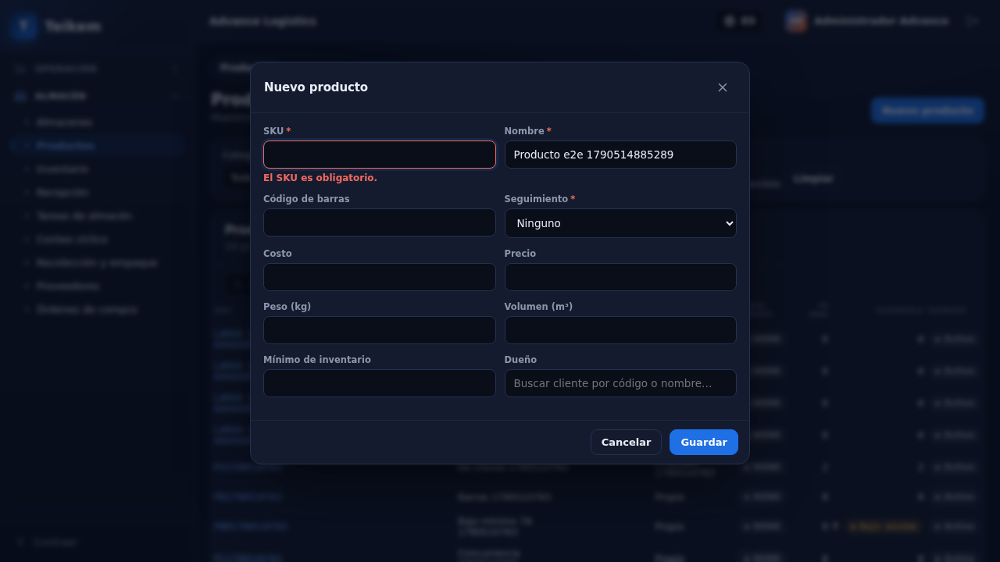

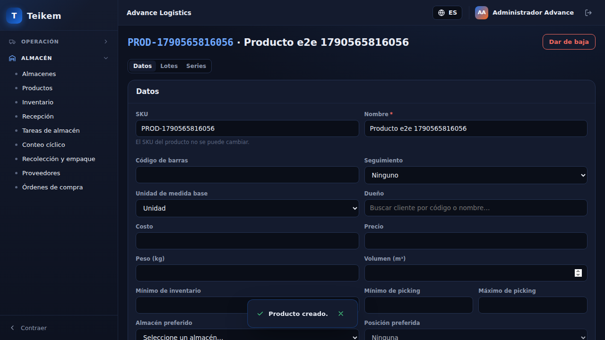

> **Captura pendiente:** el bloque «Añadir ajuste» abierto dentro del modal de producto.

**Los indicadores (KPIs) son botones.** Arriba hay cuatro tarjetas: **SKUs activos**, **Unidades totales**, **Bajo mínimo** y
**Con número de serie**. Sus cifras son de todo el catálogo (no cambian al usar los filtros) y usan el separador de miles del
idioma (367.329 en español). Cada tarjeta filtra la tabla al hacer clic; otro clic en la misma quita el filtro. El filtro
elegido queda en la dirección (`?kpi=`), así que se puede copiar el enlace o volver atrás con el navegador.

| Tarjeta | Qué cuenta | Filtro que aplica a la tabla | `?kpi=` |
|---|---|---|---|
| SKUs activos | Productos activos | Solo activos | `active` |
| Unidades totales | Existencia en mano de todos los saldos **de productos activos** (los inactivos no suman) | Activos con existencia en mano mayor que cero (cuenta también la cuarentena y el cruce de muelle, y no resta lo reservado) | `available` |
| Bajo mínimo | Productos activos con mínimo cuyo disponible es menor | Bajo mínimo | `low` |
| Con número de serie | Productos activos con rastreo por serie o con series registradas | Rastreo por serie o con series registradas (incluye los inactivos que las tengan) | `serial` |

**Cuándo una tarjeta se pone naranja.** Solo cuando hay algo que atender: **Bajo mínimo** cuando su cifra es mayor que cero, y
**Con número de serie** cuando hay productos con serie cuyas series capturadas son menos que su existencia; en ese caso
muestra debajo «N sin series completas». Sin pendientes, ambas se ven con el color normal. **SKUs activos** y **Unidades
totales** nunca son naranja.

**Filtros** (van al servidor; **Limpiar** los quita todos, incluido el indicador elegido):
- **Almacén** (varios, con buscador): limita las **cantidades** de cada fila (Disponible, Reservado, Total) a esos almacenes.
  No quita productos de la lista: un producto sin existencia en ese almacén sigue apareciendo con ceros.
- **SKU** (varios, con buscador; incluye productos inactivos).
- **Nombre** (texto: el nombre **contiene** lo escrito, sin distinguir mayúsculas; espera un instante tras la última tecla).
- **Categoría** (varias; incluye las subcategorías).
- **Marca** (varias, con buscador; ofrece las marcas que ya usan los productos de la compañía).

Ya no existe el filtro **Estado** (lo reemplazan los indicadores) ni el buscador libre dentro de la tabla: para buscar por
texto use **Nombre** o **SKU**.

**Qué se ve (lista).** Columnas: SKU, Producto, Categoría, **Marca** (el **Modelo** aparece debajo, en tono tenue; no tiene
columna propia), Dueño ("Propio" o el nombre del cliente), Disponible, Reservado, Total, Rastreo y **Estatus** (chip: OK,
Bajo mínimo o Inactivo; las filas inactivas se ven atenuadas). Pagina en el servidor con el pie común; un clic en el
encabezado ordena solo la página visible. **Exportar** saca todo lo que cumple los filtros; en el archivo, la columna Marca
lleva «Marca · Modelo».

**Qué hace cada botón.**
- **Reporte de inventario** y **Reporte de ajustes**: generan un PDF con los filtros de la tabla (ver "Reportes en PDF").
- **Nuevo producto** (`inventory.manage`): abre el modal vacío.
- **Clic en una fila**: abre el modal de edición (sin `inventory.manage` se abre como «Ver datos del producto», de solo lectura).

**El modal de producto** (alta y edición). Campos en este orden: **SKU** (obligatorio al crear; al editar no se puede cambiar) y
**Unidad** (desplegable con buscador); **Nombre**; **Marca** y **Modelo**; **Categoría** (desplegable con buscador; se busca
por cualquier nivel de la ruta «Raíz / Hija») y **Rastreo** (desplegable con buscador); **Dueño del inventario**; **Costo de
compra** y **Precio de venta**; **Almacén por defecto** y **Posición por defecto**; **Total** (solo lectura: se cambia con un
ajuste) y **Punto de reorden**; al editar, el interruptor **Producto activo** (bloqueado mientras el producto tenga
inventario) y, plegado en «Más datos del producto», código de barras, peso, volumen, mínimo y máximo de picking y los campos
personalizados. Con movimientos, Unidad, Rastreo y Dueño quedan bloqueados.
- **Marca** es texto libre con sugerencias: al escribir ofrece las marcas ya usadas en la compañía, pero se puede escribir una
  nueva. **Modelo** es texto libre. Ambos son opcionales, de hasta 100 caracteres; los espacios de los extremos se recortan.
  Al editar, borrar el contenido quita la marca o el modelo.

**Añadir ajuste** (solo al editar y con `inventory.adjust`). El bloque de ajuste está **oculto** hasta pulsar **+ Añadir
ajuste**. Al abrirlo muestra: **Cantidad (+/-)** (positivo suma, negativo resta), **Motivo** (desplegable con buscador, sin los
motivos que asigna el sistema), **Almacén** y **Posición** (por defecto, los del producto), Lote o Series si el rastreo lo
pide, y **Nota** (obligatoria, hasta 300 caracteres; «Por qué se ajusta (obligatoria)»). Botones **Cancelar ajuste** (cierra
el bloque sin cambios) y **Aplicar ajuste**. Al aplicar, aparece «Ajuste aplicado: {cantidad} {sku}», el **Total** del modal se
actualiza y el bloque vuelve a ocultarse vacío; el modal sigue abierto. Si el ajuste dejaría el inventario en negativo, el
servidor lo rechaza (409, «Inventario insuficiente de {sku} en {posición}: disponible {x}, solicitado {y}.») y el mensaje
aparece **dentro del bloque**, que sigue abierto para corregirlo. La nota es obligatoria **también en el API**
(`POST /api/v1/inventory/adjustments` responde 400 con el error en `errors.notes`); los ajustes que hace el sistema no la piden. Los
mensajes del bloque comparten texto con los demás ajustes manuales: el botón **Ajustar** del Kárdex y **Resolver** un faltante con
"Ajuste manual" (Compras) también exigen la nota.

### Reportes en PDF (Productos e inventario)

Los dos botones de la cabecera generan un PDF en su navegador (no se envía nada a otro lado) con **los filtros que tenga la
tabla en ese momento**. Mientras se genera, el botón dice «Generando…»; si falla: «No se pudo generar el reporte. Intente de
nuevo.». Los PDF admiten solo caracteres latinos (tildes y eñes salen bien; otros símbolos salen como `?`). Ambos son
horizontales y traen: encabezado con el logo de Teikem, la compañía, el título, la fecha y hora y el usuario que lo generó; el
recuadro **Filtros aplicados** (o «Sin filtros: incluye todos los registros de la compañía.»); tarjetas de resumen; la tabla con
el encabezado repetido en cada página y filas alternadas; y el pie «Generado con Teikem · compañía» con «Página X de Y».

> **Captura pendiente:** primera página del Reporte de inventario.
> **Captura pendiente:** primera página del Reporte de ajustes.

**Reporte de inventario.** Foto del inventario al momento, agrupada por categoría (con la cantidad de productos de cada una)
y con un subtotal por categoría y un total general.
- Columnas: SKU, Producto, Categoría, Marca, Disponible, Reservado, Total, Costo unitario y Valor. Resumen: Productos,
  Unidades en mano, Disponible y Valor del inventario.
- **Solo lista productos con existencia** (en mano distinta de cero). Los que están en 0 no salen y un aviso dice cuántos
  quedaron fuera: «Productos sin existencia (en mano 0) no incluidos: {count}.».
- **Valor = Total × costo de compra** registrado en el producto. El sistema no guarda costo promedio ni costo por lote (el
  reporte lo dice). Un producto con existencia pero sin costo muestra «—» en el costo y en el valor, no suma en los totales y
  se avisa: «Productos con existencia sin costo de compra: {count}. Su valor aparece como «—» y no se suma en los totales.».
  Si ningún producto tiene costo, el valor total del resumen también es «—».
- Con un filtro de Almacén, las cantidades son solo de esos almacenes (el filtro lo aclara).
- Lee hasta 10.000 productos; con más, avisa: «El reporte incluye solo los primeros {count} productos (límite de lectura).
  Afine los filtros para ver el resto.».

**Reporte de ajustes.** Movimientos de tipo **Ajuste** del Kárdex, del más reciente al más antiguo, de los productos que
cumplen los filtros de la tabla (Almacén, SKU, Nombre, Categoría y Marca). **No tiene rango de fechas:** incluye todo el
historial de ajustes que cumpla los filtros.
- Columnas: Fecha y hora, SKU, Producto (con el lote o la serie, si tiene), Almacén / Posición, Cantidad (±), Motivo, Nota y
  Usuario. Resumen: Ajustes, Entradas, Salidas y Neto; al final de la tabla, las filas de Entradas, Salidas y Neto.
- **Excluye los saldos iniciales de la migración** (motivo OPENING_BALANCE), porque se registraron como ajustes pero no son
  ajustes de la operación. Un aviso dice cuántos quedaron fuera: «Saldos iniciales de la migración excluidos: {count} (no son
  ajustes de la operación).».
- Si hay un indicador elegido (activos, con disponible, bajo mínimo, con serie), no se aplica a los movimientos; el reporte lo
  avisa: «La vista «{vista}» depende del estado actual del producto y no aplica a los movimientos: se incluyen los ajustes de
  los productos que cumplen los demás filtros.».
- Lee hasta 10.000 movimientos; con más: «El reporte incluye solo los {count} ajustes más recientes (límite de lectura). Afine
  los filtros para ver el resto.».
- Sin ajustes: «No hay ajustes para los filtros elegidos.».

El nombre del archivo lleva el título, la compañía y la fecha (por ejemplo `reporte-de-inventario-advance-depot-2026-09-30.pdf`).

**Validaciones y mensajes (marca, modelo y ajuste del modal).**

| Campo | Regla | Mensaje | Dónde |
|---|---|---|---|
| Marca | máx. 100 caracteres | "La marca no puede exceder 100 caracteres." | Pantalla (el campo ya no deja escribir más) y 400 |
| Modelo | máx. 100 caracteres | "El modelo no puede exceder 100 caracteres." | Pantalla (el campo ya no deja escribir más) y 400 |
| Ajuste: Cantidad | vacía o no numérica | "Indique la cantidad del ajuste (número, positivo para sumar o negativo para restar)." | Pantalla |
| Ajuste: Cantidad | distinta de cero | "La cantidad del ajuste no puede ser cero." | Pantalla (y 400) |
| Ajuste: Cantidad | hasta 3 decimales | "La cantidad admite como máximo 3 decimales." | Pantalla (y 400) |
| Ajuste: Motivo | obligatorio | "Seleccione un motivo." | Pantalla |
| Ajuste: Almacén | obligatorio | "Seleccione un almacén." | Pantalla |
| Ajuste: Posición | obligatoria | "Seleccione una posición." | Pantalla |
| Ajuste: Nota | obligatoria | "Escriba una nota que explique el ajuste." | Pantalla |
| Ajuste: Nota | máx. 300 caracteres | "Las notas admiten como máximo 300 caracteres." | Pantalla (y 400) |
| Ajuste: saldo | no dejar el inventario en negativo | "Inventario insuficiente de {sku} en {posición}: disponible {x}, solicitado {y}." | Servidor, 409, dentro del bloque |

**Qué se ve (ficha).** La ficha completa (`/warehouse/products/:publicId`) conserva las pestañas **Datos**, **Lotes** y
**Series**; hoy se llega a Lotes y Series desde el modal.

**Subpestaña Categorías** (en la misma pantalla de Productos, pestaña "Categorías"):

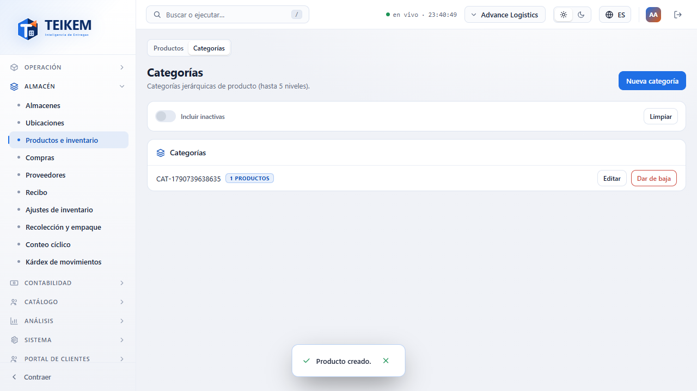

Árbol simple con indentación por nivel (hasta 5); cada fila muestra cuántos productos tiene y **Editar**/
**Dar de baja**/**Reactivar**; **Nueva categoría** elige el nombre y la categoría superior (o "raíz").

**Permiso.** `inventory.view` (lista, ficha, lotes, series, categorías); **`inventory.manage`** para crear/editar/
dar de baja/reactivar producto y categoría. Módulo `WMS_LOTSERIAL`.

**Validaciones y mensajes (producto).**

| Campo | Regla | Mensaje |
|---|---|---|
| SKU | obligatorio | "El SKU es obligatorio." |
| SKU | máx. 60 caracteres | "El SKU no puede exceder 60 caracteres." |
| SKU | sin espacios ni caracteres de control | "El SKU no admite espacios ni caracteres de control." |
| Nombre | obligatorio | "El nombre del producto es obligatorio." |
| Nombre | máx. 200 caracteres | "El nombre no puede exceder 200 caracteres." |
| Código de barras | máx. 60 caracteres | "El código de barras no puede exceder 60 caracteres." |
| Seguimiento | obligatorio | "Seleccione el tipo de seguimiento." |
| Costo / Precio | no negativos | "El costo y el precio no pueden ser negativos." |
| Costo | ≤ 4 decimales | "El costo admite como máximo 4 decimales." |
| Precio | ≤ 4 decimales | "El precio admite como máximo 4 decimales." |
| Costo o precio | tope | "El costo o el precio excede el máximo permitido." |
| Mínimos | no negativos | "Los mínimos no pueden ser negativos." |
| Máximo de picking | ≥ mínimo | "El máximo de la posición de picking debe ser mayor o igual al mínimo." |
| Mínimo de picking | exige posición preferida en zona PICKING | "El mínimo de picking requiere una posición preferida en una zona PICKING." |
| Peso / volumen | no negativos | "El peso y el volumen no pueden ser negativos." |
| Peso | ≤ 3 decimales, < 1,000,000,000 | "El peso admite como máximo 3 decimales y debe ser menor que 1,000,000,000." |
| Volumen | ≤ 4 decimales, < 100,000,000 | "El volumen admite como máximo 4 decimales y debe ser menor que 100,000,000." |

Al editar: cambiar seguimiento, unidad base o dueño de un producto con movimientos: **"No se puede cambiar: el
producto ya tiene movimientos."** (409). Dar de baja bloqueado con inventario en mano o documentos abiertos (409).

**Validaciones y mensajes (categoría).** "El nombre de la categoría es obligatorio."; "El nombre de la categoría no
puede exceder 150 caracteres."; más de 5 niveles o nombre repetido en el mismo nivel: rechazado por el servidor (409);
baja bloqueada con productos o subcategorías activas (409).

## Transferencias y ajustes

**Para qué sirve.** Es donde se corrige el inventario a mano y se consulta lo que se ha corregido: **Ajustes** (subir o bajar la cantidad de
una posición, con motivo y nota) y **Transferencias** (mover inventario de una posición a otra, del mismo almacén o de otro). Muestra
**todos** los ajustes y transferencias, también los que genera el sistema (conteo, recibo, acomodo, reabasto), con filtros para acotar. Es
la pantalla que reemplazó a "Ajustes de inventario" en el menú.

**Cómo se llega.** Menú **Almacén › Transferencias y ajustes** (justo después de Recolección y empaque), dirección
`/warehouse/transfers-adjustments`. Dos pestañas: **Ajustes** (la de entrada) y **Transferencias** (`?tab=transfers`).

**Qué se ve (Ajustes).**

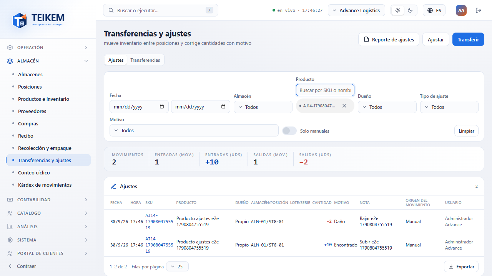

- **Cabecera:** **Reporte de ajustes** (PDF con los filtros de la pestaña), **Ajustar** y **Transferir** (estos dos, solo con `inventory.adjust`).
- **Filtros** (todos van al servidor y regresan a la página 1): **Fecha** (desde y hasta), **Almacén**, **Producto** (buscador por SKU o nombre;
  la selección queda como una píldora que se quita con ✕), **Dueño** ("Propio" o un cliente), **Tipo de ajuste** (Todos, Subir o Bajar),
  **Motivo**, **Solo manuales** y **Limpiar**.
- **Resumen** (franja de números, con los mismos filtros): **Movimientos**, **Entradas (mov.)**, **Entradas (uds)**, **Salidas (mov.)** y
  **Salidas (uds)**.
- **Tabla "Ajustes":** Fecha, Hora, SKU, Producto, Dueño, Almacén/Posición, Lote/Serie, Cantidad (con signo y color: azul entra, rojo sale),
  Motivo, Nota, Origen del movimiento (Manual, Conteo, Recibo, etc.) y Usuario. Un clic en una fila abre el **detalle del movimiento**
  (ver "Kárdex de movimientos"). Pie con filas por página y **Exportar**.

**Qué se ve (Transferencias).**

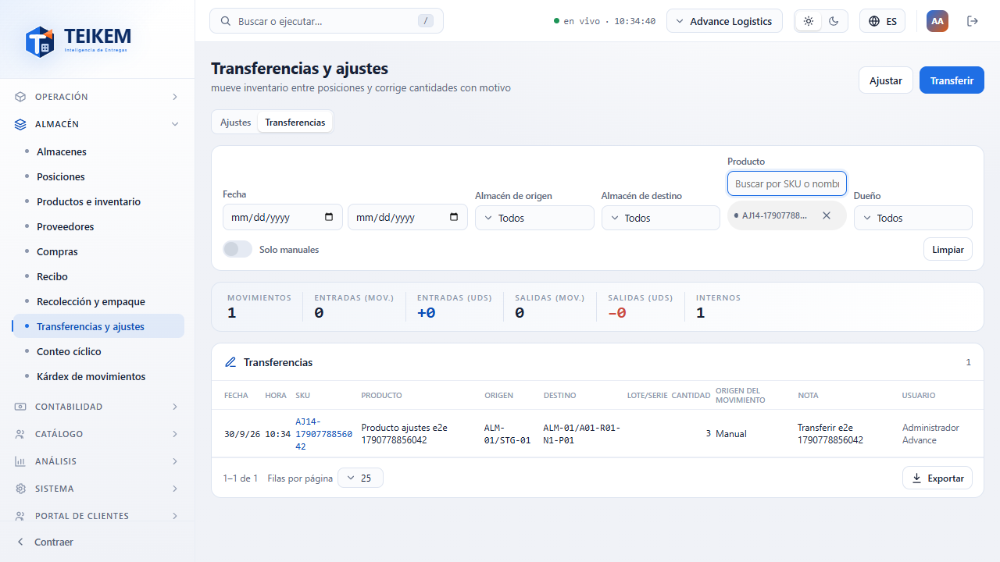

Filtros: **Fecha**, **Almacén de origen**, **Almacén de destino**, **Producto**, **Dueño** y **Solo manuales**. El resumen agrega **Internos**
(transferencias que no salen de los almacenes o posiciones filtrados; sin filtro de almacén, toda transferencia es interna). Tabla:
Fecha, Hora, SKU, Producto, **Origen** y **Destino** (almacén/posición), Lote/Serie, Cantidad (sin signo: una transferencia no suma ni
resta), Origen del movimiento (Manual, Acomodo o reabasto, Conteo…), Nota y Usuario. No hay filtro de Motivo: las transferencias no llevan
motivo.

**Qué hace cada botón.**

- **Ajustar** abre el modal **Ajuste de inventario**:

  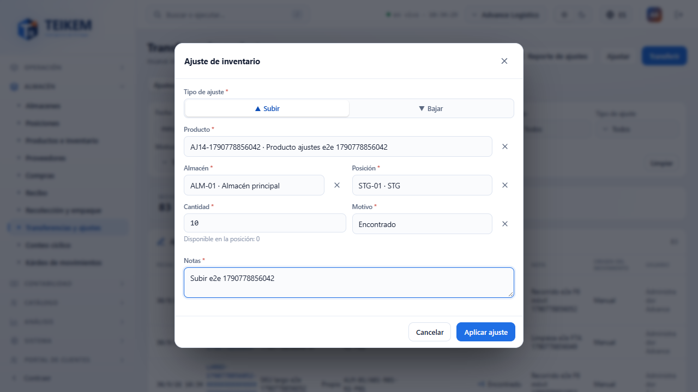

  1. **Tipo de ajuste** (obligatorio): **Subir** entra inventario; **Bajar** lo saca. La cantidad se escribe siempre en positivo; la pantalla
     pone el signo.
  2. **Producto**, **Almacén** y **Posición**. Debajo de la cantidad aparece **"Disponible en la posición: N"**. Al **subir** se
     puede elegir cualquier posición del almacén; al **bajar**, la lista ofrece solo las posiciones donde el producto tiene
     disponible, cada una con su cantidad ("A-01 · A · 5 disp."), y el campo está apagado hasta elegir el producto ("Elija primero
     un producto"). Si cambia a Bajar, o cambia el producto o el almacén, y la posición elegida ya no tiene de ese producto, se quita.
  3. **Cantidad** (mayor que cero, hasta 3 decimales; al **bajar** no puede pasar de lo disponible).
  4. **Motivo**, con buscador. Depende de la dirección: **Encontrado** solo al subir; **Daño**, **Pérdida** y **Vencido** solo al bajar; los demás
     en las dos. Si cambia de dirección y el motivo elegido ya no vale, se quita.
  5. **Notas** (obligatorias, hasta 300 caracteres).
  6. Si el producto se controla por **lote**: al subir, el número de lote; al bajar, se elige uno de los lotes que hay en la
     posición (con lo disponible y su vencimiento). Si se controla por **serie**: al subir, se escriben las series (una por línea); al bajar,
     se eligen las series que salen (la cantidad es el número de series).
  7. **Aplicar ajuste** guarda y avisa **"Ajuste registrado ({qty})."**; el Kárdex y los saldos se refrescan solos.

  El mismo modal se usa en el Kárdex y, con el producto ya fijo, en la ficha del producto (**Añadir ajuste**).

- **Transferir** abre **Transferencia de inventario**, en este orden: **Almacén de origen** → **Posición de origen** → **Ítem** (lista de lo que hay
  en esa posición: producto y lote, con lo disponible; se busca por SKU, nombre o lote) → **Series** (solo si el producto las lleva) →
  **Almacén de destino** (por defecto el de origen) → **Posición de destino** → **Cantidad** (con el tope de lo disponible; en productos con
  serie es el número de series elegidas) → **Notas** (opcionales). **Transferir** guarda y avisa "Transferencia registrada.".

- **Reporte de ajustes** genera un PDF de los ajustes con **los mismos filtros** que tiene en pantalla (fechas, dueño, tipo, motivo, almacén,
  producto), no solo con los de Productos.

**Permiso.** `inventory.view` y el módulo **Almacén y lote/serie** (`WMS_LOTSERIAL`) para entrar; **`inventory.adjust`** para Ajustar y
Transferir. Sin `inventory.adjust` los botones no aparecen.

**Validaciones y mensajes.** Los del formulario (sin código HTTP) son: "Elija si el ajuste sube o baja el inventario.", "Seleccione un
producto.", "Seleccione un almacén.", "Seleccione una posición.", "Seleccione un motivo.", "Indique la cantidad del ajuste.", "La cantidad
debe ser mayor que cero.", "La cantidad admite como máximo 3 decimales.", "No puede bajar más de lo disponible en la posición ({qty}).",
"Indique el número de lote." (al subir), "Seleccione el lote." (al bajar), "Indique al menos un número de serie.", en la transferencia "Elija el
ítem a transferir.", "Elija al menos una serie.", "No puede transferir más de lo disponible en la posición ({qty}).", "El origen y el destino
no pueden ser la misma posición.", y la nota obligatoria del ajuste ("Escriba una nota que explique el ajuste."). Los del servidor (409
"Inventario insuficiente de {sku} en {bin}: disponible {x}, solicitado {y}." y demás) aparecen arriba del formulario. Todos están en el
manual 06, sección 3, y en el [FAQ](../faq.md#lote-14--transferencias-y-ajustes-conteo-cíclico-kárdex-conciliación-y-necesita-tu-atención-lote-4-del-plan-de-cambios).

## Kárdex de movimientos: Kárdex, Saldos y Conciliación

**Para qué sirve.** Consulta el inventario disponible en cada posición (**Saldos**), su historial de movimientos (**Kárdex**) y compara el Kárdex
contra los saldos (**Conciliación**). No tiene estatus propio: es un libro de movimientos. Los ajustes y transferencias se hacen desde
**Ajustar** y **Transferir** (también aquí, en la cabecera).

**Cómo se llega.** Menú **Almacén › Kárdex de movimientos**, dirección `/warehouse/kardex` (la dirección antigua `/warehouse/inventory`
lleva ahí). Pestañas **Kárdex** (la de entrada), **Saldos** (`?tab=balances`) y **Conciliación** (`?tab=reconciliation`).

### Filtros compartidos y resumen

**Los filtros son los mismos en las tres pestañas y se conservan al cambiar de pestaña.** Cada pestaña aplica solo algunos; los que no
aplica se ven **atenuados** y una nota bajo la barra los nombra ("No aplican a Saldos (solo cambian el resumen de movimientos): …").

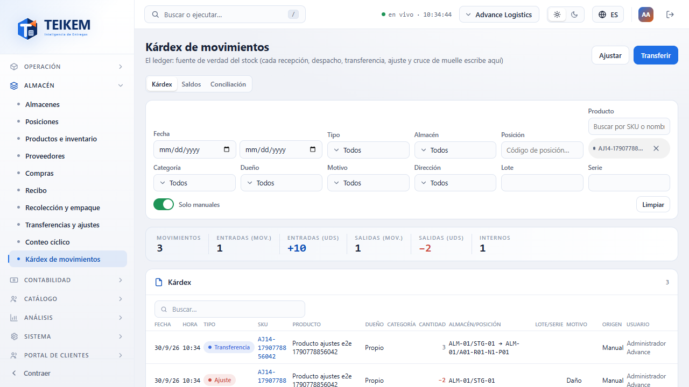

| Filtro | Kárdex | Saldos | Conciliación |
|---|---|---|---|
| **Fecha** (desde y hasta; días de Puerto Rico) | Sí | Solo el resumen | Sí (fecha de detección) |
| **Tipo** | Sí | Solo el resumen | No |
| **Almacén**, **Posición** (busca en todos los almacenes por código, zona o almacén), **Producto**, **Categoría** | Sí | Sí | Sí |
| **Dueño** ("Propio" o un cliente), **Motivo**, **Dirección** (Entradas o Salidas), **Solo manuales** | Sí | Solo el resumen | No |
| **Lote** | Sí | Sí | No |
| **Serie** | Sí | Solo el resumen | No |
| **Incluir en cero**, **Solo con disponible** | — | Sí | — |
| **Estatus** (de los descuadres; por defecto **Pendiente**) | — | — | Sí |

**Resumen.** Franja de números con **los mismos filtros** de la tabla: **Movimientos**, **Entradas (mov.)**, **Entradas (uds)**, **Salidas (mov.)**,
**Salidas (uds)** e **Internos**. En **Saldos** se agregan **En mano** y **Disponible**. En **Conciliación** la franja muestra **Pendientes**,
**En la lista** y, a la derecha, el estado de la revisión automática.

**Documento de origen.** Si llega desde un enlace con un documento (`?refEntity=` y `?refId=`, por ejemplo desde un conteo cerrado) aparece
una píldora "Documento: … #…" con una ✕ para quitarla.

### Kárdex

Columnas: **Fecha**, **Hora**, **Tipo** (chip de color: Recibo, Despacho, Transferencia, Ajuste, Cruce de muelle), **SKU**, **Producto**, **Dueño**,
**Categoría**, **Cantidad** (con signo y color), **Almacén/Posición** (las transferencias muestran origen → destino), **Lote/Serie**, **Motivo**,
**Origen** (Manual, Conteo, Recibo…) y **Usuario**; más un buscador libre. Un clic en una fila abre el **detalle del movimiento**
(`?txn=<id>`).

### Detalle de un movimiento

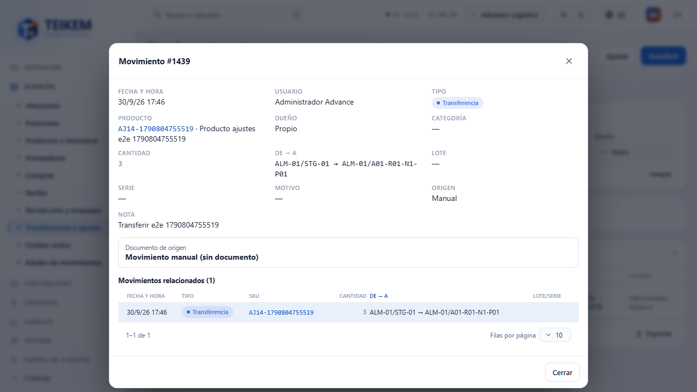

Modal de solo lectura con: **Fecha y hora**, **Usuario** ("Sistema" si lo hizo el sistema), **Tipo**, **Producto** (SKU en enlace y nombre), **Dueño**,
**Categoría**, **Cantidad**, **De → a**, **Lote** (con "vence …"), **Serie**, **Motivo**, **Origen** y **Nota**. Debajo, el **Documento de origen**:
su número, su estatus, la fecha y la parte (cliente o proveedor) y un botón **Abrir** que lleva al recibo, la recolección, el conteo, la orden de
compra, la orden o el producto; el botón **solo aparece si usted tiene el permiso y el módulo de esa pantalla**. Una tarea de almacén no
tiene pantalla propia: muestra también el **Documento de la tarea** (su documento padre) con su Abrir. Un movimiento hecho a mano dice
"Movimiento manual (sin documento)". Al final, **Movimientos relacionados (N)**: los del mismo documento o, si no tiene, los del mismo asiento
(hasta 200; si hay más, avisa "Se muestran los primeros 200 movimientos relacionados."). El modal no incrusta el cuerpo del documento: para
verlo, **Abrir**.

### Saldos

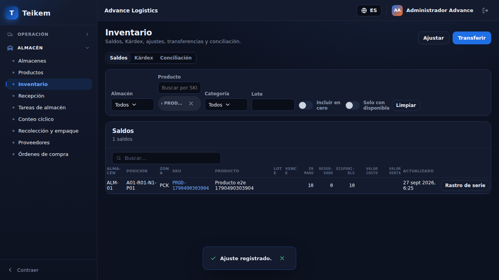

Columnas: almacén, posición, zona, SKU, producto, **dueño**, **categoría**, lote, vencimiento, en mano, reservado, disponible, valor costo, valor
venta y actualizado. Cada fila puede abrir **Genealogía** (si tiene lote) o **Rastro de serie**. Saldos no filtra por Dueño (el filtro solo
cambia el resumen de movimientos).

### Conciliación

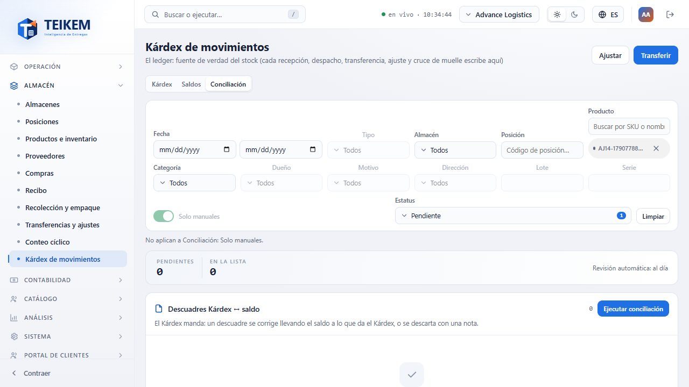

Lista los **descuadres Kárdex ↔ saldo**: el saldo de una posición (o de todo un producto) no coincide con lo que suman los movimientos. No es una
diferencia física en el estante. Vea el manual 06, sección 3.3, y el FAQ del Lote 14.

- **Franja:** **Pendientes** y **En la lista** y, a la derecha, **Revisión automática: al día**, **N en cola** o **apagada**.
- **Ejecutar conciliación** (`inventory.adjust`): revisa ahora los saldos contra el Kárdex, **de los productos del filtro Producto o, si no hay
  ninguno, de todos**, y guarda los descuadres. Avisa "Conciliación ejecutada." y escribe el resultado: "Conciliación del {fecha}: {n}
  productos y {n} saldos revisados · {n} descuadres nuevos · {n} siguen pendientes · {n} se corrigieron solos.".
- **Tabla "Descuadres Kárdex ↔ saldo":** Detectado, SKU, Producto, Almacén/Posición ("Total del producto" si el descuadre es del total), Lote,
  **Kárdex**, **Saldo**, **Diferencia** (saldo − Kárdex, con signo y color), Tipo y Estatus (chip Pendiente, Resuelto, Descartado o Se corrigió
  solo). Sin descuadres: "Sin descuadres pendientes" / "El Kárdex y los saldos cuadran con estos filtros." Cada fila pendiente trae los íconos
  **Corregir el saldo según el Kárdex** (solo en los de tipo saldo por posición) y **Descartar** (con `inventory.adjust`); un clic en la fila,
  o cualquiera de los dos íconos, abre el detalle.
- **Detalle del descuadre** (modal "Descuadre · {sku}"): la **Diferencia** grande con el chip de estatus; producto, dónde, lote, tipo, Kárdex, saldo,
  **Reservado hoy**, quién lo detectó (Automática, Manual, Migración), cuándo y cuántas revisiones; una nota que recuerda que un descuadre no es
  una diferencia física y que un ajuste o un conteo no lo arreglan; si está cerrado, quién lo cerró, cuándo, "de → a" y su nota; una **Nota
  (obligatoria para descartar)** con los botones **Corregir el saldo según el Kárdex** y **Descartar** (solo si está Pendiente y usted tiene
  `inventory.adjust`); los **últimos movimientos de la posición** (un clic abre el detalle del movimiento) y el **historial**.
  - **Corregir el saldo según el Kárdex** pone el saldo igual a lo que dan los movimientos, **sin crear un movimiento**. Avisa "Saldo corregido
    según el Kárdex."; si ya cuadraba, "El saldo ya cuadraba; el descuadre se cerró solo.".
  - **Descartar** exige la nota ("Escriba una nota que explique por qué se descarta el descuadre.") y avisa "Descuadre descartado.".
  - Un descuadre del **total del producto** no tiene botón de corregir: se resuelve corrigiendo los de posición, o se descarta con nota.
  - Tras corregir uno de posición, la pantalla ofrece **Crear conteo de esa posición** (con `warehouse.count.capture`): crea un conteo Pendiente
    y ofrece **Abrir conteo {número}**.

**Permiso.** `inventory.view` (Kárdex, Saldos, Conciliación de solo lectura, detalles, genealogía y rastro de serie); **`inventory.adjust`** para
Ajustar, Transferir, **Ejecutar conciliación**, Corregir y Descartar; **`warehouse.count.capture`** para "Crear conteo de esa posición".
Módulo `WMS_LOTSERIAL`.

**Validaciones y mensajes.**

| Campo | Regla | Mensaje |
|---|---|---|
| Rango del Kárdex | desde ≤ hasta | "La fecha 'desde' no puede ser posterior a la fecha 'hasta'." |
| Nota al descartar | obligatoria, hasta 500 caracteres | "Escriba una nota que explique por qué se descarta el descuadre." / "La nota admite como máximo 500 caracteres." |
| Corregir con reserva mayor que el Kárdex | 409 | "El Kárdex da {ledger} para {sku} en {bin}, menos que lo reservado ({reserved}); libere la reserva antes de corregir el saldo." |
| Corregir con Kárdex negativo | 409 | "El Kárdex da un saldo negativo ({ledger}) para {sku} en {bin}; revise los movimientos antes de corregir el saldo." |
| Resolver uno ya cerrado | 422 | "El descuadre ya está cerrado; solo se consulta." |
| Corregir el total del producto | 422 | "Este descuadre es del total del producto; no se corrige por posición. Corrija los descuadres por posición o descártelo con una nota." |
| Dos revisiones a la vez | 409 | "La conciliación chocó con otra revisión simultánea; intente de nuevo." |

## Recepción: recibos y avisos de llegada

**Para qué sirve.** Registra la mercancía que entra al almacén: recibos ciegos (sin documento previo), de devolución,
contra un aviso de llegada (ASN) de un cliente, o contra una orden de compra propia. Desde el Lote 13 todo se hace en **una
sola pantalla**: la lista de recibos a la izquierda y, a la derecha, el detalle del recibo elegido, con sus líneas, su botón
**Confirmar recibo** y sus tareas de acomodo. La ficha propia del recibo dejó de existir.

**Cómo se llega.** Menú **Almacén › Recibo**, dirección `/warehouse/receipts`. Tiene tres pestañas:

| Pestaña | Dirección | Qué muestra |
|---|---|---|
| **Recibos** | `/warehouse/receipts` | Los recibos y el detalle del elegido. |
| **Avisos de llegada** | `/warehouse/receipts?tab=asns` | Los avisos de llegada de los clientes. |
| **Acomodo pendiente** | `/warehouse/receipts?tab=putaway` | Los recibos confirmados que todavía tienen tareas de acomodo. |

El recibo elegido va en la dirección (`?receipt=…`), así que se puede copiar el enlace. La dirección antigua de la ficha
(`/warehouse/receipts/:publicId`) lleva ahora a la pantalla con ese recibo elegido, y el evento de un recibo en Actividad reciente
abre el recibo de la misma forma. Al cambiar de pestaña se quita el recibo elegido.

### Pestaña Recibos

**Filtros** (arriba; todos van al servidor y vuelven a la página 1; **Limpiar** los quita):
- **Almacén** (uno, con buscador), **Estatus** y **Tipo** (desplegables con buscador, se puede elegir varios), **Creado** (rango de fechas).
- **Producto** (varios, con buscador; incluye productos dados de baja, porque es historial).
- **Diferencia**: **Faltante** (alguna línea recibió menos de lo esperado), **Sobrante** (alguna recibió más) o **Sin diferencia**;
  se pueden elegir varias.

**La lista (izquierda).** Título "Recibo" con el total. Arriba un buscador libre ("Número, aviso, cliente, orden de compra o
proveedor"; también busca en el transporte y la referencia). Cada recibo muestra:
- El número (`REC-00007`) y, a la derecha, su **estatus** en un chip de color.
- El remitente: el proveedor (orden de compra) o el cliente (aviso); en ciegos y devoluciones, el tipo.
- Una línea tenue con transporte · fecha (la llegada esperada, o la de alta) · origen (**Orden de compra**, **Cliente**, **Ciego**,
  **Devolución**) con su documento · referencia · "N por acomodar" si tiene tareas de acomodo abiertas.

Los más recientes van primero. El pie de la lista trae el rango, **Filas por página**, ‹ ›, y **Exportar** (todo lo que cumple los
filtros, no solo la página; ver "Todas las tablas"). **Un clic** elige el recibo; **doble clic** abre su encabezado en un modal (el
mismo del lápiz del detalle). Un recibo **directo a posición** lleva la etiqueta **Directo** junto a su origen. **Exportar** saca cada recibo **con sus líneas** (ver "Exportar: compañía, filtros, fechas y números").

**El detalle (derecha).**

- **Título:** "Detalle del recibo · REC-…" con su estatus; a la derecha, el origen ("Origen · Orden de compra: PO-…",
  "Origen · Cliente: …" u "Origen · Ciego"), el **lápiz** (Editar el encabezado del recibo; si está confirmado, Ver el encabezado del
  recibo) y el **reloj** (Historial: los cambios de estatus del recibo).
- **Datos del recibo:** almacén, recepción (la posición por defecto), muelle, transporte, referencia, llegada esperada, creado y
  confirmado (solo los que tienen dato).
- **Líneas del recibo:** SKU, Producto, Esperado, Recibido y Diferencia (0 en gris; distinto de 0 en rojo, con signo: `−2`, `+3`).
- **Confirmar recibo** (botón ancho, `warehouse.receive`) y, si el recibo está confirmado, el panel **Tareas de acomodo**.

### Captura de las líneas

Las líneas se capturan **directamente en la tabla del detalle**, mientras el recibo está abierto (Esperado, Recibiendo o
Discrepancia) y usted tiene `warehouse.receive`. Se guarda una fila a la vez, al salir del campo o al pulsar Enter; mientras guarda
la fila dice "Guardando…". Cada guardado puede cambiar el estatus del recibo (el chip se actualiza solo).

- **Recibo ciego o de devolución.** Cada fila lleva **Producto** (buscador por SKU o nombre), **Esperado**, **Recibido** y una
  papelera; siempre queda una **fila vacía al final** para seguir capturando (hasta 200 líneas). Al escribir lo **recibido**, lo
  **esperado se copia solo** mientras esté vacío o en 0; si usted escribe otro esperado (por ejemplo, el de la factura), deja de
  copiarse. Cantidades con coma o con punto, hasta 3 decimales. La copia es solo de la pantalla: ya guardada la línea con su
  esperado, cambiar lo recibido no vuelve a moverlo, y la diferencia se ve.
- **Recibo contra aviso de llegada u orden de compra.** Lo **esperado viene del documento y es de solo lectura**; solo se captura lo
  **recibido**. **No hay "Añadir ítem"** en la web: una línea que no venía en el documento solo se registra por la app o por el
  API. Las líneas del documento no se quitan: si no llegó nada, capture 0.
- **Productos por lote o por serie.** En la fila aparece el ícono **Lote y series**, que abre "Lote y series · {producto}": lote con
  fabricación y vencimiento, números de serie (uno por renglón) y la posición de recepción de esa línea. En un producto por serie **lo
  recibido es el número de series capturadas** ("En un producto por serie lo recibido es el número de series capturadas: N.").
- **Quitar una línea** (papelera, solo líneas que no vienen del documento ni tienen cruce de muelle): pide confirmación ("¿Quitar la
  línea de {producto} del recibo?") y avisa "Línea quitada.".

Debajo de la tabla, mientras el recibo está abierto, aparecen las notas:
- "Escanea o teclea cada línea para registrar lo recibido" (para quien puede capturar).
- Cuando alguna línea difiere, un aviso destacado. En un recibo con documento: "Lo recibido difiere de lo esperado — al confirmar, la
  diferencia queda registrada como ajuste de inventario." En un ciego o devolución: "Lo recibido difiere de lo esperado — al confirmar
  entra al inventario lo recibido y el recibo queda como «Completado con diferencia» (sin ajuste)."

### Confirmar el recibo

**Confirmar recibo** abre una confirmación ("Se confirma el recibo {número} completo: se asienta el inventario y se crean las tareas
de acomodo. Ya no se podrá modificar.") y, al aceptar, avisa "Recibo {número} confirmado.". El botón está **deshabilitado** y debajo
dice por qué:

| Motivo que se ve debajo del botón | Qué hacer |
|---|---|
| "El recibo ya está confirmado." | Nada: un recibo Completado, Completado con diferencia o Acomodado no se vuelve a confirmar. |
| "Agregue al menos una línea para confirmar." | El recibo no tiene líneas guardadas. Agregue una (o borre el recibo si se creó por error). |
| "Guardando líneas…" | Espere a que termine el guardado de la fila. |
| "Hay líneas sin guardar: salga del campo o pulse Enter para guardarlas." | Hay algo tecleado que no se ha guardado; salga del campo o pulse Enter. |
| "Corrija las líneas marcadas antes de confirmar." | Alguna fila tiene un error (el mensaje sale bajo su campo); corríjalo. |

Si el servidor rechaza la confirmación con errores por línea (por ejemplo, falta el lote), el mensaje sale en la fila de esa línea.

### Recibo directo a posición (Lote 16)

**Para qué sirve.** En un almacén con modo **Directo a posición** (ficha del almacén → Datos → Recepción) el recibo **no pasa por la posición de recepción**: cada línea lleva la **posición donde se guarda** y, al confirmar, la
mercancía entra ahí, **sin tareas de acomodo**. Las reglas, los mensajes y los estatus están en el [manual 06, sección 4.1](../06-inventario-y-almacen.md#41-recibo-directo-a-posición-lote-16).

**Cómo se ve.**
- **Modo del recibo.** El encabezado lleva **Modo de recepción** ("Por defecto, el del almacén; solo se cambia mientras el recibo está abierto."). Al crear un recibo sigue al del almacén elegido mientras usted no elija otro (el
  campo dice "El del almacén"). En un recibo directo **se oculta la Posición de recepción** del encabezado y del modal **Lote y series**: la mercancía no pasa por ahí.
- **Chips.** El detalle lleva el chip **Directo a posición** junto al estatus; la lista, la etiqueta **Directo**.
- **Columna "Posición destino".** La rejilla de líneas agrega una columna con un selector ("Elija dónde se guarda…"). **No ofrece posiciones de recepción ni de cruce de muelle** (la cuarentena sí) y pone primero las
  **sugeridas**. **Se guarda al elegir**, como el resto de la fila. Bajo el selector, si la posición elegida no es la sugerida, aparece la pista **«Sugerida: {posición} · {motivo}»** (por ejemplo, "Sugerida: R-02 · Reserva vacía").
  En un panel angosto (bajo 760 px) cada línea se ve como tarjeta.
- **Aviso de cupo.** Si lo recibido es más que el espacio libre de la posición elegida aparece un chip naranja **«Excede el cupo de {posición}: caben {n}»**. **No bloquea**: se puede guardar y confirmar. El espacio libre es
  el cupo menos la existencia de la posición y menos lo que otras líneas del mismo recibo ya destinan a ella; sin cupo configurado no hay aviso.
- **Usar posiciones sugeridas.** Un botón bajo la tabla (con `warehouse.receive`, con el recibo abierto y alguna línea por asignar) asigna a cada línea que recibe algo y no tiene posición la **primera sugerida donde cabe**. Avisa
  **«Se asignó posición a {n} línea(s); {m} sin sugerencia.»**: elija a mano las {m}. **Nada se llena solo**: solo al pulsarlo.
- **Confirmar.** El botón se apaga con el motivo **«Falta la posición destino en {n} línea(s).»** mientras alguna línea que recibe algo no tenga destino. La confirmación dice: "Se confirma el recibo {número} completo: cada línea
  entra a su posición destino, sin tareas de acomodo. Ya no se podrá modificar." Después el recibo queda **Acomodado** (pasa por Completado en el mismo momento, y el historial deja los dos pasos) y no hay tareas de acomodo que trabajar.
  No pide destino un producto por lote sin lote ni una línea con cruce de muelle asignado.
- **Devoluciones.** En un recibo de devolución, la primera sugerida es una posición de **cuarentena** ("Cuarentena (devolución)") si el almacén tiene una.

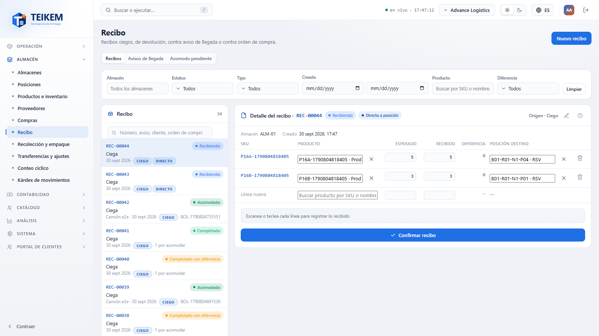

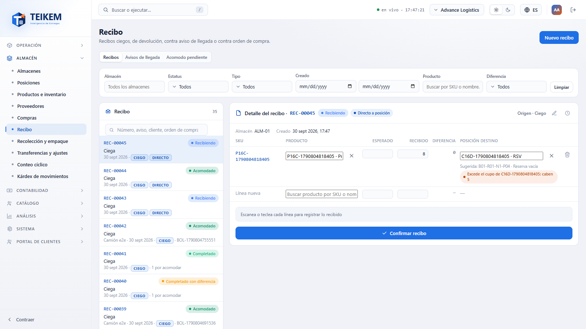

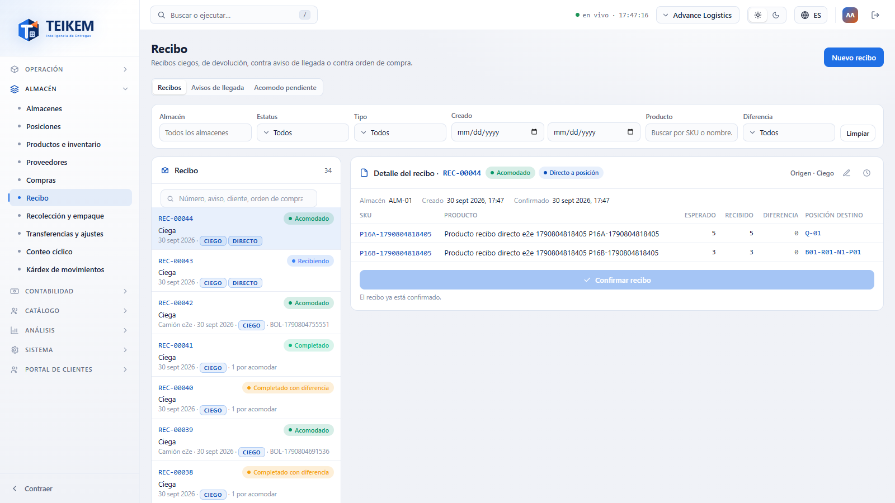

| Motivo que se ve bajo **Confirmar recibo** (recibo directo) | Qué hacer |
|---|---|
| "Falta la posición destino en {n} línea(s)." | Elija la posición de cada línea que recibe algo, o pulse **Usar posiciones sugeridas**. |

### Encabezado del recibo (modal)

**Nuevo recibo** (cabecera de la pantalla, `warehouse.receive`) y el **doble clic** o el **lápiz** de un recibo abren el mismo modal.

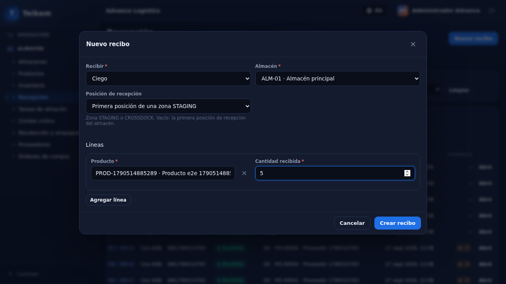

| Campo | Regla |
|---|---|
| **Origen** | Ciego, Devolución, Contra aviso de llegada o Contra orden de compra (esta última solo si tiene `purchasing.receive` y el módulo Compras encendido). Al editar, Ciego ↔ Devolución solo en recibos sin documento. |
| **Almacén** (obligatorio) | Al editar, solo cambia en un recibo sin documento y sin líneas. |
| **Aviso de llegada** / **Orden de compra** | Solo al crear con ese origen: avisos pendientes (sin recibo) u órdenes Enviadas o Recibidas parcial **del almacén elegido**. Con **Recibir** desde un aviso, el origen, el almacén y el aviso ya vienen elegidos. |
| **Modo de recepción** (Lote 16) | **Con acomodo** o **Directo a posición**. Al crear, sigue al del almacén elegido ("El del almacén"); al editar, muestra el del recibo y se cambia solo mientras está abierto. |
| **Posición de recepción** | Zona STAGING o CROSSDOCK. Vacío: la posición por defecto del almacén o, si no tiene, la primera posición de una zona STAGING. Queda como la posición por defecto de las líneas. **No se pide en un recibo directo.** |
| **Muelle** | Opcional; los muelles del almacén. |
| **Transporte** y **Referencia** | Texto libre, hasta 80 caracteres. |

- **Crear recibo:** avisa "Recibo REC-… creado." y el recibo queda **primero en la lista, elegido y con su detalle listo**, aunque los
  filtros lo excluyan (hasta que cambie un filtro). Un ciego o devolución nace **Esperado** con la tabla vacía para capturar; contra
  aviso u orden de compra nace **Recibiendo** con las líneas del documento (recibido igual a lo esperado).
- **Guardar** (al editar): manda solo lo que cambió y avisa "Encabezado del recibo {número} guardado."; sin cambios, cierra sin
  llamar al servidor. En un recibo con documento aparece el aviso "Con aviso de llegada u orden de compra, el origen, el almacén y lo
  esperado vienen del documento."; si el almacén no se puede cambiar, "El almacén solo se cambia en un recibo sin documento y sin
  líneas.".
- **Borrar recibo** (rojo; solo abierto y sin cruce de muelle asignado): "¿Borrar el recibo {número}? Si nació de un aviso de cliente,
  el aviso vuelve a quedar pendiente; si nació de una orden de compra, la orden podrá recibirse de nuevo." Avisa "Recibo {número}
  borrado.".
- **Solo lectura:** si el recibo ya está confirmado o usted no tiene `warehouse.receive`, el modal muestra los datos como texto y solo
  tiene **Cerrar**. Confirmado, dice "El recibo ya está confirmado: su encabezado no se puede cambiar.".

### Pestaña Avisos de llegada

Lista de los avisos (ASN) que los clientes anuncian.
- **Filtros** (todos al servidor): **Almacén**, **Cliente dueño** (con buscador), **Referencia** (contiene; espera un instante tras
  la última tecla) y **Llegada esperada** (rango, ambos extremos incluidos; un aviso sin fecha no entra en un rango). Esta pestaña
  **no tiene buscador libre**.
- **Tabla** (25 por página, se ordena por encabezado): Aviso (`#id · referencia`), Almacén, Cliente / OC, Llegada esperada, Estatus,
  Líneas y **Recibo** (enlace al recibo en la pestaña Recibos, si ya tiene uno). El servidor devuelve hasta 200 avisos por consulta.
- **Nuevo aviso** (`warehouse.receive`): almacén, **Cliente dueño** (obligatorio), Referencia (hasta 80), Llegada esperada y las
  líneas (Producto del cliente, **Cantidad esperada** mayor que cero y Lote), hasta 200. **Agregar línea** suma otra.
- **Recibir** (fila de un aviso pendiente y sin recibo): abre **Nuevo recibo** con el aviso y su almacén ya elegidos.
- **Cancelar aviso** (aviso pendiente): "¿Cancelar el aviso de llegada #{id}? Ya no se podrá recibir contra él." Avisa "Aviso de
  llegada cancelado.". Si el aviso ya tiene un recibo, el servidor lo rechaza (409): borre primero el recibo.

> **Captura pendiente:** pestaña Avisos de llegada con sus filtros y el modal Nuevo aviso.

### Pestaña Acomodo pendiente

Muestra los recibos **Completados** o **Completados con diferencia** que todavía tienen tareas de acomodo por cerrar. Tiene los
mismos filtros y la misma lista que la pestaña Recibos (aquí el filtro Estatus solo ofrece esos dos). A la derecha, **las tareas de
acomodo del recibo elegido**, con las acciones de cada fila (ver la captura y las acciones en "Tareas de almacén", más abajo). Al cerrar la **última** tarea, el recibo pasa
a **Acomodado** y sale de esta lista. Doble clic en un recibo abre su encabezado (solo lectura: ya está confirmado).

**Acomodo pendiente en un almacén directo (Lote 16).** Si el filtro **Almacén** es un almacén **directo a posición**, aparece el aviso **«{código} recibe directo a posición: aquí solo aparecen recibos anteriores al cambio o
con cruce de muelle.»** Los recibos directos no generan tareas de acomodo, así que no figuran aquí; quedan Acomodados al confirmar. Siguen apareciendo los recibos que ya tenían tareas cuando cambió el modo.

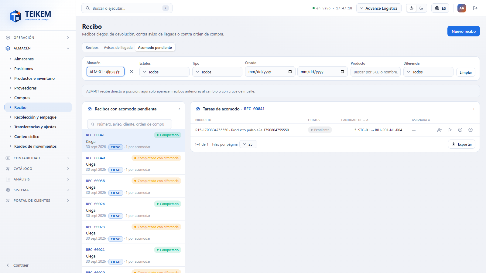

**Permiso.** `inventory.view` (todo el módulo en solo lectura); **`warehouse.receive`** para crear, editar el encabezado, capturar
líneas, confirmar, borrar y administrar avisos, e iniciar y completar las tareas de acomodo; **`warehouse.manage`** para asignarlas y
cancelarlas. Recibir contra orden de compra exige además `purchasing.receive` + módulo Compras. Módulo `WMS_LOTSERIAL`.

**Estatus y transiciones.** El estatus **no lo cambia un botón**: lo mueve el sistema según lo que usted captura.

| De → a | Quién | Qué lo dispara | Qué queda bloqueado después |
|---|---|---|---|
| (nuevo) → **Esperado** | `warehouse.receive` | Crear un ciego o devolución sin líneas | Confirmar (no hay líneas) |
| Esperado → **Recibiendo** | `warehouse.receive` | Guardar la primera línea | — |
| Recibiendo ↔ **Discrepancia** | `warehouse.receive` | Cada línea guardada: si alguna difiere de lo esperado, Discrepancia; si todas cuadran, Recibiendo | — |
| Recibiendo → **Completado** | `warehouse.receive` | **Confirmar recibo**, sin diferencia | Cambiar el encabezado, las líneas, confirmar y borrar |
| Discrepancia → **Completado con diferencia** | `warehouse.receive` | **Confirmar recibo**, con diferencia | Igual que Completado |
| Completado o Completado con diferencia → **Acomodado** | el sistema | Se cierra la última tarea de acomodo (o no hubo nada que acomodar) | — |
| Recibiendo o Discrepancia → **Acomodado** (recibo **directo**, Lote 16) | `warehouse.receive` | **Confirmar recibo**, con posición destino en cada línea que recibe algo | Completado o Completado con diferencia y **Acomodado** en el mismo momento; el historial deja los dos pasos; sin tareas |

Contra aviso u orden de compra el recibo **nace en Recibiendo**. Un recibo **nunca vuelve a Esperado**: si se borran todas sus
líneas queda en Recibiendo, y para deshacerlo se borra el recibo. El detalle técnico (efectos en el Kárdex, orden de compra y cruce de
muelle) está en el manual 06, sección 4.

**Validaciones y mensajes.**

| Campo | Regla | Mensaje |
|---|---|---|
| Almacén | obligatorio | "Elija el almacén." |
| Aviso de llegada / Orden de compra | obligatorio según el origen | "Elija el aviso de llegada." / "Elija la orden de compra." |
| Orden de compra (lista) | sin permiso para consultar órdenes | "Su usuario no puede consultar órdenes de compra." |
| Aviso de llegada / Orden de compra | primero el almacén | "Elija primero el almacén." |
| Transporte / Referencia | hasta 80 caracteres | "El transporte admite como máximo 80 caracteres." / "La referencia admite como máximo 80 caracteres." |
| Producto (fila) | obligatorio | "Indique el producto." |
| Cantidad recibida | obligatoria, no negativa | "Indique la cantidad recibida." / "La cantidad recibida no puede ser negativa." |
| Cantidad esperada (ciego o devolución) | no negativa | "La cantidad esperada no puede ser negativa." |
| Cantidad | número, hasta 3 decimales | "Escriba un número." / "La cantidad admite como máximo 3 decimales." / "La cantidad excede el máximo permitido." |
| Lote (producto por lote) | obligatorio | "El producto {sku} se controla por lote: indique el lote." |
| Series (producto por serie) | tantas como la cantidad, sin repetir | "El producto {sku} se controla por serie: capture {qty} número(s) de serie (hay {n})." / "El número de serie '{serial}' está repetido." |
| Líneas del recibo | máx. 200 | "El recibo admite como máximo 200 líneas." |
| Aviso: cliente | obligatorio | "Indique el cliente dueño de la mercancía del aviso de llegada." |
| Aviso: cantidad esperada | mayor que cero | "La cantidad esperada debe ser mayor que cero." |
| Aviso: líneas | máx. 200 | "El aviso de llegada admite como máximo 200 líneas." |
| Recibo no encontrado | el enlace apunta a un recibo que ya no existe | "Recibo no encontrado." |
| Confirmar / borrar / editar un recibo confirmado | el servidor lo rechaza (422) | "El recibo {n} ya fue confirmado; no se puede modificar." |
| Recibo directo: confirmar con una línea sin destino | el servidor lo rechaza (400) | "Indique la posición destino de {sku}: el recibo entra directo a posición." (bajo la fila de esa línea) |
| Recibo directo: posición destino de recepción o de cruce | el servidor lo rechaza (400) | "La posición {code} está en una zona {zoneType}; la posición destino debe ser de guardado." |
| Recibo directo: posición o zona desactivada | el servidor lo rechaza (422) | "La posición destino {code} está desactivada." / "La zona de la posición destino {code} está inactiva." |

Los demás mensajes del servidor (cambio de tipo con documento, almacén con líneas, esperado en un recibo con documento, cruce de
muelle asignado, etc.) salen tal cual en el formulario o bajo el campo de la fila; están todos en el manual 06, sección 4, y en el
[FAQ](../faq.md#lote-13--recibo-lote-3-del-plan-de-cambios-ciclo-de-estatus-encabezado-editable-esperado-en-ciegos-y-filtros).

## Tareas de almacén

**Para qué sirve.** Todo el trabajo físico del almacén que el sistema genera: acomodo (putaway) tras un recibo, reabasto de
posiciones de picking, conteo cíclico y cruce de muelle. **Ya no existe una pantalla ni un ítem de menú "Tareas de almacén"** con
todas las tareas juntas: cada tipo se trabaja en la pantalla a la que pertenece.

**Cómo se llega.**

| Tipo de tarea | Dónde se trabaja | Qué se puede hacer ahí |
|---|---|---|
| **Acomodo** (Putaway) | **Recibo › Acomodo pendiente**, y el panel "Tareas de acomodo" del detalle de un recibo confirmado | Asignar, iniciar, completar y cancelar |
| **Reabasto** | **Recolección y empaque › Reabasto** (`?tab=replenish`), con el botón **Correr reabasto** | Asignar, iniciar, completar y cancelar |
| **Conteo** | **Conteo cíclico › lista de conteos** (la pestaña "Tareas de conteo" se quitó en el Lote 14) | Asignar con el ícono de la fila; la tarea se completa al **confirmar** el conteo |
| **Cruce de muelle** | **Cruce de muelle › Tareas de cruce** | Asignar e iniciar; se completan moviendo la asignación desde el plan |

La dirección antigua `/warehouse/tasks` lleva a **Recibo › Acomodo pendiente** (por ahí no se llega a las tareas de reabasto).

**Qué se ve.**

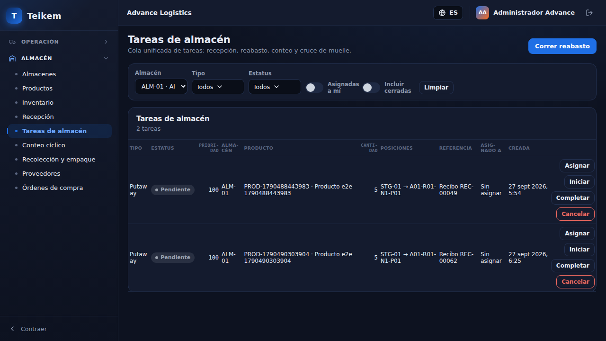

La tabla de tareas de acomodo del recibo es compacta: columnas **Producto**, **Estatus**, **Cantidad**, **De → a** (posición de
recepción → posición destino) y **Asignada a**, más la columna de acciones. Los encabezados solo se parten entre palabras, nunca
dentro de una. En las colas de Reabasto, Conteo y Cruce de muelle la tabla trae además **Tipo** (si la cola mezcla tipos),
**Prioridad**, **Almacén**, **Referencia** y **Creada**, y estos filtros: **Almacén**, **Estatus**, **Asignadas a mí** e **Incluir
cerradas**.

**Qué hace cada acción.** En todas las colas las acciones de una fila son **íconos con tooltip** (el nombre accesible es el de la
acción):

| Ícono | Acción | Cuándo aparece | Permiso |
|---|---|---|---|
| Persona con "+" | **Asignar** | Tarea abierta | `warehouse.manage` |
| Triángulo ▶ | **Iniciar** | Tarea Pendiente | El del tipo de tarea (ver abajo) |
| Círculo con palomita | **Completar** | Tarea abierta que se completa desde la cola | El del tipo de tarea |
| Círculo con equis (rojo) | **Cancelar** | Tarea abierta de Acomodo o de Reabasto | `warehouse.manage` |

- **Asignar** abre "Asignar tarea": elige el usuario (o "Sin asignar"). Avisa "Tarea asignada.".
- **Iniciar** pasa la tarea a en curso y avisa "Tarea iniciada.".
- **Completar** abre "Completar tarea": **Posición destino** (vacío usa la sugerida), **Cantidad** (vacío completa el total; el
  remanente queda como tarea nueva) y **Números de serie** si aplica. Avisa "Tarea completada.".

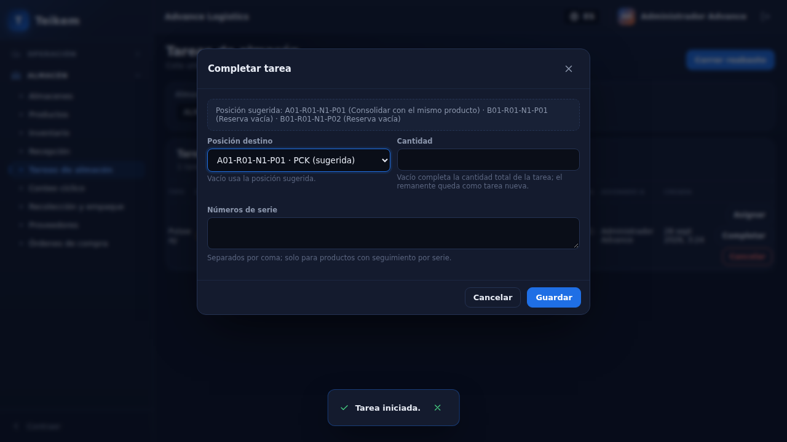

- **Cancelar** pide confirmación ("La tarea quedará cancelada y no podrá reanudarse.") y avisa "Tarea cancelada.".
- **Correr reabasto** (cabecera de Recolección y empaque, pestaña Reabasto): elige el almacén y crea las tareas de reabasto que
  hagan falta. Avisa "Se crearon {count} tareas de reabasto.".

**Al cerrar la última tarea de acomodo** de un recibo (completada o cancelada), el recibo pasa solo a **Acomodado** y sale de la
pestaña Acomodo pendiente.

**Permiso.** `inventory.view` (ver las tareas); **`warehouse.manage`** (asignar, cancelar); **Iniciar** y **Completar** exigen el
permiso del tipo de tarea: `warehouse.receive` (Acomodo), `warehouse.pick` (Reabasto y el botón Correr reabasto), `warehouse.count`
(Conteo: desde el Lote 14 la web solo asigna la tarea, con `warehouse.manage`, y la completa al confirmar el conteo) o `warehouse.crossdock` (Cruce de muelle). Módulo `WMS_LOTSERIAL`.

**Estatus y transiciones.** Pendiente → En curso (**Iniciar**) → Terminada (**Completar**); Cancelada es lateral desde
Pendiente o En curso, solo para Acomodo y Reabasto. Sin transición manual de pipeline.

**Mensajes que puede ver.**

| Mensaje | Cuándo aparece |
|---|---|
| "Su usuario no puede consultar el listado de usuarios." | Al abrir **Asignar** sin permiso para ver usuarios |
| "Vacío usa la posición sugerida." / "Vacío completa la cantidad total de la tarea; el remanente queda como tarea nueva." | Ayuda del formulario de **Completar** |
| "No hay una posición sugerida para esta tarea." | La tarea (normalmente no Acomodo) no trae una sugerencia del servidor |
| "Este recibo no tiene tareas de acomodo." | Un recibo elegido en Acomodo pendiente sin tareas |
| "Selecciona un recibo para ver sus tareas de acomodo" | Ningún recibo elegido en Acomodo pendiente |
| "Se crearon {count} tareas de reabasto." | Al terminar **Correr reabasto** |

## Conteo cíclico

**Para qué sirve.** Toma una "foto" del saldo en mano de una posición, permite capturar lo contado y **confirmar el ajuste en un solo paso**
contra el saldo actual. Desde el Lote 14 la pantalla es de **dos paneles**: la lista de conteos a la izquierda y el conteo elegido a la
derecha; ya no hay ficha aparte ni pestaña "Tareas de conteo".

**Cómo se llega.** Menú **Almacén › Conteo cíclico**, dirección `/warehouse/cycle-counts`. El conteo elegido va en `?count=<id>` (las
direcciones viejas `/warehouse/cycle-counts/:id` redirigen ahí).

**Qué se ve.**

- **Cabecera:** la marca **Modo: informado**, y (con `warehouse.count`) **Conteo de lo cambiado** y **Nuevo conteo**. Debajo, una nota: quien
  cuenta ve la cantidad esperada, la varianza se calcula al vuelo y, al confirmar, la diferencia queda como ajuste en el Kárdex.
- **Filtros** (todos van al servidor): **Almacén**, **Zona** (las de los almacenes elegidos), **Posición** (busca en todos los almacenes),
  **Producto**, **Estatus**, **Origen** (Selección o Lo cambiado), **Creado** (desde y hasta, días de Puerto Rico) y **Buscar** (número, SKU o
  producto), más **Limpiar**. La lista de la izquierda no tiene buscador propio: se filtra con estos.
- **Dos paneles con barra arrastrable** (34 % / 66 %; se recuerda en el navegador; Enter o doble clic en la barra la devuelve). Bajo 900 px,
  uno debajo del otro.

### Lista de conteos (panel izquierdo, "Tareas de conteo")

Un conteo por fila: la **posición** (o "N posiciones") con el **chip de estatus** (Pendiente, Contado, Concordancia o Diferencia, con el color del
catálogo); debajo, "CC-00155 · Zona PCK · 27 línea(s) · fecha"; la etiqueta **Lo cambiado** si nació de "lo cambiado"; y **Sin asignar** o
"Asignado a {nombre}". Un clic elige el conteo. A la derecha de cada fila hay dos íconos:

| Ícono | Acción | Cuándo | Permiso |
|---|---|---|---|
| Persona con "+" | **Asignar** el conteo a un usuario (asigna su tarea de conteo) | Conteos abiertos (Pendiente o Contado) | `warehouse.manage` (y `admin.users` para listar a quién) |
| Papelera | **Eliminar** el conteo (pide confirmar: "¿Eliminar el conteo pendiente {número}? Su tarea de conteo se cancela y la baja queda en la auditoría.") | Solo **Pendiente** | `warehouse.count` |

Pie de la lista: rango, filas por página (50 por defecto) y **Exportar** (todo lo que cumple los filtros).

### Conteo elegido (panel derecho)

- **Título y botones:** "Conteo · {posición}" con el número (CC-…); **Historial** (los cambios de estatus); **Refrescar foto** (solo si hay
  líneas cuyo saldo cambió desde la foto: las vuelve a fotografiar y borra su captura) y **Agregar lo encontrado** (un producto que está en la
  posición pero no en el conteo). Estos dos, solo con `warehouse.count` y con el conteo abierto.
- **Cabecera del conteo:** chip de estatus, etiqueta de origen, almacén, zona, "N de M líneas contadas", fecha, a quién está asignado y, en los
  de "lo cambiado", **"Movimientos del {desde} al {hasta}"**.
- **Escáner** ("Escanear o buscar producto"): escriba o escanee un **SKU, código de barras, lote o serie** y pulse Enter: lleva a la línea y
  abre **Contar {producto}** para escribir la cantidad (Enter guarda; vacío borra la captura). Si el código coincide con varias líneas,
  pide elegir la posición y el lote; si no está en el conteo, avisa.
- **Tabla de líneas** con **todas** las líneas desde el inicio: SKU, Producto, (Posición si hay varias), (Lote), **Esperado** (con la marca
  "Foto vieja" si el saldo cambió), **Contado** (**se edita en la propia fila**: al salir del campo o con Enter se guarda y pasa a la
  siguiente; en productos con serie el botón "Series (n)" abre el conteo de series) y **Varianza** (contado − esperado, con color). En un conteo
  cerrado se agrega **Ajustado** (lo que se asentó en el Kárdex) y la marca "Saldo cambió" en las líneas cuyo saldo se movió desde la foto.
- **Confirmar conteo y ajustar** (`warehouse.count`): debajo de la tabla, con la nota "Al confirmar, cada línea con varianza genera un ajuste
  enlazado a este conteo ({número}).". Pide confirmar ("Se asientan en el Kárdex los ajustes del conteo {número} contra el saldo actual ({n}
  línea(s) con varianza). Después solo se consulta.") y lleva el conteo de **Pendiente** (o **Contado**) **directo** a su estatus final:
  **Concordancia** si no hubo nada que ajustar ("Conteo {número}: Concordancia, sin ajustes.") o **Diferencia** si se asentó al menos un
  movimiento ("Conteo {número}: Diferencia, {n} ajuste(s) en el Kárdex."). Antes de confirmar, la pantalla guarda lo tecleado. El botón
  está apagado, con el motivo debajo, si faltan líneas por contar, si no hay líneas, si el conteo ya se confirmó o si es un conteo a ciegas.
- **Conteo cerrado:** el aviso "Conteo cerrado. Los ajustes ya están en el Kárdex de movimientos." con el enlace **Ver los ajustes en el
  Kárdex** (abre el Kárdex filtrado por ese conteo).
- **Sin `warehouse.count`** la pantalla es de **solo lectura a ciegas**: no se ven las cantidades esperadas, la varianza ni se captura ("Su
  usuario no tiene el permiso de conteo informado: las cantidades esperadas no se muestran y la captura se hace en la app de almacén."). La
  web **no confirma conteos a ciegas**.

### Nuevo conteo y Conteo de lo cambiado

- **Nuevo conteo** (origen "Selección"): almacén y, opcionalmente, zonas o posiciones (sin filtros toma todo el saldo en
  mano del almacén, máximo 1000 líneas). Al crear, la lista vuelve a la página 1 y queda elegido el primer conteo creado.
- **Conteo de lo cambiado** crea **un conteo Pendiente por cada posición** con movimientos en una ventana de tiempo:

  

  1. **Almacén** (con más de uno, hay que elegir).
  2. **Desde** y **Hasta**, ya llenos con la ventana por defecto —desde la **última vez que se generó "lo cambiado" en ese almacén** (la primera vez,
     desde el inicio del día) hasta ahora—, en **hora de Puerto Rico**. Se pueden cambiar; el rango no pasa de 31 días. **Volver a la ventana
     por defecto** los restablece.
  3. **Zonas** (opcional) e **Incluir posiciones vacías** (activo por defecto: las posiciones que quedaron en 0 también se cuentan, para
     confirmar que de verdad están vacías).
  4. La **Vista previa** se calcula sola al cambiar cualquier dato: la ventana, la última generación ("Primera vez en este almacén: desde el
     inicio del día." si no hay), "{n} movimiento(s) en la ventana", **"Se crearán {n} conteo(s), uno por posición, con {lines} línea(s)"**, y
     cuántas posiciones se saltan por tener un conteo pendiente, por estar inactivas o por no tener nada que contar; y "Máximo 200
     posiciones por vez.". Si algo impide crear, la vista previa dice el mensaje exacto y **Crear** queda apagado.
  5. **Crear {n} conteo(s)** crea todos o ninguno y avisa "Se crearon {n} conteo(s) de lo cambiado.".

  Los movimientos que salen de un conteo no cuentan (un conteo no genera otro), y las posiciones inactivas o que ya tienen un conteo Pendiente o
  Contado se saltan.

**Permiso.** `inventory.view` (ver la lista y los conteos, a ciegas sin `warehouse.count`); **`warehouse.count`** para Nuevo conteo, Conteo de lo
cambiado, capturar, Agregar lo encontrado, Refrescar foto, **Confirmar** y Eliminar; **`warehouse.manage`** para Asignar. Módulo `WMS_LOTSERIAL`.

**Estatus y transiciones.** **Pendiente** → (**Contado**, solo a ciegas, desde la app) → **Concordancia** o **Diferencia** (terminales). La web lleva
de Pendiente directo a Concordancia o Diferencia con **Confirmar conteo y ajustar**. **Diferencia** significa que al confirmar se asentó al menos un
movimiento en el Kárdex; **Concordancia**, que no hubo nada que ajustar. Un conteo cerrado solo se consulta.

**Validaciones y mensajes.**

| Mensaje | Cuándo aparece |
|---|---|
| "El conteo admite como máximo 1000 líneas; acote los filtros." | Al crear un conteo sin zonas/posiciones sobre un almacén muy grande |
| "Los filtros no seleccionan inventario en mano para contar; amplíe los filtros o agregue líneas a mano." | Filtros sin inventario, o en "lo cambiado" cuando no queda nada que contar |
| "Indique la posición." / "Indique la cantidad contada." | Al agregar/capturar una línea |
| "Indique el lote por su id o por su número, no ambos." | Ambigüedad de lote al agregar una línea manual |
| "Faltan {n} línea(s) por contar." | Motivo bajo el botón **Confirmar** apagado (y respuesta 422 del API) |
| "El conteo no tiene líneas." / "El conteo ya fue confirmado; solo se consulta." / "La web no confirma conteos a ciegas." | Otros motivos del botón **Confirmar** apagado |
| "Ese código no está en este conteo. Use \"Agregar lo encontrado\" si el producto está en la posición." | Escáner sin coincidencia |
| "{n} líneas coinciden: elija la posición y el lote." | Escáner con varias coincidencias |
| "Hay cantidades que no se pudieron guardar; corríjalas antes de confirmar." | Al confirmar con una fila que falló al guardar |
| 409 (lo contado es menor que lo reservado) | Al **Confirmar** |
| "Elija el almacén." | En "Conteo de lo cambiado" con más de un almacén |
| "No hubo movimientos en {almacén} entre {desde} y {hasta}; no hay posiciones que contar." / "Las {n} posiciones con cambios ya tienen un conteo pendiente." / "Hay {n} posiciones con cambios; se generan como máximo 200 a la vez. Acote el rango de fechas o las zonas." / "El rango de \"lo cambiado\" admite como máximo 31 días." / "La fecha 'desde' no puede ser posterior a la fecha 'hasta'." | En la vista previa y al crear "lo cambiado" |

## Recolección y empaque

**Para qué sirve.** Recolecta inventario (por FEFO automático o eligiendo posición/lote/serie) y lo empaca como una orden de
transporte nueva, sin pasar por la captura completa de una orden. Desde el Lote 13 la captura y la lista están en **la misma
pantalla, en dos paneles**.

**Cómo se llega.** Menú **Almacén › Recolección y empaque** (va justo después de **Recibo**), dirección `/warehouse/pick-batches`.
Tiene dos pestañas: **Recolecciones** (la de los dos paneles) y **Reabasto** (`?tab=replenish`, las tareas de reabasto y el botón
**Correr reabasto**; ver "Tareas de almacén"). La ficha completa de una recolección sigue en `/warehouse/pick-batches/:publicId`,
pero desde la lista el detalle se abre en un modal.

**Qué se ve.**

Con `warehouse.pick` la pantalla tiene **dos paneles lado a lado**: **Recolección** (captura, izquierda) y **Recolecciones**
(lista, derecha). Sin `warehouse.pick` no hay panel de captura y la lista ocupa todo el ancho.

**La barra entre los paneles.** Es una barra vertical que se puede mover para dar más espacio a un lado.
- **Arranca en 60/40** (el panel de captura ocupa el 60 %).
- **Con el ratón o el dedo:** arrastre la barra. **Con el teclado:** enfoque la barra (Tab) y use **←** y **→** (5 % por pulsación) o
  **Inicio** y **Fin** (los extremos).
- **Volver a 60/40:** pulse **Enter** con la barra enfocada, o haga **doble clic** en ella. Eso además olvida la posición guardada.
- **Se recuerda:** la posición se guarda en el navegador (`teikem.split.pick-batches`), así que al volver a la pantalla o recargar
  queda donde la dejó. Se guarda **por navegador, no por usuario**: en otro equipo u otro navegador arranca en 60/40, y quien entre con otro usuario en el mismo navegador ve la misma posición.
- **Límites:** el panel de captura no baja del 35 % ni sube del 75 %, y cada panel conserva un ancho mínimo (420 px la captura,
  320 px la lista).
- **En celular** (ventana de 900 px o menos, o cuando el espacio no alcanza para los dos paneles) **uno va debajo del otro**, sin
  barra: primero la captura y abajo la lista.

### Panel Recolección (captura)

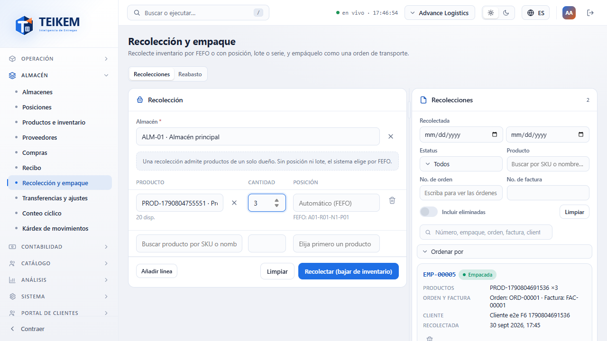

- **Almacén** (obligatorio): si la compañía tiene un solo almacén activo, ya viene elegido. Debajo, la nota "Una recolección admite
  productos de un solo dueño. Sin posición ni lote, el sistema elige por FEFO.".
- **Rejilla de líneas** (hasta 100). Columnas:
  - **Producto**: buscador por SKU o nombre del almacén elegido; solo aparecen productos con existencia disponible y del mismo dueño
    que las demás líneas. Bajo el campo se ve la existencia ("15 disp.").
  - **Cantidad**: al elegir el producto queda en 1. En un producto por serie debe coincidir con el número de series.
  - **Posición**: vacía significa "Automático (FEFO)": el sistema elige. Mientras no haya producto el campo está apagado ("Elija
    primero un producto"). Con producto, la lista ofrece **solo las posiciones donde ese producto tiene existencia disponible** (y,
    si eligió lote, solo las de ese lote), cada una con lo disponible ("A01-R01-N1-P01 · PICK · 12 disp."), en el mismo orden en que
    el sistema las usaría (vence primero; luego picking, reserva…; luego código); la primera va marcada **Sugerida** y bajo el
    campo se anuncia ("FEFO: A01-R01-N1-P01"). Si cambia el producto o el lote y la posición elegida ya no tiene de ese producto,
    se quita sola.
  - **Lote**: solo si alguna línea es de un producto por lote o por serie; vacío es "Automático (FEFO)". Ofrece los lotes con
    existencia.
  - **Series**: solo para productos por serie. El botón **Series (n)** abre "Series de la línea n · SKU": una serie por renglón (o
    separadas por coma) y "Capturadas: n."; **Listo** las guarda en la línea.
  - **Papelera**: quita la línea. La fila vacía del final no se quita.
- **Siempre hay una fila vacía al final**: al elegir el producto de la última fila se agrega otra. **Añadir línea** también agrega
  una. Al llegar a 100 líneas el botón se apaga y aparece "Máximo 100 líneas por recolección.".
- **Recolectar (bajar de inventario):** graba **todas** las líneas con datos en una sola operación (las filas vacías se ignoran).
  Avisa "Recolección EMP-… creada.", deja las líneas vacías (se queda el almacén) y **resalta la recolección nueva** en la lista; no
  abre su detalle. Si el servidor rechaza una línea (por ejemplo, inventario insuficiente), el mensaje sale en la fila de esa línea.
- **Limpiar:** vacía las líneas (se queda el almacén).
- Si el panel queda angosto (menos de 560 px), cada línea se ve como una tarjeta.

### Panel Recolecciones (lista)

- **Filtros** (dentro del panel; todos van al servidor y regresan a la página 1; **Limpiar** los quita): **Recolectada** (rango de
  fechas), **Estatus**, **Producto** (varios; incluye productos dados de baja), **No. de orden**, **No. de factura** e **Incluir
  eliminadas** (interruptor). Más un buscador libre ("Número, empaque, orden, factura, cliente o SKU", se aplica después de los
  filtros).
  - **No. de orden** es un campo con sugerencias: al escribir, ofrece números de orden existentes ("Escriba para ver las órdenes";
    si no hay, "Ninguna orden con ese número."; si no se pueden consultar, "No se pudieron consultar las órdenes."). Puede elegir una
    sugerencia (↑ ↓ Enter) o dejar lo escrito: busca por contenido. La equis ("Quitar el número de orden") lo vacía.
- **Tabla** (25 por página, con el pie común y **Exportar**): **Número** (con su estatus y, si aplica, el chip "Eliminada"),
  **Productos** ("SKU ×cantidad"), **Orden y factura**, **Cliente** ("Propio" si el inventario es propio) y **Recolectada**. Si el
  panel queda angosto (menos de 640 px) las filas se ven como tarjetas, como en la captura de arriba.
- **Acciones de la fila** (íconos con tooltip):
  - **Empacar** (caja; `warehouse.pick` + `orders.create`; solo en recolecciones que se pueden empacar): abre "Empacar EMP-…".
  - **Eliminar** (papelera roja; `warehouse.pick`, y `orders.cancel` si ya está empacada; solo si se puede): pide confirmación —
    "¿Eliminar la recolección {número}? El inventario vuelve a su posición original." o, si está empacada, "¿Eliminar la recolección
    {número}? Se borra también su orden {orden} y el inventario vuelve a su posición original."— y avisa "Recolección {número} eliminada.".
- **Clic en la fila** (o en el número) abre el **detalle en un modal**; así no se pierde lo que tenga capturado en el panel de la
  izquierda.

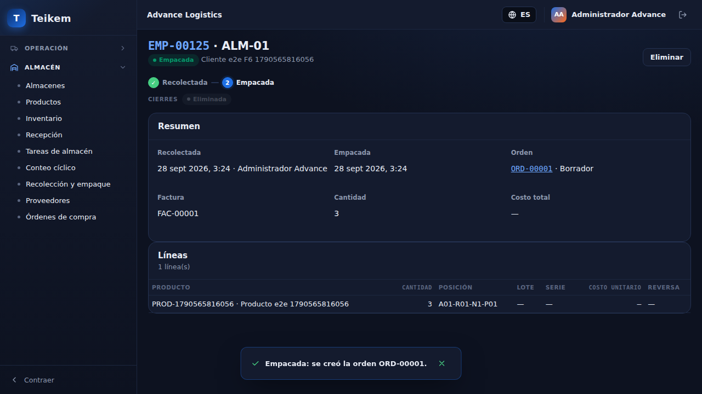

**El detalle** muestra el cliente dueño, las etapas del estatus (**Recolectada → Empacada**, con el cierre **Eliminada**; solo
lectura), el **Resumen** (recolectada con fecha y usuario, empacada, orden —con enlace a la orden si tiene `orders.view`— y su
estatus, factura, cantidad y costo total) y las **Líneas** (producto, cantidad, posición, lote, serie, costo unitario y "Revertida" si
ya se restauró). El pie trae **Cerrar** y, según corresponda, **Eliminar** y **Empacar**. Mientras el diálogo de Empacar o de Eliminar
está abierto, el detalle no se cierra con Esc ni con un clic fuera; al eliminar, el detalle se cierra.

### Empacar

**Empacar** (desde la fila o desde el detalle) abre un formulario con los datos de la orden que nace del empaque.

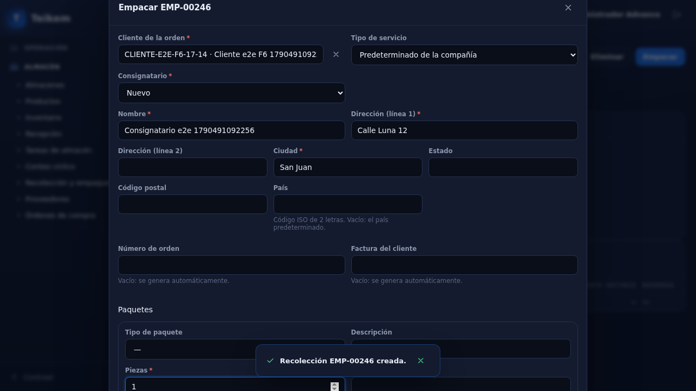

| Campo | Regla |
|---|---|
| **Cliente de la orden** (obligatorio) | Debe ser el cliente dueño del inventario recolectado; si la recolección es de un cliente, el campo lo recuerda: "Debe ser el cliente dueño del inventario: {cliente}.". |
| **Tipo de servicio** | Ofrece **"Predeterminado de la compañía ({etiqueta})"** solo si la compañía tiene uno. **Si no lo tiene, esa opción no aparece y el campo es obligatorio.** |
| **Consignatario** (obligatorio) | "Del directorio" (elija uno del cliente) o "Nuevo" (nombre, dirección, ciudad obligatorios; estado, código postal y país opcionales; el país es el código ISO de 2 letras). |
| **Número de orden** y **Factura del cliente** | Opcionales: vacío, se generan automáticamente. |
| **Paquetes** (al menos uno) | **Tipo de paquete** (con el mismo "Predeterminado de la compañía" solo si existe; si no, obligatorio), Descripción, **Piezas** (entero, al menos 1) y **Peso (kg)** (no negativo). **Agregar paquete** suma otro. |
| **Notas** | Opcional. |

**Empacar y crear orden** avisa "Empacada: se creó la orden {orden}." y la recolección pasa a Empacada.

**Permiso.** `inventory.view` (listar y ver el detalle); **`warehouse.pick`** para recolectar, empacar y eliminar; **Empacar**
exige además `orders.create`; eliminar una recolección **empacada** exige además `orders.cancel`. Módulo `WMS_LOTSERIAL`.

**Estatus y transiciones.** No hay botón de pipeline: cada paso lo hace una acción.

| De → a | Quién | Qué lo dispara | Qué queda bloqueado después |
|---|---|---|---|
| (nueva) → **Recolectada** | `warehouse.pick` | **Recolectar (bajar de inventario)** | — |
| Recolectada → **Empacada** | `warehouse.pick` + `orders.create` | **Empacar** (crea la orden de transporte) | No se vuelve a empacar ("La recolección {n} ya fue empacada.") |
| Recolectada → **Cancelada** | `warehouse.pick` | **Eliminar** (devuelve el inventario a su posición) | Solo se consulta ("La recolección {n} fue eliminada; solo se consulta.") |
| Empacada → **Cancelada** | `warehouse.pick` + `orders.cancel` | **Eliminar** (borra también la orden y devuelve el inventario) | Igual que arriba; solo si la orden sigue en su etapa inicial |

**Validaciones y mensajes.**

| Campo | Regla | Mensaje |
|---|---|---|
| Almacén | obligatorio | "Elija el almacén." |
| Líneas | al menos una con datos | "Indique al menos una línea a recolectar." (bajo el producto de la primera fila) |
| Líneas | máx. 100 | "La recolección admite como máximo 100 líneas." |
| Producto (línea con datos) | obligatorio | "Indique el producto." |
| Dueño | un solo dueño por recolección | "Una recolección solo puede tener productos de un mismo dueño." |
| Cantidad (línea) | > 0, hasta 3 decimales | "La cantidad debe ser mayor que cero." / "La cantidad admite como máximo 3 decimales." |
| Series (producto por serie) | tantas como la cantidad, sin repetir entre líneas | "El producto {sku} tiene serie: escanee las series a recolectar." / "En productos con serie la cantidad debe ser igual al número de series escaneadas." / "La serie {serial} está repetida en la recolección." |
| Series (línea) | máx. 500 | "Una línea admite como máximo 500 series." |
| Lote / serie en un producto que no lo maneja | — | "El producto {sku} no maneja lote." / "El producto {sku} no maneja serie." |
| Cliente (empacar) | obligatorio | "Indique el cliente de la orden." |
| Tipo de servicio (empacar, compañía sin predeterminado) | obligatorio | "Elija el tipo de servicio." |
| Tipo de paquete (empacar, compañía sin predeterminado) | obligatorio | "Elija el tipo de paquete." |
| Consignatario (empacar) | obligatorio (directorio o nuevo) | "El consignatario es obligatorio: elija uno del directorio o capture uno nuevo." |
| Nombre / Dirección / Ciudad (consignatario nuevo) | obligatorios | "El nombre del consignatario es obligatorio." / "La dirección (línea 1) del consignatario es obligatoria." / "La ciudad del consignatario es obligatoria." |
| País (consignatario nuevo) | código ISO de 2 letras | "Use el código ISO de 2 letras del país." |
| Paquetes | al menos uno | "Indique al menos una línea de paquete." |
| Piezas (paquete) | ≥ 1 | "La cantidad de piezas debe ser al menos 1." |
| Peso (paquete) | no negativo | "El peso no puede ser negativo." |
| Existencia | el servidor la revisa al recolectar | 409 "Inventario insuficiente de {sku} en {posición}: disponible {x}, solicitado {y}." (sin efecto parcial) |

Los demás mensajes del servidor (posición inactiva, zona no recolectable, orden que ya avanzó, etc.) salen en la fila o en el
diálogo; están en el manual 06, sección 7, y en el [FAQ](../faq.md).

## Proveedores

**Para qué sirve.** Directorio de proveedores para las órdenes de compra: contacto, término de pago y estatus.

**Cómo se llega.** Menú **Almacén › Proveedores**, dirección `/warehouse/suppliers`. Desde el Lote 12 este ítem va **antes**
de «Compras» en el menú.

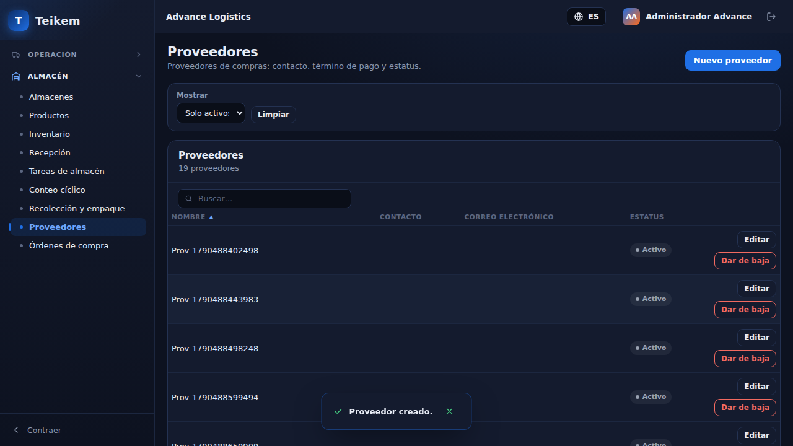

**Qué se ve.** Filtros (en la pantalla, sin consultar al servidor): **Nombre**, **Contacto**, **Teléfono**, **Correo** y
**Mostrar** («Solo activos», por defecto, o «Incluir inactivos»). El de Teléfono compara **por dígitos**: escribir `787` o
`5551234` encuentra `(787)555-1234` sea cual sea el formato guardado. **Limpiar** los quita. No hay buscador dentro de la
tabla. Columnas: Nombre, Contacto, **Teléfono**, Correo y **Estatus** (chip verde «Activo» o gris «Inactivo», con los mismos
colores que Almacenes); se ordena por nombre; los proveedores inactivos se ven atenuados. Tabla de 25 filas por página.

**Qué hace cada botón.**
- **Nuevo proveedor** (`purchasing.manage`).
- **Clic en una fila**: abre el proveedor para editarlo (solo con `purchasing.manage`; sin ese permiso las filas no se abren).
  Ya no hay botón «Editar» en la fila.
- **Ícono de baja** al final de cada fila activa (tooltip «Dar de baja»; confirmación «El proveedor {nombre} quedará
  inactivo.») y **ícono de reactivar** en las inactivas (tooltip «Reactivar»; «El proveedor {nombre} volverá a estar
  disponible.»). Solo con `purchasing.manage`. Avisos: «Proveedor dado de baja.» / «Proveedor reactivado.».

**El modal** («Nuevo proveedor» / «Editar»): **Nombre** (obligatorio), **Contacto**, **Teléfono**, **Correo electrónico**,
**Término de pago** (desplegable con buscador, «Buscar término de pago…») y **Notas**. Avisos: «Proveedor creado.» /
«Cambios guardados.».
- **Teléfono con máscara.** Escriba solo los dígitos: el campo pone la máscara de la compañía (Ajustes de la compañía →
  Región y formatos; en Puerto Rico `(###) ###-####`) mientras escribe, hasta los dígitos que pide la máscara (10 en Puerto
  Rico). Desde el lote F9 el teléfono **se guarda solo con dígitos** (`7875551234`) y se muestra con la máscara vigente; si la
  compañía cambia la máscara, todos los teléfonos se ven con la nueva. Puede dejarse vacío. Un proveedor guardado antes con
  otro formato se muestra con la máscara si tiene exactamente los dígitos de la máscara (con o sin el código de país `+1`);
  si no, se muestra tal cual y hay que corregirlo para poder guardar.

**Permiso.** `purchasing.view` (ver la lista); **`purchasing.manage`** para crear/editar/dar de baja/reactivar. Módulo
**Compras** (`PURCHASING`).

**Validaciones y mensajes.**

| Campo | Regla | Mensaje | Dónde |
|---|---|---|---|
| Nombre | obligatorio | "El nombre del proveedor es obligatorio." | Pantalla (y 400) |
| Nombre | único entre proveedores activos | "Ya existe un proveedor activo con ese nombre." | Servidor, 409 |
| Teléfono | vacío o exactamente los dígitos de la máscara de la compañía | "El teléfono debe tener {n} dígitos: {máscara}." (Puerto Rico: "El teléfono debe tener 10 dígitos: (###) ###-####.") | Pantalla |
| Correo electrónico | formato válido | "El correo electrónico no es válido." | Pantalla (y 400) |

## Órdenes de compra

**Para qué sirve.** Ordena mercancía propia a un proveedor, hace seguimiento a lo recibido contra lo pedido y
resuelve lo que quedó faltante.

**Cómo se llega.** Menú **Almacén › Órdenes de compra**, dirección `/warehouse/purchase-orders`; ficha en
`/warehouse/purchase-orders/:publicId` (pestañas **Líneas** y **Faltantes**).

**Qué se ve (lista).**

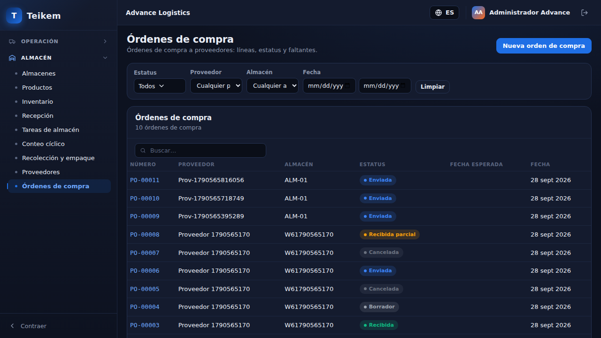

Columnas: número, proveedor, almacén, estatus, fecha esperada y fecha. Filtros (Lote 12): **Estatus**, **Proveedor** y
**Almacén**, los tres de selección **múltiple con buscador** (la orden aparece si su proveedor o almacén es cualquiera de los
elegidos), y **Fecha** (rango). **Limpiar** los quita. Ya no hay buscador dentro de la tabla.

**Qué hace cada botón.**
- **Nueva orden de compra**: **Proveedor** (desplegable con buscador, «Buscar proveedor…»; obligatorio), **Almacén**
  (obligatorio **en la pantalla**), fecha esperada, notas y las líneas (**Producto** con buscador —solo productos propios—,
  **Cantidad ordenada**, **Costo unitario**); nace en Borrador. Debe haber **al menos una línea con cantidad ordenada mayor
  que cero**; el aviso aparece sobre las líneas. (En el API el almacén es opcional cuando la compañía tiene un solo almacén
  activo; la pantalla siempre lo pide.)

  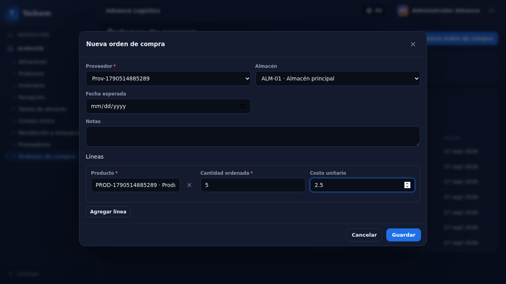

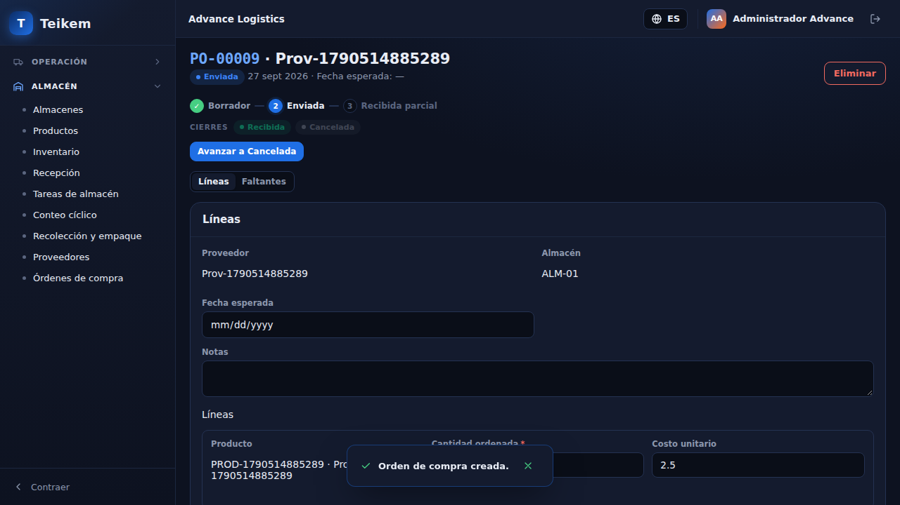

**Qué se ve (ficha).** Barra de estatus con botones **Avanzar a Enviada** y **Avanzar a Cancelada** (los únicos
manuales; Recibida parcial/Recibida los pone el sistema al confirmar un recibo); pestañas **Líneas** (editable solo
en Borrador; una línea con recepciones muestra la nota "Esta línea ya tiene recepciones: no se elimina, no baja de lo
recibido y su costo no cambia.") y **Faltantes** (líneas pendientes con **Resolver**). El **proveedor** y el **almacén** son
campos editables **solo mientras la orden está en Borrador** (proveedor con buscador sobre los activos, almacén con el mismo
selector del alta; ambos obligatorios) y se guardan junto con las líneas; la pantalla manda solo lo que cambió. Fuera de Borrador se
muestran de solo lectura (el servidor responde 409 "El proveedor y el almacén solo se cambian mientras la orden de compra está en
borrador."); si se equivocó y la orden ya se envió, cancélela y cree otra. Al guardar las líneas se aplica la misma regla del alta:
al menos una línea con cantidad ordenada mayor que cero.

**Qué hace cada botón (ficha).**
- **Eliminar** (cabecera, solo si el servidor permite `canDelete`: sin recepciones ni recibo abierto).
- **Agregar línea** / **Quitar línea**: solo en Borrador.
- **Resolver** (pestaña Faltantes): elige la acción —**Cerrar** (dar por perdido), **Reordenar** (exige además
  `purchasing.manage`) o **Ajuste manual** (exige además el módulo `WMS_LOTSERIAL`; entra a inventario con posición,
  lote/series si aplica).

**Permiso.** `purchasing.view` (listar, ver ficha y faltantes); **`purchasing.manage`** (crear/editar/enviar/cancelar/
eliminar la orden, y proveedores); **`inventory.adjust`** para resolver un faltante. Módulo `PURCHASING`.

**Estatus y transiciones.**

| De → a | Quién | Qué dispara |
|---|---|---|
| Borrador → Enviada | `purchasing.manage` (botón del pipeline) | — |
| Enviada/Borrador/Recibida parcial → Cancelada | `purchasing.manage` (botón del pipeline) | 409 "Una orden de compra recibida completa no se cancela." si ya está Recibida |
| Enviada → Recibida parcial → Recibida | el sistema | Al confirmar un recibo contra la orden |

**Validaciones y mensajes.**

| Campo | Regla | Mensaje |
|---|---|---|
| Proveedor | obligatorio | "Indique el proveedor." |
| Almacén | obligatorio en la pantalla (el API lo acepta vacío solo con un único almacén activo) | "Indique el almacén." |
| Líneas | al menos una con cantidad ordenada > 0 (alta y edición de líneas) | "Agregue al menos una línea con cantidad ordenada mayor que cero." |
| Producto (línea) | obligatorio, solo propio | "Indique el producto." / "La orden de compra solo admite productos propios; {sku} pertenece a un cliente." |
| Cantidad ordenada | > 0, ≤ 3 decimales | "La cantidad ordenada debe ser mayor que cero." / "La cantidad admite como máximo 3 decimales." |
| Costo unitario | ≥ 0, ≤ 4 decimales | "El costo unitario no puede ser negativo." / "El costo unitario admite como máximo 4 decimales." |
| Producto (línea) | sin repetir | "Ese producto ya está en la orden de compra." |
| Líneas | al menos una, máx. 200 | "La orden de compra debe tener al menos una línea." / "La orden de compra admite como máximo 200 líneas." |
| Cantidad (resolver faltante) | > 0, ≤ pendiente | "La cantidad debe ser mayor que cero." / "La cantidad no puede exceder el faltante pendiente." |
| Posición (ajuste manual) | obligatoria | "Indique la posición donde entra la mercancía." |
| Lote/series (ajuste manual) | según seguimiento del producto | "El producto {sku} se controla por lote; indique el lote." / "El producto {sku} se controla por serie; capture los números de serie." |

Fuera de Borrador, editar la orden (sin la capacidad habilitada por el estatus del tenant) responde 422 "El estatus
actual no permite la acción 'EDIT_PURCHASE_ORDER'."

## Citas de muelle

**Para qué sirve.** Agenda del uso de los muelles del almacén, enlazada opcionalmente a un aviso de llegada o a un
viaje (demo de cruce de muelle).

**Cómo se llega.** Menú **Almacén › Citas de muelle**, dirección `/warehouse/dock-appointments`.

**Qué se ve.** Columnas: muelle, dirección (entrada/salida), inicio, fin, estatus y referencia. Filtros: almacén,
muelle, estatus y rango de fecha.

**Qué hace cada botón.**
- **Nueva cita**: almacén, muelle, dirección, inicio/fin programados y, opcionalmente, a qué se enlaza (ninguno,
  aviso de llegada o viaje).
- **Reprogramar** (por fila): cambia inicio/fin.
- **Cambiar estatus** (por fila): abre el control de pipeline (Programada → Llegó → Completada; No presentado/
  Cancelada laterales).

**Permiso.** `inventory.view` (ver la agenda); **`warehouse.crossdock`** para agendar, reprogramar y cambiar estatus.
Módulo **Cruce de muelle** (`CROSSDOCK`, apagado por defecto).

**Validaciones y mensajes.**

| Campo | Regla | Mensaje |
|---|---|---|
| Muelle | obligatorio | "Indique el muelle." |
| Inicio programado | obligatorio | "Indique el inicio programado." |
| Dirección | obligatoria | "Indique la dirección de la cita (entrada o salida)." |
| Enlace a aviso de llegada | debe ser de entrada | "Una cita de un aviso de llegada debe ser de entrada (INBOUND)." |
| Enlace | a lo sumo uno | "Una cita se enlaza a un aviso de llegada o a un viaje, no a ambos." |

## Cruce de muelle: planes

**Para qué sirve.** Asigna líneas de un recibo directamente a órdenes de salida, sin pasar por una posición de
reserva (demo del flujo de cruce de muelle).

**Cómo se llega.** Menú **Almacén › Cruce de muelle**, dirección `/warehouse/cross-dock-plans`; ficha en
`/warehouse/cross-dock-plans/:id`.

**Qué se ve (lista).** Columnas: plan, almacén, estatus, asignaciones, cantidad asignada/movida/faltante y creado.
Filtros: almacén y estatus.

**Qué hace cada botón.**
- **Nuevo plan**: almacén y, opcionalmente, la zona de tránsito (STAGING).

**Qué se ve (ficha).** Barra de estatus de solo lectura (Abierto → Asignado → Completado: lo mueve el sistema según
las asignaciones), tabla de "Líneas disponibles" (candidatas a asignar) y tabla de "Asignaciones" con su propio
estatus (Planeada → Movida/Cancelada).

**Qué hace cada botón (ficha).**
- **Completar plan** (cabecera, mientras no esté Completado): si quedan asignaciones sin mover, el servidor la
  rechaza.
- **Asignar a una orden** (por línea candidata, si tiene disponible): busca la orden por número exacto, factura o
  lote de empaque, y la cantidad.
- **Mover** (por asignación Planeada): registra el movimiento físico, con comentario opcional.
- **Cancelar asignación** (por asignación Planeada).

**Permiso.** `inventory.view` (ver planes y candidatos); **`warehouse.crossdock`** para crear el plan, asignar,
cancelar, mover y completar. Módulo `CROSSDOCK`.

**Validaciones y mensajes.**

| Mensaje | Cuándo aparece |
|---|---|
| "Elija una orden." | Al asignar sin elegir la orden destino |
| "Sin coincidencias exactas." | La búsqueda de orden (número/factura/lote de empaque) no encontró nada exacto |
| "Para buscar órdenes necesita el permiso orders.view y el módulo LTL_GROUND." | Sin ese permiso/módulo, al intentar buscar una orden para asignar |
| "Si quedan asignaciones pendientes de mover, el servidor rechazará la acción." | Ayuda antes de confirmar **Completar plan** |

## Consulta de órdenes (solo lectura)

**Para qué sirve.** Da contexto de almacén sobre las órdenes de transporte (por ejemplo, la que creó "Empacar" en
Recolección y empaque), sin dar de alta ni editar nada: es una consulta.

**Cómo se llega.** Menú **Operación › Órdenes**, dirección `/orders`; ficha en `/orders/:publicId`.

**Qué se ve (lista).**

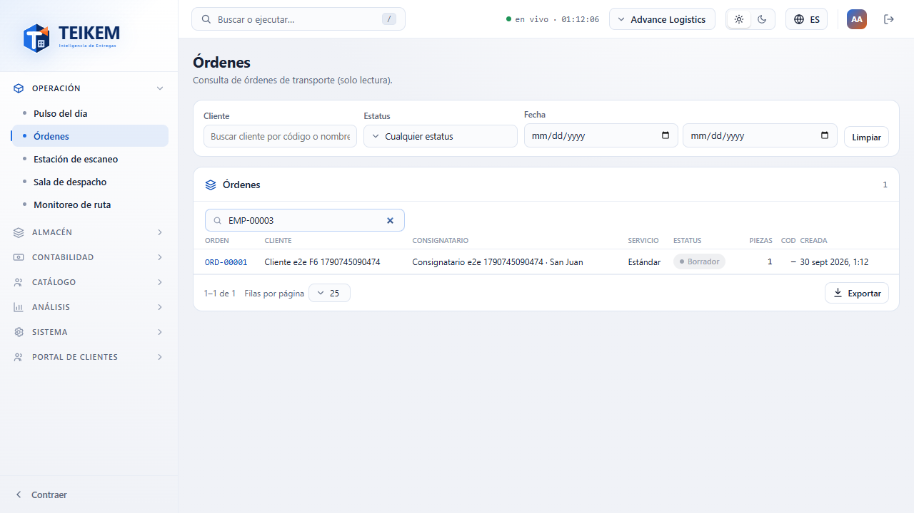

Columnas: orden, cliente, consignatario, servicio, estatus, piezas, COD y creada. Filtros: cliente, estatus y rango
de fecha. Sin botón "Nuevo" ni acciones por fila.

**Qué se ve (ficha).**

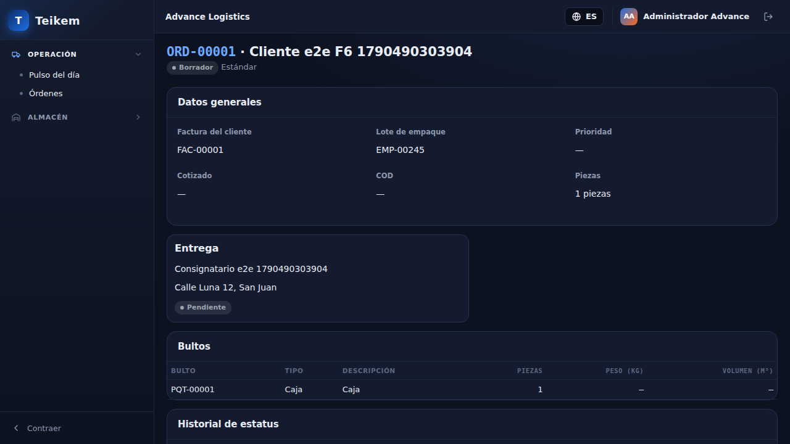

Paneles apilados (no pestañas): **Datos generales** (factura, lote de empaque, prioridad, cotizado, COD, piezas),
**Recogida**/**Entrega** (nombre, dirección, ventana de horario, estatus de la parada), **Bultos** (número, tipo,
descripción, piezas, peso, volumen) e **Historial de estatus** de solo lectura. Sin `StatusPipeline` interactivo: no
se puede cambiar el estatus desde aquí.

**Permiso.** `orders.view`. Módulo **Transporte terrestre** (`LTL_GROUND`).

**Mensajes que puede ver.** "La orden no existe o no pertenece a su compañía." si el enlace es incorrecto o la orden
es de otra compañía.

## Preguntas frecuentes de este capítulo

**¿Por qué "Órdenes de compra" no me deja editar las líneas si ya está Enviada?** Solo se edita en Borrador; una vez
enviada, cambiar cantidades o costos podría desajustar lo que el proveedor ya está preparando. Si necesita corregirla,
pida a un administrador que revierta el estatus o cancele la orden y cree una nueva.

**¿Por qué no puedo elegir un producto de un cliente en la orden de compra?** Las órdenes de compra son para reponer
inventario propio; el selector de producto ya viene filtrado a solo propios para que no llegue a intentarlo (el
servidor lo rechazaría de todos modos con "La orden de compra solo admite productos propios...").

**¿Por qué el recibo no tiene un botón para pasarlo a "Acomodado" a mano?** Porque ese paso lo decide el sistema: pasa solo cuando
se completa (o se cancela) la última tarea de acomodo que generó el recibo. Vaya a **Recibo › Acomodo pendiente** para completarlas.
Igual, "Discrepancia", "Recibiendo" y "Completado" los mueve el sistema según lo que captura y confirma.

**¿Dónde quedó "Tareas de almacén"?** Ya no hay una cola con todas las tareas: el acomodo está en Recibo › Acomodo pendiente, el
reabasto en Recolección y empaque › Reabasto, el conteo en Conteo cíclico y el cruce en Cruce de muelle.

**¿Cómo abro el encabezado de un recibo?** Con doble clic en el recibo de la lista o con el lápiz del detalle (Editar el encabezado
del recibo). Si el recibo ya está confirmado se abre en solo lectura.

**¿Cómo vuelvo la barra de Recolección y empaque a 60/40?** Enfoque la barra y pulse Enter, o haga doble clic en ella.

**¿Cómo pongo un almacén en directo?** En **Almacenes**, abra el almacén, pestaña **Datos**, grupo **Recepción**: cambie el **Modo de recepción** a "Directo a posición", guarde y confirme. Los recibos **nuevos** nacen
directos; los abiertos conservan su modo y las tareas de acomodo pendientes siguen.

**¿Por qué mi recibo directo no me deja confirmar?** Porque falta la posición destino en alguna línea que recibe algo ("Falta la posición destino en {n} línea(s)."). Elíjala en la columna **Posición destino** o pulse **Usar posiciones
sugeridas**.

**¿Puedo pasarme del cupo de una posición?** Sí: el chip naranja **«Excede el cupo de {posición}: caben {n}»** solo avisa. Guarde y confirme igual, y transfiera el sobrante después.

**¿Por qué no veo las posiciones de recepción en "Posición destino"?** Porque en un recibo directo la mercancía se guarda, no se recibe en recepción: el selector no ofrece posiciones de recepción (`STAGING`) ni de cruce de muelle
(`CROSSDOCK`). La cuarentena sí se ofrece.

**¿Por qué el selector de Posición en Recolección y empaque solo muestra algunas posiciones?** Porque solo ofrece las posiciones donde el producto elegido tiene existencia disponible (con su cantidad), en el orden en que el sistema
las usaría. Sin producto, el campo está apagado.

**¿Por qué los números tienen coma?** Formato de Puerto Rico: coma para los miles y punto para los decimales (`61,023`). Ver "Exportar: compañía, filtros, fechas y números".

**¿Por qué "Cruce de muelle" no aparece en mi menú?** El módulo `CROSSDOCK` viene apagado por defecto; pida a un
administrador que lo encienda en Configuración si su compañía lo necesita.

**¿Qué significa el chip "Bajo mínimo" en Productos?** Que el disponible de ese producto está por debajo del "Mínimo
de inventario" configurado en su ficha; no bloquea nada, es solo una señal para reabastecer.

**¿Por qué la ocupación de una zona dice "unidades · sin cupo configurado"?** Porque ninguna de sus posiciones activas tiene
"Cupo máximo". La ocupación se calcula contra la suma del cupo de las posiciones; sin cupo no hay porcentaje. Abra la
zona en Posiciones o en la pestaña Posiciones de la ficha y escriba el cupo de cada posición, o use **Asignar cupo** para
ponerlo a muchas a la vez.

**¿Por qué el recuadro de una zona dice "N posiciones sin cupo"?** Porque la zona mezcla posiciones con cupo y sin cupo. El
porcentaje se calcula solo con las que tienen cupo; las otras se avisan aparte para que no falseen el número.

**¿Cómo exporto una tabla y qué exporta?** Con el botón **Exportar** del pie de la tabla: elija Excel, CSV o PDF. Sale todo lo
que cumple los filtros de la pantalla (no solo la página que está viendo), hasta 10.000 filas.

**¿Por qué mi ciudad sale en mayúsculas?** Porque la ciudad viene del catálogo postal. Fuera de Puerto Rico es el nombre
postal oficial (`NEW YORK`); en Puerto Rico se guarda el municipio con su escritura normal (`Toa Baja`). No se puede
escribir a mano desde la pantalla.

**¿Por qué no puedo cambiar el código ni la zona de una posición?** Es una regla del sistema: el código y la zona de
una posición quedan fijos desde el alta ("El código y la zona de la posición no se pueden cambiar."). Lo que sí puede cambiar
es el pasillo, rack, nivel, posición, el cupo y el peso máximo (el código no se recalcula). Si necesita otro código u otra
zona, cree una posición nueva y dé de baja la anterior (solo procede sin inventario ni tareas abiertas). El **código de una
zona**, en cambio, sí se puede editar.

**¿Adónde se fue «Ubicaciones»?** Se llama **Posiciones** desde el Lote 12 (mismo lugar del menú, misma dirección
`/warehouse/locations`). En inglés es «Bins».

**¿Por qué el reporte de inventario no lista productos con 0?** Porque es una foto de lo que hay: solo entran los productos
con existencia en mano distinta de cero. El aviso del reporte dice cuántos quedaron fuera. Para ver también los de cero use
la tabla de la pantalla o **Exportar**.

**¿Por qué el reporte de ajustes no trae los saldos iniciales de la migración?** Porque se registraron como ajustes (motivo
OPENING_BALANCE) pero no son ajustes de la operación. El aviso del reporte dice cuántos se excluyeron; siguen en el Kárdex.

**¿Por qué el valor del inventario sale «—»?** Porque el producto no tiene **Costo de compra**. El valor es Total × costo de
compra; sin costo no se calcula ni se suma. Capture el costo en el producto y vuelva a generar el reporte.

**¿Por qué, con un filtro de Almacén en Productos, siguen saliendo productos sin existencia?** Porque el filtro de Almacén
acota las **cantidades** de cada fila a ese almacén, no quita productos. Para ver solo los activos con existencia en mano, use el
indicador «Unidades totales».

**¿Cómo corrijo el cupo de muchas posiciones a la vez?** Con **Asignar cupo** en Posiciones (ver esa sección): elija el
alcance, escriba el cupo, revise «Se aplicará a N posiciones» y aplique.

**¿Por qué no puedo cambiar el proveedor ni el almacén de una orden de compra?** Solo se cambian mientras la orden está en
**Borrador**. Una vez enviada quedan fijos: cancele la orden y cree otra con los datos correctos.

**¿Dónde quedó «Ajustes de inventario»?** Salió del menú (Lote 14). Esa pantalla mostraba compras recibidas de forma incompleta, no ajustes. Los
faltantes se resuelven en la ficha de cada orden de compra, pestaña **Faltantes**; los ajustes de inventario, en **Transferencias y ajustes** y en
el Kárdex. La dirección vieja lleva a Compras.

**¿Por qué el ajuste pide «Subir» o «Bajar» en vez de un número con signo?** Porque así lo decidió el dueño (Lote 14): la cantidad se escribe en
positivo y la dirección dice si suma o resta; además, los motivos cambian según la dirección (Encontrado solo al subir; Daño, Pérdida y Vencido solo
al bajar). El API sigue recibiendo la cantidad con signo.

**¿Por qué algunos filtros del Kárdex se ven atenuados?** Las tres pestañas comparten los filtros, pero cada una aplica solo algunos; los que no
aplica se atenúan y una nota bajo la barra los nombra. No se pierden: valen al volver a la pestaña donde aplican.

**¿Cómo veo qué documento originó un movimiento?** Haga clic en la fila del Kárdex (o de Ajustes o Transferencias): el detalle muestra el
**Documento de origen** con su estatus y un botón **Abrir** (aparece solo si usted tiene el permiso y el módulo de esa pantalla), y los movimientos
relacionados.

**¿Cómo confirmo un conteo?** Cuente las líneas (escriba el SKU o el código de barras en el escáner y pulse Enter, o escriba la cantidad en la
propia fila) y pulse **Confirmar conteo y ajustar**; queda en **Concordancia** o **Diferencia**. Ya no hay «Terminar conteo» ni «Reconciliar».

**¿Cómo asigno un conteo?** Con el ícono de persona con «+» en la fila de la lista de conteos (necesita `warehouse.manage`; para elegir a quién,
también `admin.users`).

**¿Qué hago con un descuadre?** Vea Kárdex de movimientos › Conciliación. Corregir el saldo según el Kárdex o descartar con una nota; un ajuste o un
conteo no lo arreglan (manual 06, sección 3.3).
