# F7A — Pulso: panel Almacén con filtro y Actividad reciente

Capítulo del manual de pantallas del Lote F7A (frontend), sobre la pantalla de inicio **Pulso del día** (`/`), ya
descrita en el capítulo F1. Este lote agrega un filtro al panel "Almacén" (Lote F6) y un panel nuevo, "Actividad
reciente". Ninguna pantalla tiene ruta propia: las dos viven debajo de los indicadores y gráficos de Pulso.
Capturas en `img/f7a-*.png`. El Lote 14 agrega el panel **Necesita tu atención** (arriba de todo, captura `img/l14-pulso-atencion.png`) y cambia la cifra de
**Conteos abiertos** del panel Almacén (ver las dos secciones nuevas, antes de "Actividad reciente"). El **Lote 15** agrega la franja **Almacén hoy** (arriba de todo), las filas fijas, los indicadores por módulo, los gráficos siempre dibujados y los gráficos "De la compañía" (secciones nuevas al principio; capturas `img/l15-*.png`).

## Pulso del día: franja "Almacén hoy · últimos 7 días" (Lote 15)

**Para qué sirve.** Es lo primero que se ve bajo la fecha: cuatro números de Almacén con lo de **hoy** y cómo vienen los últimos 7 días,
sin entrar a ninguna pantalla. Cada tarjeta es un enlace al detalle. Qué cuenta cada una, con sus reglas, está en el capítulo
[07, sección 5.1](../07-pulso-y-actividad.md).

**Cómo se llega.** Aparece sola arriba del Pulso (`/`), debajo de la fecha y de los botones "Organizar". No se pide nada aparte. Los números
de las capturas son los de la demo del día en que se tomaron (por eso cambian de una captura a otra).

**Qué se ve.**

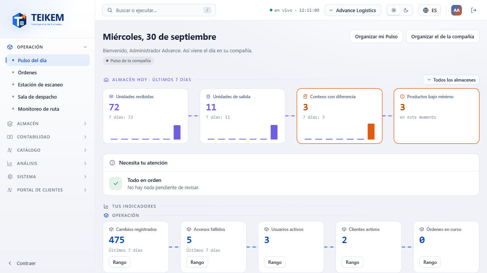

- **Título:** "ALMACÉN HOY · ÚLTIMOS 7 DÍAS", con el ícono de almacén, en violeta. A la derecha, un selector de almacén ("Todos los
  almacenes" o el código del almacén).
- **Cuatro tarjetas unidas por una tubería punteada violeta:** **Unidades recibidas**, **Unidades de salida**, **Conteos con diferencia** y
  **Productos bajo mínimo**.
- **En cada una de las tres primeras:** el **número grande de hoy** (violeta), el texto pequeño **"7 días: N"** con el total de la semana y
  **7 barritas**, una por día. La de la derecha es **hoy** y es la que crece durante el día; un día sin movimiento es una línea (barrita
  vacía). En la captura, los seis días anteriores están vacíos y solo hoy tiene barra.
- **Productos bajo mínimo:** el número de **ahora**, "en este momento" y **sin barritas**.
- **Naranja** (borde y número): "Conteos con diferencia" si hoy hubo alguno (su barrita de hoy también es naranja) y "Productos bajo
  mínimo" si hay alguno. En la captura ambas están en naranja.
- **Al pasar el mouse por una barrita** sale el detalle del día con la fecha larga y la cantidad; en la de hoy empieza con "Hoy":

  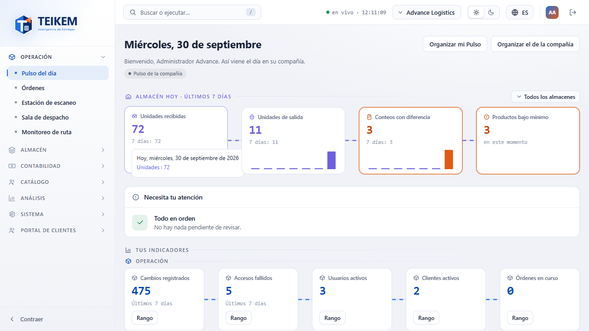

  Las barritas solo muestran: hacer clic en la tarjeta (no en la barrita) lleva al detalle.

**A dónde lleva el clic en una tarjeta.** Siempre con el almacén elegido y, en el Kárdex, con los 7 días:

- **Unidades recibidas** → Kárdex de movimientos con el tipo **Recepción** y las fechas de los 7 días.

  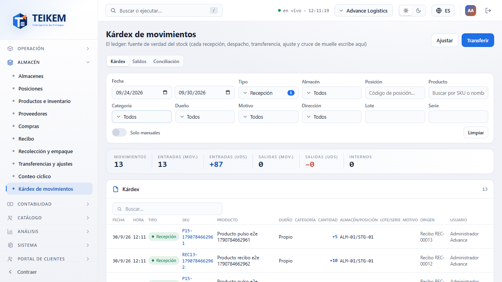

- **Unidades de salida** → Kárdex con los tipos **Despacho** y **Cruce de muelle** y los 7 días.
- **Conteos con diferencia** → Conteo cíclico con el estatus **Diferencia** ya elegido (sin fechas). La lista trae los conteos en Diferencia y
  el primero abierto a la derecha.

  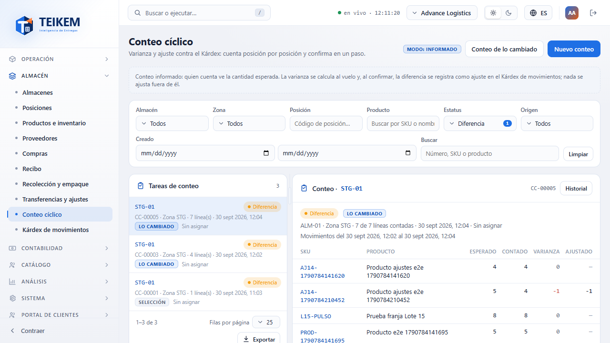

- **Productos bajo mínimo** → Productos e inventario con el recuadro **Bajo mínimo** marcado (en naranja) y la tabla de esos productos.

  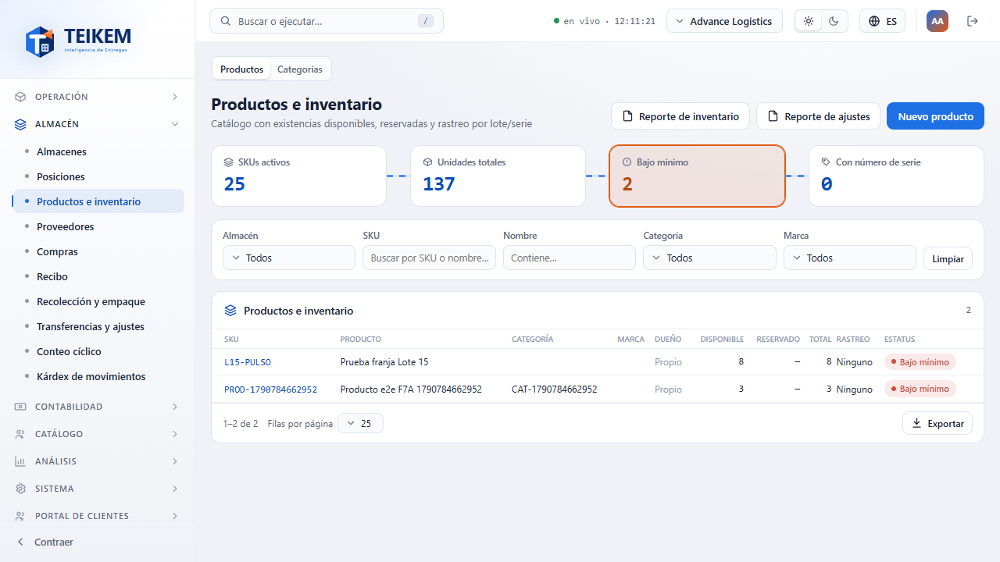

> **Ojo con la suma del Kárdex.** El Kárdex filtra por tipo de movimiento y la tarjeta es un neto (las recolecciones eliminadas restan en
> "Unidades de salida", y las diferencias de recibo suman en "Unidades recibidas"), así que la suma que ve en el Kárdex puede no coincidir
> con la tarjeta. Ver la FAQ.

**El almacén.** El selector de la franja es el **mismo** del panel "Almacén" de más abajo: cambiarlo en uno cambia el otro, y se recuerda por
usuario en ese navegador. Los enlaces de las tarjetas llevan el almacén elegido (Kárdex, Conteo cíclico y Productos e inventario lo leen de la
dirección al abrirse).

**Mensajes que puede ver.** "…" en cada número mientras carga; "—" si la consulta falla (por ejemplo, un 403 al cambiar de compañía),
sin sacarlo del Pulso. No hay mensajes de error propios.

**Permiso.** Se pinta con `pulse.warehouse`, `inventory.view` y el módulo **Almacén y lote/serie** (`WMS_LOTSERIAL`) encendido. Se puede ocultar
o mover con Organizar (ver más abajo).

## Pulso del día: encabezado fijo al desplazarse (Lote 15; ajustado el 2026-10-05)

Al bajar por el Pulso queda **fijo arriba solo el encabezado**: la fecha con "Organizar mi Pulso" y "Organizar el de la compañía", el saludo
("Bienvenido… Así viene el día en su compañía.") y el chip "Pulso de la compañía". La franja "Almacén hoy", "Necesita tu atención" y todo lo demás
se van con el desplazamiento: **ninguna sección queda fija** (decisión del dueño; en el Lote 15 original la franja
"Almacén hoy" también se fijaba, y la captura `img/l15-pulso-fijas.png` puede mostrarla así).

- Mientras organiza, no hay filas fijas: la barra de Organizar (con "Listo") ya se queda arriba.
- Con el teclado, el foco no queda tapado por la fila fija: la pantalla deja un margen al desplazarse a lo que recibe el foco.
- Solo pasa en la pantalla de inicio: Análisis → Indicadores y Gráficos no cambian.

## Pulso del día: indicadores en una fila por módulo (Lote 15)

"Tus indicadores" se muestra ahora **por módulo**: una fila con su etiqueta (**Operación**, **Almacén** y, si hay indicadores, **Contabilidad**,
en ese orden, el del menú). Cada indicador conserva su rango ("Últimos 7 días") y su botón **Rango**; el módulo ya no se repite en la
tarjeta.

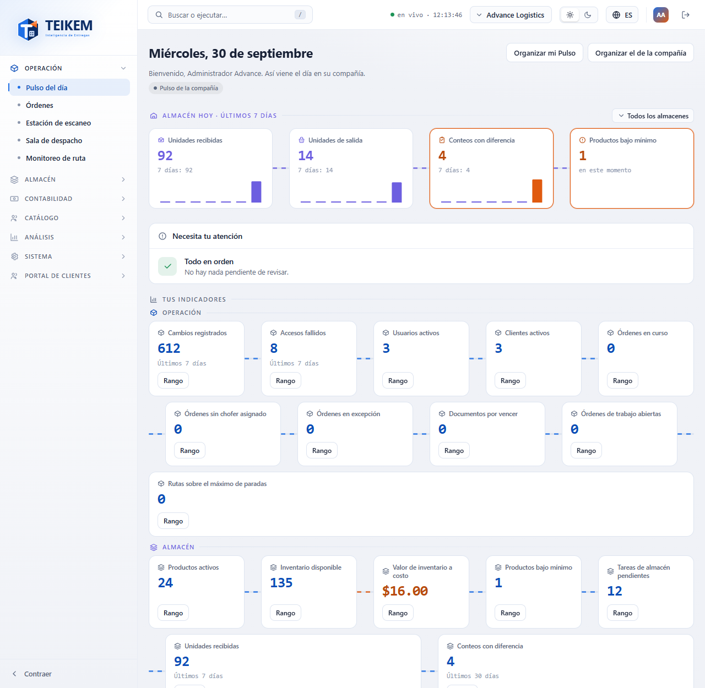

En **Organizar** los indicadores se ordenan solo dentro de su fila (con la ayuda "Los indicadores se muestran en una línea por módulo; aquí se
ordenan dentro de su línea.").

## Pulso del día: "Tus gráficos" siempre como gráfico (Lote 15)

Todos los gráficos de "Tus gráficos" se dibujan como gráfico, aunque tengan uno, dos o tres puntos (antes se mostraba una lista). Hay **como
máximo 2 por fila** (en el celular, uno debajo del otro). Los dos primeros son los de almacén: **"Valor de inventario por categoría"**, una dona con
el total en el centro, a la izquierda, y **"Movimientos de inventario por tipo"**, barras de unidades en positivo de los últimos 7 días, a la
derecha.

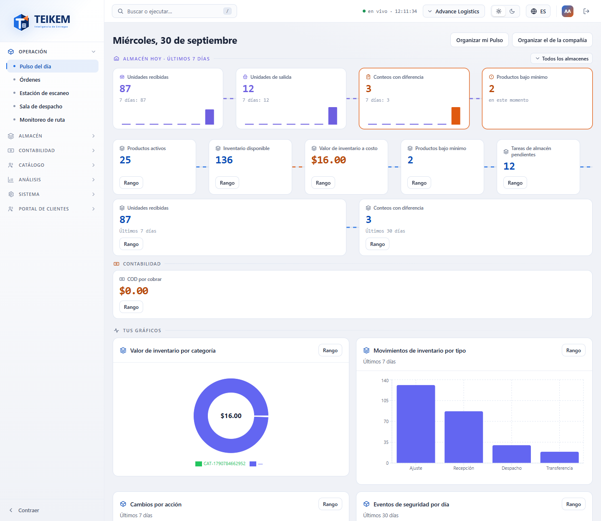

En la captura se ve arriba la franja, luego las dos filas de indicadores de Almacén y Contabilidad, y abajo los gráficos. La dona de la demo tiene
una sola categoría con valor (por eso una sola rebanada, dibujada igual, con "$16.00" al centro). Si una dona o unas barras tienen más de 8 grupos,
el último punto es **"Otras"**, que junta el resto.

## Análisis → Gráficos: los gráficos "De la compañía" (Lote 15)

Los dos gráficos de almacén ya no son de fábrica: en Análisis → Gráficos llevan el chip **"De la compañía"** junto al nombre, se pueden editar y
eliminar (con `analytics.manage`) y se pueden mostrar u ocultar en el Pulso como cualquier otro.

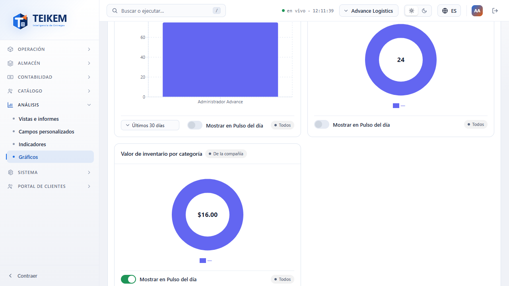

Al **Eliminar** uno de la compañía, la confirmación avisa: "¿Eliminar el gráfico {nombre}? Es de la compañía: una vez eliminado no se vuelve a
crear." Quien no tiene `analytics.manage` no ve Editar ni Eliminar.

## Pulso del día: organizar con la franja (Lote 15)

Desde **Organizar mi Pulso** y **Organizar el de la compañía** el panel "Almacén hoy" aparece en la lista de paneles: se mueve, se oculta y se
muestra como los demás. Bajo el título hay una nota: "La franja que quede justo debajo de la fecha se queda fija al desplazarse; si la oculta o la
baja, solo queda fija la fecha." Sin ningún cambio, la franja va primera. Ver el capítulo [F8a](f8a-menu-sistema-analisis-y-marca.md).

## Pulso del día: panel "Almacén" con filtro

**Para qué sirve.** Vistazo del estado actual del almacén (saldo, documentos abiertos), con la opción de acotarlo a
un solo almacén y, para el saldo, a una categoría o un producto concreto — por ejemplo, para revisar de un vistazo si
un producto puntual está bajo su mínimo, sin ir a la pantalla de Inventario.

**Cómo se llega.** Aparece automáticamente debajo de los indicadores y gráficos de Pulso (`/`), sin pedir nada aparte.

**Qué se ve.**

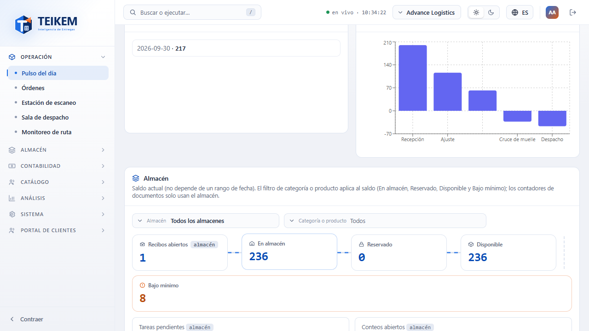

Una fila de filtros y, debajo, seis tarjetas: **En mano**, **Disponible** (con "Reservado: en mano − disponible"),
**Bajo mínimo**, **Recibos abiertos**, **Tareas pendientes** (con el desglose por tipo: Putaway, Reabasto, Conteo,
Cruce de muelle) y **Conteos abiertos** (Pendientes y Contados; ver "Conteos abiertos" más abajo). Las tres últimas llevan la marca **almacén**: solo reciben el filtro de
almacén, nunca el de categoría o producto (el texto de la cabecera del panel lo aclara, y pasar el mouse o el foco
sobre la marca muestra "Solo aplica el filtro de almacén (no el de categoría o producto)."). Estas tarjetas no
tienen el botón "Rango" de las demás: son saldo actual, no de un período.

**Qué hace cada control.**

- **Almacén**: lista desplegable con "Todos los almacenes" y los almacenes activos de su compañía; se aplica a las
  seis tarjetas.
- **Categoría o producto**: un combobox con buscador, dos secciones (Categorías y Productos) y un botón "✕" para
  quitar la selección. Solo afecta a En mano, Disponible y Bajo mínimo.

  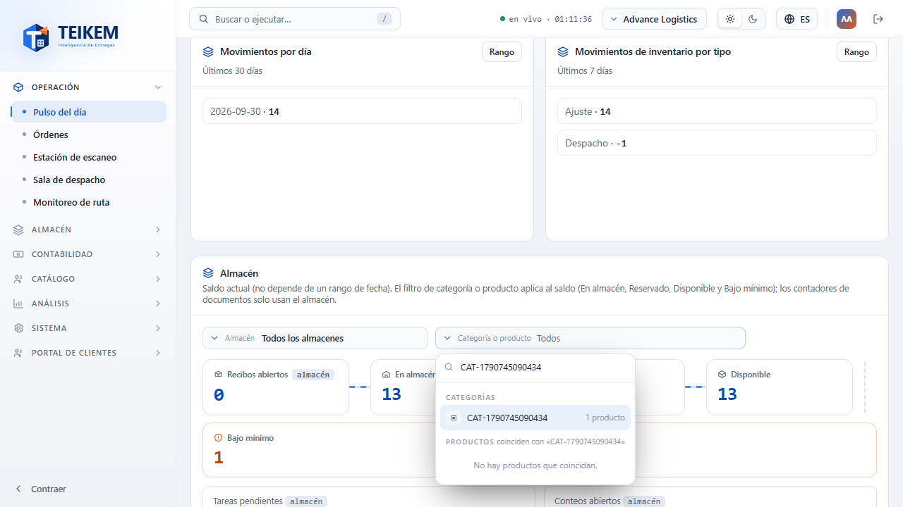

  - Escriba el nombre de una categoría o de un producto (por SKU o nombre); las categorías se filtran al momento,
    los productos se buscan en el servidor una cuarta parte de segundo después de dejar de escribir.
  - Elija una **categoría**: "En mano" muestra su subtítulo con el nombre y cuántos productos tiene (contando sus
    subcategorías); "Bajo mínimo" cuenta los productos de esa categoría por debajo de su mínimo y ofrece el enlace
    **"Ver en Inventario ›"**.

    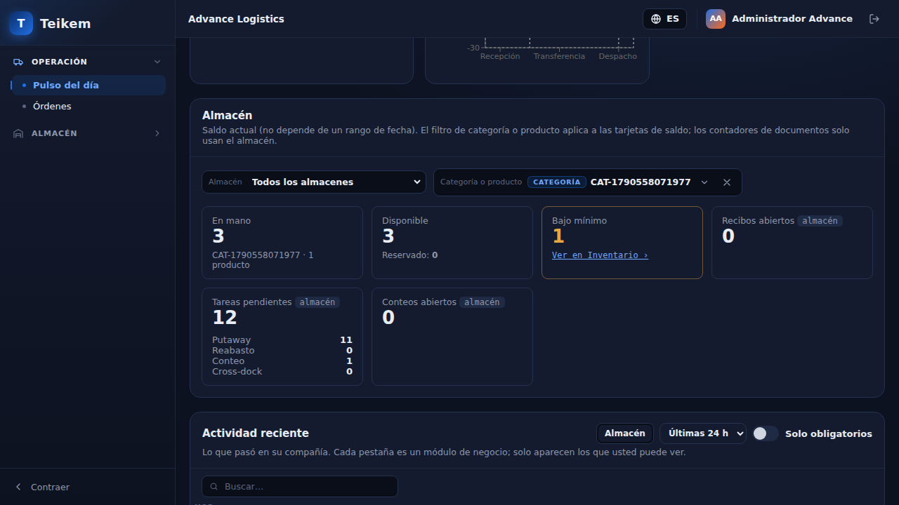
  - Elija un **producto**: "En mano" muestra su SKU (y su mínimo, si tiene); "Bajo mínimo" pasa a **Sí**/**No** con
    el enlace **"Ver Kárdex de {SKU} ›"**.

    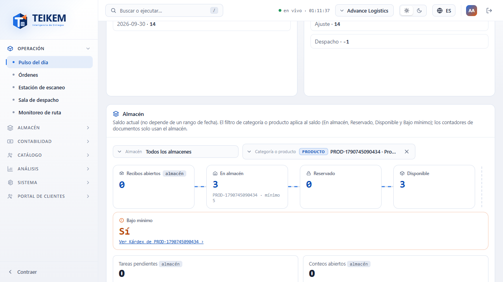
  - Teclado: flechas ↑/↓ recorren las opciones, Enter elige, Escape cierra sin elegir.
- **Enlaces "Ver en Inventario ›" / "Ver Kárdex de… ›"**: llevan a la pantalla Inventario (capítulo 06) ya con el
  mismo almacén y la misma categoría o producto de la tarjeta, para que lo que vea ahí cuadre con la cifra que traía
  Pulso.

  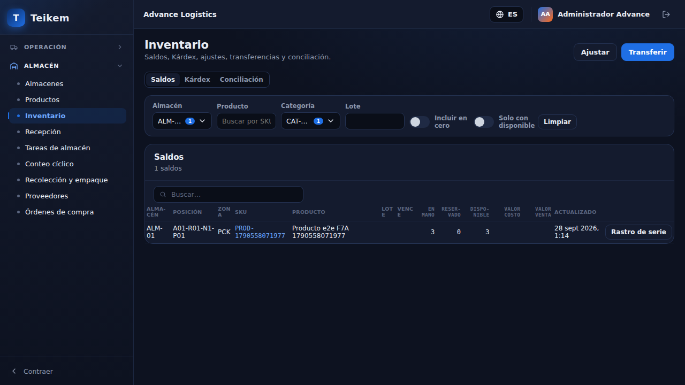
  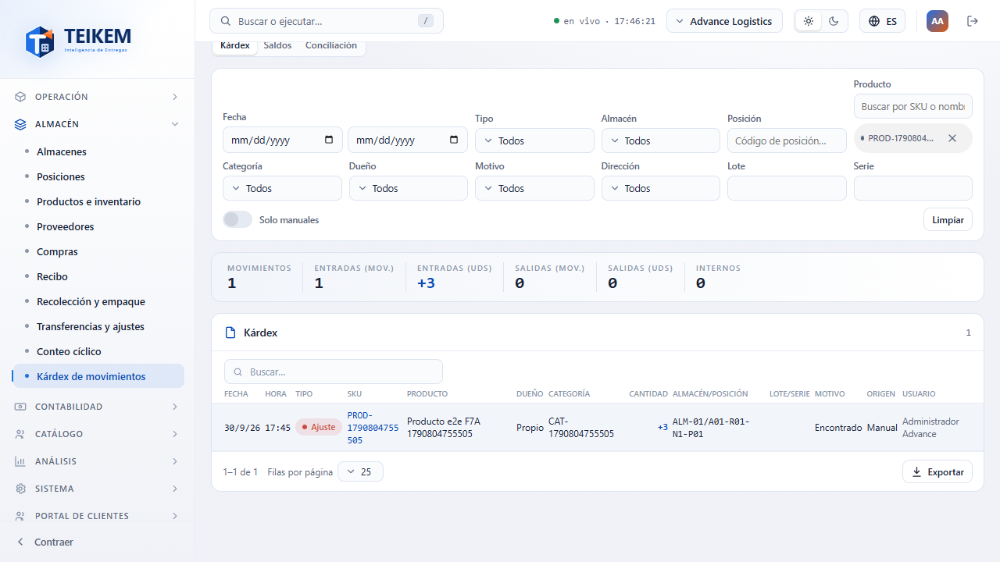

**La selección se recuerda.** Almacén y categoría/producto elegidos se guardan para su usuario en este mismo
navegador y se restauran la próxima vez que abra Pulso (incluida una recarga de la página); si mientras tanto ese
almacén, categoría o producto se dio de baja o se eliminó, la selección se descarta sola, sin ningún mensaje de
error, y el panel vuelve a "Todos los almacenes" / sin categoría ni producto.

**Permiso.** Se pinta solo con `inventory.view` **y** el módulo **Almacén y lote/serie** (`WMS_LOTSERIAL`)
encendido; sin alguno de los dos, Pulso se ve igual que en F1, sin este panel y sin pedir nada al servidor.

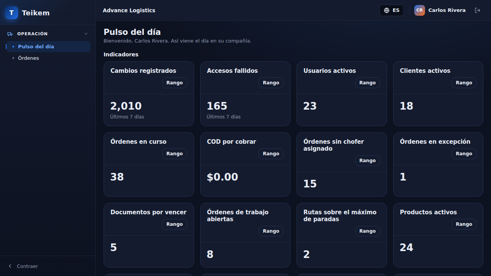

**Mensajes que puede ver.** Mientras carga cada tarjeta, muestra "…"; si una consulta falla (por ejemplo, un 403 al
cambiar de compañía a una sin permiso), muestra "—" en esa tarjeta en vez de sacarlo de la pantalla de inicio. Si no
puede consultar productos (sin `inventory.view` en una compañía secundaria, caso raro), la sección "Productos" del
control muestra "Su usuario no puede consultar productos." en vez de la lista.

## Pulso del día: panel "Necesita tu atención"

**Para qué sirve.** Es lo primero que se ve en el Pulso después de la franja "Almacén hoy" (Lote 15): lista lo que **necesita que alguien lo revise**. Hoy trae un solo tipo de aviso, el
**descuadre Kárdex ↔ saldo** (el saldo de una posición no coincide con lo que suman los movimientos; ver el capítulo
[06, sección 3.3](../06-inventario-y-almacen.md)). Sin nada pendiente, dice que todo está en orden.

**Cómo se llega.** Aparece automáticamente en la parte de arriba de Pulso (`/`), debajo de la franja "Almacén hoy" y antes de "Tus indicadores". Se desplaza con el resto (no es fija).

**Qué se ve.**

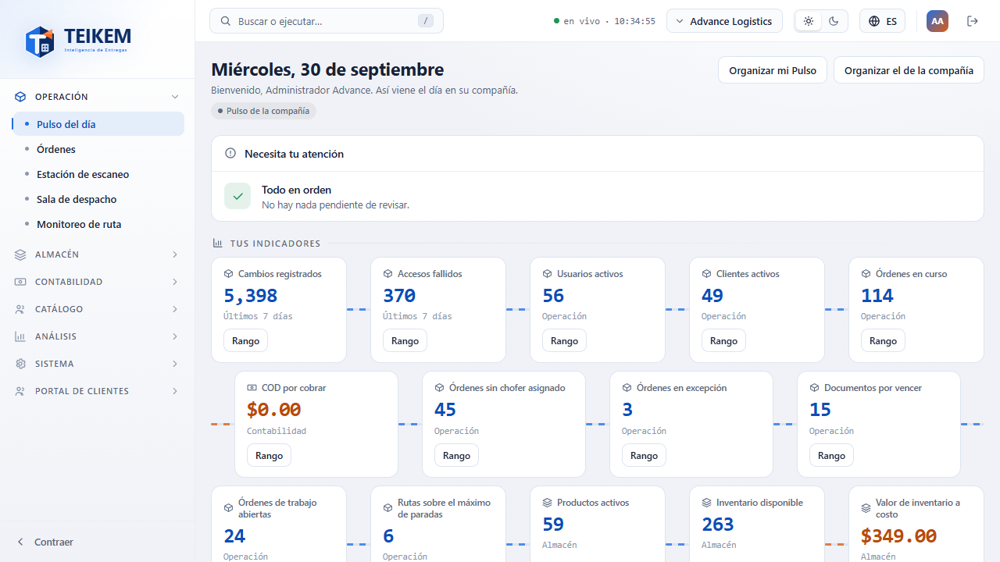

- **Cabecera:** "Necesita tu atención" y, si hay pendientes, "{N} pendientes" (o "1 pendiente"); el ícono de alerta se enciende.
- **Una fila por descuadre pendiente** (los **5 más antiguos**): el título "Descuadre en {SKU}" (o "Descuadre en el total de {SKU}"), el producto y
  dónde (almacén · posición · lote, o "todas las posiciones" en un descuadre del total), las cifras **Kárdex**, **Saldo** y **Diferencia** (saldo −
  Kárdex, con signo y en rojo), "desde {hora}" y el botón **Revisar**.
- **Revisar** abre el Kárdex de movimientos en la pestaña **Conciliación** con ese descuadre abierto (`/warehouse/kardex?tab=reconciliation&discrepancy=…`),
  donde se corrige el saldo o se descarta con una nota.
- **Ver todos ({N})** (pie del panel, con los pendientes): abre la lista completa de descuadres Pendientes.
- **Todo en orden** ("No hay nada pendiente de revisar."): no hay descuadres pendientes que usted pueda ver.

> **Captura pendiente:** el panel con una fila de descuadre pendiente (la captura de arriba es el estado "Todo en orden"; un descuadre real exige
> tocar los saldos directamente en la base de datos, así que no se genera en el recorrido automático).

**Se actualiza solo.** El panel se vuelve a consultar cada vez que se abre el Pulso. La revisión que abre los descuadres corre sola, unos segundos
después de cada movimiento; al resolver un descuadre, la fila desaparece.

**Organizar.** Como los demás paneles, se puede mover y ocultar desde **Organizar mi Pulso** y **Organizar el de la compañía** (capítulo
[F8a](f8a-menu-sistema-analisis-y-marca.md)).

**Permiso.** Se pinta solo con **`pulse.attention`**; cada tipo de aviso pide además el suyo: los descuadres, `inventory.view` con el módulo
**Almacén y lote/serie** (`WMS_LOTSERIAL`) encendido. Lo que usted no puede ver no suma. Sin `pulse.attention` (o si el servidor responde 403) el
panel no se pinta y Pulso se ve como antes. Lo traen el Admin de compañía, el Operador de almacén, Facturación y Solo lectura. **Corregir** y
**Descartar** exigen además `inventory.adjust`.

**Mensajes que puede ver.** "Todo en orden" / "No hay nada pendiente de revisar." (sin pendientes). Mientras carga, un indicador de carga; si
la consulta falla por otra razón, el mensaje del error dentro del panel.

## "Conteos abiertos" en el panel Almacén

La tarjeta **Conteos abiertos** (arriba, en "Pulso del día: panel «Almacén» con filtro") cuenta ahora los conteos cíclicos **Pendientes y
Contados** con su **total real** (antes contaba una lista cortada en 200 y solo los "Abiertos"; con «Conteo de lo cambiado», que crea uno por
posición, la cifra se habría quedado en 200). Los conteos en Concordancia o Diferencia ya no cuentan. Sigue recibiendo solo el filtro de
almacén.

## Pulso del día: panel "Actividad reciente"

**Para qué sirve.** Muestra, en un solo lugar, lo último que pasó en su compañía (recibos, conteos, ajustes,
recolecciones, órdenes de compra, altas y bajas…), agrupado por módulo de negocio, para no tener que ir pantalla por
pantalla a buscarlo.

**Cómo se llega.** Aparece automáticamente debajo del panel "Almacén" en Pulso (`/`).

**Qué se ve.**

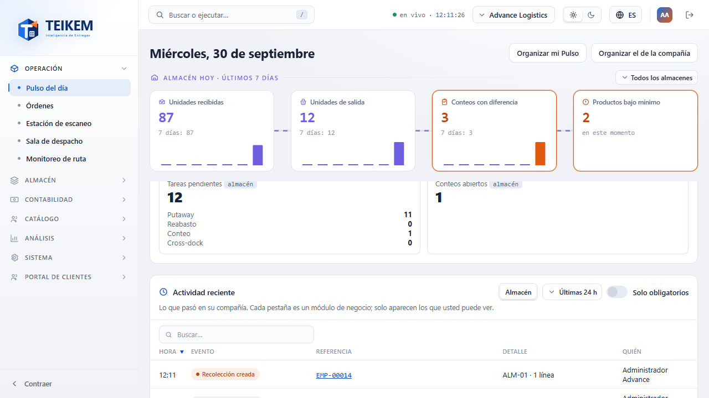

Una pestaña por módulo de negocio que usted puede ver (por ahora, solo **Almacén**; Operación y Contabilidad
aparecerán solas cuando su compañía las tenga disponibles), un selector de **ventana de tiempo** (Últimas 24 h /
Últimas 48 h / Hoy), el interruptor **"Solo obligatorios"**, un buscador libre y una tabla con: **Hora** (la de su
propio computador), **Evento** (una píldora de color por familia, con la marca **oblig.** si es un evento que
siempre se muestra), **Referencia** (con enlace a la ficha correspondiente, cuando su usuario tiene permiso para
verla), **Detalle** y **Quién**. Al pie, "N eventos · [ventana]" y el botón **"Ver más"** si hay más por cargar.

**Qué hace cada control.**

- **Pestañas de módulo**: cambian qué eventos se listan; si su compañía o su usuario solo ven un módulo, no hay
  pestañas que elegir (aparece igual, ya en ese módulo).
- **Ventana de tiempo**: acota los eventos a las últimas 24 h, 48 h u "Hoy" (desde la medianoche).
- **"Solo obligatorios"**: oculta los eventos opcionales (por ejemplo, "Recolección creada") y deja solo los que la
  plataforma considera que siempre deben verse (por ejemplo, un ajuste de inventario).

  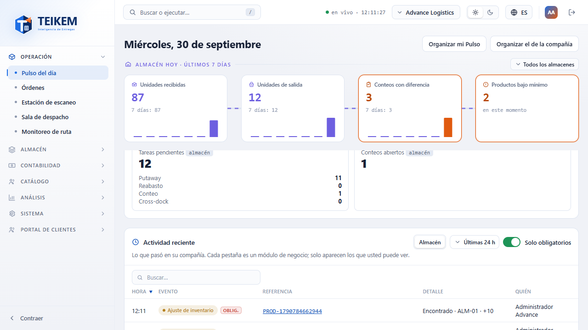
- **Buscador**: filtra lo que ya está cargado en pantalla (no vuelve a preguntar al servidor); busca en el evento, la
  referencia, el detalle y quién lo hizo.
- **Encabezados de columna** (Hora, Evento, Referencia, Quién): ordenan la tabla; por defecto viene ordenada por
  Hora, la más reciente arriba.
- **"Ver más"**: pide la siguiente página de eventos y la agrega debajo de la ya cargada.
- **Referencia** (enlace): abre la ficha del recibo, la orden de compra, el conteo cíclico, la recolección, el
  producto o el almacén según corresponda; si su usuario no tiene permiso para esa ficha, el texto se ve pero sin
  enlace. Los ajustes y transferencias de inventario no llevan enlace (no hay una ficha de "movimiento" a la que
  ir).

**Idioma.** Los textos de los eventos (nombre, detalle) los traduce el servidor según el idioma que tenga elegido;
cambiar de idioma con el selector de la cabecera no recarga la página ni pierde la ventana de tiempo elegida.

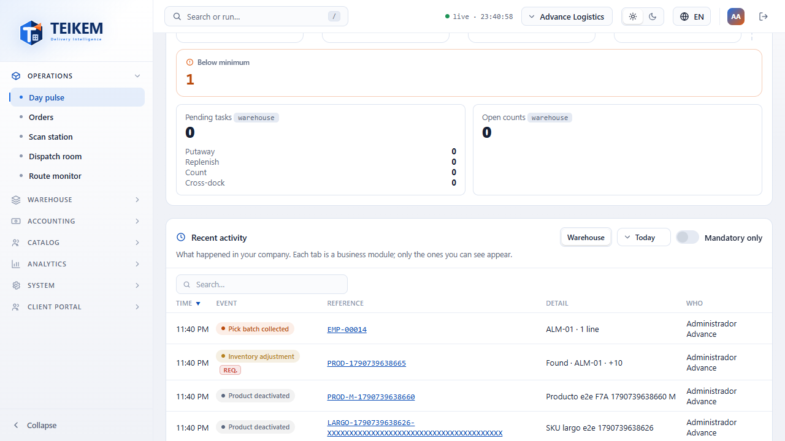

**Permiso.** Se pinta solo con `analytics.view` **y** el módulo **Análisis** (`ANALYTICS`) encendido; si su
compañía o su usuario no ven ningún módulo de negocio (por ejemplo, sin `inventory.view` para Almacén), el panel
directamente no aparece.

**Mensajes que puede ver.**

- Mientras carga: un indicador de carga con el título y subtítulo del panel.
- Sin ningún evento en la ventana elegida: **"Sin actividad en esta ventana"**.
- El buscador sin ninguna coincidencia: **"Sin resultados"** (el genérico de las tablas del sistema).
- Un error al consultar (por ejemplo, de conexión): el mensaje del servidor en el lugar de la tabla.

## En el celular (360 px)

La franja **Almacén hoy** se compacta: **cuatro cuadros en 2×2** con el número y las barritas, sin el texto pequeño ("7 días: N") ni "· últimos 7 días" en el título, y sigue fija bajo la fecha al desplazarse; con el celular acostado (poco alto) solo queda fija la fecha. Los gráficos de "Tus gráficos" quedan uno debajo del otro. Las tarjetas del panel Almacén se apilan en una sola columna y la tabla de Actividad reciente se ve como una lista
de tarjetas (una por evento), sin perder ninguna columna ni desbordar la pantalla; el control "Categoría o producto"
ocupa todo el ancho y su lista, al abrirse, también cabe sin desbordar.

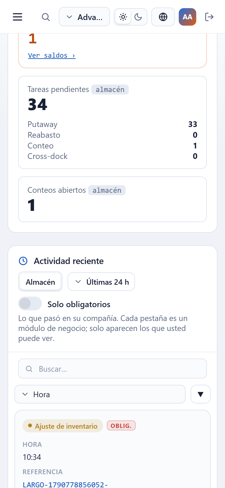

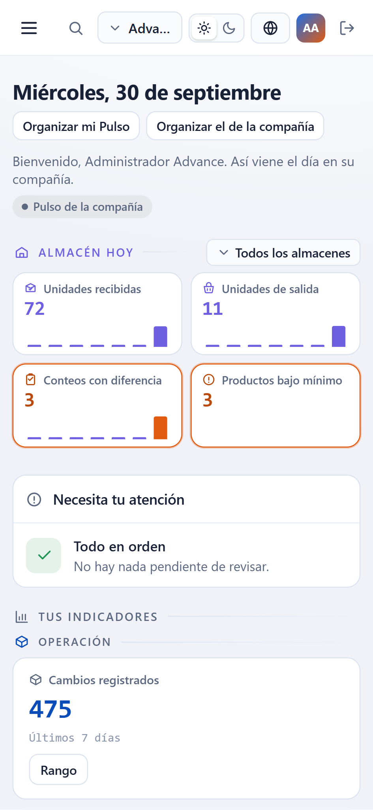

En la captura, la fecha y los botones de Organizar van en dos renglones, y la franja ocupa dos filas de dos cuadros: "Conteos con diferencia" y "Productos bajo mínimo" van en naranja. Sin scroll horizontal.

## Preguntas frecuentes de este capítulo

**¿Por qué "Bajo mínimo" dice "Sí" en vez de un número?** Porque eligió un producto puntual en el filtro "Categoría o
producto": para un solo producto la pregunta es sí/no está bajo su mínimo, no una cantidad. Quite la selección (✕)
para volver a ver la cantidad de productos bajo mínimo de todo el almacén (o de la categoría elegida).

**Elegí un almacén y una categoría, y al entrar a Inventario desde "Ver en Inventario" veo más filtros aplicados
de los que esperaba, ¿por qué?** El enlace lleva los mismos filtros que la tarjeta (almacén y categoría o producto),
para que lo que vea en Inventario cuadre exactamente con la cifra que traía Pulso.

**¿Por qué al recargar la página mi almacén o mi producto elegido desaparecieron?** Puede ser que ese almacén, esa
categoría o ese producto se haya dado de baja o eliminado mientras tanto: la selección guardada se limpia sola, sin
avisar, y el panel vuelve a "Todos los almacenes" sin categoría ni producto.

**¿Por qué no veo la pestaña "Operación" o "Contabilidad" en Actividad reciente?** Esos módulos todavía no están
disponibles (llegan en lotes posteriores); solo aparecen las pestañas de los módulos que su compañía tiene
encendidos y que usted puede ver.

**¿Qué quiere decir la marca "oblig." junto a un evento?** Que es un evento que la plataforma considera que siempre
debe verse en Actividad reciente, aunque tenga activado "Solo obligatorios"; el resto de los eventos se puede ocultar
con ese interruptor.

**Busqué algo en el buscador de Actividad reciente y no encontré un evento que sé que pasó, ¿por qué?** El buscador
solo revisa lo que ya está cargado en pantalla (según la ventana de tiempo y la pestaña elegidas); si el evento pasó
fuera de esa ventana, cambie a "48 h" o cargue más con "Ver más" antes de buscar.

**¿Por qué el Kárdex que abro desde "Unidades de salida" suma distinto que la tarjeta?** Porque la tarjeta es un neto y el Kárdex filtra por
tipo: las recolecciones eliminadas restan en la tarjeta, pero en el Kárdex son un ajuste que el filtro (Despacho y Cruce de muelle) no incluye.
Igual con "Unidades recibidas": las diferencias de recibo suman en la tarjeta y salen aparte en el Kárdex. Ver la [FAQ del Lote 15](../faq.md).

**Toco "Conteos con diferencia" y veo más conteos que el número, ¿por qué?** El enlace abre el Conteo cíclico con el estatus Diferencia y sin
fechas; el número cuenta solo los cerrados hoy (y "7 días: N", los de la semana).

**¿Cómo quito la franja fija?** Con Organizar (mío o de la compañía): oculte "Almacén hoy" o bájela. Queda fija solo la fecha.

**Cambié el almacén de la franja y cambió el del panel "Almacén".** Es lo esperado: los dos comparten el mismo almacén.
