# F8a — Menú completo, marca, Pulso por paneles, Sistema y Análisis

Capítulo del manual de pantallas del Lote F8a (frontend): el menú y la cabecera con la maqueta completa (los 7
grupos, con una pantalla "pendiente" para lo que todavía no tiene función), la marca Teikem, el Pulso del día
organizado por paneles con permiso propio y orden en dos niveles (compañía y usuario), la pantalla **Roles y
usuarios** (con el PIN de los aparatos de almacén y el MFA por persona), **Aparatos móviles**, **Catálogos de
valores** e **Indicadores y Gráficos**. Capturas en `img/f8a-*.png`.

Las acciones por fila de estas tablas (editar, eliminar, PIN, MFA, ajustar, restaurar…) se ven como un icono a
tono con la acción, no como un botón de texto — pase el cursor sobre el icono para ver de qué acción se trata.

## Marca y estructura del menú

**Qué se ve.** El logotipo de Teikem en la barra lateral (cambia de variante con el tema claro/oscuro y con el
idioma) y, en la cabecera, la barra "Buscar o ejecutar…" (paleta de comandos), el reloj "en vivo", el selector de
compañía, tema, idioma, su nombre y "Salir".

Los **7 grupos** de la maqueta, en este orden: **Operación**, **Almacén**, **Contabilidad**, **Catálogo**,
**Análisis**, **Sistema**, **Portal de clientes**. Un grupo solo se pinta si tiene al menos un ítem que su usuario
puede ver (por permiso y módulo); dentro de cada grupo, los ítems para los que su compañía o su rol todavía no
tienen función abren una pantalla "pendiente" con el título y el subtítulo de esa pantalla y el aviso "Esta pantalla
llega en un lote posterior."

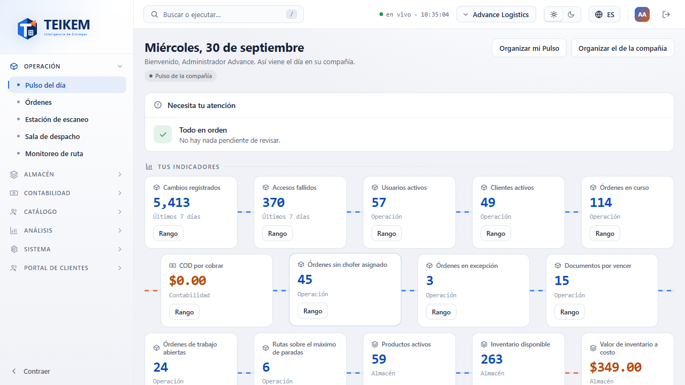

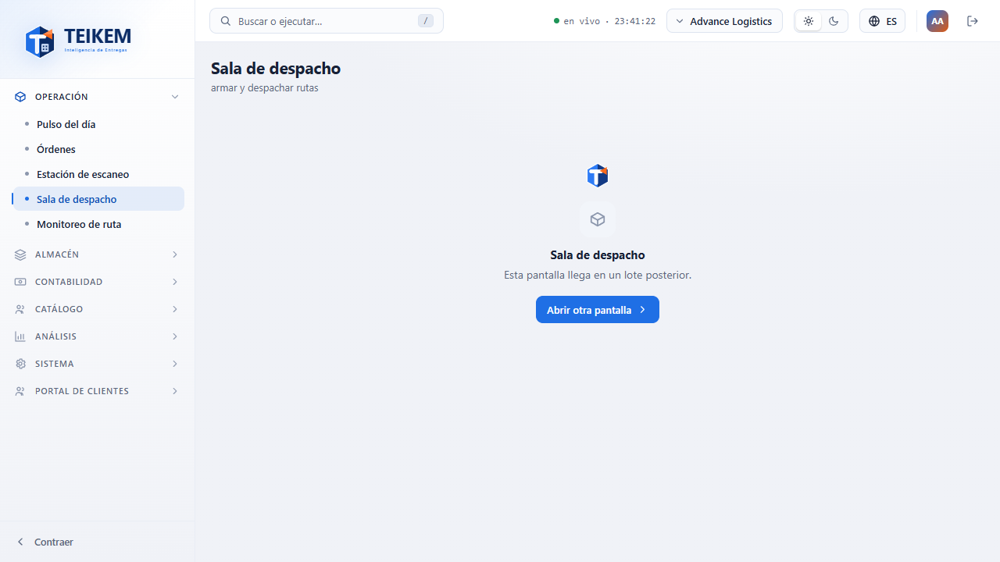

**Paleta de comandos.** Se abre con **/** (fuera de un campo de texto) o Ctrl/⌘+K, o con la lupa en pantallas
angostas; escriba parte del título o subtítulo de una pantalla (sin acentos) para filtrarla, flechas ↑/↓ para
moverse y Enter para entrar; Escape la cierra. Solo ofrece pantallas que su usuario puede ver.

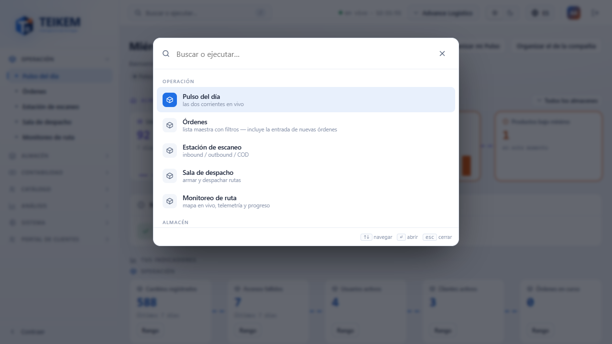

**Colapsar la barra lateral** dice el nombre de la marca y sus íconos: no pierde la pantalla en la que estaba ni
recarga la página. El tema (claro/oscuro) y el idioma se guardan en su navegador y se conservan al recargar.

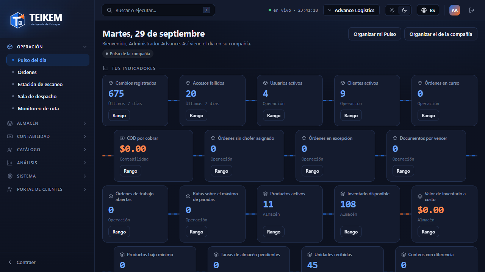

**Sin permiso para una pantalla directa por URL:**

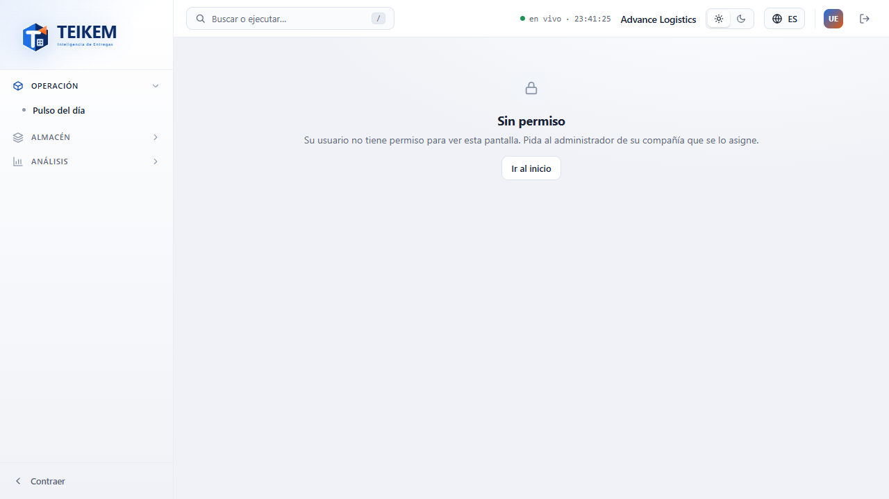

> "Su usuario no tiene permiso para ver esta pantalla. Pida al administrador de su compañía que se lo asigne."

## Pulso del día: organizar (mío y de la compañía)

El detalle de qué panel ve cada usuario (permiso `pulse.*` por panel, lectura de la fuente de datos, módulo
encendido) está en el capítulo [07 — Pulso del día](../07-pulso-y-actividad.md), sección 3. Aquí se documenta la
pantalla de organizar.

**"Organizar mi Pulso"** (siempre disponible si tiene algún panel): dentro, cada panel y cada indicador/gráfico
tiene un asa para arrastrar (con el ratón, en escritorio), botones ▲/▼ para subir/bajar y un botón "Ocultar"/
"Mostrar". "Listo" guarda un solo pedido con el nuevo orden; los ocultos quedan atenuados mientras organiza. Al
guardar, aparece el aviso "Pulso guardado" y, si nunca antes había organizado el suyo, un chip **"Pulso personal ·
Volver al de la compañía"** junto al título — este orden es solo suyo y se conserva al recargar.

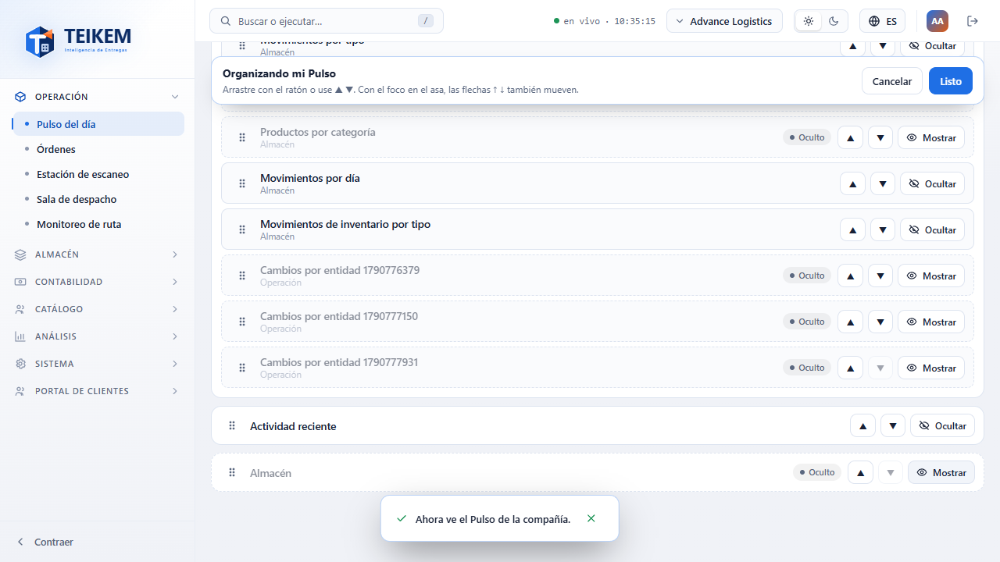

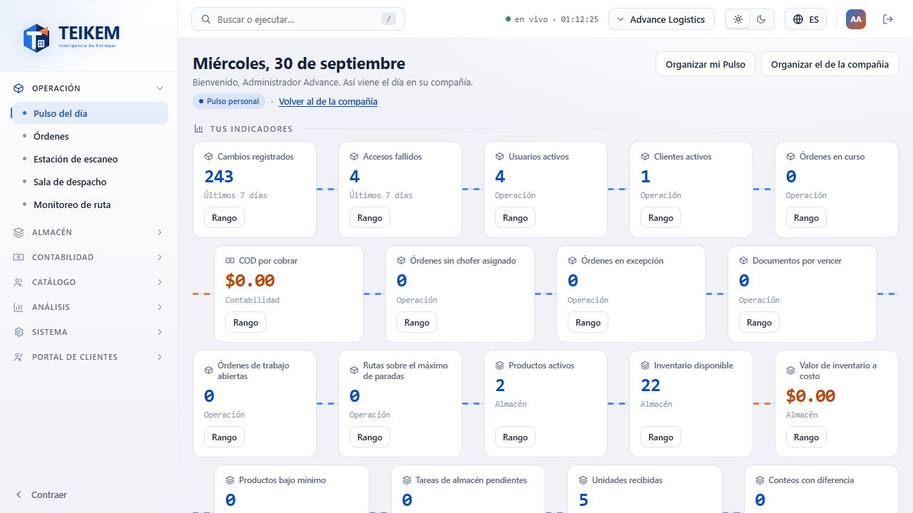

Desde el Lote 14 el organizador también lista el panel **Necesita tu atención** (permiso `pulse.attention`): se puede mover y ocultar como los
demás paneles.

Desde el Lote 15 también lista el panel **Almacén hoy** (la franja; primero por defecto) con una nota que explica que la franja que quede justo
debajo de la fecha se queda fija al desplazarse y que, si se oculta o se baja, solo queda fija la fecha. Los **indicadores** se listan por fila de
módulo (Operación, Almacén, Contabilidad) y solo se mueven dentro de su fila; al guardar, el orden se guarda por fila. Ver [F7A](f7a-pulso-almacen-y-actividad.md).

**"Volver al de la compañía"** (el enlace del chip): pide confirmar — "Se borran su orden y sus ocultos del Pulso y
verá el de la compañía. Sus rangos de fecha se conservan." — y descarta su Pulso personal entero.

**"Organizar el de la compañía"** (solo con el permiso `pulse.organize_company`): mismo organizador, pero parte del
**Pulso real de la compañía** (no del suyo) y, al guardar, cambia lo que ve **todo el mundo** que no tenga su propio
Pulso personal — incluidos los paneles a los que ese permiso no da acceso (por ejemplo, alguien con permisos de
Almacén nada más también deja de ver un panel que usted oculte aquí, si no tiene un Pulso propio).

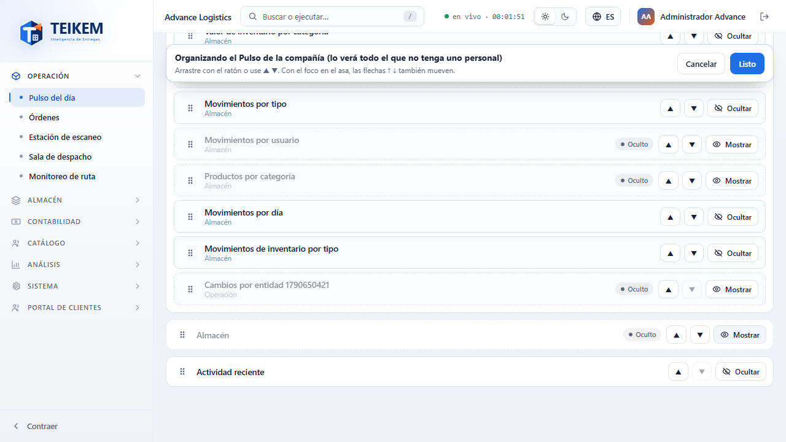

**Permiso.** "Organizar mi Pulso" no exige ningún permiso aparte de ver al menos un panel; "Organizar el de la
compañía" exige `pulse.organize_company` — sin él, el botón no aparece (§2.2: lo que no puede hacer no se ofrece).

## Análisis: Indicadores y Gráficos

**Para qué sirve.** Administrar los indicadores y gráficos que puede armar su compañía (no solo verlos en Pulso):
crearlos, editarlos, elegir si se muestran en el Pulso propio o en el de la compañía, y su rango de fecha.

**Cómo se llega.** Grupo **Análisis** → **Indicadores** / **Gráficos** (`analytics.view`, módulo **Análisis**).

**Qué se ve.** Tarjetas agrupadas por módulo de negocio, cada una con su valor actual, el rango de fecha, el
interruptor **"Mostrar en Pulso del día"** (su preferencia personal) y, si además tiene `analytics.manage` sobre
esa definición, el interruptor "…en el de la compañía" (el que ven todos los que no tengan Pulso personal).

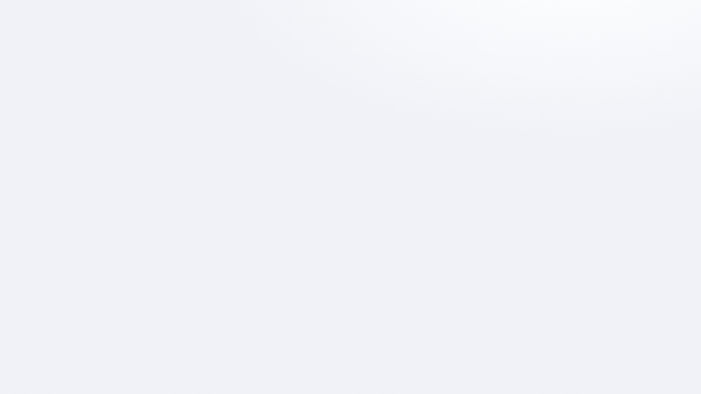

**"Nuevo indicador"/"Nuevo gráfico"** (`analytics.manage`): nombre en español e inglés, fuente de datos, campo y
agregación, filtro (campo · operador · valor, con `or`/`not` cuando la fuente lo permite), módulo de negocio, si es
dinero, visibilidad (toda la compañía / privado / compartido con roles o personas), rango de fecha por defecto y
orden en el Pulso de la compañía; los gráficos agregan agrupar por y el tipo (barra, dona, línea).

**Mensajes que puede ver.**

- **Chip "De la compañía"** (Lote 15) junto al nombre de un gráfico sin dueño que no es de sistema (los dos de almacén: "Valor de inventario por
  categoría" y "Movimientos de inventario por tipo"): con `analytics.manage` se editan y eliminan. Al eliminar uno, la confirmación dice
  "¿Eliminar el gráfico {nombre}? Es de la compañía: una vez eliminado no se vuelve a crear." Los gráficos siempre se dibujan (sin lista con pocos
  puntos) y, con más de 8 grupos, el último punto es "Otras". Capturas en [F7A](f7a-pulso-almacen-y-actividad.md).
- **"El nombre es obligatorio."** al guardar sin nombre.
- **"Ya existe el indicador '{nombre}'."** / **"Ya existe el gráfico '{nombre}'."** (409): el nombre debe ser único
  entre los activos.
- Editar/eliminar o el interruptor "…en el de la compañía" solo aparecen si es el dueño o tiene `analytics.manage`
  sobre esa definición.
- Si la fuente de datos deja de poder leerse (por ejemplo, le quitan `admin.audit` y la definición usaba la
  bitácora), la fuente responde **"Fuente de datos '{clave}' no encontrado."** (404): la definición sigue
  existiendo, pero usted ya no puede verla ni editarla.

## Roles y usuarios

**Cómo se llega.** Grupo **Sistema** → **Roles y usuarios** (`admin.users` o `admin.roles`; el segmento
Roles/Usuarios muestra solo la pestaña para la que tiene permiso).

### Pestaña Roles

Tabla con **Rol**, **Permisos** (n / total), **Usuarios** y editar/eliminar. Los roles de sistema y las plantillas
llevan su chip; un rol con usuarios asignados no se puede eliminar:

> "El rol tiene usuarios asignados; reasígnelos antes de eliminarlo." (409)

**"Nuevo rol"/Editar** (`admin.roles`, y **reautenticación (AAL2)** al guardar cambios de permisos o al eliminar):
nombre, descripción en español e inglés y las casillas de permisos agrupadas por categoría (con "Todo el grupo").
Un nombre repetido responde **"Ya existe el rol '{nombre}'."** (409).

### Pestaña Usuarios

Tabla con QBox de búsqueda (por nombre o correo) y, por defecto, **sin** los usuarios suspendidos (interruptor
"Incluir suspendidos" para verlos también): Nombre, Correo, Roles, Permisos extra, Estado (interruptor activo/
suspendido), MFA, Último acceso y, si tiene `devices.manage` o `admin.users` con el módulo de Almacén encendido,
**PIN app**.

**"Nuevo usuario"** (correo, nombre, roles, contraseña opcional): si deja la contraseña en blanco, el servidor
genera una temporal y la pantalla la muestra **una sola vez**, en un modal que no se cierra con Esc ni haciendo
clic afuera — cópiela con el botón antes de pulsar "Listo", porque después no se puede volver a ver (se puede
cambiar más adelante desde la propia cuenta del usuario).

**"También agregar a estas compañías"** (desde 2026-10-01, en "Nuevo usuario"): lista las otras compañías donde **usted también
administra usuarios** (el administrador de plataforma ve todas las activas); si no hay ninguna, el campo no aparece. Marque las
que quiera: la persona entra con el mismo correo y la misma contraseña, y recibe en cada compañía marcada los **mismos roles, por
nombre**, que escogió arriba. Todo se valida antes de crear nada: si en una compañía no existe alguno de los roles sale
`En {compañía} no existen los roles: {roles}.` (400) y no se crea el usuario en ninguna; si usted no administra usuarios en una
compañía, `No puede agregar usuarios a esa compañía.` (403). Si el correo ya pertenece a una de las marcadas, esa compañía no se
toca y se avisa ("Ya era miembro de: …"). Un solo primer ingreso (correo, contraseña propia y MFA) sirve para todas. Después, los
roles de cada compañía se ajustan desde su propia pantalla de Usuarios.

**Asignar/Restablecer PIN** (aparece por fila si su usuario no tiene PIN / si ya tiene uno; exige AAL2 al guardar):
un PIN de 4 a 6 dígitos, dos veces para confirmar.

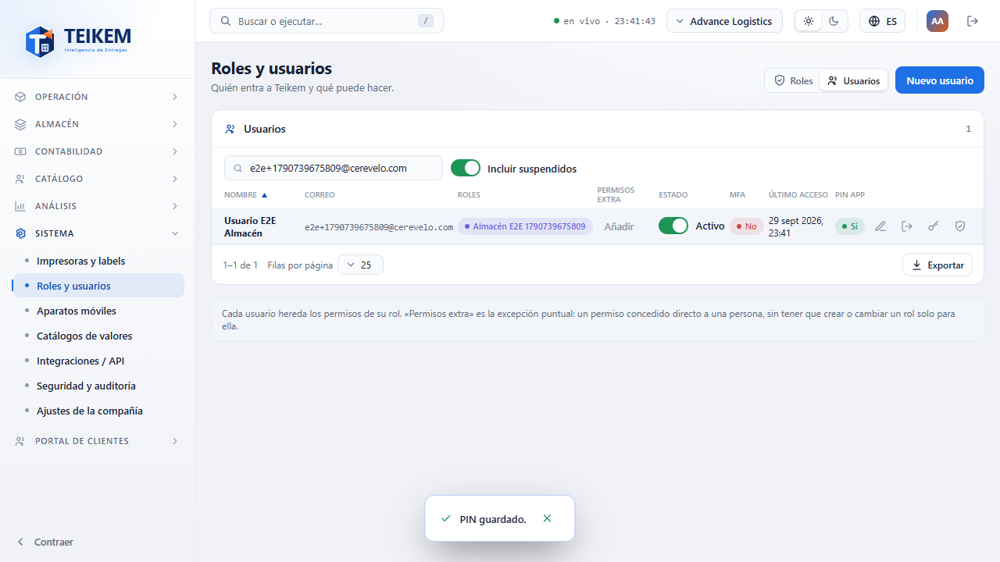

- **"Los PIN no coinciden."**: las dos capturas no son iguales.
- **"El PIN debe tener de 4 a 6 dígitos."**: formato.
- **"El PIN no puede ser una secuencia trivial."**: todos los dígitos iguales (1111) o una secuencia consecutiva
  ascendente o descendente (1234, 4321, 9876…).

  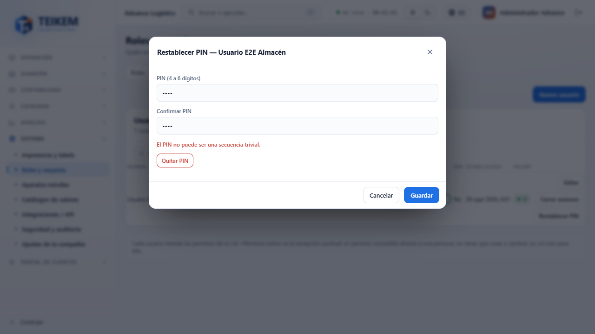
- **"Quitar PIN"** (dentro del mismo modal, solo si ya tiene uno): pide confirmar y no exige reautenticación.
- **"No puede asignar ni quitar el PIN de un usuario con más permisos que usted."** (403): defensa en profundidad,
  igual que asignar roles.
- Asignar o quitar el PIN **cierra las sesiones del usuario en los aparatos** (su próxima sincronización pide PIN
  de nuevo).

**Editar un usuario que pertenece a más de una compañía:**

> "Este usuario pertenece a más de una compañía; solo el administrador de plataforma puede editar su cuenta." (403)

Nombre y estado de la cuenta son de la persona, no de una compañía en particular; un administrador de una sola
compañía no puede cambiarlos si esa persona también trabaja en otra. Los roles y permisos de **su** compañía sí se
pueden editar igual.

### MFA: exigirlo a una persona, y resetearlo si perdió su dispositivo

Aparte de la política de MFA de toda la compañía (pendiente de exponer en pantalla — ver la sección siguiente),
un administrador puede exigirlo o dejar de exigirlo a **una persona en particular**, y resetearlo si esa persona
perdió el teléfono donde tenía la verificación en dos pasos.

En la columna **MFA** de la tabla de usuarios: chip **Sí**/**No** (si ya lo tiene activo) y, si se le exige pero
todavía no lo activó, un chip adicional **"Pendiente"**.

- **"Exigir MFA"** (icono de escudo): pide confirmar — "{nombre} tendrá que activar la verificación en dos pasos
  antes de poder entrar." — y AAL2 al guardar. Su próximo intento de iniciar sesión responde `mfa_required` y le
  pide enrolar el segundo factor antes de dejarlo entrar (no lo activa el administrador por ella: cada quien
  enrola el suyo).
- **"Ya no exigir MFA"** (mismo icono, aparece cuando ya se le exige): quita la exigencia puntual; si esa persona
  ya lo tenía activo por su cuenta, lo conserva — dejar de exigirlo no se lo quita.
- **"Restablecer MFA"** (icono de restaurar, solo si ya tiene uno activo): le quita la verificación en dos pasos
  confirmada y sus códigos de recuperación — para cuando perdió el dispositivo y quedó bloqueado sin poder
  generar el código. En su siguiente ingreso, si todavía se le exige (por la compañía o por esta exigencia
  puntual), vuelve a pedirle que enrole uno nuevo desde cero.

**Ajuste de la compañía entera.** `Tenant.MfaRequired` (exigir MFA a todos) ya existe en el servidor y por
default viene en **Sí** para toda compañía nueva — pero la pantalla "Ajustes de la compañía" que lo mostraría es
todavía un "pendiente" (grupo Sistema); por ahora ese ajuste solo se cambia por el API.

## Aparatos móviles

**Cómo se llega.** Grupo **Sistema** → **Aparatos móviles** (`devices.manage`, módulo **Almacén y lote/serie**).

**Qué se ve.** Tabla con QBox y, por defecto, **solo activos** ("Mostrar: Incluir inactivos" para verlos todos):
Código, Nombre, Almacén por defecto, Estado y Último latido.

**"Nuevo aparato"**: nombre y almacén por defecto (opcional); el código del aparato **lo genera el servidor** (forma
`AP-XXXXXX`, 6 caracteres al azar) — la pantalla ya no pide ni tiene un campo para escribirlo. Al guardar, un modal
muestra el **código de registro** (8 caracteres, un solo uso, vence en 24 h) con un botón para copiarlo; se ve una
sola vez, hasta que se pide otro con "Nuevo código de registro".

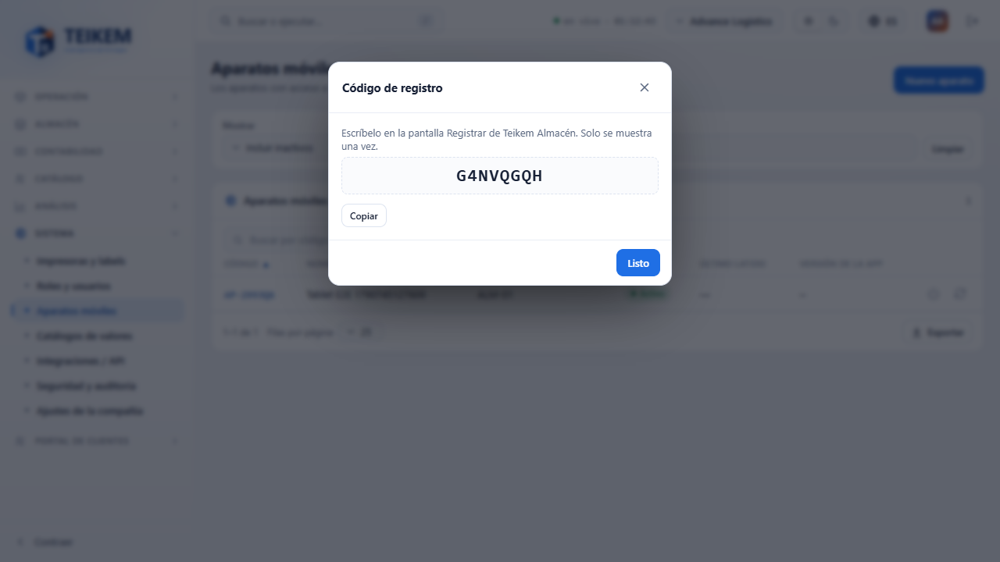

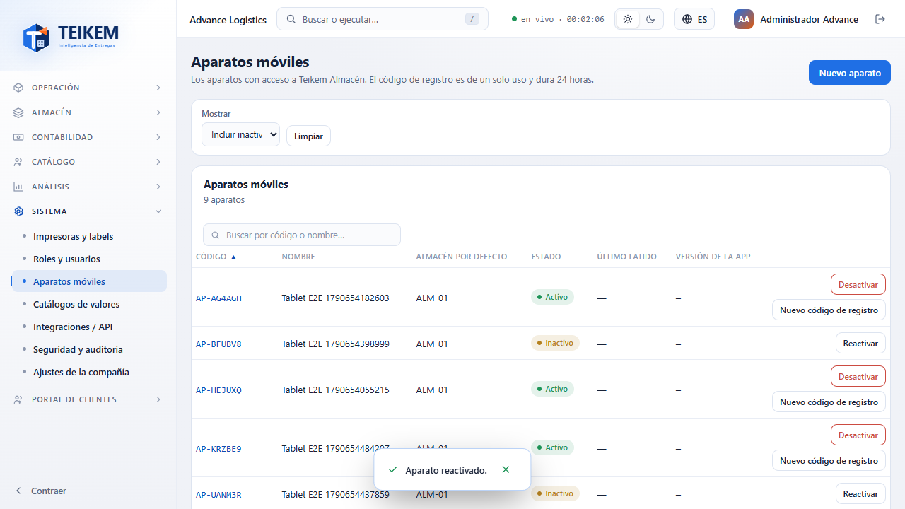

**Desactivar/Reactivar** (por fila, con confirmación): desactivar revoca las sesiones que el aparato tenía abiertas
(deja de sincronizar) y lo saca de la lista de "Solo activos"; reactivarlo hace que cada persona vuelva a entrar
con su PIN.

## Catálogos de valores

**Cómo se llega.** Grupo **Sistema** → **Catálogos de valores** (`admin.catalogs`).

**Qué se ve.** Maestro-detalle: lista de dominios a la izquierda (con su chip Sistema/Propio) y, a la derecha, sus
valores (Código, Etiqueta en español e inglés, Orden, Habilitado, Origen: **Sistema** / **Ajustado** / **Propio**).
El origen se decide por si el valor tiene dueño (compañía) o no, no por una marca suelta: un valor sin compañía es
de sistema, aunque venga con un ajuste de la suya encima.

**Un valor de sistema** (por ejemplo, un tipo de tarea de almacén) no se edita ni se desactiva directamente: se
**"Ajusta"** (etiqueta en los dos idiomas, orden, habilitado) — el ajuste es solo de su compañía, sin tocar el
valor real para las demás — y se **"Restaura"** cuando ya no hace falta.

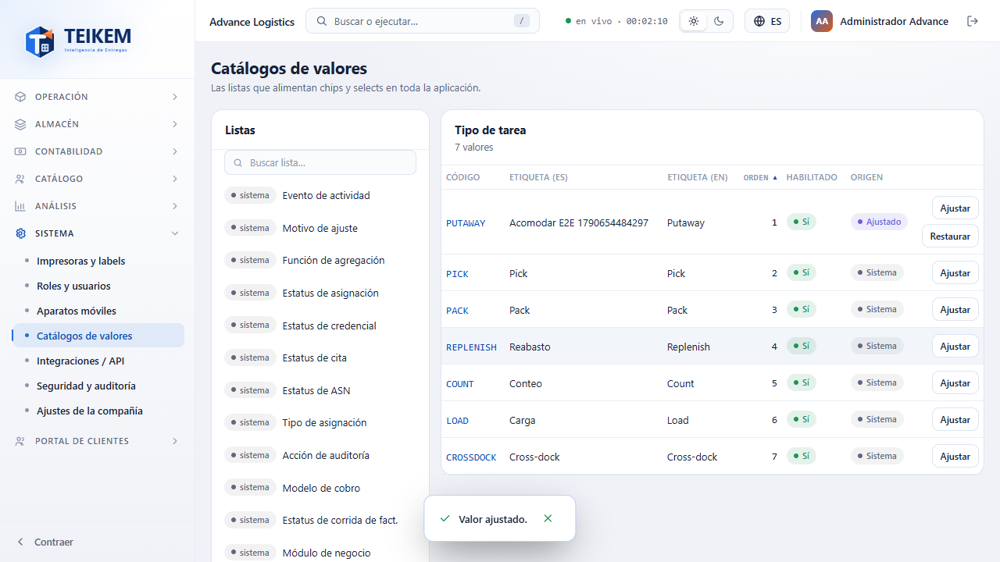

El cambio se refleja de inmediato donde sea que ese valor se muestre — por ejemplo, el desglose de tareas
pendientes del panel Almacén de Pulso — sin tener que recargar la página.

**Un valor propio de su compañía** (de un dominio o una lista que usted creó) se edita, se desactiva ("Deshabilita
sin borrar el historial que ya lo usa") y, si estaba desactivado, se **"Restaura"** para volver a ofrecerlo al
capturar — antes de este lote esa acción no tenía ningún efecto real; ya lo tiene.

**"Nueva lista"** (dominio propio, para campos personalizados de tipo lista): nombre en los dos idiomas y sus
valores iniciales; una fila sin código o sin etiqueta responde con el número de la fila:

> "Falta el código en la fila {n}." / "Falta la etiqueta en la fila {n}."

## Mi cuenta → PIN de la app

**Cómo se llega.** Mi cuenta → pestaña **"PIN de la app"** (solo si el módulo Almacén y lote/serie está encendido).

**Fijar/Cambiar PIN**: pide su **contraseña actual** además del PIN nuevo (dos veces); las mismas reglas de formato
y de secuencia trivial que el PIN que le asigna un administrador. **Quitar** no pide contraseña.

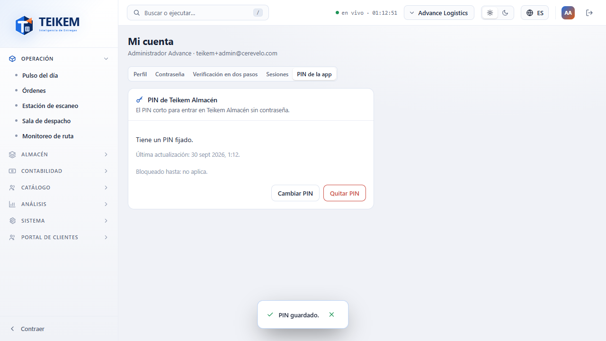

## En el celular (360 px)

El Pulso, Roles y usuarios y Catálogos de valores se ven sin scroll horizontal ni contenido recortado; la paleta de
comandos se abre desde la lupa de la cabecera en vez de la barra "Buscar o ejecutar…".

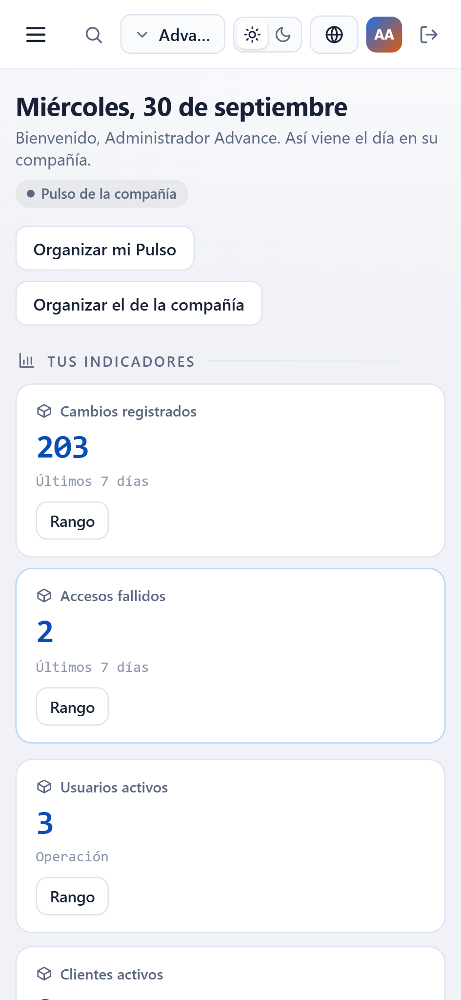
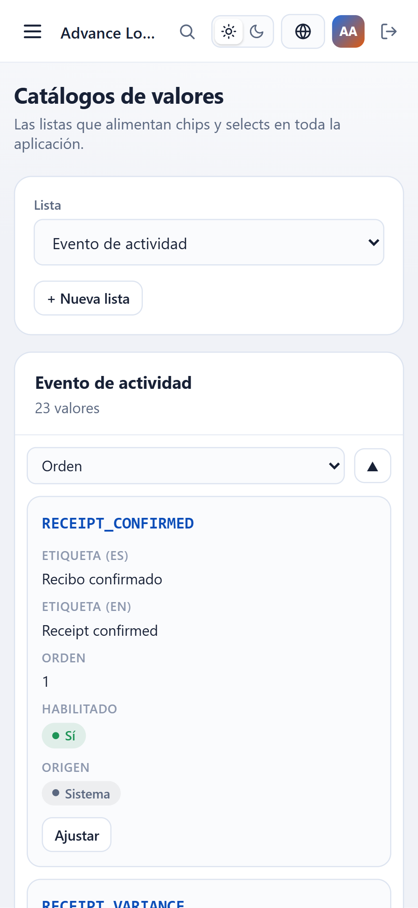

## Preguntas frecuentes de este capítulo

Ver también [faq.md](../faq.md), sección "Lote F8a — frontend: menú, Sistema y Análisis".
