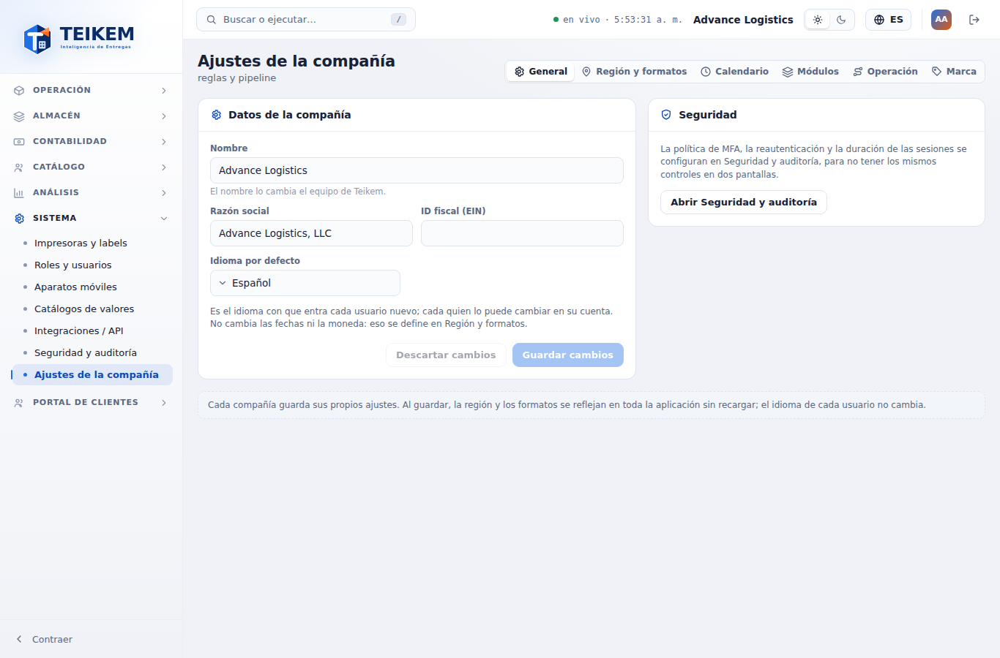
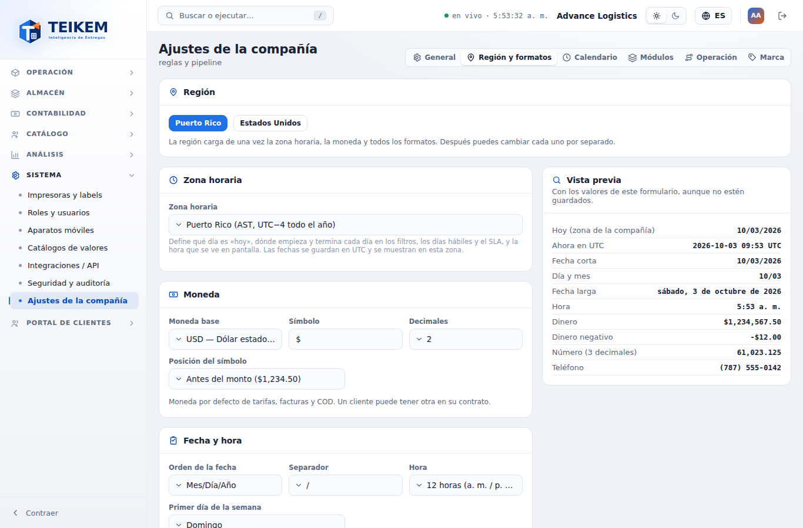
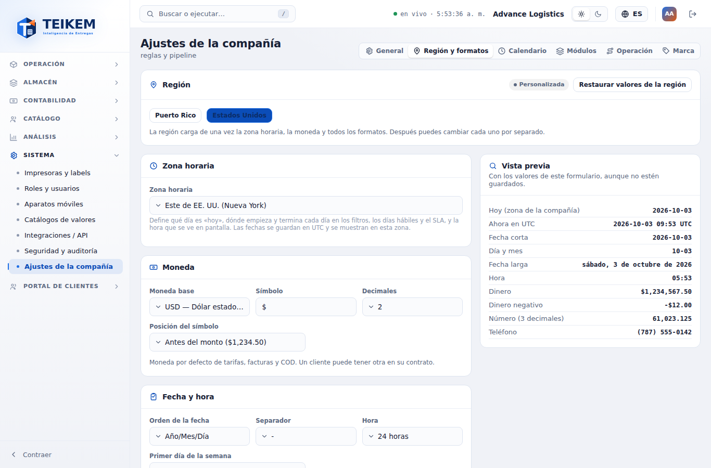
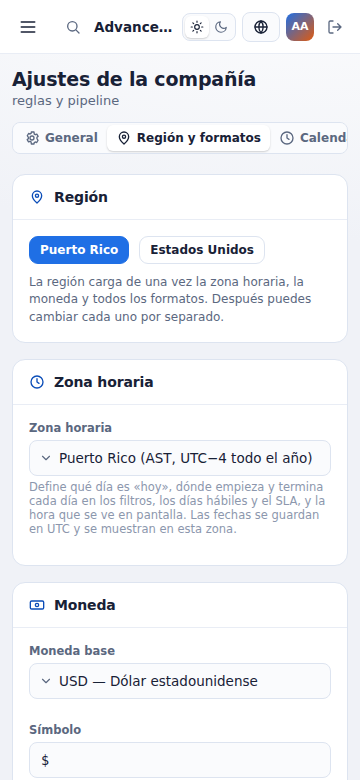
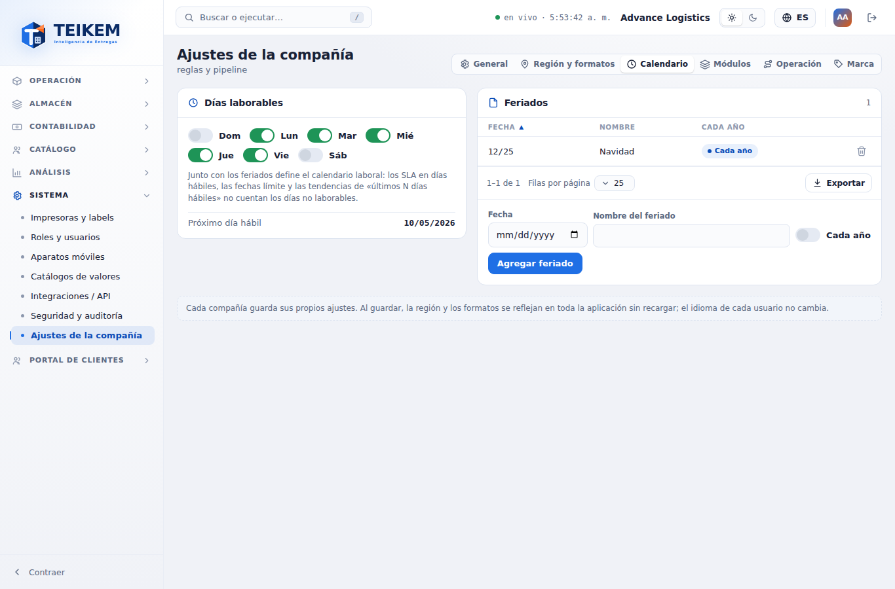
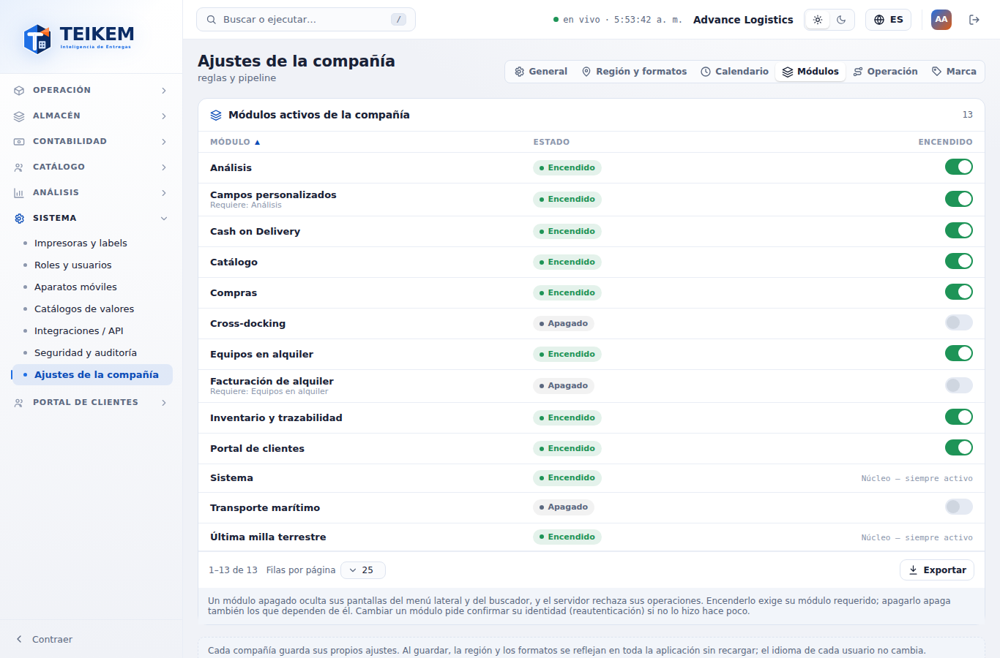
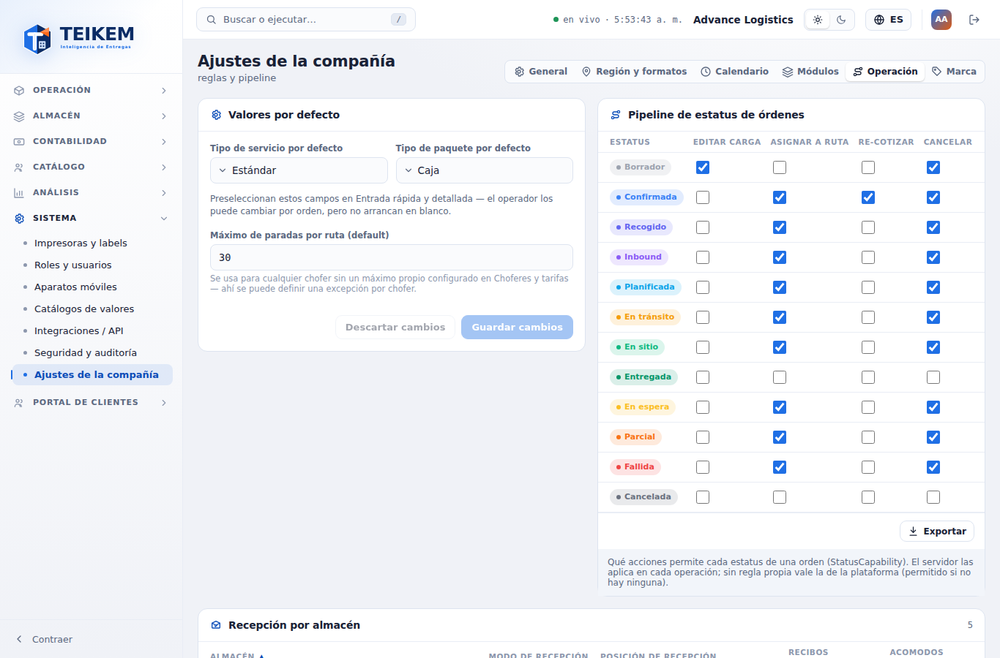
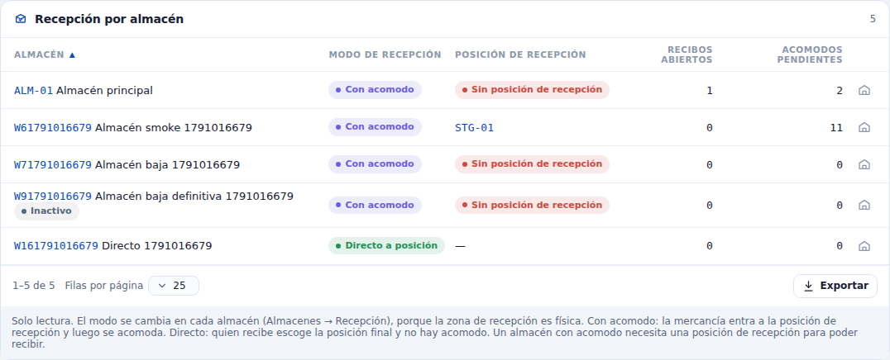
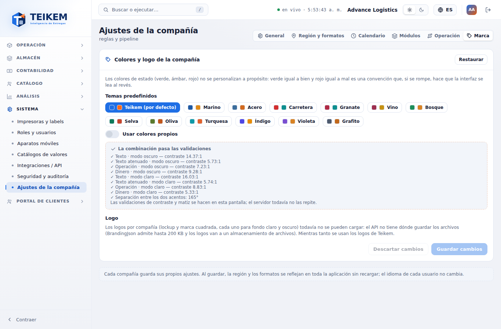

# F9 — Ajustes de la compañía y región y formatos

Pantalla **Sistema → Ajustes de la compañía** (`/system/settings`) y el cambio que trae a toda la aplicación: desde este lote
las fechas, horas, números, dinero y teléfonos se ven con la **región y los formatos de la compañía**, no con el idioma del
usuario. Backend del lote 18 (capítulo 01, sección 11.1); decisiones del frontend en `docs/frontend/loteF9-decisiones.md`.

**Quién puede.** Ver la pantalla: permiso **`admin.tenant`** con el módulo **Sistema** (`SYSTEM`) encendido (sin el permiso,
el menú no la muestra y la dirección lleva a "Sin permiso"). Leer los ajustes (`GET /api/v1/tenant/settings`) solo pide sesión:
por eso toda la aplicación conoce los formatos aunque el usuario no pueda cambiarlos. Si alguien entra sin `admin.tenant`
(p. ej. le quitaron el permiso con la pantalla abierta), todo queda de solo lectura con el aviso "Solo lectura: su usuario no
tiene el permiso para cambiar los ajustes de la compañía (admin.tenant)." y sin botones de guardar.

**Pestañas.** Arriba a la derecha, como en Seguridad y auditoría: **General**, **Región y formatos**, **Calendario**,
**Módulos**, **Operación** y **Marca**. La pestaña queda en la dirección (`?tab=region`, `calendar`, `modules`, `ops`,
`brand`; General sin parámetro), así se puede enviar un enlace directo. En el celular las pestañas se desplazan dentro de su
franja (nunca la página). Los formularios con **Guardar cambios** muestran "Hay cambios sin guardar." y **Descartar cambios**
vuelve a lo guardado; cambiar de pestaña sin guardar descarta el borrador de esa pestaña.

## 1. Cómo se ven las fechas, horas, números y teléfonos (toda la aplicación)

| Qué | Lo decide | Puerto Rico (por defecto) |
|---|---|---|
| Orden y separador de la fecha | Compañía (Región y formatos) | 10/02/2026 (mes/día/año) |
| Hora (12 o 24 horas) y zona horaria | Compañía | 9:30 p. m. en `America/Puerto_Rico` |
| "Hoy", inicio y fin de cada día | Zona de la compañía | a las 9:30 p. m. del 2 de octubre sigue siendo el 2 |
| Separadores de miles y decimal | Compañía | 61,023.125 |
| Dinero (símbolo, posición, decimales) | Compañía | $1,234.50 · -$12.00 |
| Teléfono | Compañía (código de país y máscara) | (787) 555-0142 |
| Nombres de meses y días, "a. m."/"AM" | Idioma del usuario | "viernes, 2 de octubre" / "Friday, October 2" |

- Cambiar el **idioma** (selector de la cabecera) ya no cambia el orden de la fecha ni los separadores: solo traduce.
- El **reloj** de la cabecera ("● en vivo · 2:05:09 p. m.") va en la zona y con el formato de hora de la compañía.
- Las listas, fichas, historiales de estatus, Kárdex, Pulso, la oración de filtros de las exportaciones ("del 09/01/2026 al
  09/30/2026"), los PDF y el nombre de los archivos exportados usan estos formatos. El Excel sigue guardando las fechas como
  fecha (`aaaa-mm-dd`), para que el programa las lea como tales.
- Las citas de muelle, "Conteo de lo cambiado" y los campos personalizados de fecha y hora se escriben en la hora de la
  compañía (antes, las citas y los campos personalizados usaban la hora de la computadora).
- **Al guardar** Región y formatos, toda la aplicación cambia **en el momento, sin recargar** (para todos los usuarios de la
  compañía cuando su pantalla vuelve a leer los ajustes: se consideran vigentes 10 minutos y después se piden de nuevo al
  volver a la ventana o al abrir otra pantalla; también al cambiar de idioma o de compañía).

## 2. General

- **Datos de la compañía.** *Nombre* (solo lectura: "El nombre lo cambia el equipo de Teikem."), *Razón social*, *ID fiscal
  (EIN)* e *Idioma por defecto* (Español / English: el idioma con que entra cada usuario nuevo; no cambia fechas ni moneda).
  Guardar → `PUT /api/v1/tenant/settings` con esos tres campos; aviso "Ajustes guardados". Un texto vacío borra el valor.
- **Seguridad.** La política de MFA, la reautenticación y la duración de las sesiones están en Seguridad y auditoría (botón
  **Abrir Seguridad y auditoría**); no se repiten aquí.

| Campo | Regla | Mensaje | Dónde |
|---|---|---|---|
| Idioma por defecto | código de 2 letras | "Código de idioma de 2 letras." | Servidor, 400 (la pantalla solo ofrece es/en) |

## 3. Región y formatos

- **Región.** Botones **Puerto Rico** y **Estados Unidos** (los que da `GET /api/v1/tenant/format-options`). Un clic carga de
  una vez el juego completo de la región (zona, moneda y todos los formatos) en el formulario; aviso "Región aplicada: revise
  la vista previa y guarde.". Si algún valor difiere del de la región aparece el chip **Personalizada** y el botón
  **Restaurar valores de la región**, que vuelve a cargar el juego completo de la región elegida.
- **Zona horaria** (Puerto Rico, Este, Centro, Montaña y Pacífico de EE. UU., Alaska, Hawái).
- **Moneda.** *Moneda base* (USD), *Símbolo* (1 a 3 caracteres), *Decimales* (0, 2 o 3) y *Posición del símbolo* (antes del
  monto, `$1,234.50`, o después, `1.234,50 $`).
- **Fecha y hora.** *Orden de la fecha* (Mes/Día/Año, Día/Mes/Año, Año/Mes/Día), *Separador* (`/`, `-`, `.`), *Hora* (12 o 24
  horas) y *Primer día de la semana* (domingo o lunes; ordena los días del Calendario).
- **Números.** *Separador de miles* (coma, punto o espacio) y *Separador decimal* (punto o coma). Nunca pueden ser el mismo:
  si escoge uno que choca con el otro, **el otro se cambia solo** y sale el aviso "El separador de miles y el decimal no pueden
  ser el mismo: se cambió el otro.".
- **Teléfono.** *Código de país* (`+` y 1 a 4 dígitos) y *Formato* (`(000) 000-0000`, `000-000-0000`, `000.000.0000`,
  `000 000 0000`; cada 0 es un dígito). Los teléfonos se guardan solo con dígitos y se muestran con este formato.
- **Vista previa** (a la derecha; debajo en el celular). Con los valores del formulario, **aunque no estén guardados**: hoy en
  la zona de la compañía, ahora en UTC, fecha corta, día y mes, fecha larga, hora, dinero, dinero negativo, número con 3
  decimales y teléfono. La hora avanza sola.
- **Guardar cambios** manda la región y los 13 campos completos (`PUT /api/v1/tenant/settings`); "Ajustes guardados".

**Mensajes** (todos 400, debajo de su campo; si hay error no se guarda nada). Texto exacto en el capítulo 01, sección 11.1 y
en la FAQ "Región y formatos (2026-10)":

| Campo | Mensaje |
|---|---|
| Zona horaria | "La zona horaria '…' no la reconoce la plataforma. Use un nombre IANA, por ejemplo America/Puerto_Rico o America/New_York." |
| Símbolo | "El símbolo de moneda es obligatorio y de 1 a 3 caracteres, por ejemplo $." |
| Separador decimal | "El separador de miles y el decimal no pueden ser el mismo" (no debería verse: la pantalla los intercambia) |
| Código de país | "El código de país del teléfono debe ser '+' seguido de 1 a 4 dígitos, por ejemplo +1." |

## 4. Calendario

- **Días laborables.** Un interruptor por día, en el orden del primer día de la semana de la compañía. Cada cambio se guarda
  en el momento (`PUT /tenant/settings` con `workDaysMask`; "Días laborables guardados"). Tiene que quedar al menos uno:
  apagar el último no se permite ("Tiene que haber al menos un día laborable"). Abajo, **Próximo día hábil** contado desde hoy
  en la zona de la compañía, saltando días no laborables y feriados.
- **Feriados.** Tabla con Fecha (un feriado "cada año" se muestra solo con día y mes), Nombre y Cada año; columnas ordenables.
  Para agregar: Fecha, Nombre del feriado, interruptor *Cada año* y **Agregar feriado** (`POST /api/v1/tenant/holidays`;
  "Feriado agregado"). La papelera de cada fila pide confirmación ("¿Eliminar el feriado?") y lo quita
  (`DELETE /api/v1/tenant/holidays/{id}`; "Feriado eliminado").

| Mensaje | Cuándo | Dónde |
|---|---|---|
| "Escribe la fecha y el nombre del feriado" | falta la fecha o el nombre | Pantalla |
| "Ya hay un feriado en esa fecha" | ya existe uno en esa misma fecha (el servidor lo reemplazaría en silencio) | Pantalla |
| "El nombre es obligatorio." | nombre vacío | Servidor, 400 |
| "Tiene que haber al menos un día laborable" | apagar el último día | Pantalla (aviso) |

## 5. Módulos

Catálogo de módulos de la plataforma (`GET /api/v1/modules`) con su **Estado** (Encendido/Apagado) y, si depende de otro,
"Requiere: …". Los **núcleo** dicen "Núcleo — siempre activo" y no tienen interruptor. El interruptor de un módulo cuyo
requerido está apagado está deshabilitado ("Primero activa: …"). Apagar un módulo del que dependen otros encendidos pide
confirmación ("¿Apagar …?" — "Al apagar … también se apagan: …"). Encender o apagar (`PUT /api/v1/modules/{clave}`) exige
haber confirmado la identidad hace poco (AAL2): si no, se abre la reautenticación (contraseña y código MFA) y la acción se
repite sola. Al terminar, el menú y el buscador muestran u ocultan las pantallas del módulo sin recargar.

| Mensaje | Código |
|---|---|
| "'…' depende de '…', que debe encenderse primero." | 409 (la pantalla lo evita deshabilitando el interruptor) |
| "'…' es un módulo núcleo y no se puede apagar." | 409 (la pantalla no ofrece apagarlo) |

## 6. Operación

- **Valores por defecto.** *Tipo de servicio por defecto* y *Tipo de paquete por defecto* (del catálogo; "Sin valor por
  defecto" lo quita) y *Máximo de paradas por ruta (default)* (entero ≥ 1; "Debe ser 1 o más." en pantalla, "Debe ser ≥ 1."
  del servidor). Guardar → `PUT /tenant/settings`.
- **Pipeline de estatus de órdenes** (solo con el módulo de órdenes, `LTL_GROUND`). Matriz estatus × acción (Editar carga,
  Asignar a ruta, Re-cotizar, Cancelar) leída de `GET /api/v1/status/capabilities/TRANSPORT_ORDER`: marcado = el estatus
  permite la acción (sin regla, se permite). Cada casilla se guarda al hacer clic (`PUT …/capabilities/TRANSPORT_ORDER?statusDomain=OrderStatus`;
  "Acción del estatus guardada") y exige el permiso **`admin.statusconfig`** (sin él, de solo lectura). El servidor aplica la
  matriz en cada operación de la orden.
- **Recepción por almacén** (solo lectura; módulo WMS). Por almacén: modo (**Con acomodo** / **Directo a posición**), posición
  de recepción por defecto, recibos abiertos y acomodos pendientes. Un almacén con acomodo **sin** posición de recepción
  muestra en rojo **"Sin posición de recepción"**: no podría recibir. El ícono de almacén (o clic en la fila) abre la ficha del
  almacén, donde se cambia el modo (Almacenes → Recepción). Sin permiso para ver almacenes: "Su usuario no puede consultar los
  almacenes.". Nota: el servidor usa la primera zona `STAGING` del almacén cuando no tiene posición por defecto, así que el aviso
  también sale en un almacén que recibiría con esa zona (en la captura, ALM-01); fije la posición por defecto para quitarlo.

## 7. Marca

- **Temas predefinidos** (13, con sus dos colores) o **Usar colores propios**: color de operación, color de dinero y tono base
  (selector de color o hexadecimal; uno mal escrito: "Escriba un color hexadecimal, por ejemplo #1F6FE5.").
- **Validaciones** en vivo: contraste del texto, el texto atenuado y los dos acentos contra el panel en modo oscuro y claro, y
  separación entre los dos acentos (mínimo 40°). Si algo falla, "Revisa estos puntos antes de usarla" y no se puede guardar
  ("Corrija las validaciones antes de guardar.").
- Mientras edita, **toda la aplicación** se ve con el borrador; **Guardar cambios** lo deja en la compañía ("Marca guardada");
  **Descartar cambios** o salir de la pestaña vuelve a lo guardado. **Restaurar** vuelve al tema Teikem (hay que guardar).
- Los colores de estado (verde, ámbar, rojo) no se cambian a propósito.
- **Logo:** todavía no se pueden cargar logos por compañía (falta dónde guardar los archivos en el servidor); se usan los de
  Teikem.

## 8. Casos frecuentes

- **Cambié a Estados Unidos y no veo diferencia.** Puerto Rico y el Este de EE. UU. comparten formatos y, de marzo a
  noviembre, la misma hora (UTC−4). La diferencia está en la zona: en invierno Nueva York va una hora detrás.
- **Las fechas en español ahora salen mes/día/año.** Es el formato de la compañía (Puerto Rico = MM/DD/AAAA). Para día/mes/año,
  cambie el *Orden de la fecha* en Región y formatos.
- **Un teléfono se ve "tal cual".** No tiene los dígitos que pide la máscara; edítelo y escriba los dígitos completos.
